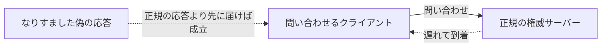

## はじめに

- **この記事で得られること**: [DNSサーバーの基礎](/articles/dns-server-fundamentals-guide)で扱ったゾーンファイルとレコードの仕組みを前提に、DNSの応答そのものが抱える構造的な弱点と、**DNSSEC**(DNS Security Extensions)が、電子署名を使ってその弱点をどう補っているのかを体系的に理解します。
- **対象読者**: DNSの名前解決の仕組みは理解しているが、「DNSSEC」という言葉を聞いたことはあっても、それが具体的に何を証明する仕組みなのかを説明できない方を想定しています。
- **読むのにかかる想定時間**: 約16分

この記事は[『上位1%』シリーズ 全記事ガイド](/sitemap)の一部、[DNSサーバー基礎シリーズ](/sitemap#シリーズ一覧)の4本目です。

## 前提知識

- **権威サーバーとゾーンファイル**: [DNSサーバーの基礎](/articles/dns-server-fundamentals-guide)で扱った、ゾーンファイルとリソースレコードの構造を前提とします。
- **公開鍵暗号(電子署名)**: 秘密鍵で作成した署名を、対応する公開鍵で検証することで、「その秘密鍵の持ち主が作成したデータである」ことを証明できる仕組みです。

## 全体像をつかむ

### DNSの応答には、そもそも「送信元を証明する仕組み」がない

DNSは、UDPというコネクションレスなプロトコルの上に成り立っています。**クライアントが送った問い合わせに対して届いた応答が、本当に正規の権威サーバーから来たものなのか、それとも第三者が正規のサーバーになりすまして送り込んだ偽の応答なのかを、DNSプロトコル自体は区別する手段を持っていません。** この弱点を悪用し、偽の応答を本物より先にクライアントへ届けることで、間違った(攻撃者に都合の良い)IPアドレスをキャッシュさせてしまう攻撃が、DNSキャッシュポイズニングです。

## 基礎から徹底解説

### DNSSECが解決する問題:「改ざんされていないこと」の証明

**DNSSECは、DNSの応答そのものに、電子署名を付与する仕組みです。** 権威サーバーは、自分が管理するゾーンのレコードに対して、あらかじめ秘密鍵で署名を作成しておきます。問い合わせを受け取ったクライアント(正確には検証を行う再帰リゾルバ)は、対応する公開鍵を使って、その署名を検証します。**署名の検証に成功すれば、そのレコードは、正規の権威サーバーが発行したものであり、途中で改ざんされていないことが証明されます。**

### DNSSECを構成する3種類の主要なレコード

| レコード | 役割 |
|---|---|
| **RRSIG**(Resource Record Signature) | 個々のリソースレコード(A、MXなど)に対する、電子署名そのものです。 |
| **DNSKEY** | そのゾーンの署名を検証するための、公開鍵を格納するレコードです。 |
| **DS**(Delegation Signer) | 親ゾーンに登録される、子ゾーンのDNSKEYのハッシュ値です。親から子への「信頼の橋渡し」を担います。 |

### 信頼の連鎖(Chain of Trust):なぜルートゾーンから辿る必要があるのか

DNSKEYの公開鍵自体が本物かどうかは、どうやって証明すればよいのでしょうか。**DNSSECは、この問題を、DNSの階層構造(ルート→TLD→ドメイン)に沿って、親ゾーンが子ゾーンの公開鍵を保証するという方式で解決しています。** 親ゾーンに登録されたDSレコードが、子ゾーンのDNSKEYのハッシュ値と一致するかを検証することで、「この子ゾーンの公開鍵は、親ゾーンが保証したものである」と確認できます。この確認を、信頼の起点である**ルートゾーン**まで、階層を1つずつ遡って繰り返すことで、最終的な信頼が成立します。この一連のつながりを**信頼の連鎖**(Chain of Trust)と呼びます。

## プロが見ている視点(上位1%の理解)

### DNSSECは「盗聴」ではなく「改ざん・なりすまし」を防ぐ仕組み

DNSSECについて最もよくある誤解は、「DNSSECを使えば、DNSの通信内容が暗号化される」というものです。**DNSSECが提供するのは、機密性(暗号化)ではなく、完全性(改ざんされていないこと)と真正性(正規の発行元であること)の証明です。** 通信内容そのものを暗号化したい場合は、DNS over HTTPS(DoH)やDNS over TLS(DoT)という、別の仕組みが必要になります。DNSSECと暗号化(DoH/DoT)は、**目的がまったく異なる、独立した仕組み**であるという理解が重要です。

### 信頼の連鎖のどこか1箇所でも欠けると、検証全体が失敗する

信頼の連鎖という設計は、裏を返せば、**途中の親ゾーンのどこか1つでもDSレコードの登録を誤ると、それより下の階層すべてで検証が失敗してしまう**、という脆さも意味します。実務では、DNSSEC対応ドメインの鍵をローテーション(定期的な更新)する際に、親ゾーンへのDSレコードの登録更新を忘れると、切り替え後のある時点から突然そのドメイン全体が名前解決できなくなる、という重大な障害につながります。DNSSECの運用では、鍵のローテーション手順そのものよりも、**親ゾーンとの同期タイミング**が最も注意すべきポイントです。

## よくある誤解・つまずきポイント

- **誤解1: 「DNSSECを有効にすれば、DNSの通信内容が暗号化される」**
  DNSSECが提供するのは完全性と真正性の証明であり、暗号化(機密性)は別の仕組み(DoH/DoT)が担います。
- **誤解2: 「DNSSECは、ゾーンファイルに署名さえ付ければ、それだけで機能する」**
  親ゾーンにDSレコードを登録し、信頼の連鎖をルートまでつなげない限り、検証は成立しません。
- **誤解3: 「DNSSECはDNSキャッシュポイズニングを完全に不可能にする」**
  DNSSECは偽の応答を検証によって拒否できるようにする仕組みであり、攻撃自体を物理的に防ぐものではありません。検証を行わない(DNSSEC未対応の)リゾルバを経由すれば、依然としてリスクは残ります。

## 障害・トラブルシューティングの視点

1. **DNSSEC対応ドメインが、ある時点から突然名前解決できなくなった**: 親ゾーンに登録されているDSレコードと、現在のゾーンのDNSKEYが一致しているかを確認します。鍵のローテーション後に、DSレコードの更新を忘れているケースが典型的です。
2. **DNSSECの検証結果を確認したい**: `dig +dnssec <ドメイン名>`を実行し、応答に`ad`(Authenticated Data)フラグが立っているかを確認します。
3. **一部のリゾルバだけで名前解決に失敗する**: そのリゾルバがDNSSEC検証を有効にしているかどうか、そしてルートゾーンからの信頼の連鎖を正しく辿れているかを確認します。

## まとめ

- DNSの応答には、そもそも送信元を証明する仕組みがなく、これがDNSキャッシュポイズニングを成立させる原因になっています。
- DNSSECは、RRSIG・DNSKEY・DSという3種類のレコードと電子署名によって、応答の完全性と真正性を証明します。
- 信頼の連鎖(Chain of Trust)は、ルートゾーンから階層を1つずつ辿ることで、最終的な信頼を成立させる仕組みです。
- DNSSECは暗号化(機密性)を提供するものではなく、DoH/DoTとは目的が異なる、独立した仕組みです。

**今日から意識すべきこと**
1. DNSSECと暗号化(DoH/DoT)を、別の目的を持つ独立した仕組みとして区別しましょう。
2. DNSSECの鍵をローテーションする際は、親ゾーンへのDSレコード更新を忘れずに行いましょう。

## 参考文献

- [DNSSEC: DNS Security Extensions | ICANN](https://www.icann.org/resources/pages/dnssec-what-is-it-why-important-2019-03-05-en)
- [RFC 4033: DNS Security Introduction and Requirements](https://datatracker.ietf.org/doc/html/rfc4033)
