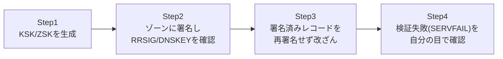

## はじめに

- **この記事で得られること**: [DNSSECの仕組み](/articles/dns-dnssec-fundamentals-guide)で学んだRRSIG・DNSKEY・DSレコードと信頼の連鎖を、[BINDでDNSサーバーを構築するハンズオン](/articles/dns-server-handson-guide)で作った`lab.example.test`ゾーンに、実際に鍵を生成して署名することで検証します。さらに、署名済みのレコードをわざと再署名せずに書き換えることで、検証を有効にしたリゾルバが応答を拒否する(`SERVFAIL`を返す)様子を自分の目で確認します。
- **対象読者**: [BINDでDNSサーバーを構築するハンズオン](/articles/dns-server-handson-guide)をすでに終え、[DNSSECの仕組み](/articles/dns-dnssec-fundamentals-guide)を読み終えた方を想定しています。
- **読むのにかかる想定時間**: 約50分

この記事は[『上位1%』シリーズ 全記事ガイド](/sitemap)の一部です。

## 前提知識

- **RRSIG・DNSKEY・DS、信頼の連鎖**: [DNSSECの仕組み](/articles/dns-dnssec-fundamentals-guide)を前提とします。
- **BINDでのゾーン構築**: [BINDでDNSサーバーを構築するハンズオン](/articles/dns-server-handson-guide)で作成した、`lab.example.test`ゾーンを持つマスターサーバーの環境を前提とします。

## 全体像をつかむ



**実際のインターネット上のドメインでは、親ゾーン(レジストラ)へのDSレコード登録が必要になり、信頼の連鎖がルートまでつながります。このハンズオンでは検証環境内で完結させるため、`lab.example.test`ゾーンを検証する再帰リゾルバ側に、DSレコードの代わりに信頼するDNSKEYを直接登録する`trust-anchors`という設定を使います。**

## ハンズオン手順

### Step 1: 鍵(KSK/ZSK)を生成する

マスターサーバー上で、DNSSEC用のツールをインストールし、鍵を生成します。

```bash
sudo apt install -y bind9-dnsutils
cd /etc/bind
sudo dnssec-keygen -a ECDSAP256SHA256 -f KSK lab.example.test
sudo dnssec-keygen -a ECDSAP256SHA256 lab.example.test
```

**`-f KSK`を付けた1つ目が鍵署名鍵(KSK)、付けていない2つ目がゾーン署名鍵(ZSK)です。** KSKはDNSKEYレコード自体に署名するための鍵、ZSKは個々のリソースレコード(A、MXなど)に署名するための鍵という、役割分担があります。それぞれ`K lab.example.test.+013+xxxxx.key`と`.private`という2つのファイルが生成されます。

### Step 2: ゾーンに署名し、RRSIG/DNSKEYレコードを確認する

ゾーンファイルに、生成した鍵をINCLUDEで読み込ませます。

```bash
sudo nano /etc/bind/db.lab.example.test
```

```
$INCLUDE /etc/bind/K lab.example.test.+013+xxxxx.key
$INCLUDE /etc/bind/K lab.example.test.+013+yyyyy.key
```

シリアル番号を上げてから、`dnssec-signzone`で実際に署名します。

```bash
sudo dnssec-signzone -A -3 $(head -c 16 /dev/urandom | xxd -p) -N INCREMENT -o lab.example.test -t db.lab.example.test
```

このコマンドは、`db.lab.example.test.signed`という、署名済みの新しいゾーンファイルを生成します。`named.conf.local`の`file`を、この署名済みファイルに切り替えます。

```
zone "lab.example.test" {
    type master;
    file "/etc/bind/db.lab.example.test.signed";
    allow-transfer { <スレーブサーバーのIPアドレス>; };
};
```

```bash
sudo systemctl restart bind9
```

`dig`で、署名が実際に付与されているかを確認します。

```bash
dig @localhost www.lab.example.test A +dnssec
```

`ANSWER SECTION`に、Aレコードとあわせて**RRSIGレコード**が表示されていれば、署名は成功しています。同様に、DNSKEYレコードも確認できます。

```bash
dig @localhost lab.example.test DNSKEY +dnssec
```

### Step 3: 検証用リゾルバを構築し、trust-anchorsを設定する

別のUbuntu Serverに、検証(バリデーション)を行う再帰リゾルバとしてBINDを構築します。

```bash
sudo apt install -y bind9
```

マスター上で確認したZSKの公開鍵の中身を、リゾルバ側の`named.conf.options`に、信頼するアンカーとして直接登録します。

```
trust-anchors {
    lab.example.test initial-key 257 3 13 "<DNSKEYレコードの公開鍵部分の文字列>";
};

options {
    recursion yes;
    dnssec-validation yes;
    forwarders { <マスターサーバーのIPアドレス>; };
};
```

再起動し、このリゾルバ経由で問い合わせます。

```bash
sudo systemctl restart bind9
dig @localhost www.lab.example.test A +dnssec
```

応答に`ad`(Authenticated Data)フラグが立っていれば、リゾルバがDNSSEC検証に成功し、「このデータは正規のものである」と確認できたことを意味します。

### Step 4: 署名済みレコードを改ざんし、検証失敗(SERVFAIL)を確認する

ここが、このハンズオンの核心です。マスター側で、**署名済みのゾーンファイル(`.signed`ファイル)自体を直接編集し、`www`のIPアドレスだけを書き換えます。** 通常の運用では絶対に行わない操作ですが、検証の効果を体感するためにあえて行います。

```bash
sudo nano /etc/bind/db.lab.example.test.signed
```

```
www     IN  A       10.0.20.250
```

再署名せずに、そのままBINDを再起動します。

```bash
sudo systemctl restart bind9
```

検証を行わない(DNSSEC非対応の)マスター自身への問い合わせでは、この改ざんされた値がそのまま返ってきます。

```bash
dig @<マスターのIP> www.lab.example.test A   # 改ざんされた値がそのまま返る
```

**しかし、Step 3で構築した、検証を有効にしたリゾルバへ同じ問い合わせを送ると、結果はまったく異なります。**

```bash
dig @<リゾルバのIP> www.lab.example.test A   # status: SERVFAILが返る
```

`status`に`SERVFAIL`が表示され、**改ざんされた値そのものは、クライアントに一切届きません。** リゾルバは、書き換えられたAレコードに対応する正しいRRSIG署名が存在しない(再署名されていない)ことを検知し、「このデータは信頼できない」と判断して、意図的に応答を拒否しているのです。

## プロが見ている視点(上位1%の理解)

### 「拒否」こそが、DNSSECの正常な動作である

Step 4で見た`SERVFAIL`という結果は、**一見するとDNSサーバーの障害のように見えますが、実際にはDNSSECが設計通りに機能している証拠です。** 改ざんされたデータをそのままクライアントへ届けてしまうくらいなら、名前解決自体を失敗させる方がまだ安全である、という設計思想がここに表れています。実務でDNSSECを有効化したドメインに関するトラブルシューティングを行う際、`SERVFAIL`という結果を見たら、まず「本当に何かが壊れているのか」と「意図した通りに、何かの改ざん・不整合を検知して拒否しているのか」を切り分ける視点が重要です。

### KSKとZSKを分ける理由:更新頻度の異なる鍵を、役割ごとに分離する

Step 1で、あえて2種類の鍵(KSK/ZSK)を生成した理由を、ここで扱います。**ZSKは個々のレコードに署名するため、ゾーンの更新頻度に応じて、比較的短い周期でローテーションされることが想定されています。** 一方、**KSKは、親ゾーンへのDSレコード登録という、より手間のかかる作業と連動するため、ZSKよりも長い周期でしかローテーションされません。** もし鍵を1種類しか使わなかった場合、ZSKの日常的なローテーションのたびに、親ゾーンのDSレコードも毎回更新する必要が生じ、運用負荷が跳ね上がってしまいます。役割の異なる2種類の鍵に分離することで、**頻繁に変わるものと、めったに変わらないものを、独立して管理できる**ようにしているのです。

## よくある誤解・つまずきポイント

- **誤解1: 「dnssec-signzoneを一度実行すれば、以降のゾーンファイルの変更にも自動的に追従する」**
  ゾーンファイルの内容を変更するたびに、再度`dnssec-signzone`を実行して署名をやり直す必要があります。
- **誤解2: 「SERVFAILは、常にDNSサーバーの障害や設定ミスを意味する」**
  DNSSEC検証環境では、改ざんや不整合を検知した結果としての、意図された拒否である場合があります。
- **誤解3: 「KSKとZSKは、どちらも同じ頻度でローテーションするべきである」**
  ZSKは比較的短い周期で、KSKは親ゾーンとの同期が必要なためより長い周期で、それぞれ異なる頻度でローテーションするのが実務上の定石です。

## 障害・トラブルシューティングの視点

1. **署名後にSERVFAILが返ってくる(改ざんしていないのに)**: 署名済みゾーンファイルが最新の状態か、シリアル番号や署名の有効期限が切れていないかを確認します。`dnssec-signzone`は署名に有効期限を設定するため、長期間再署名しないと、正常なデータでも検証に失敗するようになります。
2. **trust-anchorsを設定したのに検証が有効にならない**: `dnssec-validation yes;`が設定されているか、登録した公開鍵の文字列が正確かを確認します。
3. **マスターへの直接の問い合わせと、リゾルバ経由の問い合わせで結果が異なる**: これは異常ではなく、マスター自身は検証を行わないため、リゾルバ側でのみ検証結果が反映されるという、正しい挙動です。

## まとめ

- `dnssec-keygen`でKSK/ZSKを生成し、`dnssec-signzone`でゾーンに署名すると、RRSIG/DNSKEYレコードが自動的に追加されます。
- 検証を有効にしたリゾルバは、`dig`の応答に`ad`フラグを立てることで、検証成功を示します。
- 署名済みレコードを再署名せずに改ざんすると、検証を有効にしたリゾルバは`SERVFAIL`を返して応答を拒否します。
- KSKとZSKは、更新頻度の異なる役割を分離するために、意図的に2種類用意されています。

**今日から意識すべきこと**
1. ゾーンファイルを変更したら、`dnssec-signzone`による再署名を忘れずに行いましょう。
2. DNSSEC有効なドメインで`SERVFAIL`に遭遇したら、障害ではなく意図した検証拒否である可能性を、最初に検討しましょう。

## 参考文献

- [BIND 9 Administrator Reference Manual: DNSSEC](https://bind9.readthedocs.io/en/latest/chapter4.html)
- [dnssec-signzone(8) | BIND 9 Documentation](https://bind9.readthedocs.io/en/latest/manpages.html#dnssec-signzone-dnssec-sign-a-zone)
