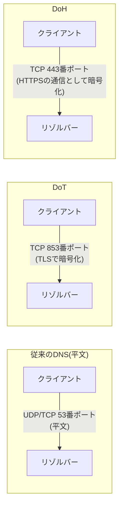

## はじめに

- **この記事で得られること**: [DNSSEC基礎](/articles/dns-dnssec-fundamentals-guide)で扱った、DNSの応答が改ざんされていないことを保証する仕組みとは守っている対象がまったく違う、「**DoH**(DNS over HTTPS)」・「**DoT**(DNS over TLS)」という、DNSの通信そのものを暗号化する仕組みを理解します。そのうえで、[スプリットホライズンDNS](/articles/dns-split-horizon-guide)で構築した、社内向けの名前解決が、ブラウザの既定のDoH利用によって意図せずバイパスされてしまう実務上の課題と、**カナリアドメイン**による対処法までを扱います。
- **対象読者**: DNSSECについては理解しているものの、「DNSSECを使えば、DNSの通信内容も暗号化される」と思い込んでいる方、DoH・DoTという言葉を聞いたことはあるが、具体的に何を解決する仕組みなのかを説明できない方を想定しています。
- **読むのにかかる想定時間**: 約18分

この記事は[『上位1%』シリーズ 全記事ガイド](/sitemap)の一部、[DNSサーバー基礎シリーズ](/sitemap#シリーズ一覧)の6.1本目です。

## 前提知識

- [DNSSEC基礎](/articles/dns-dnssec-fundamentals-guide): DNSの応答に電子署名を付与し、正当性を検証する仕組みが前提になっています。
- [スプリットホライズンDNS](/articles/dns-split-horizon-guide): 問い合わせ元によって異なる応答を返す、BINDのviewsという仕組みが前提になっています。

## 全体像をつかむ

従来のDNS問い合わせ(UDP/TCPの53番ポート)は、**平文のまま**、ネットワーク上を流れています。これは、経路上の誰か(公衆Wi-Fiの運営者、ISP、その他の中継者)が、**どのドメイン名を問い合わせているかを覗き見たり、応答そのものを書き換えたりできてしまう**ことを意味します。DoH・DoTは、この通信経路そのものを暗号化することで、この課題を解決します。



**DoTは、DNSのプロトコルそのものを、専用のポート(853番)でTLSのトンネルに包んで送ります。** **DoHは、DNSの問い合わせを、HTTPSのリクエストという形に変換して、通常のWebアクセスと同じ443番ポートで送ります。**

## 基礎から徹底解説

### DNSSECとDoH/DoTは、守っている対象がまったく違う

**ここが、最も誤解されやすい、決定的なポイントです。** [DNSSEC基礎](/articles/dns-dnssec-fundamentals-guide)で扱ったDNSSECは、**「この応答が、本当に正当な権威DNSサーバーから発行されたものであり、途中で改ざんされていないか」という、データそのものの正当性**を保証する仕組みです。DNSSECで検証された応答であっても、**通信経路そのものは、平文のままです。** 一方、DoH・DoTは、**「この通信の内容を、途中の誰にも覗き見られないようにする」という、通信経路の機密性**を保証する仕組みです。

| | DNSSEC | DoH / DoT |
|---|---|---|
| 守る対象 | データの正当性(改ざん・なりすましの検知) | 通信経路の機密性(盗聴の防止) |
| 暗号化するか | しない(電子署名のみ) | する(TLS/HTTPSによる暗号化) |
| 保証が及ぶ範囲 | 権威DNSサーバーから、検証者まで、エンドツーエンド | クライアントと、利用している1つのリゾルバーとの間だけ |

**「DNSSECを有効にしているから、DNSの通信は安全だ」という判断は、不正確です。** DNSSECは改ざん・なりすましを検知できますが、**誰がどのドメイン名を調べているかという情報が、経路上で盗み見られることを防ぐものではありません。** この2つは、**両方を組み合わせて初めて、完全な保護になる**、独立した仕組みです。

<details>
<summary>DoH/DoTの保護範囲が、「クライアントと1つのリゾルバーの間だけ」である理由</summary>

**DoH/DoTが暗号化しているのは、クライアントが、自分の使っているリゾルバー(例:パブリックDNSサービス)へ問い合わせを送る、最初の1区間だけです。** そのリゾルバー自身が、権威DNSサーバーへ問い合わせを転送する際の通信は、従来通り平文で行われることが一般的です。つまり、**「盗聴から守られる範囲」と「改ざんから守られる範囲」は、DoH/DoTとDNSSECで、まったく異なるレイヤーに属している**ことになります。

</details>

### ブラウザの既定のDoH利用が、企業のDNS設計を静かにバイパスする

DoHの普及に伴い、FirefoxやChromeのような主要なブラウザは、**OSが設定しているDNSサーバーとは無関係に、ブラウザ自身が信頼する、固定のDoH対応リゾルバーへ、直接問い合わせを送る**ようになりました。**これは、[スプリットホライズンDNS](/articles/dns-split-horizon-guide)で構築した、社内向けの名前解決の仕組みそのものを、静かにバイパスしてしまう**可能性があります。社内の端末のブラウザが、社内DNSサーバーではなく、ブラウザ自身が選んだ外部のDoHリゾルバーへ直接問い合わせを送ってしまうと、**社内専用のドメイン名が正しく解決できなくなったり、意図した分割ホライズンの挙動が成立しなくなったりします。**

### Firefoxの「カナリアドメイン」による、実務上の対処法

Firefoxは、この課題に対して、**カナリアドメイン**という仕組みを用意しています。Firefoxは、起動時に`use-application-dns.net`という、特定のドメイン名への問い合わせを行い、**この問い合わせへの応答によって、既定のDoH利用を自動的に無効化するかどうかを判断します。**

```
; 社内DNSサーバー(BIND)のゾーン設定に追加する
zone "use-application-dns.net" {
    type master;
    file "/etc/bind/db.empty";
};
```

**`use-application-dns.net`というドメイン名に対して、社内DNSサーバーが、意図的に「存在しない」(NXDOMAIN)という応答を返すように設定しておくと、Firefoxはこれを「この環境では、企業によるDNS管理が行われている」という信号として検知し、既定のDoH自動有効化を、自動的に無効化します。** これにより、社内の端末は、意図通り社内DNSサーバーへ問い合わせを送るようになり、スプリットホライズンDNSの挙動が守られます。

<details>
<summary>この対処法は、ユーザー自身がDoHを明示的に有効化した場合にも効くのか</summary>

**カナリアドメインによる無効化は、あくまで「既定の設定のまま、自動的にDoHが有効化されるケース」を対象にしています。** ユーザー自身が、ブラウザの設定で明示的にDoHを有効化した場合、その選択は、カナリアドメインの判定結果よりも優先されます。企業として、より確実にDoHの利用を制御したい場合は、グループポリシー(Firefoxであれば、Mozilla提供のADMXテンプレート)を使い、DoHの利用そのものを、ポリシーレベルで無効化することを検討する必要があります。

</details>

## プロが見ている視点(上位1%の理解)

### 暗号化の普及は、常に「誰のための暗号化か」という対立を生む

DoH・DoTは、個々のユーザーの通信を、経路上の盗聴者から守るという、明確に正しい目的を持った技術です。**しかし、企業のネットワーク管理者にとっては、「DNSの問い合わせ内容を監視・制御することで、不正なドメインへのアクセスを遮断する」という、既存のセキュリティ対策の前提そのものが、揺らぐことになります。** これは、[HTTPSの普及とプロキシキャッシュの終焉](/articles/http-caching-cdn-guide)で扱った、**「通信を暗号化して守る対象が広がるほど、その内容を正当な目的で監視・管理していた側の可視性が失われる」という、暗号化技術の普及に常について回るトレードオフ**と、まったく同じ構造です。上位1%のエンジニアは、新しい暗号化技術の導入を検討する際、「誰の、何を守るための暗号化か」「その結果、誰が、何を見えなくなるのか」を、常にセットで評価します。

## よくある誤解・つまずきポイント

- **誤解1: 「DNSSECを有効にしていれば、DNSの通信内容も暗号化される」**
  DNSSECは、データの正当性(改ざん・なりすましの検知)を保証する仕組みであり、通信経路そのものは暗号化しません。暗号化を実現するのは、DoH・DoTという、別の独立した仕組みです。
- **誤解2: 「DoHを有効にすれば、DNSSECは不要になる」**
  DoHが保護するのは、クライアントと利用しているリゾルバーの間だけです。リゾルバーから権威DNSサーバーまでの区間や、データそのものの正当性の検証には、依然としてDNSSECが必要です。
- **誤解3: 「社内DNSサーバーを構築していれば、社内の端末は必ずそれを使って名前解決する」**
  ブラウザが既定でDoHを使う設定になっている場合、社内DNSサーバーを経由せず、ブラウザ自身が選んだ外部のリゾルバーへ直接問い合わせが送られてしまう可能性があります。

## 障害・トラブルシューティングの視点

1. **社内専用のドメイン名が、特定のブラウザからだけ解決できない**: そのブラウザが、既定でDoHを使用し、社内DNSサーバーをバイパスしていないかを確認します。
2. **カナリアドメインを設定したのに、DoHが無効化されない**: ユーザー自身がブラウザの設定で、明示的にDoHを有効化していないかを確認します。その場合は、グループポリシーでの制御を検討します。
3. **DoHを使った通信を、ネットワーク側で検知・遮断したい**: DoHの通信は、通常のHTTPS通信と区別が難しいため、宛先となる既知のパブリックDoHリゾルバーのIPアドレスを、個別にブロックする運用が必要になる場合があります。

## まとめ

- DoH・DoTは、DNSの通信経路そのものを暗号化し、盗聴から保護する仕組みです。従来のDNSは、平文のまま通信されています。
- DNSSECは、データそのものの正当性(改ざん・なりすましの検知)を保証する仕組みであり、DoH・DoTとは守っている対象がまったく異なります。両方を組み合わせて初めて、完全な保護になります。
- ブラウザが既定でDoHを使用すると、企業のスプリットホライズンDNSのような、社内向けの名前解決の仕組みが、意図せずバイパスされる可能性があります。
- Firefoxのカナリアドメイン(`use-application-dns.net`)を社内DNSサーバーで意図的にNXDOMAINとして応答させることで、既定のDoH自動有効化を無効化できます。

**今日から意識すべきこと**
1. DNSのセキュリティを検討する際は、「データの正当性(DNSSEC)」と「通信経路の機密性(DoH/DoT)」を、常に別の軸として評価しましょう。
2. 社内向けのDNS設計を行う際は、主要なブラウザの既定のDoH利用によって、意図した名前解決がバイパスされていないかを、必ず確認しましょう。

## 参考文献

- [RFC 8484 - DNS Queries over HTTPS (DoH)](https://datatracker.ietf.org/doc/html/rfc8484)
- [RFC 7858 - Specification for DNS over Transport Layer Security (TLS)](https://datatracker.ietf.org/doc/html/rfc7858)
- [Firefox DNS over HTTPS | Mozilla Support](https://support.mozilla.org/en-US/kb/firefox-dns-over-https)
