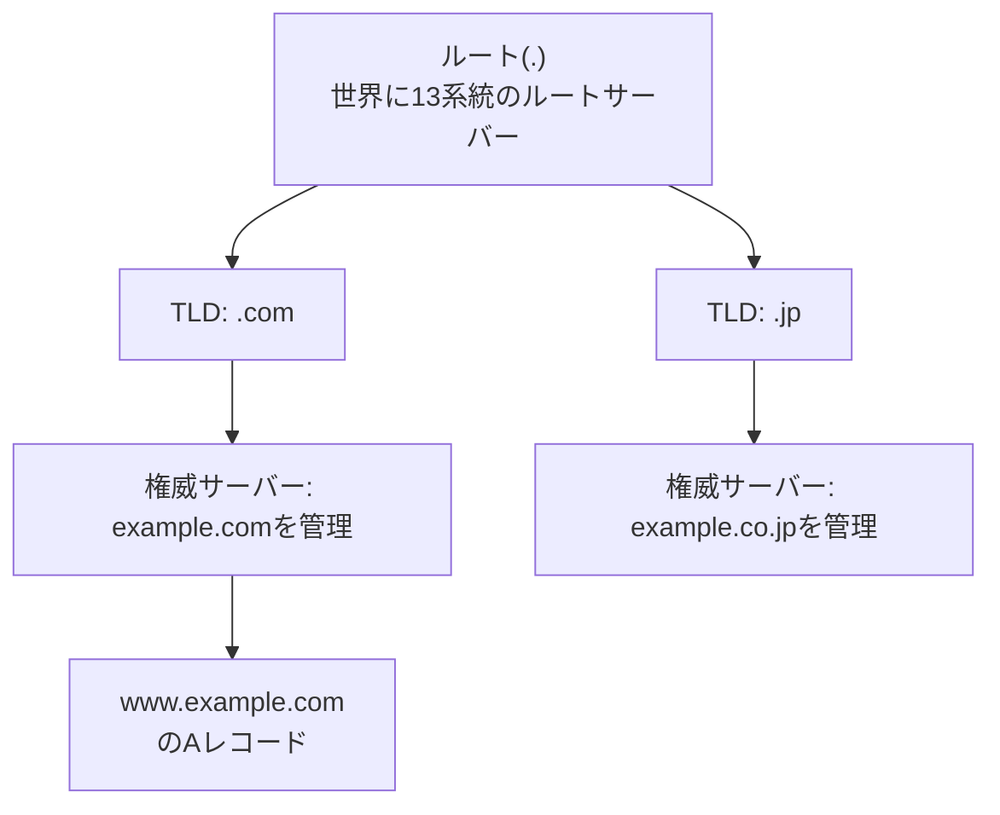
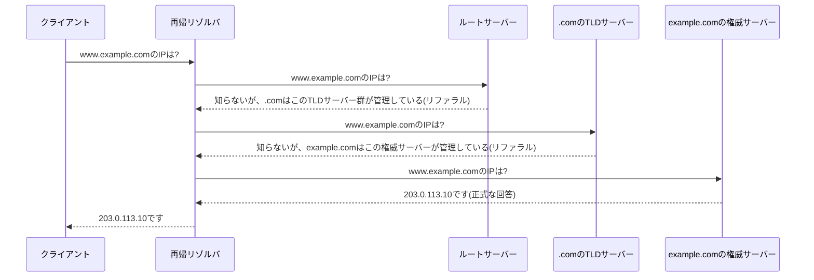

## はじめに

- **この記事で得られること**: 「DNSは名前をIPアドレスに変換する仕組み」という理解の、その中身——なぜ1台のサーバーで完結せず世界中に分散しているのか、実際に名前解決が行われる際にどのサーバーが何を答えているのか、そして実務でよく引っかかる「複数のDNSサーバーが登録されているとき、結局どれが使われるのか」「VPN接続時に社内向けの名前解決はどう成立しているのか」を、Windows/Linuxそれぞれの実装レベルまで含めて体系的に理解できます。
- **対象読者**: インフラエンジニアとして「DNSはドメイン名をIPアドレスに変換するもの」ということは知っているものの、複数のDNSサーバーがどう使い分けられているのか、VPN接続時に社内DNSサーバーがどう機能しているのかを具体的に説明できない方を想定しています。
- **読むのにかかる想定時間**: 約20分

この記事は[『上位1%』シリーズ 全記事ガイド](/sitemap)の一部です。VPN接続時のIPCPによるDNSサーバー払い出しについては[L2TP/IPsecの仕組みを『上位1%』の視点で理解する](/articles/l2tp-ipsec-guide)で扱っています。

## 前提知識

- **IPアドレスとホスト名**: IPアドレスは通信機器が経路制御に使う数値の住所、ホスト名(`www.example.com`のような文字列)は人間が扱いやすいように付けられた名前です。DNSはこの2つを相互に対応付けます。
- **FQDN(Fully Qualified Domain Name)** : `www.example.com.`のように、ホスト名からルートまでの階層をすべて明示した完全な形式のドメイン名です。末尾のドット(ルートを表す)は通常省略されて表示されます。
- **クライアント/サーバーモデル**: 要求を送る側(クライアント)と、要求に応じて処理・応答を返す側(サーバー)に役割が分かれる通信モデルです。DNSも「名前を尋ねる側」と「答える側」に分かれます。
- **UDP/TCP**: DNSの問い合わせは基本的に軽量なUDP(ポート53)で行われますが、応答サイズが大きい場合やゾーン転送(サーバー間でのデータ同期)ではTCPが使われます。UDPの特性については[L2TP/IPsecの仕組みを『上位1%』の視点で理解する](/articles/l2tp-ipsec-guide)の前提知識でも触れています。

## 全体像をつかむ

### 一言で言うと

**DNS(Domain Name System)とは、「人間が覚えやすい階層的な名前(ドメイン名)」と「機械が通信に使うIPアドレス」を相互に変換するための、世界中に分散配置されたデータベースシステムです。** 1台の巨大なサーバーがすべての名前を管理しているのではなく、**名前空間そのものが階層構造(ツリー構造)になっており、階層ごとに管理主体が分かれている**という点が、DNSを理解するうえで最も重要な前提です。

この木構造のどの階層も、**自分が委任(delegation)された範囲だけに責任を持ち、それより下の階層は別の管理主体に委任する**という設計になっています。ルートサーバーは「`.com`はこのTLDサーバー群が管理している」ということだけを知っていればよく、`.com`のTLDサーバーは「`example.com`はこの権威サーバーが管理している」ということだけを知っていればよい、という具合に、責任範囲が階層ごとにきれいに分割されています。この分散設計こそが、単一障害点を作らずに世界中のドメイン名を管理できている理由です。

## 基礎から徹底解説

### 権威サーバーと再帰リゾルバ:「答えを知っている側」と「聞きに行く側」

DNSの動作を理解するうえで最初に区別すべきなのが、**権威サーバー(authoritative server)**と**再帰リゾルバ(recursive resolver)**という、役割がまったく異なる2種類のサーバーです。

- **権威サーバー**: 特定のゾーン(`example.com`など、委任された名前空間の範囲)について、正式なデータ(ゾーンファイル)を保持しているサーバーです。「このゾーンについて聞かれたら、自分の持っているデータで正確に答える」ことだけが役目で、他のドメインについて何かを尋ねられても、代わりに調べに行ったりはしません。
- **再帰リゾルバ**: クライアント(PCやスマートフォン)から「このホスト名のIPアドレスは?」と尋ねられ、**代わりにルートサーバー→TLDサーバー→権威サーバーの順に問い合わせを重ねて、最終的な答えをクライアントに返す**サーバーです。多くの場合、契約しているISPが提供するDNSサーバーや、パブリックDNS(後述)がこの役割を担います。

### 実際の名前解決シーケンス:再帰リゾルバは何段階の問い合わせをしているのか

`www.example.com`のIPアドレスを知りたいクライアントが再帰リゾルバに問い合わせてから、実際に答えが返るまでの流れを追うと、次のようになります。

ここで重要なのは、**ルートサーバーもTLDサーバーも「正確な答え」を返しているわけではなく、「次にどこへ聞きに行けばよいか」という委任先の情報(リファラル)を返している**という点です。最終的に正式な答え(権威回答、Authoritative Answer)を返せるのは、そのゾーンを実際に管理している権威サーバーだけです。この一連の「代わりに何段階も辿って答えを探しに行く」動作を**再帰的な問い合わせ(recursive query)**と呼び、再帰リゾルバという名前の由来になっています。

スタブリゾルバとフルサービスリゾルバの違い

クライアント(PCやスマートフォン)のOSに内蔵されているDNS機能は、上記の再帰的な問い合わせをすべて自分で行うわけではありません。多くの場合、**スタブリゾルバ**と呼ばれる簡易な実装で、「設定された1台の再帰リゾルバに問い合わせを丸投げし、返ってきた答えをそのまま使う」という、いわば「又聞き」だけを行います。実際にルート→TLD→権威サーバーと辿っていく「フルサービスリゾルバ」としての仕事は、ISPやパブリックDNSが提供する再帰リゾルバ側が担っています。この後の節で説明する「Windows/LinuxでのDNSサーバー設定」は、まさにこの**スタブリゾルバがどの再帰リゾルバに問い合わせを投げるか**を設定している、という点を押さえておくと以降の話がつながりやすくなります。

### キャッシュとTTL:なぜ毎回ルートから聞きに行かないのか

前述のシーケンスを、名前を引くたびに毎回律儀に繰り返していては、ルートサーバー・TLDサーバーへの問い合わせが世界中から殺到してしまいます。これを防いでいるのが**キャッシュ**です。再帰リゾルバは、一度得た答え(および途中のリファラル情報)を、権威サーバーが指定した**TTL(Time To Live)**という有効期間だけ手元に保持し、同じ名前への問い合わせが来た場合はキャッシュから即座に返答します。TTLが切れるまでは権威サーバーへ再度問い合わせに行かないため、世界中の再帰リゾルバへの問い合わせ集中を防ぎつつ、応答も高速になります。

TTLの長さは、DNSレコードを管理する側(権威サーバー側)がゾーンファイル上で明示的に指定するトレードオフのパラメータです。TTLを長くすればキャッシュヒット率が上がり権威サーバーの負荷や応答遅延は減りますが、レコードの内容(IPアドレスなど)を変更した際に、世界中のキャッシュに古い情報が残り続ける期間も長くなります。サーバー移転やロードバランサーの切り替えを予定している場合、事前にTTLを短く設定しておき、切り替えが完了してから再び長いTTLに戻す、という運用が定石です。

### 主要なレコード種別

DNSが保持しているデータは、IPアドレスへの変換だけではありません。代表的なレコード種別は次の通りです。

| レコード種別 | 役割 |
|---|---|
| A | ホスト名をIPv4アドレスに変換する、最も基本的なレコード |
| AAAA | ホスト名をIPv6アドレスに変換するレコード |
| CNAME | ある名前を別の名前の別名(エイリアス)として定義するレコード |
| MX | そのドメイン宛のメールを受け取るメールサーバーを指定するレコード(優先順位付き) |
| NS | そのゾーンを管理する権威サーバー自体を示すレコード(前述の委任情報そのもの) |
| TXT | 任意の文字列を保持できる汎用レコード(SPF/DKIMなどメール送信元認証や、ドメイン所有権確認に使われる) |
| PTR | IPアドレスからホスト名を引く「逆引き」用のレコード |

## プロが見ている視点(上位1%の理解)

### 複数のDNSサーバーが登録されているとき、どちらが使われるのか(Windows)

実務で頻繁に混乱の原因になるのが、**1台のPCに複数のネットワークアダプター(有線LAN、Wi-Fi、VPN接続時の仮想アダプターなど)が存在し、それぞれに異なるDNSサーバーが設定されている場合、実際にどのDNSサーバーが使われるのか**という点です。

Windowsでは、DNSサーバーの設定は**ネットワークアダプターごと**に持ちます。`ncpa.cpl`(コントロールパネルの「ネットワーク接続」)から該当のアダプターのプロパティを開き、「インターネット プロトコル バージョン4(TCP/IPv4)」のプロパティ、あるいは「詳細設定」タブを開くと、そのアダプターに紐づくDNSサーバーの一覧(優先/代替、あるいは複数の候補)が表示されます。つまり「PC全体で1つのDNSサーバー設定を持つ」のではなく、**アダプターの数だけDNSサーバーのリストが存在しうる**というのがまず押さえるべき前提です。

複数のアダプターがすべて有効な状態(たとえば有線LANとVPN接続の仮想アダプターが同時に動いている状態)では、**インターフェースメトリック(そのアダプター経由の通信がどれだけ優先されるかを示す数値。小さいほど優先度が高い)**が、名前解決に使うDNSサーバーの優先順位にも影響します。加えて、VPN接続時に「リモートネットワークでデフォルトゲートウェイを使う」(いわゆるフルトンネル設定)を有効にしているかどうかによっても、経路とあわせてDNS解決の優先順位が変わります。ただし、この優先順位付けだけでは**特定のドメイン(社内ドメインなど)だけを特定のDNSサーバーに振り分ける**という制御はできません。それを実現するのが、次に説明する**NRPT**です。

### NRPT(Name Resolution Policy Table):特定のドメインだけを特定のDNSサーバーに振り分ける

Windowsには、**NRPT(Name Resolution Policy Table、名前解決ポリシーテーブル)**という仕組みがあります。これは「`corp.example.com`という名前空間への問い合わせだけは、通常のアダプターごとのDNSサーバーではなく、指定したDNSサーバー(たとえば社内DNSサーバー)へ送る」という**ドメイン単位のルーティングルール**を明示的に定義する機能です。グループポリシーや`netsh namespace`コマンドで設定でき、もともとはDirectAccess(証明書ベースで常時接続する企業向けVPN技術)向けに設計されましたが、通常のVPN接続でも同じ仕組みを使ってスプリットトンネル環境の名前解決を制御できます。

NRPTが設定されていない環境で、VPN接続を**スプリットトンネル**(社内向けの通信だけがVPN経由になり、それ以外の通信は通常のインターネット回線をそのまま使う構成)にしている場合、「VPN接続時に社内DNSサーバーの情報が払い出される」こと自体は成立していても(前述のIPCPによる払い出し)、**社内ドメイン以外の一般的な名前解決までVPN側のDNSサーバーに送られてしまう、あるいは逆にインターフェースメトリックの状況次第で社内ドメインの問い合わせが通常のDNSサーバーに送られて失敗する**、といった挙動のブレが生じえます。NRPT(あるいは同等の分割DNS設定)を明示的に構成することで、初めて「このドメインへの問い合わせは確実にこのDNSサーバーへ」という確定的な制御ができるようになります。

### 複数のDNSサーバーが登録されているとき、どちらが使われるのか(Linux/systemd-resolved)

Linuxでの事情は、使われているディストリビューション・DNS解決の実装によって異なります。

- **伝統的な実装(`/etc/resolv.conf`を直接参照)** : `/etc/resolv.conf`に列挙された`nameserver`の並び順が、上から順に問い合わせる優先順位になります。この方式には、Windowsのようなアダプターごとの個別管理や、ドメイン単位のルーティングという概念が基本的にありません(`search`/`domain`ディレクティブによる検索ドメインの補完はありますが、問い合わせ先DNSサーバーの振り分けとは別の話です)。
- **`systemd-resolved`を使う現代的な実装(多くのデスクトップ系ディストリビューションが採用)** : ネットワークインターフェース(リンク)ごとに個別のDNSサーバーを保持でき、`resolvectl status`コマンドでリンクごとの設定を確認できます。さらに、Windowsの NRPTに相当する**ルーティングドメイン(Routing Domain)**という仕組みがあり、あるリンクに対して`~corp.example.com`のように**先頭にチルダを付けたドメイン**を割り当てることで、「`corp.example.com`宛の問い合わせだけはこのリンクのDNSサーバーへ送る」という、まさにNRPTと同じ発想のドメイン単位ルーティングを実現できます。VPN接続時にこのルーティングドメインが正しく設定されていないと、Windowsの場合と同様に、社内ドメインの名前解決だけが失敗する、あるいは意図せず外部のDNSサーバーに社内向けクエリが漏れる(DNS漏洩)という問題が起こり得ます。

NetworkManager経由でVPN接続する場合の設定

`NetworkManager`でVPN接続を管理している場合、VPN接続プロファイルの設定に「このVPN接続で使うDNSサーバー」と「このVPN経由で解決すべきドメイン(検索ドメイン)」を指定する項目があり、これが内部的に`systemd-resolved`のルーティングドメイン設定へと反映されます。VPN接続時に社内名前解決がうまくいかない場合、まずは`resolvectl status`でVPNの仮想インターフェースにDNSサーバーとルーティングドメイン(`~`付きのドメイン)が正しく設定されているかを確認するのが最初の切り分けになります。

### フルトンネルVPNとスプリットトンネルVPNでDNS解決がどう変わるか

ここまでの内容を踏まえると、VPN接続時のDNS解決の挙動は、**トンネル方式(フル/スプリット)とDNSルーティング設定(NRPT/ルーティングドメインの有無)の組み合わせ**で整理できます。

| 構成 | 一般的な名前解決 | 社内ドメインの名前解決 |
|---|---|---|
| フルトンネル(全通信がVPN経由) | VPN側のDNSサーバーが使われる(デフォルトゲートウェイごとVPN側に切り替わるため) | VPN側のDNSサーバーが使われる |
| スプリットトンネル + NRPT/ルーティングドメインなし | 通常は既存のDNSサーバーが優先されるが、インターフェースメトリック次第で不安定になりうる | 確実性がなく、失敗することがある |
| スプリットトンネル + NRPT/ルーティングドメインあり | 既存のDNSサーバーがそのまま使われる(社内ドメイン以外は分割ルールの対象外) | 指定した社内ドメインだけ確実にVPN側のDNSサーバーへ送られる |

「VPN接続すれば、社内向けの名前解決は自動的にVPNサーバー側のDNS情報が最優先で使われる」というのは、**フルトンネル構成か、あるいはスプリットトンネルでもNRPT/ルーティングドメインが適切に構成されている場合に限って成立する**という点を押さえておくと、実務でのDNS関連の障害切り分けが速くなります。

## よくある誤解・つまずきポイント

- **誤解1: 「複数のDNSサーバーを登録すれば、負荷分散(ロードバランス)される」**
  一般的なOSのDNSクライアントの実装は、複数登録されたDNSサーバーを「優先/代替」あるいは「並び順」として扱い、基本的には**フェイルオーバー(優先サーバーが応答しない場合に次を試す)**のための仕組みです。問い合わせを常に均等に振り分けるロードバランサーではありません。
- **誤解2: 「hostsファイルよりDNSの方が常に優先される」**
  Windows・Linuxいずれの標準的な名前解決の順序でも、通常は**hostsファイル(`C:\Windows\System32\drivers\etc\hosts`や`/etc/hosts`)がDNSより先に参照されます**。DNSで正しい設定をしているはずなのに意図した名前解決にならない場合、まずhostsファイルに古いエントリが残っていないかを確認するのが定石です。
  

  
参照順序を制御している設定

  Linuxでは`/etc/nsswitch.conf`の`hosts:`行が、hostsファイル(`files`)とDNS(`dns`)のどちらを先に参照するかという順序そのものを制御しています。Windowsではこの参照順序自体はOSに組み込まれた既定の挙動で、明示的な設定ファイルで変更する一般的な手段はありません。
  

- **誤解3: 「TTLは長ければ長いほど良い」**
  TTLを長くするとキャッシュヒット率が上がり権威サーバーの負荷や応答時間は改善しますが、その分レコードを変更した際に世界中の古いキャッシュが残り続ける期間も伸びます。サーバー移転やIPアドレス変更の予定がある場合は、事前にTTLを短縮しておくのが定石です。
- **誤解4: 「再帰リゾルバも権威サーバーも、やっていることは同じ『DNSサーバー』でしかない」**
  権威サーバーは「自分が管理するゾーンについて正式に答える」役割、再帰リゾルバは「クライアントの代わりにルートから権威サーバーまで辿って答えを探す」役割であり、担っている仕事はまったく異なります。同じサーバーソフトウェアが両方の機能を持つことはありますが(BINDなど)、役割としては明確に分けて理解する必要があります。

## 障害・トラブルシューティングの視点

DNS関連の障害は、**「どの段階のキャッシュ・設定が古い/誤っているか」を切り分ける**のが基本です。

1. **特定のPCだけ、特定の名前が解決できない/古いIPを返す**: そのPCのローカルDNSキャッシュを疑います。Windowsでは`ipconfig /displaydns`で現在のキャッシュ内容を確認し、`ipconfig /flushdns`でクリアできます。Linux(`systemd-resolved`)では`resolvectl statistics`や`resolvectl flush-caches`が相当します。
2. **社内ドメインだけが解決できない(VPN接続中)**: 前述のNRPT(Windows)またはルーティングドメイン(`resolvectl status`で確認、Linux)が正しく構成されているかを確認します。特定のドメインの問い合わせがVPN側のDNSサーバーへ正しくルーティングされていない典型的な原因です。
3. **社内でも社外でも、その端末だけまったく名前解決できない**: `nslookup`や`dig`で、実際に使われているDNSサーバー自体に到達できているかを確認します。DNSサーバー自体への疎通(UDP/TCP 53番ポート)がファイアウォールなどで遮断されていないかも合わせて確認します。
4. **新しく変更したレコードが世界的に反映されない**: TTLが切れるまで古いキャッシュが世界中の再帰リゾルバに残っている可能性があります。権威サーバー側の設定変更が正しく反映されているかは、その権威サーバーへ直接問い合わせる(`dig @<権威サーバーのIP> <ホスト名>`)ことでキャッシュの影響を受けずに確認できます。
5. **社内の特定の権威サーバー/DNSサーバーだけ応答しない**: サーバー自体のプロセス停止、ゾーンファイルの構文エラーによる起動失敗、上位(親ゾーン)からの委任情報(NSレコード)の不一致などを疑います。

### 予防策・恒久対策

- サーバー移転やIPアドレス変更を予定している場合は、事前にTTLを短く設定しておく。
- VPN接続でスプリットトンネルを使う場合は、NRPT(Windows)またはルーティングドメイン(Linux)を明示的に構成し、インターフェースメトリックの優劣に挙動を依存させない。
- DNSサーバーの二重化(プライマリ/セカンダリ)は、あくまでフェイルオーバーのためであり負荷分散ではないことを踏まえた上で運用する。

## まとめ

- DNSは、階層的な名前空間を、階層ごとに異なる管理主体(ルート・TLD・権威サーバー)へ委任する形で分散管理するシステムです。
- 再帰リゾルバはルート→TLD→権威サーバーの順に問い合わせを重ねて答えを探す役割、権威サーバーは自分が管理するゾーンについて正式な答えを返す役割であり、両者の役割は明確に異なります。
- キャッシュとTTLにより、世界中の再帰リゾルバへの問い合わせ集中を防ぎつつ高速な応答を実現していますが、TTLの長さはキャッシュ効率とレコード変更の反映速度のトレードオフです。
- 複数のDNSサーバーが登録されている場合、Windowsではインターフェースメトリックとアダプターごとの設定、Linux(systemd-resolved)ではリンクごとの設定が優先順位に影響しますが、特定ドメインだけを特定のDNSサーバーへ確実に振り分けるにはNRPT(Windows)やルーティングドメイン(Linux)の明示的な設定が必要です。
- VPN接続時に社内向けの名前解決が自動的に最優先されるとは限らず、フルトンネルかスプリットトンネルか、NRPT/ルーティングドメインが構成されているかによって挙動が変わります。

**今日から意識すべきこと**
1. 「DNSが引けない」障害に遭遇したら、まずローカルキャッシュ・OS側の名前解決設定(アダプターごとのDNSサーバー、NRPT/ルーティングドメイン)・権威サーバー自体、のどの段階の問題かを切り分けましょう。
2. VPN接続時に社内名前解決が不安定な場合は、真っ先にNRPT(Windows)またはルーティングドメイン(Linux)の設定を確認しましょう。

## 参考文献

- [Domain Names - Concepts and Facilities | RFC 1034](https://datatracker.ietf.org/doc/html/rfc1034)
- [Domain Names - Implementation and Specification | RFC 1035](https://datatracker.ietf.org/doc/html/rfc1035)
- [DNS Terminology | RFC 8499](https://datatracker.ietf.org/doc/html/rfc8499)
- [Name Resolution Policy Table (NRPT) | Microsoft Learn](https://learn.microsoft.com/en-us/windows-server/remote/remote-access/directaccess/technical-reference-for-name-resolution-in-directaccess)
- [resolvectl(1) | systemd](https://www.freedesktop.org/software/systemd/man/latest/resolvectl.html)
- [nsswitch.conf(5) | Linux man-pages](https://man7.org/linux/man-pages/man5/nsswitch.conf.5.html)
