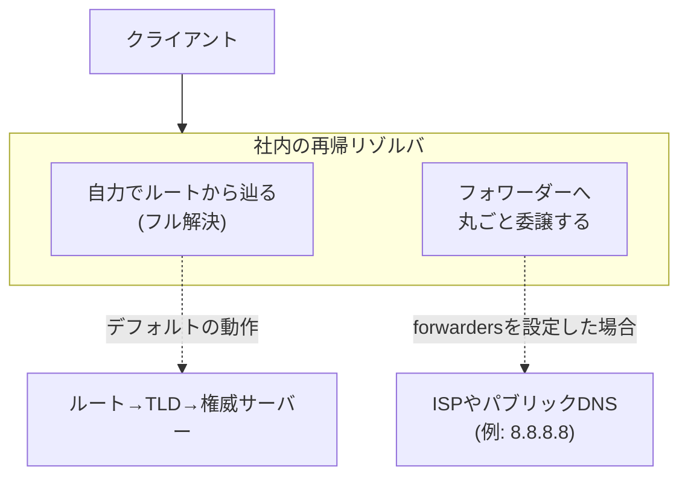

## はじめに

- **この記事で得られること**: [DNSサーバーの基礎](/articles/dns-server-fundamentals-guide)で軽く触れた再帰リゾルバ(キャッシュサーバー)の役割を掘り下げ、再帰リゾルバが自らルートから名前解決を辿る代わりに、別のサーバーへ問い合わせを丸ごと委譲する**フォワーダー**という構成と、「存在しない」という答え自体もキャッシュされる**ネガティブキャッシュ**の仕組みを体系的に理解します。
- **対象読者**: 権威サーバー(自分が管理するゾーンについて答える側)の構築は経験があるが、再帰リゾルバ側の内部動作(フォワーダー、ネガティブキャッシュ)には詳しくない方を想定しています。
- **読むのにかかる想定時間**: 約15分

この記事は[『上位1%』シリーズ 全記事ガイド](/sitemap)の一部、[DNSサーバー基礎シリーズ](/sitemap#シリーズ一覧)の5本目です。

## 前提知識

- **権威サーバーと再帰リゾルバの違い**: [DNSの仕組み](/articles/dns-guide)で扱った、「答えを知っている側」と「聞きに行く側」という役割分担です。

## 全体像をつかむ



## 基礎から徹底解説

### フォワーダー:「自分で調べる」代わりに「他人に丸投げする」構成

再帰リゾルバの既定の動作は、ルートサーバーから順に、TLD、権威サーバーへと自力で問い合わせを重ねていく**フル解決**(反復問い合わせ)です。これに対し、`named.conf`に`forwarders`を設定すると、社内の再帰リゾルバは、自分でルートから辿る代わりに、**指定した別のDNSサーバー(ISPのDNSサーバーや、8.8.8.8のようなパブリックDNSなど)へ、問い合わせを丸ごと委譲**するようになります。

```
options {
    forwarders {
        8.8.8.8;
        8.8.4.4;
    };
    forward only;
};
```

**`forward only`を指定すると、フォワーダーへの問い合わせが失敗した場合でも、自力でのフル解決にフォールバックしなくなります。** これを指定しない場合(`forward first`が既定の挙動)は、フォワーダーが応答しない場合に、自力でのフル解決を試みます。

### なぜフォワーダーという構成が存在するのか

社内の再帰リゾルバが、外部の一般的なドメイン(`google.com`など)まで毎回自力でルートから辿ると、**インターネット全体への再帰的な問い合わせが、社内の全端末の分だけ発生**してしまいます。フォワーダーへ委譲すれば、**その先のキャッシュ済みの結果を再利用**できるため、社内のリゾルバ自身がキャッシュを一から積み上げる必要がなくなり、外部への問い合わせ量を大幅に削減できます。また、社内ネットワークからインターネットへの直接の再帰的な問い合わせを許可したくない(ファイアウォールの都合など)場合にも、フォワーダー1台だけに外部への問い合わせを集約する、という構成が使われます。

### ネガティブキャッシュ:「存在しない」という答えもキャッシュされる

[DNSサーバーの基礎](/articles/dns-server-fundamentals-guide)のSOAレコードで触れた最後のフィールド、**ネガティブキャッシュTTL**は、「そのようなレコードは存在しない」(NXDOMAIN、または該当タイプのレコードなし)という**否定的な応答自体を、他のDNSサーバーがキャッシュしてよい時間**を制御しています。

```
@   IN  SOA   ns1.example.com. admin.example.com. (
                2026093001
                3600
                900
                604800
                86400 )     ; ← このネガティブキャッシュTTL
```

つまり、あるホスト名が存在しないという結果を得た再帰リゾルバは、その否定的な結果自体を、このTTLの間キャッシュします。**この間、同じホスト名への問い合わせは、権威サーバーへ届く前に、再帰リゾルバ側で「存在しません」と即座に返されます。**

## プロが見ている視点(上位1%の理解)

### 「新しく作ったはずのレコードが、まだ見つからない」の正体は、しばしばネガティブキャッシュ

実務で頻繁に遭遇するのが、**新しいホスト名のレコードを追加したにもかかわらず、しばらくの間、名前解決に失敗し続ける**という現象です。原因の多くは、**そのホスト名が存在しなかった時点での問い合わせが、すでにネガティブキャッシュとして、途中の再帰リゾルバに乗ってしまっている**ことです。レコードをゾーンファイルに追加し、シリアル番号を上げても、この否定的なキャッシュ自体は、ネガティブキャッシュTTLが経過するまで自動的には消えません。この現象は「レコードの追加に失敗した」のではなく、「追加は成功しているが、否定的な過去の記憶がまだ残っている」という状態であると理解しておくと、無駄な切り分け作業を減らせます。

### フォワーダーを使うと、DNSSECの検証責任がどこに移るのか

[DNSSECの仕組み](/articles/dns-dnssec-fundamentals-guide)で扱った検証を、社内の再帰リゾルバ自身が行う代わりに、フォワーダーとして指定した外部のパブリックDNS(多くの場合、DNSSEC検証を有効にしている)に委ねる、という考え方もできます。**ただし、フォワーダーとの通信経路自体が保護されていなければ、フォワーダーが検証済みの正しい答えを返しても、その応答が自社の再帰リゾルバに届くまでの間に、なりすましのリスクが残ります。** フォワーダー構成を採用する際は、「検証済みの答えを信頼する」という前提が、フォワーダーとの通信経路の安全性にも依存していることを意識しておく必要があります。

## よくある誤解・つまずきポイント

- **誤解1: 「forwardersを設定すれば、常にその後は問い合わせが速くなる」**
  フォワーダー自体の応答が遅い、または落ちている場合、`forward only`の設定次第では、名前解決自体が失敗する可能性があります。
- **誤解2: 「レコードを追加してすぐに名前解決できないのは、設定ミスである」**
  多くの場合、追加前の否定的な結果がネガティブキャッシュとして残っているだけであり、ネガティブキャッシュTTLの経過を待てば解決します。
- **誤解3: 「ネガティブキャッシュは、$TTLと同じ値が使われる」**
  ネガティブキャッシュTTLは、SOAレコードの最後のフィールドで個別に指定される、独立した値です。

## 障害・トラブルシューティングの視点

1. **新しく追加したはずのレコードが見つからない**: `dig`でSOAレコードのネガティブキャッシュTTLを確認し、その時間が経過するのを待つか、途中の再帰リゾルバのキャッシュを強制的にクリアできないか確認します。
2. **フォワーダーを設定した途端、名前解決が不安定になった**: フォワーダー自体の生死と応答速度を確認し、`forward only`ではなく`forward first`への変更を検討します。
3. **社内からのみ、特定のドメインの解決が不安定**: 社内の再帰リゾルバが、フォワーダーと外部への直接的なフル解決のどちらを使っているのかを、`named.conf`の設定から確認します。

## まとめ

- フォワーダーは、再帰リゾルバが自力でフル解決する代わりに、別のDNSサーバーへ問い合わせを丸ごと委譲する構成です。
- ネガティブキャッシュTTLは、「存在しない」という否定的な応答自体がキャッシュされる時間を制御する、SOAレコードのフィールドです。
- レコード追加直後に名前解決できない現象の多くは、設定ミスではなく、ネガティブキャッシュの影響です。

**今日から意識すべきこと**
1. 新しいレコードを追加した直後に名前解決できない場合は、まずネガティブキャッシュTTLの経過を疑いましょう。
2. フォワーダー構成を採用する際は、`forward only`と`forward first`のどちらの挙動が必要かを明確にしましょう。

## 参考文献

- [BIND 9 Administrator Reference Manual: Forwarding](https://bind9.readthedocs.io/en/latest/chapter3.html)
- [RFC 2308: Negative Caching of DNS Queries](https://datatracker.ietf.org/doc/html/rfc2308)
