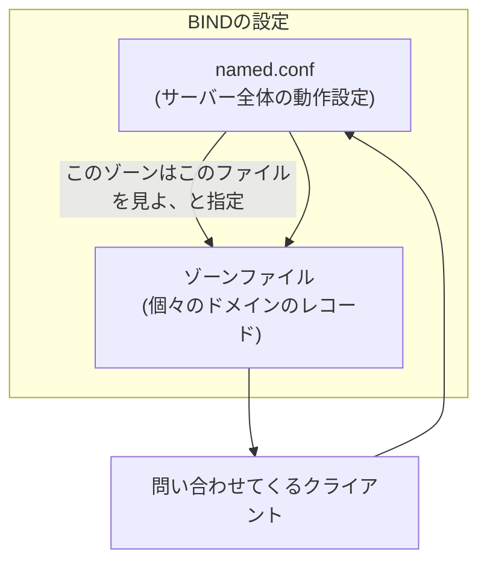

## はじめに

- **この記事で得られること**: [DNSの仕組みを『上位1%』の視点で理解する](/articles/dns-guide)で扱った名前解決の階層構造を前提に、実際に**DNSサーバーを構築・運用する側**の視点から、**ゾーンファイル**の構造、**SOAレコード**の各フィールドが何を制御しているのか、そして複数のDNSサーバー間でゾーンデータを同期する**マスター/スレーブ構成**(ゾーン転送)の仕組みを体系的に理解します。題材には、Linux上で最も広く使われているDNSサーバーソフトウェアである**BIND**(Berkeley Internet Name Domain)を使います。
- **対象読者**: DNSの名前解決の仕組みは理解しているものの、実際にDNSサーバーを構築・移行した経験がなく、「ゾーンファイル」「SOAレコード」「マスター/スレーブ」といった実務用語に馴染みがない方を想定しています。
- **読むのにかかる想定時間**: 約17分

この記事は[『上位1%』シリーズ 全記事ガイド](/sitemap)の一部、[DNSサーバー基礎シリーズ](/sitemap#シリーズ一覧)の1本目です。この後の[DNSサーバー構築ハンズオン](/articles/dns-server-handson-guide)で、ここで扱う内容を実際に手を動かして構築します。

## 前提知識

- **権威サーバーと再帰リゾルバの違い**: [DNSの仕組みを『上位1%』の視点で理解する](/articles/dns-guide)で扱った、「答えを知っている側(権威サーバー)」と「聞きに行く側(再帰リゾルバ)」という役割分担です。本記事では、この**権威サーバー側を実際に構築する**方法を扱います。

## 全体像をつかむ

### BINDとは何か:Linux版の代表的なDNSサーバーソフトウェア

**BIND**(Berkeley Internet Name Domain)は、1980年代から続く、インターネット上で最も広く使われているDNSサーバーソフトウェアです。[メールサーバーの基礎](/articles/mail-server-fundamentals-guide)で扱ったPostfix(メールの世界での代表的なOSS実装)と同じように、BINDは**DNSプロトコルの世界における、Linux上での代表的な実装**という位置づけです。BINDの設定は、大きく2つのファイルに分かれています。

- **`named.conf`**: サーバー全体の動作(どのゾーンを管理するか、誰からの問い合わせに応答するか、といった全体設定)を定義するファイルです。
- **ゾーンファイル**: 個々のドメイン(ゾーン)ごとの、実際のレコード(A・NS・MXなど)を記述するファイルです。



## 基礎から徹底解説

### ゾーンファイルの構造:SOAレコードとリソースレコード

ゾーンファイルの先頭には、必ず**SOA**(Start of Authority、権威の開始)レコードが置かれます。これは、**そのゾーンそのものに関する管理情報**を表すレコードです。

```
example.com.  IN  SOA  ns1.example.com. admin.example.com. (
                        2026092501  ; シリアル番号
                        3600        ; リフレッシュ間隔(秒)
                        900         ; リトライ間隔(秒)
                        604800      ; 有効期限(秒)
                        86400 )     ; ネガティブキャッシュTTL(秒)
```

| フィールド | 意味 |
|---|---|
| **シリアル番号** | このゾーンデータの"バージョン番号"です。ゾーンデータを変更するたびに、この値を必ず増やす必要があります。 |
| **リフレッシュ間隔** | 後述するスレーブサーバーが、マスターへ「更新はありますか」と定期的に確認する間隔です。 |
| **リトライ間隔** | リフレッシュの問い合わせに失敗した場合、次に再試行するまでの間隔です。 |
| **有効期限** | マスターへの問い合わせがこの期間ずっと失敗し続けた場合、スレーブが保持するゾーンデータを「もはや信頼できない」として無効化するまでの期間です。 |
| **ネガティブキャッシュTTL** | 「そのようなレコードは存在しない」という否定的な応答自体を、他のDNSサーバーがキャッシュしてよい時間です。 |

SOAレコードに続けて、そのゾーンが実際に持つレコード(NSレコード、Aレコード、MXレコードなど)を列挙していきます。

<details>
<summary>シリアル番号を上げ忘れると何が起きるか</summary>

**シリアル番号は、ゾーンファイルを編集しただけでは自動的には増えません。管理者が手動で増やす必要があります。** これを忘れると、実際にはレコードを変更したにもかかわらず、後述するスレーブサーバーは「シリアル番号が変わっていない=更新はない」と判断し、**ゾーン転送が一切発生しません。** ゾーンファイルを編集したら、レコードの追加・変更内容だけでなく、シリアル番号を上げ忘れていないかを必ず確認する習慣が必要です。日付+連番(`2026092501`のような形式)にしておくと、その日何回目の変更かが一目で分かり、上げ忘れにも気づきやすくなります。

</details>

### マスター/スレーブ構成とゾーン転送:AD DSのレプリケーションとの類推

DNSサーバーを冗長化する場合、1台の**マスター**(プライマリ)サーバーが持つゾーンデータを、1台以上の**スレーブ**(セカンダリ)サーバーへ複製します。この複製の仕組みを**ゾーン転送**と呼びます。

- **AXFR**(全ゾーン転送): ゾーンデータ全体をまるごと転送します。
- **IXFR**(差分ゾーン転送): 前回転送済みのシリアル番号との差分だけを転送する、効率化された方式です。

スレーブサーバーは、`named.conf`で設定した**リフレッシュ間隔**ごとに、マスターへ「現在のシリアル番号は何か」を問い合わせます。**マスター側のシリアル番号が、スレーブが持っている値より大きければ**、スレーブはゾーン転送を要求し、最新のデータを取得します。

この「シリアル番号という単一の数値を基準に、変更があったかどうかを判定し、なければ何もしない」という設計は、[SYSVOL・DFSR・グループポリシーの仕組み](/articles/ad-sysvol-dfsr-gpo-guide)で扱った、**GPOのバージョン番号を基準にした複製判定**と、発想としてまったく同じです。DNSの世界とAD DSの世界は別々の技術ですが、「変更検知の基準として単調増加する番号を使う」という設計パターンは、分散システム全般で繰り返し登場する普遍的な考え方だと理解しておくと、他の技術を学ぶ際にも応用が効きます。

### 権威サーバーとキャッシュサーバーは、なぜ分離すべきなのか

BINDは、権威サーバー(自分が管理するゾーンについて答える)としても、再帰リゾルバ(他のドメインについて代わりに調べてあげる、キャッシュサーバー)としても動作できます。しかし実務のベストプラクティスとして、**この2つの役割は同じサーバーに同居させず、分離するべき**とされています。

理由は、キャッシュサーバー(再帰リゾルバ)としての機能を、**誰でも自由に使える状態(オープンリゾルバ)のまま公開してしまうと、DNSリフレクション攻撃・DNS増幅攻撃(DNS Amplification Attack)という、第三者へのDDoS攻撃の踏み台として悪用されるリスク**があるためです。小さな問い合わせで大きな応答を得られるDNSの性質を悪用し、送信元IPアドレスを詐称した問い合わせを大量に送りつけることで、応答トラフィックを標的へ集中させる攻撃です。権威サーバーは、外部からの問い合わせに応答する必要があるため公開せざるを得ませんが、**再帰(recursion)機能は、信頼できる内部クライアントだけに限定し、インターネットに対しては無効化しておく**、という設定が定石です。

## プロが見ている視点(上位1%の理解)

### BINDとWindows DNSサーバーは、同じプロトコルの別々の実装

[SMBとCIFSは何が違うのか](/articles/smb-cifs-linux-interop-guide)で扱った「プロトコルは文書化された仕様であり、実装は複数存在しうる」という考え方は、DNSにもそのまま当てはまります。BIND(Linux)もWindows DNS Server([AD環境のDNS](/articles/ad-dns-guide)で扱った、DCが兼務することの多いDNSサーバー機能)も、**同じDNSプロトコル仕様を、別々のソフトウェアとして実装したもの**にすぎません。そのため、Windows DNS ServerがマスターでBINDがスレーブ(あるいはその逆)という、異なる実装同士でのゾーン転送も、標準化されたプロトコルに従っている限り技術的に成立します。異機種混在環境のDNS移行を任された際は、この「実装は違っても、プロトコルレベルで会話できる」という前提を思い出してください。

## よくある誤解・つまずきポイント

- **誤解1: 「ゾーンファイルを編集して保存すれば、それだけで変更が反映される」**
  シリアル番号を増やし忘れると、スレーブサーバーへの複製(ゾーン転送)が発生せず、変更が反映されません。
- **誤解2: 「DNSサーバーは、権威サーバーとキャッシュサーバーの機能を両方有効にしておいた方が便利である」**
  両方を同じサーバーで無制限に公開すると、DNS Amplification Attackの踏み台にされるリスクがあります。再帰機能は信頼できる内部クライアントだけに限定するのが定石です。
- **誤解3: 「BINDとWindows DNSサーバーは、互いに連携できない別々の技術である」**
  どちらも同じDNSプロトコルの実装であり、標準化されたゾーン転送の仕組みを介して、異なる実装同士でも連携できます。

## 障害・トラブルシューティングの視点

DNSサーバーの設定不備は、多くの場合、**構文エラーか、シリアル番号の更新忘れ**が原因です。

1. **設定を変更したのにBINDが起動しない**: `named-checkconf`で`named.conf`の構文エラーを、`named-checkzone <ゾーン名> <ゾーンファイル>`でゾーンファイル自体の構文エラーを確認します。
2. **スレーブサーバーにマスターの変更が反映されない**: マスター側でシリアル番号を上げ忘れていないかを確認します。`dig @<マスターのIP> <ゾーン名> SOA`で、マスター・スレーブ双方の現在のシリアル番号を比較すると、どちらが古いままかを特定できます。
3. **外部から名前解決ができない**: `named.conf`の`allow-query`や`allow-transfer`の設定で、意図せずアクセスを制限しすぎていないかを確認します。

### 予防策・恒久対策

- ゾーンファイルを変更する際は、`named-checkzone`で構文を検証してから反映する運用を徹底する。
- シリアル番号は日付+連番の形式にし、更新忘れに気づきやすくする。
- 権威サーバーでは、再帰機能を内部の信頼できるクライアントだけに制限する。

## まとめ

- BINDは、Linux上で最も広く使われているDNSサーバーソフトウェアで、`named.conf`(全体設定)とゾーンファイル(個々のドメインのレコード)という2つの設定レイヤーで構成されます。
- SOAレコードのシリアル番号は、ゾーンデータの"バージョン番号"であり、これを基準にマスター/スレーブ間のゾーン転送(AXFR/IXFR)が行われます。
- 権威サーバーとキャッシュサーバー(再帰リゾルバ)の機能は、DNS Amplification Attackのリスクを避けるため、実務では分離すべきです。
- BINDとWindows DNSサーバーは、同じDNSプロトコルの別々の実装であり、標準化された仕組みを介して連携できます。

**今日から意識すべきこと**
1. ゾーンファイルを編集したら、レコードの内容だけでなくシリアル番号を上げ忘れていないかを必ず確認しましょう。
2. DNSサーバーを公開する際は、再帰機能を内部クライアントだけに制限する設定になっているかを確認しましょう。

## 参考文献

- [BIND 9 Administrator Reference Manual](https://bind9.readthedocs.io/en/latest/)
- [Domain Names - Implementation and Specification | RFC 1035](https://datatracker.ietf.org/doc/html/rfc1035)
- [Understanding DNS Amplification Attacks | CISA](https://www.cisa.gov/news-events/alerts/2013/03/29/dns-amplification-attacks)
