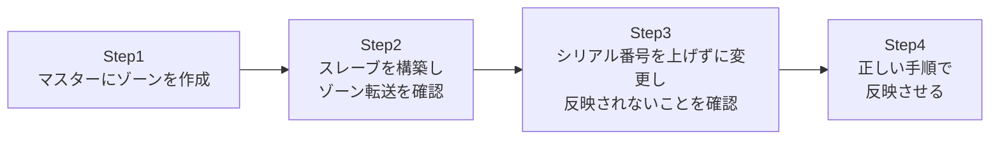

## はじめに

- **この記事で得られること**: [DNSサーバーの基礎](/articles/dns-server-fundamentals-guide)で学んだゾーンファイル・SOAレコード・マスター/スレーブ構成の知識を、**実際に2台のBINDサーバーを構築し、ゾーン転送が発生する様子、そしてシリアル番号を上げ忘れると反映されない様子を自分の目で確認する**ことで検証します。
- **対象読者**: DNSサーバーの構築・運用に実際に携わったことがなく、まず仮想マシン上でマスター/スレーブ構成を組んで動作を確認しておきたい方を想定しています。
- **読むのにかかる想定時間**: 約20分(ハンズオン実施込み)

この記事は[『上位1%』シリーズ 全記事ガイド](/sitemap)の一部、[DNSサーバー基礎シリーズ](/sitemap#シリーズ一覧)の2本目です。[ハンズオン準備マニュアル](/articles/handson-prep-guide)で作成したUbuntu Server環境が2台あれば実施できます(1台のVMを複製するか、新規に2台目を作成してください)。

## 前提知識

- **ゾーンファイル・SOAレコード・マスター/スレーブ構成**: [DNSサーバーの基礎](/articles/dns-server-fundamentals-guide)を先に読んでおいてください。

## 全体像をつかむ

このハンズオンで行うことは、次の4ステップです。



## ハンズオン手順

### Step 1: マスターサーバーにゾーンを作成する

1台目のUbuntu ServerにBINDをインストールします。

```bash
sudo apt update
sudo apt install -y bind9 bind9utils dnsutils
```

`/etc/bind/named.conf.local`に、新しいゾーンを追加します。

```
zone "lab.example.test" {
    type master;
    file "/etc/bind/db.lab.example.test";
    allow-transfer { <スレーブサーバーのIPアドレス>; };
};
```

**`allow-transfer`で、ゾーン転送を許可する相手を明示的に指定している点がポイントです。** これを指定しないと、既定では原則すべての相手からのゾーン転送要求を許可してしまい、ゾーンデータの中身(社内のホスト名の一覧など)を誰でも取得できてしまいます。

続けて、ゾーンファイル`/etc/bind/db.lab.example.test`を作成します。

```
$TTL 86400
@   IN  SOA   ns1.lab.example.test. admin.lab.example.test. (
                2026092501  ; シリアル番号
                3600        ; リフレッシュ
                900         ; リトライ
                604800      ; 有効期限
                86400 )     ; ネガティブキャッシュTTL
@       IN  NS      ns1.lab.example.test.
@       IN  NS      ns2.lab.example.test.
ns1     IN  A       <マスター自身のIPアドレス>
ns2     IN  A       <スレーブサーバーのIPアドレス>
www     IN  A       10.0.20.100
```

構文チェックを行ってから、BINDを再起動します。

```bash
sudo named-checkzone lab.example.test /etc/bind/db.lab.example.test
sudo systemctl restart bind9
```

`dig`コマンドで、マスター自身に問い合わせて動作を確認します。

```bash
dig @localhost www.lab.example.test A
```

`ANSWER SECTION`に`10.0.20.100`が表示されれば成功です。

### Step 2: スレーブサーバーを構築し、ゾーン転送を確認する

2台目のUbuntu ServerにもBINDをインストールし、`/etc/bind/named.conf.local`に次のように追加します。

```
zone "lab.example.test" {
    type slave;
    file "/var/cache/bind/db.lab.example.test";
    masters { <マスターサーバーのIPアドレス>; };
};
```

**スレーブ側は、自分でゾーンファイルの中身を書くのではなく、マスターから転送されたデータを保存する場所(`file`)を指定するだけ**である点に注目してください。BINDを再起動します。

```bash
sudo systemctl restart bind9
```

ゾーン転送が成功していれば、`/var/cache/bind/`に`db.lab.example.test`というファイルが自動的に作成されているはずです。

```bash
sudo ls -la /var/cache/bind/
sudo journalctl -u bind9 | grep transfer
```

ログに`transfer of 'lab.example.test/IN' from <マスターのIP>#53: Transfer status: success`のような記録があれば、ゾーン転送は成功しています。スレーブ自身に対して`dig`で問い合わせても、マスターと同じ結果が返ってくることを確認してください。

```bash
dig @localhost www.lab.example.test A
```

### Step 3: シリアル番号を上げずに変更し、反映されないことを確認する

ここが、このハンズオンで最も体感してほしい部分です。マスター側のゾーンファイルを編集し、`www`のIPアドレスを変更しますが、**あえてシリアル番号は上げません。**

```
www     IN  A       10.0.20.200
```

```bash
sudo named-checkzone lab.example.test /etc/bind/db.lab.example.test
sudo systemctl restart bind9
```

マスターへ問い合わせると、新しい値がすぐに反映されます。

```bash
dig @<マスターのIP> www.lab.example.test A   # 10.0.20.200が返る
```

しかし、**スレーブへ問い合わせると、古い値のままのはずです。**

```bash
dig @<スレーブのIP> www.lab.example.test A   # 依然として10.0.20.100のまま
```

[DNSサーバーの基礎](/articles/dns-server-fundamentals-guide)で説明した通り、スレーブはシリアル番号を基準に「更新の有無」を判断しています。シリアル番号が変わっていないため、スレーブは「マスター側に更新はない」と判断し、ゾーン転送を要求しません。**この「知識としては知っていたはずなのに、実際に古い値が返ってくる」という体験こそが、このハンズオンの核心です。**

### Step 4: シリアル番号を正しく上げて、反映させる

マスターのゾーンファイルで、シリアル番号だけを増やします。

```
2026092502  ; シリアル番号を1つ増やす
```

```bash
sudo named-checkzone lab.example.test /etc/bind/db.lab.example.test
sudo systemctl restart bind9
```

しばらく待つか(既定のリフレッシュ間隔を待てない場合は、スレーブ側で`sudo rndc retransfer lab.example.test`を実行して即座にゾーン転送を強制できます)、再度スレーブへ問い合わせます。

```bash
dig @<スレーブのIP> www.lab.example.test A   # 10.0.20.200に更新されているはず
```

新しい値が返ってくれば成功です。**シリアル番号という、たった1つの数値を変え忘れただけで複製が止まり、正しく増やすだけで複製が再開する**、という一連の流れを、自分の手で確認できました。

<details>
<summary>ステップアップ:生のDNSクエリをPythonで手作りしてみる</summary>

余力があれば、`dig`を使わず、Pythonの`socket`モジュールでUDPポート53番へ生のDNSクエリを直接送ってみてください。DNSメッセージの先頭12バイトは固定長のヘッダーで構成されており、`struct`モジュールを使えば手作りできます。[自分の手でHTTPサーバーを書いてみるハンズオン](/articles/minimal-http-server-handson-guide)で体感した「プロトコルは結局、決まった書式のバイト列に過ぎない」という感覚を、DNSでも味わうことができます。

</details>

## プロが見ている視点(上位1%の理解)

### 「知識として知っている」と「実際に体で覚えている」の差

Step 3で体験した「シリアル番号を上げ忘れると、スレーブには反映されない」という現象は、[DNSサーバーの基礎](/articles/dns-server-fundamentals-guide)を読んだだけでも知識としては知っていたはずです。しかし、**実際に自分の手で再現し、`dig`の結果が食い違う瞬間を目で見る**ことで、この知識は初めて「実務でとっさに疑える」レベルの理解に変わります。「マスターとスレーブで応答が違う」という障害に将来遭遇したとき、このハンズオンの経験が、シリアル番号を疑うという最初の一手を、迷いなく選べるようにしてくれます。

## よくある誤解・つまずきポイント

- **誤解1: 「スレーブサーバーにも、マスターと同じゾーンファイルの中身を手動で書く必要がある」**
  スレーブは自分でゾーンファイルの中身を書く必要はなく、`file`にはマスターから転送されたデータの保存先を指定するだけです。
- **誤解2: 「ゾーン転送は、`allow-transfer`を設定しなくても安全に制限されている」**
  `allow-transfer`を明示的に指定しないと、既定では広く許可されてしまう可能性があり、ゾーンデータが誰でも取得できる状態になりかねません。

## 障害・トラブルシューティングの視点

1. **スレーブでゾーン転送が発生しない**: マスター側の`allow-transfer`に、スレーブのIPアドレスが正しく指定されているかを確認します。ファイアウォールでTCP 53番ポート(ゾーン転送はTCPを使います)がブロックされていないかも確認します。
2. **`named-checkzone`でエラーが出る**: ゾーンファイルの構文(セミコロンの位置、丸括弧の対応など)を確認します。
3. **スレーブの値が更新されない**: マスター側でシリアル番号を上げ忘れていないかを、まず疑います。

### 予防策・恒久対策

- ゾーンファイルを変更する運用フローに、「シリアル番号を上げる」ことをチェックリストとして明示的に組み込む。
- `allow-transfer`を必ず明示的に設定し、意図しない相手へのゾーン転送を防ぐ。

## まとめ

- BINDのマスター/スレーブ構成は、マスター側に`type master`とゾーンファイル、スレーブ側に`type slave`と保存先の`file`、`masters`(転送元)を指定するだけで構築できます。
- ゾーン転送(AXFR/IXFR)は、スレーブがマスターのシリアル番号を確認し、自分より新しければ発生します。
- シリアル番号を上げ忘れると、実際にレコードを変更してもスレーブには反映されないことを、`dig`の結果の違いとして実際に確認できます。
- `allow-transfer`を明示的に設定し、意図しない相手へのゾーンデータの流出を防ぐことが実務上重要です。

**今日から意識すべきこと**
1. ゾーンファイルを変更したら、`dig`でマスター・スレーブ双方に問い合わせて、実際に反映されているかを確認する習慣をつけましょう。
2. マスター/スレーブ構成を組む際は、`allow-transfer`を必ず明示的に設定しましょう。

## 参考文献

- [BIND 9 Administrator Reference Manual](https://bind9.readthedocs.io/en/latest/)
- [dig(1) - Linux manual page](https://linux.die.net/man/1/dig)
