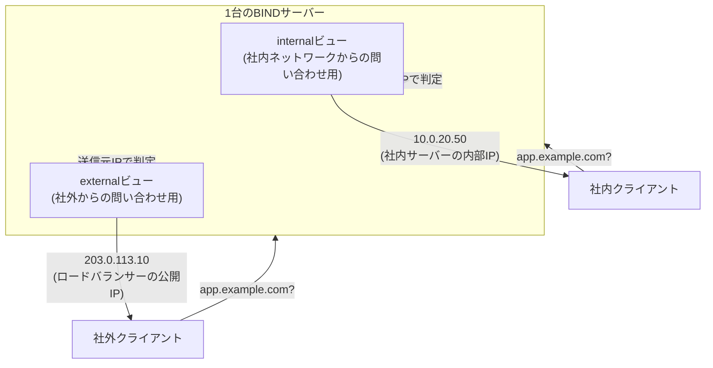

## はじめに

- **この記事で得られること**: [DNSサーバーの基礎](/articles/dns-server-fundamentals-guide)で扱った、1つのゾーンに1つのゾーンファイルが対応するという基本形を発展させ、**同じドメイン名に対して、問い合わせ元(社内か社外か)によって異なる応答を返す**、スプリットホライズンDNSという設計と、それを実現するBINDの**views**という機能を体系的に理解します。
- **対象読者**: 単一のゾーンファイルでDNSサーバーを構築した経験はあるが、「社内からは違うIPアドレスが返ってくる」という、より発展的な構成を見たことも構築したこともない方を想定しています。
- **読むのにかかる想定時間**: 約16分

この記事は[『上位1%』シリーズ 全記事ガイド](/sitemap)の一部、[DNSサーバー基礎シリーズ](/sitemap#シリーズ一覧)の6本目です。

## 前提知識

- **ゾーンファイルとACL**: [DNSサーバーの基礎](/articles/dns-server-fundamentals-guide)で扱った、ゾーンファイルの構造と、`allow-transfer`のような、問い合わせ元を制限する設定の考え方を前提とします。

## 全体像をつかむ

### スプリットホライズンDNSが解決する課題

社内向けのWebアプリケーションを、社内からは高速な内部ネットワーク経由で、社外(インターネット)からはロードバランサー経由で、**同じドメイン名(`app.example.com`など)でアクセスできるようにしたい**、という要望は珍しくありません。しかし、単一のゾーンファイルでは、1つの名前に対して1つの答えしか用意できません。**この、同じ名前に対して問い合わせ元ごとに異なる答えを返す設計を、スプリットホライズンDNS(または「DNSビュー」)と呼びます。**



## 基礎から徹底解説

### BINDのviewsという機能:送信元IPアドレスで、ゾーンデータそのものを切り替える

BINDでスプリットホライズンDNSを実現する機能が**views**です。`named.conf`に、複数の`view`ブロックを定義し、それぞれに**問い合わせを許可する送信元IPアドレスの範囲**(`match-clients`)と、**その範囲からの問い合わせに対して使うゾーンデータ**を、個別に指定します。

```
view "internal" {
    match-clients { 10.0.0.0/8; };
    zone "example.com" {
        type master;
        file "/etc/bind/db.internal.example.com";
    };
};

view "external" {
    match-clients { any; };
    zone "example.com" {
        type master;
        file "/etc/bind/db.external.example.com";
    };
};
```

**同じ`example.com`というゾーン名に対して、内容の異なる2つのゾーンファイル(`db.internal.example.com`と`db.external.example.com`)を用意し、問い合わせ元の送信元IPアドレスが`10.0.0.0/8`(社内)に一致すれば`internal`ビューが、それ以外(`any`、つまり社外を含むすべて)であれば`external`ビューが使われます。**

### viewsの評価順序:上から順に、最初にマッチしたものが使われる

`named.conf`に定義された複数の`view`ブロックは、**上から順に評価され、`match-clients`に最初にマッチしたビューが採用されます。** これは、[セキュリティグループとネットワークACL(NACL)の違い](/articles/aws-nacl-security-group-guide)で扱った、NACLの「番号の小さいルールが優先される」という評価順序と、発想が似ています。**そのため、より限定的な条件(社内ネットワークなど)のビューを先に、より広い条件(`any`)のビューを後に書く**、という順序が定石です。この順序を逆にしてしまうと、`any`にマッチする`external`ビューが常に先に採用されてしまい、`internal`ビューが一切使われないという設定ミスになります。

## プロが見ている視点(上位1%の理解)

### viewsを使う際、ゾーンファイルの二重管理という運用コストが発生する

スプリットホライズンDNSの最大の実務上の注意点は、**同じドメイン名について、内部用と外部用、2つの独立したゾーンファイルを、別々に管理し続ける必要がある**という点です。両方に共通するレコード(たとえば`mail.example.com`のMXレコードなど)を、片方だけ更新してしまうと、社内と社外で名前解決の結果に食い違いが生じます。実務では、この二重管理の手間を減らすため、共通するレコードを`$INCLUDE`ディレクティブで別ファイルとして共有し、**ビューごとに異なる部分だけを個別のファイルに分離する**、という運用が定石です。

### match-clientsは「送信元IPアドレス」であり、DNSの問い合わせ内容そのものではない

viewsの判定基準である`match-clients`は、あくまで**DNSサーバーへの問い合わせパケットの送信元IPアドレス**に基づいています。**社外のスマートフォンが、VPN経由で社内ネットワークに接続してから問い合わせれば、その送信元IPアドレスは社内アドレスとして扱われ、`internal`ビューの結果を受け取ります。** 逆に言えば、「社内ネットワークにいるかどうか」を判定しているのではなく、「DNSサーバーから見て、どのIPアドレス範囲から問い合わせが来たか」だけを見ている、という理解が重要です。この境界線のずれが、VPN接続時に社内向けのリソースへ正しくアクセスできる(あるいは、意図せずアクセスできてしまう)理由の正体です。

## よくある誤解・つまずきポイント

- **誤解1: 「viewsは、同じゾーンファイルを、問い合わせ元によって見せたり隠したりする機能である」**
  viewsは、ビューごとに完全に独立したゾーンファイルを使う仕組みであり、同じファイルの一部を出し分けているわけではありません。
- **誤解2: 「view定義の順序は、動作に影響しない」**
  viewsは上から順に評価され、最初にマッチしたビューが採用されるため、より限定的な条件を先に書く必要があります。
- **誤解3: 「match-clientsは、社内ネットワークに物理的に接続しているかどうかを判定している」**
  match-clientsは送信元IPアドレスのみで判定するため、VPN接続などで送信元IPアドレスが変われば、判定結果も変わります。

## 障害・トラブルシューティングの視点

1. **社内からのはずなのに、externalビューの結果が返ってくる**: `named.conf`での`view`定義の順序を確認します。より広い条件のビューが先に書かれていないかを確認します。
2. **internal/externalの両方のゾーンファイルで、内容の食い違いが発生している**: 共通するレコードが、`$INCLUDE`のような仕組みで共有されているか、それとも二重管理で片方だけ更新漏れが起きていないかを確認します。
3. **VPN接続時だけ、名前解決の結果が想定と異なる**: VPN接続後のクライアントの送信元IPアドレスが、`match-clients`のどの範囲に一致しているかを確認します。

## まとめ

- スプリットホライズンDNSは、同じドメイン名に対して、問い合わせ元によって異なる応答を返す設計です。
- BINDのviewsは、`match-clients`(送信元IPアドレスの範囲)ごとに、完全に独立したゾーンファイルを対応させることで、これを実現します。
- view定義は上から順に評価されるため、より限定的な条件を先に、より広い条件を後に書く必要があります。
- match-clientsは送信元IPアドレスのみで判定するため、VPN接続などによって、どのビューが採用されるかが変わります。

**今日から意識すべきこと**
1. viewsを設定する際は、より限定的な条件のビューを必ず先に書きましょう。
2. internal/externalの両方のゾーンファイルに共通するレコードは、`$INCLUDE`などで二重管理を避ける工夫をしましょう。

## 参考文献

- [BIND 9 Administrator Reference Manual: Views](https://bind9.readthedocs.io/en/latest/chapter4.html)
