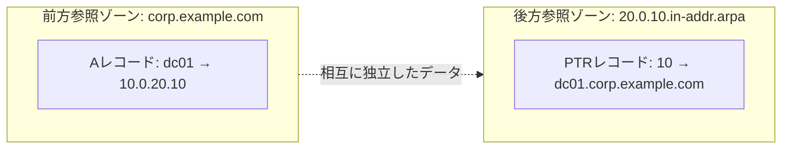

## はじめに

- **この記事で得られること**: DNSマネージャーを開くと必ず目にする「前方参照ゾーン」「後方参照ゾーン」という区分の意味、ADのゾーンの中に必ず現れる`_msdcs`という奇妙な名前のゾーンの正体、そしてAレコードだけでは説明できない**SRVレコード**というレコード種別が、AD環境で具体的にどう使われているのかを体系的に理解できます。あわせて、実際にDNSマネージャーの画面でどこを開けば何が確認できるのか、という実務的な読み方も整理します。
- **対象読者**: DNSマネージャーの画面は見たことがあるものの、前方参照ゾーンの中の`_msdcs`フォルダーやSRVレコードが何を意味しているのか説明できない方、AD移行や障害対応の際にDNSマネージャーの画面から必要な情報を読み取れるようになりたい方を想定しています。
- **読むのにかかる想定時間**: 約18分

この記事は[『上位1%』シリーズ 全記事ガイド](/sitemap)の一部、[Active Directoryシリーズ](/sitemap#シリーズ一覧)の5本目です。Aレコード・CNAME・MXなど基本的なレコード種別や再帰リゾルバ・権威サーバーの一般論は[DNSの仕組みを『上位1%』の視点で理解する](/articles/dns-guide)で扱っているため、本記事ではAD環境に特有のゾーン構造とSRVレコードにフォーカスします。また、フォレスト・ドメインという境界の意味は[ADとDC、ドメインとフォレストの違いを『上位1%』の視点で理解する](/articles/ad-dc-fundamentals-guide)を前提にしています。

## 前提知識

- **ゾーン**: DNSにおいて、特定の名前空間の範囲について、あるサーバー(群)が権威を持って管理しているデータの単位です。
- **Aレコード・SRVレコード**: Aレコードはホスト名をIPv4アドレスに変換する基本的なレコードです。SRVレコードは、「特定のサービスを提供しているサーバーはどれか」を示す、より高機能なレコードで、詳しくは本記事で扱います。
- **AD統合ゾーンとレプリケーションパーティション**: AD統合ゾーンのデータは、通常のドメインパーティションとは別に管理される場合があります。この違いが、後述する`_msdcs`ゾーンの特殊な扱いの鍵になります。
- **フォレストルートドメイン**: フォレストの中で最初に作成されたドメインのことです。[ドメイン・ツリー・フォレストの違い](/articles/ad-dc-fundamentals-guide)で見た通り、フォレストは複数のドメイン(ツリー)から構成できますが、その中で最初に構築されたドメインだけは特別扱いされ、Enterprise Admins・Schema Adminsといったフォレスト全体に影響するグループの既定の置き場所になったり、本記事で扱う`_msdcs`ゾーンの名前の一部として使われたりします。「フォレスト」と「フォレストルートドメイン」は別物で、後者はあくまでフォレストを構成する多数のドメインのうちの1つ(ただし特別な1つ)です。

## 全体像をつかむ

### DNSマネージャーの画面構成

本記事は、Windows Serverの管理ツールである**DNSマネージャー**(`dnsmgmt.msc`、サーバーマネージャーの「ツール」メニューからも開けます)の画面を読み解くことを主眼に置いています。DNSマネージャーを開くと、左側のツリーに接続先のDNSサーバー名が表示され、その配下に「前方参照ゾーン」「後方参照ゾーン」「条件付きフォワーダー」といったフォルダーが並びます。ゾーンのフォルダーを展開すると、そのゾーンに登録されている個々のレコード(Aレコード、SRVレコードなど)が一覧表示され、右クリックから新規レコードの追加やゾーンのプロパティ確認ができます。実務では「DNSマネージャーを開いて確認する」という行為は、このツリーを辿って該当するゾーン・レコードを探し出す作業を指します。

### 前方参照ゾーンと後方参照ゾーン

DNSマネージャーを開くと、ゾーンは大きく2種類に分類されて表示されます。

- **前方参照ゾーン(Forward Lookup Zone)**: 「名前→IPアドレス」の変換を担当するゾーンです。`corp.example.com`のようなドメイン名の中に、`www`や個々のPC名に対応するAレコードなどが格納されています。実務で「DNSレコードを登録する」と言うとき、ほとんどの場合はこの前方参照ゾーンへの登録を指します。
- **後方参照ゾーン(Reverse Lookup Zone)**: 「IPアドレス→名前」の変換(逆引き)を担当するゾーンです。ゾーン名はIPアドレスの範囲を逆順に並べた特殊な形式(例: `10.0.20.0/24`であれば`20.0.10.in-addr.arpa`)で表現され、中身はPTRレコードです。



**前方参照ゾーンと後方参照ゾーンは、互いに参照し合っているわけではなく、それぞれ独立して管理・登録される別々のデータです。** 前方参照ゾーンにAレコードを追加しても、対応する後方参照ゾーンのPTRレコードが自動的にできるとは限らず(動的更新が両方に対して有効になっていれば通常は両方登録されますが、後方参照ゾーン自体が作成されていなければPTRは登録されません)、この非対称性が「名前解決はできるのに逆引きだけできない」という実務上のトラブルの原因になることがあります。

## 基礎から徹底解説

### `_msdcs`ゾーンの正体

AD統合DNSの前方参照ゾーンを開くと、通常のホスト名の並びとは別に、必ず`_msdcs`という名前のフォルダー(あるいは独立したゾーンそのもの)が存在します。これは**Microsoft DCS**(Domain Controller Locator Service)の略で、**クライアントが「このドメイン(あるいはフォレスト)のDCはどこにあるか」を検索するための、特殊なレコード群を格納する専用の場所**です。

現在のWindows Serverでは、この`_msdcs`は多くの場合、フォレストのルートドメインの前方参照ゾーンの中の1フォルダーとしてではなく、**`_msdcs.<フォレストルートドメイン名>`という、それ自体が独立した前方参照ゾーン**として作成されます。これには重要な理由があります。

- 通常のドメインのゾーンデータ(AD統合ゾーン)は、既定では**そのドメイン内のDC間だけ**でレプリケーションされる、AD DSの**ドメインパーティション**に相当するデータ(正確には`DomainDnsZones`という専用のアプリケーションパーティション)として保存されます。
- 一方`_msdcs`ゾーンは、**フォレスト内のどのドメインのクライアントからも参照される必要がある**ため(たとえば、あるドメインのメンバーコンピューターが、フォレスト内の別ドメインのDCやグローバルカタログを検索する場合など)、**フォレスト内の全DC間でレプリケーションされる`ForestDnsZones`という別のアプリケーションパーティション**に保存されます。

この設計は、[ADとDC、ドメインとフォレストの違いを『上位1%』の視点で理解する](/articles/ad-dc-fundamentals-guide)で説明した「設定パーティション・スキーマパーティションはフォレスト全体で共有され、ドメインパーティションはドメイン内に閉じる」という区分と、まさに同じ発想の応用です。`_msdcs`のレコードは、ドメインを横断してフォレスト全体で参照される情報であるため、通常のドメインゾーンより広い範囲でレプリケーションされる必要がある、というわけです。

<details>
<summary>GUIDベースのCNAMEレコード:コンピューター名が変わってもDCを見失わない仕組み</summary>

前提として、**GUID**(Globally Unique Identifier)とは、128ビットの数値をもとに生成される、重複がほぼ発生しないことを前提とした識別子の総称です。AD DSでは、ユーザー・コンピューター・DC自身などほぼすべてのオブジェクトに、オブジェクト作成時にこのGUIDが1つ割り当てられ、**そのオブジェクトが存在し続ける限り、名前が変わってもGUID自体は変わりません**。また**CNAMEレコード**は、「ある名前を、別の名前の"別名"として登録する」DNSレコードの一種です。たとえば`www.example.com`という名前へのCNAMEレコードとして`web01.example.com`を登録しておけば、`www.example.com`への問い合わせは自動的に`web01.example.com`のAレコードを参照しに行きます。名前の転送先(この例では`web01.example.com`)を後から差し替えるだけで、参照元(`www.example.com`)を書き換えずに実体を切り替えられるのが、CNAMEの基本的な使い方です。

`_msdcs`ゾーンの直下には、通常のホスト名ではなく、**各DCのNTDS Settingsオブジェクトの一意のGUID(例: `a1b2c3d4-....`)を名前としたCNAMEレコード**が、DCの台数分だけ登録されています。このCNAMEレコードは、そのGUIDをそのDCの実際のAレコード(ホスト名)へ転送します。

この仕組みが存在する理由は、**レプリケーションパートナーの参照や一部のクライアント処理が、ホスト名ではなくこのGUIDを使ってDCを恒久的に識別する**ためです。[sysdm.cplとnetdom computernameは何が違うのか](/articles/ad-computername-netdom-guide)で見たように、DCのコンピューター名(ホスト名)は変更されうるものですが、GUIDは一度発行されると変わりません。GUIDベースのCNAMEレコードを経由する参照であれば、**そのDCのホスト名がその後変更されても、GUIDさえ変わらなければ、参照は自動的に新しいホスト名を指し示すAレコードへ正しくたどり着きます。** これが、DC降格後にホスト名を変更しても内部的な整合性が壊れにくい理由の1つです。

</details>

### SRVレコードとは何か:「サービスの提供者」を検索するためのレコード

[DNSの仕組みを『上位1%』の視点で理解する](/articles/dns-guide)で扱ったAレコードは、あくまで「この名前のIPアドレスは何か」を答えるだけです。しかし実務では、「LDAPサービスを提供しているサーバーはどれか」「Kerberosの鍵配布センター(KDC)はどのサーバーか」というように、**特定のサービスを提供しているサーバーを名前ではなく役割から検索したい**場面があります。これに応えるのが**SRVレコード**(Service record)です。

SRVレコードは、次のような形式でサービスの所在地を示します。

```
_サービス名._プロトコル.ドメイン名  優先度  重み  ポート番号  ターゲット(ホスト名)
```

AD環境で実際に登録される代表的なSRVレコードは次の通りです。

| SRVレコード名(例) | 意味 |
|---|---|
| `_ldap._tcp.dc._msdcs.corp.example.com` | このドメインのDC(LDAPサービス提供者)を検索する |
| `_ldap._tcp.<サイト名>._sites.dc._msdcs.corp.example.com` | 特定のADサイト(拠点)にあるDCだけを検索する |
| `_ldap._tcp.pdc._msdcs.corp.example.com` | PDCエミュレータ役割を持つ、ただ1台のDCを検索する |
| `_ldap._tcp.gc._msdcs.<フォレストルートドメイン>` | フォレスト内のグローバルカタログサーバーを検索する |
| `_kerberos._tcp.dc._msdcs.corp.example.com` | Kerberos認証のためのKDC(通常はDCが兼任)を検索する |

**優先度**(priority)と**重み**(weight)というフィールドは、同じ役割を持つサーバーが複数存在する場合の、選択の優先順位と負荷分散の比率を表します。クライアントは、優先度が最も低い(数値が小さい)グループの中から、重みに応じた確率で1台を選んで接続を試みます。

具体例で確認します。あるサービスに対して次の3つのSRVレコードが登録されているとします。

| ターゲット | 優先度 | 重み |
|---|---|---|
| dc01.corp.example.com | 0 | 50 |
| dc02.corp.example.com | 0 | 50 |
| dc03.corp.example.com | 10 | 100 |

この場合、クライアントはまず**優先度が最も低い(=0の)グループ**である`dc01`と`dc02`だけを候補にします(`dc03`は優先度10なので、`dc01`と`dc02`の両方に接続できない場合の予備です)。`dc01`と`dc02`は重みが同じ50:50なので、**ほぼ半々の確率でどちらか一方が選ばれます**。もし`dc01`の重みが80、`dc02`の重みが20であれば、**重みの比率どおり、dc01がおよそ80%、dc02がおよそ20%の確率で選ばれます**。つまり優先度は「どのグループを優先するか」という段階を、重みは「同じ優先度内での振り分け比率」を制御しており、優先度でサイト内/サイト外DCの切り分けを行い、重みでサーバースペックの差に応じた負荷分散を行う、という組み合わせ方が実務ではよく使われます。

<details>
<summary>ADサイトを考慮したDC検索がなぜ重要なのか</summary>

前述の`_sites`付きのSRVレコードは、**クライアントに、地理的・ネットワーク的に近い(同じADサイトに属する)DCを優先的に見つけさせる**ための仕組みです。ADサイトとは、IPサブネットの集合を「同じ拠点(高速な回線でつながっている範囲)」として定義する、AD DSの構成情報の一種です。もしこの仕組みがなく、クライアントが常にフォレスト内のどのDCにでもランダムに接続してしまうと、海外拠点のクライアントが遠く離れた本社のDCへ毎回問い合わせに行くことになり、認証やポリシー適用のたびに大きな遅延が発生します。DCロケーターは、まず同じサイト内のDCを優先的に探し、見つからない場合にのみ他のサイトのDCへフォールバックする、という順序で動作します。

</details>

### DNSマネージャーでの実際の見方

実務でDNSマネージャーを開いて確認する際、次のような視点で見ていくと情報を読み取りやすくなります。

1. **前方参照ゾーンの一覧で、対象のドメイン名(`corp.example.com`)と`_msdcs.<フォレストルートドメイン>`の両方が存在するかを確認する**——前者がドメインゾーン、後者がフォレスト全体で共有される特殊ゾーンです。
2. **ドメインゾーン(`corp.example.com`)の直下で、各DCのホスト名に対応するAレコードが正しく存在するかを確認する**——ここが存在しない、あるいは古いIPアドレスを指している場合、そのDC自体への到達性に問題が出ます。
3. **`_msdcs`ゾーンの`dc`フォルダー(および`_sites`配下)で、期待するDCの台数分のSRVレコードが登録されているかを確認する**——ここに、既に撤去したはずの古いDCの名前が残っていないかは、AD移行後のクリーンアップ確認で特に重要な確認ポイントです(詳しくは後続記事で扱います)。
4. **`_msdcs`ゾーンの直下にある、GUID名のCNAMEレコードの数が、実際に稼働しているDCの台数と一致しているかを確認する**——数が合わない場合、正しく降格・削除されていないDCの残骸が存在する可能性があります。

## プロが見ている視点(上位1%の理解)

### `dnslint`によるSRVレコードの健全性検証

AD環境のDNS構成に問題がないかを網羅的に検証するツールとして、Microsoftは`dnslint`というコマンドラインツールを提供しています。特に`dnslint /ad`というオプションは、指定したDCに対して、前述の`_msdcs`配下の主要なSRVレコードが期待通りに登録・解決できるかを一括でチェックし、レポートをHTML形式で出力します。DNSマネージャーの画面を目視で1つずつ確認する代わりに、この種のツールでまとめて検証することが、大規模環境での実務では現実的です。

### 前方参照ゾーンと後方参照ゾーンの非対称性が引き起こす実務上の問題

前述の通り、前方参照ゾーンと後方参照ゾーンは独立したデータです。この非対称性は、**Kerberos認証における逆引きの利用**という形で実務に影響することがあります。一部のアプリケーションやサービス(特にレガシーな実装)は、[SPN](/articles/ad-spn-guide)の検証やログ記録のために逆引き(PTRレコード)を利用することがあり、後方参照ゾーンが正しく構成されていない、あるいは動的更新が有効になっていない環境では、名前解決自体は正常なのに特定のサービスだけで認証エラーやパフォーマンス低下が起こる、という一見不可解な症状につながることがあります。

## よくある誤解・つまずきポイント

- **誤解1: 「`_msdcs`は単なる迷惑なフォルダーで、中身を気にする必要はない」**
  `_msdcs`は、クライアントがDC・グローバルカタログ・KDCを検索するために不可欠なSRVレコード群を格納する、AD DSの根幹に関わるゾーンです。特にフォレスト全体で共有される特殊なレプリケーション範囲を持つ点が重要です。
- **誤解2: 「前方参照ゾーンにAレコードがあれば、対応する逆引きレコードも自動的に存在する」**
  前方参照ゾーンと後方参照ゾーンは独立したデータであり、後方参照ゾーン自体が作成・設定されていなければ、対応するPTRレコードは存在しません。
- **誤解3: 「SRVレコードは特殊すぎて、AD以外では使われていない」**
  SRVレコードはAD以外にも、SIP(VoIP)やXMPP(チャット)など、さまざまなサービスディスカバリの標準的な仕組みとして広く使われている、汎用的なDNSレコード種別です。

## 障害・トラブルシューティングの視点

DNSゾーン・レコードに起因するAD障害は、**「必要なレコードが実際に存在し、正しい内容になっているか」を`_msdcs`から順に確認する**のが基本です。

1. **特定のクライアントだけDCを見つけられない(ログオンが不安定)**: そのクライアントが問い合わせているDNSサーバー上の`_msdcs`ゾーンに、期待するDCのSRVレコードが正しく登録されているかを`nslookup`(`set type=srv`のあと`_ldap._tcp.dc._msdcs.<ドメイン名>`を問い合わせる)で確認します。
2. **AD移行後、撤去したはずの古いDCの名前がまだ検索結果に出てくる**: `_msdcs`ゾーンのSRVレコードとGUID名のCNAMEレコードに、古いDCの情報が残っていないかを確認します(降格処理が不完全だった可能性があります)。
3. **名前解決はできるのに、特定のサービスだけ認証エラーになる**: 後方参照ゾーンが正しく構成されているか、PTRレコードが前方参照ゾーンの内容と一致しているかを確認します。

### 予防策・恒久対策

- 大規模環境では`dnslint /ad`などのツールを使い、目視確認に頼らずSRVレコードの健全性を定期的に検証する。
- 前方参照ゾーンを新設する際は、対応する後方参照ゾーンの作成と動的更新の有効化を必ずセットで検討する。
- DCを降格・撤去する際は、`_msdcs`ゾーンとGUID名のCNAMEレコードが正しく削除されたことまで確認する。

## まとめ

- 前方参照ゾーンは名前→IP、後方参照ゾーンはIP→名前を担当する、互いに独立したデータです。
- `_msdcs`ゾーンは、クライアントがDC・グローバルカタログ・KDCを検索するためのSRVレコード群を格納する特殊なゾーンで、フォレスト全体で共有されるべき情報のため`ForestDnsZones`パーティションに保存され、通常のドメインゾーンより広い範囲でレプリケーションされます。
- SRVレコードは、特定のサービスを名前ではなく役割から検索するためのレコード種別で、優先度・重みによって複数サーバー間の選択・負荷分散を制御します。
- DNSマネージャーでは、ドメインゾーンのAレコード、`_msdcs`ゾーンのSRVレコード、GUID名のCNAMEレコードという3種類の情報を順に確認することで、AD環境のDNS健全性を実務的に読み取れます。

**今日から意識すべきこと**
1. DNSマネージャーを開いたら、まず`_msdcs.<フォレストルートドメイン>`ゾーンが独立して存在することを確認し、それが通常のドメインゾーンとは異なるレプリケーション範囲を持つことを意識しましょう。
2. AD移行や障害対応の際は、`nslookup`でSRVレコードを直接問い合わせることで、DNSマネージャーの画面を目視するより速く健全性を確認できることを覚えておきましょう。

## 参考文献

- [DNS Support for Active Directory Technical Reference | Microsoft Learn](https://learn.microsoft.com/en-us/previous-versions/windows/it-pro/windows-server-2003/cc759550(v=ws.10))
- [A DNS Look-up Tool (Dnslint.exe) Is Available | Microsoft Learn](https://learn.microsoft.com/en-us/troubleshoot/windows-server/networking/dnslint-tool-available)
- [Resource Records (SRV RR) | RFC 2782](https://datatracker.ietf.org/doc/html/rfc2782)
- [DNS Zone Replication in Active Directory Domain Services | Microsoft Learn](https://learn.microsoft.com/en-us/previous-versions/windows/it-pro/windows-server-2003/cc816656(v=ws.10))
