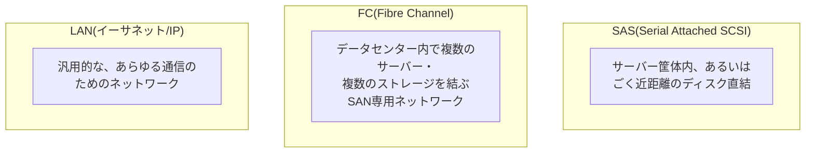

## はじめに

- **この記事で得られること**: 「FCケーブル接続の場合はサーバーとストレージのセグメントを気にしなくてよい」という実務上の説明を出発点に、**FCがIPアドレスを使わずにどうやって通信相手を認識しているのか**を体系的に理解します。あわせて、IPネットワーク(LAN)とは設計思想が根本的に異なる<strong>FC(Fibre Channel)</strong>と、サーバー筐体内での直結に使われる<strong>SAS(Serial Attached SCSI)</strong>について、それぞれ何のために設計された規格なのか、そして実務でどう使い分けるべきかまでを整理します。
- **対象読者**: サーバーとストレージの接続にFC・SASという用語が登場することはあるものの、IPネットワークとの違いや、それぞれの規格が持つ設計思想を具体的に説明できない方を想定しています。
- **読むのにかかる想定時間**: 約18分

この記事は[『上位1%』シリーズ 全記事ガイド](/sitemap)の一部、[ストレージ基礎シリーズ](/sitemap#シリーズ一覧)の2本目です。

## 前提知識

- **SAN(Storage Area Network)**: 複数のサーバーと複数のストレージ装置を、ネットワークを介して接続する構成です。個々のサーバーがストレージを直接内蔵するのではなく、ストレージを外部の共有リソースとして扱えるようにする仕組みです。

## 全体像をつかむ

### 3つの接続方式は、そもそも設計思想が異なる

**FC・SAS・LAN(イーサネット/IP)は、単なる「ケーブルの種類の違い」ではありません。それぞれ、想定する接続範囲と目的がまったく異なる、別々の設計思想を持つ技術です。**

## 基礎から徹底解説

### FC(Fibre Channel)がIPアドレスを使わずに通信相手を認識する仕組み

ここが最大の疑問点です。**FCはそもそもIPネットワークではないため、IPアドレスという概念自体を使いません。** その代わりに、FC上のすべての機器(サーバー側のFC HBA、ストレージ装置のポートなど)には、<strong>WWN(World Wide Name)</strong>という、**世界で一意な識別子**が製造時に割り当てられています。これは、イーサネットの世界におけるMACアドレスに相当する概念です。

FC専用のスイッチ(複数台のFCスイッチで構成されるネットワーク全体を<strong>ファブリック(Fabric)</strong>と呼びます)は、このWWNをもとに、どのサーバーがどのストレージ装置(のどのポート)と通信できるかを管理します。**「セグメントを気にしなくてよい」という説明は、まさにこの点を指しています。** IPネットワークのようにサブネット・セグメントという概念でアクセス範囲を区切るのではなく、**FCではWWN単位で、どの機器とどの機器が通信を許可されるかを直接指定する、ゾーニング(Zoning)という仕組み**でアクセス制御が行われます。IPアドレスの割り当て設計やルーティングという発想自体が、そもそもFCには存在しません。

ゾーニングとは何か

**ゾーニング**は、FCスイッチ上で、WWN(あるいは、スイッチのどの物理ポートに接続されているか)を基準に、「このサーバーのWWNは、このストレージ装置のこのポートのWWNとだけ通信できる」というルールを定義する仕組みです。これは、IPネットワークにおけるVLANやアクセスコントロールリスト(ACL)が担っている役割に近いものですが、**IPアドレスという抽象化を経由せず、機器固有の識別子(WWN)を直接基準にしている**という点が異なります。

### FCスイッチを介さない直結構成でも、WWNの識別は自動的に行われる

サーバーとストレージ装置をFCスイッチなしで直接ケーブル接続する、**ポイント・ツー・ポイント**という構成も存在します。この場合、管理者が通信相手のWWNを手動で指定する必要はありません。**FCのポートは、リンクが確立すると、自動的に「ログイン」と呼ばれる手続きを行います。** まず`FLOGI`(Fabric Login)という要求を送り、相手がFCスイッチ(ファブリック)であるかどうかを確認します。ファブリックが存在しない直結構成では、この`FLOGI`に応答するファブリックが存在しないため、ポートは「自分はポイント・ツー・ポイント構成にある」と判断し、代わりに**相手の機器そのものへ直接`PLOGI`(N_Port Login)を行い、互いのWWNを交換した上で通信を開始します。** つまり、IPネットワークで直結した2台の機器がARPによって自動的に相手のMACアドレスを知るのと同じように、**WWNによる相手の識別自体は、ケーブルを接続した時点でFCのプロトコルが自動的に行っており、管理者が明示的に設定する項目ではありません。** ゾーニングは、あくまで複数のサーバー・複数のストレージ装置がファブリックを介して混在する環境でアクセス制御を行うための仕組みであり、直結構成のように通信相手が最初から1台しかいない場合には、そもそもゾーニングという概念自体が意味を持たないため、設定は不要です。

### FCの物理層:LANとは完全に独立した配線・機器

FCは、論理的な通信方式が異なるだけでなく、**物理的な配線・機器の面でも、既存のLAN(イーサネット)とは完全に独立しています。** サーバー側には専用の<strong>FC HBA(Host Bus Adapter)</strong>という、通常のNICとは別のアダプタを搭載し、専用の光ファイバーケーブル(ごく一部の環境では銅線)で、専用のFCスイッチへ接続します。この配線・機器一式が、既存のイーサネットのLANケーブル・スイッチとは、完全に別のネットワークとして構築されます。

FCoE(Fibre Channel over Ethernet)という例外

近年では、<strong>FCoE(Fibre Channel over Ethernet)</strong>という技術により、FCのフレームをイーサネットのフレームの中にカプセル化して、物理的な配線自体をイーサネットと共有する構成も存在します。ただし、この場合でも、**WWNによる識別やゾーニングといった、FCの論理的な仕組み自体はそのまま維持されます。** あくまで物理層の配線を共有できるようにする技術であり、FCという通信方式の設計思想そのものを変えるものではない、という理解が正確です。

### SAS(Serial Attached SCSI)とは何か

**SAS**は、古くからストレージ接続の標準として使われてきた**SCSI**規格の、シリアル伝送版です。**サーバー筐体内、あるいは外部のディスクエンクロージャとの、ごく近距離(数メートル程度)の直結**に使われる規格であり、FCのように**複数のサーバーと複数のストレージ装置が、ネットワークを介して自由に通信し合う**という用途は想定していません。

**SASの基本的な発想は、あくまで「1対1(あるいはエクスパンダーという中継装置を介した1対多)の直結」であり、FCのような「ファブリック」やゾーニングといったネットワーク的な仕組みそのものを持ちません。** サーバーに内蔵されたHDD/SSDや、サーバーに直結された外部のディスクエンクロージャを接続する用途で使われる、最も基本的なストレージ接続方式だと理解しておくと整理しやすくなります。

### SASは、通信相手をどうやって識別しているのか

FCがWWNで機器を識別しているように、**SASの機器(HBA・ディスク・エクスパンダーのポートなど)にも、`SASアドレス`と呼ばれる、製造時に割り当てられる世界で一意な識別子が存在します。** 発想としてはFCのWWNとほぼ同じものだと理解して構いません。複数のディスクをエクスパンダー経由でツリー状に接続するような、やや複雑な構成では、**SMP**(Serial Management Protocol)という管理用のプロトコルを使い、どのポートにどのSASアドレスの機器が接続されているかを問い合わせる、探索(ディスカバリー)の手続きが行われます。

SASにもゾーニングに相当する仕組みはあるのか

基本的な1対1の直結構成では登場しませんが、複数のサーバー(イニシエーター)が同じディスクエンクロージャを共有するような、より高度なエンタープライズ向けのSAS構成では、**SASゾーニング**という、FCのゾーニングに近い仕組みが使われることがあります。エクスパンダーに対してSMP経由でゾーニング設定を行い、特定のイニシエーターから特定のディスクだけが見えるように制限します。ただし、これはSASの発展的な使い方であり、サーバー筐体内やごく近距離の単純な直結構成では意識する必要はありません。

## プロが見ている視点(上位1%の理解)

### 使い分けの基準:接続範囲と要件で選ぶ

3つの方式の使い分けは、次のような基準で整理できます。

| 方式 | 主な用途 | 特徴 |
|---|---|---|
| **SAS** | サーバー筐体内、あるいは直結の外部ディスクエンクロージャとの、ごく近距離の接続 | ネットワークという概念自体が不要な、単純な直結構成 |
| **FC** | データセンター内で、複数のサーバーと複数のストレージ装置を結ぶSANを構築する場合 | IPとは独立した専用ネットワークによる、高い帯域保証・低レイテンシ・輻輳制御の成熟度。大規模エンタープライズ環境で伝統的に選ばれてきた |
| **LAN(iSCSIなど)** | 既存のIPネットワーク・イーサネット機器を再利用してSAN相当の構成を組みたい場合 | 追加の専用機器(FCスイッチ・FC HBA)が不要なためコスト面で有利。伝統的にはFCほどの低レイテンシ・帯域保証には及ばないとされてきたが、高速イーサネットの普及で差は縮小している |

通信速度と伝送距離という、より具体的な数値で比較すると、次のようになります。

| 項目 | SAS | FC |
|---|---|---|
| 世代ごとの速度 | SAS-1(3Gbps)→SAS-2(6Gbps)→SAS-3(12Gbps)→SAS-4(24Gbps)と世代ごとに倍増 | 8G→16G→32G→64G→128Gと世代ごとに倍増 |
| 伝送距離 | 銅線ケーブルでの直結が基本で、数メートル程度(アクティブケーブルやエクスパンダーで多少延長可能) | 光ファイバーが基本で、世代によっては最大10km前後まで到達可能。データセンター間などの長距離接続にも対応できる |
| 接続構成 | 1対1、またはエクスパンダーを介した1対多のツリー構造 | FCスイッチによる本格的なネットワーク(ファブリック)を構築可能 |

この表からも分かる通り、**SASは「近距離・低コスト」、FCは「長距離・大規模ネットワーク」という、そもそも狙っている使用場面が異なります。** SASの世代ごとの速度自体はFCと比べて遜色ない水準まで上がってきていますが、伝送距離と接続構成の自由度の違いから、用途が置き換わるわけではありません。

**FCが今でもエンタープライズ環境で選ばれ続けている理由は、IPネットワークから完全に独立した専用の通信方式であることによる、帯域保証・低レイテンシ・輻輳制御の成熟度**にあります。一方、既存のIPネットワークインフラを再利用でき、追加の専用機器投資を抑えられるという理由から、iSCSIのようなLANベースの選択肢も広く使われています。どちらを選ぶかは、**既存のネットワーク投資・運用チームのスキルセット・要求される性能水準**を踏まえた、トレードオフの判断になります。

## よくある誤解・つまずきポイント

- **誤解1: 「FCは、IPネットワークの一種であり、IPアドレスに相当する何かを内部的に使っている」**
  FCはIPネットワークとは別系統の通信方式であり、IPアドレスという概念自体を使いません。機器の識別にはWWNという固有の識別子を使います。
- **誤解2: 「SASはネットワークプロトコルであり、複数の相手と自由に通信できる」**
  SASの基本的な発想は1対1(あるいはエクスパンダーを介した1対多)の直結であり、FCのようなファブリック・ゾーニングといったネットワーク的な仕組みは持ちません。
- **誤解3: 「FCoEを使えば、FCという技術自体がイーサネットに置き換わる」**
  FCoEはFCのフレームをイーサネットの物理配線の上でカプセル化して運ぶ技術であり、WWNによる識別やゾーニングといったFCの論理的な仕組み自体は維持されます。

## 障害・トラブルシューティングの視点

FC・SAN関連の障害は、**「物理的な配線・機器の問題か、ゾーニング(論理的なアクセス制御)の問題か」を切り分ける**のが基本です。

1. **サーバーから特定のストレージ装置(のLUN)が見えない**: そのサーバーのWWNが、対象のストレージ装置のポートと通信できるようゾーニング設定されているかを確認します。
2. **FC HBA自体が認識されない**: OS側のデバイスドライバ、およびFC HBAとFCスイッチ間の物理的な接続(光ファイバーケーブル、SFPモジュールなど)を確認します。
3. **SASで接続した外部ディスクエンクロージャが認識されない**: SASケーブル自体の接続と、エクスパンダーを介している場合はその設定を確認します。

### 予防策・恒久対策

- ゾーニングの設定変更を行う際は、変更対象のWWNと影響範囲を事前に正確に洗い出しておく。
- FC・SAN環境の設計時には、既存のネットワーク投資・運用チームのスキルセットを踏まえ、FC・iSCSIのどちらが要件に適しているかを比較検討する。

## まとめ

- FC・SAS・LANは単なるケーブルの種類の違いではなく、想定する接続範囲と目的が異なる、別々の設計思想を持つ技術です。
- FCはIPアドレスを使わず、WWNという世界で一意な識別子で機器を識別し、ゾーニングという仕組みでアクセス制御を行うため、IPネットワークのようなセグメントという概念を気にする必要がありません。
- SASは、サーバー筐体内やごく近距離のディスク直結に使われる規格で、FCのようなネットワーク的な仕組み(ファブリック・ゾーニング)は持ちません。
- FCは専用ネットワークとしての帯域保証・低レイテンシの成熟度から大規模エンタープライズ環境で選ばれ続けており、iSCSIなどのLANベースの選択肢は既存インフラの再利用によるコスト面の利点があります。

**今日から意識すべきこと**
1. FCの「セグメントを気にしなくてよい」という説明に出会ったら、IPアドレスではなくWWNとゾーニングでアクセス制御が行われていることを思い出しましょう。
2. SAS・FC・LANという用語に出会ったら、それぞれが想定する接続範囲(筐体内直結・SAN・汎用ネットワーク)の違いを意識しましょう。

## 参考文献

- [Fibre Channel Overview | SNIA](https://www.snia.org/education/what-is-fibre-channel)
- [Serial Attached SCSI (SAS) | SNIA Dictionary](https://www.snia.org/education/dictionary)
- [Fibre Channel Zoning | Storage Networking Industry Association](https://www.snia.org/education)
