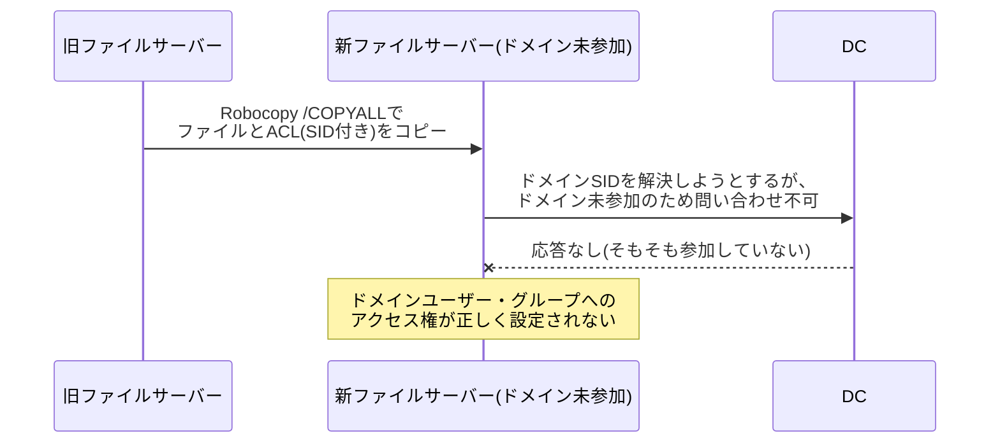

## はじめに

- **この記事で得られること**: ファイルサーバーの移行作業で、`Robocopy`の`/COPYALL`オプションを使えばアクセス権(ACL)も一緒にコピーできる、ということは知られています。しかし、**新しいサーバーをまだドメインへ参加させていない状態でこれを実行すると、ドメインユーザー・ドメイングループに対するアクセス権は正しくコピーされない**という、意外な落とし穴があります。この記事では、**NTFSのACLがSIDという識別子で記録されていること、そのSIDの解決にドメイン参加が必要なこと**を理解した上で、「読み取り専用にしてからコピーすれば安全だろう」という発想が、[共有アクセス許可とNTFSアクセス許可という2層構造](/articles/smb-file-sharing-guide)を理解していないと見落としにつながる理由までを体系的に理解します。
- **対象読者**: ファイルサーバーの移行やリプレース作業で、`Robocopy`の`/COPYALL`オプションを使ったことがあるものの、なぜドメイン参加のタイミングが重要なのかを説明できない方を想定しています。
- **読むのにかかる想定時間**: 約17分

この記事は[『上位1%』シリーズ 全記事ガイド](/sitemap)の一部、[Windows Server運用シリーズ](/sitemap#シリーズ一覧)の8.1本目です。

## 前提知識

- [Windows ServerのSMB共有](/articles/smb-file-sharing-guide): 共有アクセス許可とNTFSアクセス許可という、独立した2層のアクセス制御が存在するという理解が前提になっています。
- [ADとDC、ドメインとフォレストの違い](/articles/ad-dc-fundamentals-guide): ドメインに参加した端末が、DCと通信して認証やアカウント情報の解決を行うという理解が前提になっています。

## 全体像をつかむ

**NTFSのACL(アクセス制御リスト)は、「誰に」権限を与えるかを、ユーザー名やグループ名という読みやすい文字列ではなく、SID(セキュリティ識別子)という内部的な識別子で記録しています。** `S-1-5-21-...`のような形式のSIDは、それ単体では人間にも、OSにも、「誰を指しているのか」を直接教えてくれません。**OSがSIDを「誰を指しているのか」という意味のある情報へ変換するには、そのSIDの発行元(ローカルコンピューター、またはドメイン)に問い合わせる必要があります。** ドメインユーザー・ドメイングループのSIDであれば、この問い合わせ先はDCです。**新しいファイルサーバーがまだドメインに参加していない場合、DCへ問い合わせる手段そのものがなく、ドメインSIDを解決できません。** この結果、`Robocopy`が`/COPYALL`でACLを丸ごとコピーしようとしても、ドメインSIDに関する権限設定だけが、正しく移行されないという事態が起こります。

## 基礎から徹底解説

### なぜ`/COPYALL`を使っても、ドメインSIDは正しくコピーされないのか

**`Robocopy`の`/COPYALL`(内部的には`/COPY:DATSOU`)オプションは、ファイルのデータに加えて、タイムスタンプ・所有者情報・ACLなど、セキュリティ関連の属性もまとめてコピーする設定です。** ACLをコピーする際、**Windowsは、コピー先に書き込もうとしているSIDが、実際に解決可能な(=有効な)セキュリティプリンシパルであるかを検証しようとします。** **ローカルグループやローカルユーザーのSIDであれば、コピー先のコンピューター自身のローカルなアカウント情報を見れば解決できます**が、**ドメインユーザー・ドメイングループのSIDは、コピー先のコンピューターがドメインに参加し、DCへ問い合わせられる状態でなければ解決できません。** ドメインに参加していないコピー先では、このSID解決が失敗し、**既定では、解決できなかったSIDに関するアクセス制御エントリ(ACE)は、正しく設定されない**という挙動になります。ファイル自体は正常にコピーされるため、「コピーは成功した」ように見えますが、**権限だけが抜け落ちている**という、見た目では気づきにくい形の不整合が発生します。

ローカルグループを使っている場合の、もう1つの落とし穴

**旧ファイルサーバーのACLに、そのサーバー自身のローカルグループ(ドメインのグループではない)が使われていた場合**、この問題はさらに厄介になります。**ローカルグループのSIDは、そのグループが作成されたコンピューター自身に固有であり、別のコンピューター(新ファイルサーバー)からは、たとえドメインに参加していても、そもそも解決できません。** コピー先では、このSIDは「存在しないアカウント」として扱われ、いわゆる**デッドSID**(持ち主が解決できない、孤立したSID)として残ることになります。移行計画の初期段階で、旧ファイルサーバーのACLにローカルグループが使われていないかを確認し、使われていれば、移行前にドメインのグループへ置き換えておくことが望ましい対応です。

### 正しい移行の順序

前述の問題を避けるためには、次の順序を徹底する必要があります。

1. **新ファイルサーバーを、まずドメインへ参加させる**(この時点で、ファイルのコピーはまだ行わない)
2. **ドメイン参加が完了し、DCへの問い合わせが可能な状態になったことを確認する**
3. **この状態になってから、`Robocopy /COPYALL`でファイルとACLをコピーする**

この順序であれば、コピー処理の最中、新ファイルサーバーは常にDCへ問い合わせ可能な状態にあるため、ドメインユーザー・ドメイングループのSIDも正しく解決され、ACLがそのまま正確に引き継がれます。

## プロが見ている視点(上位1%の理解)

### 「読み取り専用にしてからコピーすれば安全」という発想の見落とし

ファイルサーバーの移行作業では、**移行中にユーザーがファイルを更新してしまい、コピー後の内容と食い違う**という事故を防ぐため、旧ファイルサーバーの共有フォルダーを一時的に読み取り専用にする、という対策がよく取られます。ここで実務者が抱きがちな疑問が、**「この読み取り専用設定が、Robocopyによってそのまま新サーバーへコピーされてしまい、新サーバーでも誤って読み取り専用のままになってしまわないか**」というものです。

**この疑問への答えは、[共有アクセス許可とNTFSアクセス許可という、2層の独立したアクセス制御](/articles/smb-file-sharing-guide)を理解していれば明確になります。** 読み取り専用の設定を、**共有アクセス許可(共有フォルダーへの「入り口」で設定する権限)として行った場合**、この設定は共有フォルダーそのものに紐づく情報であり、**`Robocopy`がコピーするのは、あくまでファイル・フォルダー自身のNTFS ACLだけ**です。共有アクセス許可は、ファイルシステム上のどこにも記録されておらず、`Robocopy`のコピー対象には、そもそも含まれません。**つまり、共有アクセス許可としての読み取り専用設定は、Robocopyによって新サーバーへ引き継がれることはなく**、新サーバー側で共有を作成する際に、あらためて明示的に設定する必要があります。

NTFSアクセス許可として読み取り専用にしていた場合はどうなるか

一方、読み取り専用の制限を、**NTFSアクセス許可(ファイル・フォルダー自身に記録されている個別の権限)として設定していた場合**は、話が変わります。この場合、その制限は**ファイル自身のACLの一部**であるため、`Robocopy /COPYALL`は、この制限もそのまま新サーバーへコピーします。**移行完了後も新サーバー上でユーザーが書き込めない状態が続いてしまう**ため、移行作業の最終段階で、NTFSアクセス許可として設定した読み取り専用の制限を、明示的に解除する作業を、チェックリストに含めておく必要があります。

## よくある誤解・つまずきポイント

- **誤解1: 「`/COPYALL`を使えば、どんなACLでも完全にコピーされる」**
  `/COPYALL`がコピーできるのは、コピー先で解決可能なSIDに関するACLだけです。コピー先がドメインに参加していない場合、ドメインSIDは解決できず、正しくコピーされません。
- **誤解2: 「ファイルのコピーが正常に完了した=アクセス権も正しく引き継がれた」**
  ファイル自体のコピーが成功しても、SIDが解決できなかったACEは、正しく設定されないまま、見た目には気づきにくい形で欠落します。
- **誤解3: 「共有フォルダーを読み取り専用にしておけば、Robocopyでそのまま新サーバーに引き継がれる」**
  共有アクセス許可としての読み取り専用設定は、Robocopyのコピー対象であるNTFS ACLには含まれず、新サーバー側で別途明示的に設定し直す必要があります。

## 障害・トラブルシューティングの視点

1. **移行後のファイルサーバーで、ドメインユーザーがアクセスできないという報告が相次ぐ**: 移行時に新サーバーがドメインに参加済みだったか、そして旧サーバーのACLにローカルグループが使われていなかったかを確認します。
2. **移行後も特定のフォルダーが書き込み不可のままになっている**: NTFSアクセス許可として読み取り専用の制限が設定されていなかったか、移行前の旧サーバー側のACLを確認します。
3. **移行後、新サーバーで共有フォルダーへのアクセスがすべて拒否される**: 共有アクセス許可が、新サーバー側の共有作成時に明示的に設定されているかを確認します。NTFSアクセス許可が正しくても、共有アクセス許可が未設定であればアクセスは拒否されます。

## まとめ

- NTFSのACLは、ユーザー名やグループ名ではなく、SIDという内部的な識別子で記録されています。
- ドメインユーザー・ドメイングループのSIDを解決するには、コピー先のコンピューターがドメインに参加し、DCへ問い合わせられる状態である必要があります。
- 新ファイルサーバーをドメインへ参加させる前にRobocopyでコピーすると、ドメインSIDに関するアクセス権だけが正しく移行されません。
- 共有アクセス許可とNTFSアクセス許可は独立した2層であり、RobocopyがコピーするのはあくまでNTFSアクセス許可だけです。

**今日から意識すべきこと**
1. ファイルサーバーの移行では、必ず「新サーバーのドメイン参加完了」を確認してから、Robocopyによるファイルコピーを実行しましょう。
2. 旧ファイルサーバーのACLに、ローカルグループが使われていないかを、移行計画の初期段階で確認しましょう。

## 参考文献

- [Robocopy | Microsoft Learn](https://learn.microsoft.com/en-us/windows-server/administration/windows-commands/robocopy)
- [How Security Descriptors and Access Control Lists Work | Microsoft Learn](https://learn.microsoft.com/en-us/windows/win32/secauthz/access-control-lists)
