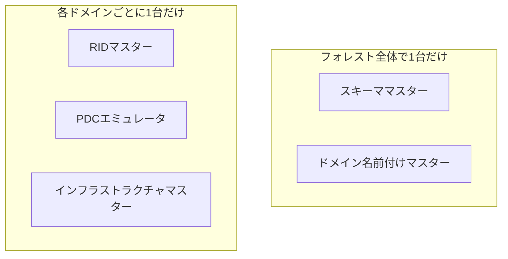
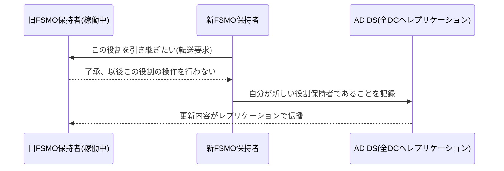

## はじめに

- **この記事で得られること**: [ADとDCの違い、ドメインとフォレストの違いを『上位1%』の視点で理解する](/articles/ad-dc-fundamentals-guide)で見た「AD DSはマルチマスターレプリケーションが基本」という原則には、実は例外があります。**FSMO**(Flexible Single Master Operations、操作マスター)と呼ばれる5つの役割だけは、フォレストやドメインの中でただ1台のDCだけが実行できる操作として、特別に単一マスターの仕組みが用意されています。この記事では、なぜこの5つの役割だけがマルチマスターにできないのか、それぞれの役割が具体的に何をしているのか、そしてFSMOをあるDCから別のDCへ移す**FSMO転送**がどのような仕組みで行われるのかを体系的に理解します。
- **対象読者**: AD移行やDC構築の手順の中で「FSMOの移行」という作業を行ったことがあるものの、5つの役割それぞれが何をしているのか、なぜ単一マスターである必要があるのかを具体的に説明できない方を想定しています。
- **読むのにかかる想定時間**: 約20分

この記事は[『上位1%』シリーズ 全記事ガイド](/sitemap)の一部、[Active Directoryシリーズ](/sitemap#シリーズ一覧)の6本目です。ドメイン・フォレストの境界については[ADとDC、ドメインとフォレストの違いを『上位1%』の視点で理解する](/articles/ad-dc-fundamentals-guide)を前提にしています。

## 前提知識

- **マルチマスターレプリケーション**: AD DSの通常の変更は、どのDCで行っても他の全DCへ伝播していく方式です。詳しくは[ADとDC、ドメインとフォレストの違いを『上位1%』の視点で理解する](/articles/ad-dc-fundamentals-guide)を参照してください。
- **SID(セキュリティ識別子)**: ユーザーやコンピューターを一意に識別する値です。ドメインSID(そのドメイン共通の部分)と、オブジェクトごとに異なる**RID**(Relative Identifier、相対識別子)という数値の組み合わせで構成されます。

## 全体像をつかむ

### なぜマルチマスターの例外が必要なのか

マルチマスターレプリケーションは、「どのDCで変更しても、最終的には他のDCへ伝播する」という前提のもとで成立しています。しかし、**複数のDCで同時に矛盾する変更が行われた場合に、単純な方法では正しく調停できない種類の操作**が、AD DSにはいくつか存在します。たとえば、2台のDCが同時にそれぞれ独立して新しいユーザーへ同じ番号のSIDを割り当ててしまったら、後から複製が届いても、どちらのSIDが正しいかを機械的に決めることはできません。

**FSMO(操作マスター)は、こうした「複数のDCが同時に実行すると矛盾が生じうる、特定の種類の操作」だけを、フォレストまたはドメインの中でただ1台のDCに限定して実行させる仕組み**です。



FSMOには全部で5つの役割があり、そのうち2つは**フォレスト全体でただ1台**、残り3つは**ドメインごとにただ1台**が保持します。単一ドメインのフォレストであれば、理論上はこの5役割すべてを1台のDCに集約することも可能ですが、複数ドメインのフォレストでは、ドメインごとに存在するRID・PDCエミュレータ・インフラストラクチャの3役割は、当然ドメインの数だけ存在することになります。

## 基礎から徹底解説

### フォレスト全体で1つ:スキーママスター

**スキーママスター**は、AD DSのスキーマ(オブジェクトの型定義)に対する変更を実行できる、フォレスト内で唯一のDCです。スキーマはフォレスト全体で共有される情報であり、複数のDCが同時にスキーマへ矛盾する変更(たとえば同じ属性名を異なる定義で追加するなど)を加えてしまうと、フォレスト全体のオブジェクト構造の一貫性が壊れかねません。スキーマの変更自体は、Exchange ServerやSCCMなど一部の製品の導入時に発生する程度で、日常的な運用で頻繁に行われる操作ではありません。実際にスキーマが拡張される際に何が起きているのか、なぜ後戻りできないのかは[ADのスキーマ拡張](/articles/ad-schema-extension-guide)で深掘りします。

### フォレスト全体で1つ:ドメイン名前付けマスター

**ドメイン名前付けマスター**は、フォレストへの新しいドメインの追加・削除(および一部のアプリケーションパーティションの追加・削除)を実行できる、フォレスト内で唯一のDCです。ここでいう「グローバルに一意」とは、**全世界のインターネット上で一意という意味ではなく、あくまで自分が管理するそのフォレストの中で一意**という意味です。`test.local`のような社内でよく使われがちな名前を複数の異なる組織が(それぞれ別のフォレストで)使っていても、フォレストが別である以上は何の問題もありません。ドメイン名前付けマスターが管理・保証しているのは、あくまで「**自分のフォレストの中に、同じドメイン名を持つドメインが2つ以上できてしまう」事故を防ぐこと**であり、フォレストの外の世界にあるドメイン名までは関知しません(そもそもフォレスト外の他組織のドメイン名を知る手段自体がありません)。

### ドメインごとに1つ:RIDマスター

前提知識で触れた通り、オブジェクトのSIDは「ドメインSID + RID」という組み合わせで構成されます。新しいユーザー・コンピューター・グループが作成されるたびに、それぞれのDCは新しいRIDを払い出す必要がありますが、**もし各DCが独立して自由にRIDを採番してしまうと、複数のDCで同時に同じRIDが重複して払い出され、SIDの衝突が起こりえます。**

これを防ぐため、**RIDマスター**は、ドメイン内の各DCに対して、**あらかじめ一定範囲のRIDのブロック(既定では500個単位)を事前に払い出しておく**という方式を取ります。各DCは、自分に割り当てられたブロックの中でだけ、他のDCと調整せずに自由にRIDを採番でき、ブロックを使い切りそうになると、RIDマスターへ次のブロックを要求します。**RIDそのものの払い出しは各DCがローカルで行いつつ、ブロック単位の割り当てだけをRIDマスターが単一の窓口として管理する**ことで、通信のたびに単一マスターへ問い合わせる必要をなくしつつ、重複を防いでいます。

<details>
<summary>RIDプールの枯渇という実務上のリスク</summary>

RIDには理論上の上限があるため(32bit値の範囲)、非常に長期間・大量にオブジェクトの作成と削除を繰り返してきた大規模なドメインでは、**RIDプールの枯渇**が実務上の懸念事項になることがあります。RIDマスターが払い出せるブロックの残量が少なくなると、イベントログに警告が記録されます。この状態を放置すると、最終的には新しいユーザー・コンピューターアカウントを作成できなくなるため、大規模かつ歴史の長いドメインでは、RIDプールの消費状況を監視しておくことが推奨されます。

</details>

### ドメインごとに1つ:PDCエミュレータ

**PDCエミュレータ**は、5つのFSMOの中でも最も多くの役割を実質的に兼ねている、いわば「ドメインの顔役」です。

- **タイムサーバーとしての権威**: ドメイン内の時刻同期(Windows Timeサービス)は階層構造になっており、各DCはPDCエミュレータの時刻を基準に同期し、一般のドメイン参加PCはそのDCの時刻に同期します。Kerberos認証は時刻のずれに厳しく、既定で許容されるずれの範囲(既定5分)を超えると認証自体が失敗するため、PDCエミュレータの時刻精度はドメイン全体の認証の安定性に直結します。

<details>
<summary>PDCエミュレータ自身は、何と時刻を同期しているのか</summary>

PDCエミュレータより上位の同期先を明示的に設定していない場合、Windows TimeサービスはPDCエミュレータ自身の**ローカルのハードウェアクロック(CMOSクロック)を時刻源として自走**します。ドメイン内の他のDC・クライアントは全員このPDCエミュレータに合わせて同期するため、**ドメイン内で相対的な時刻のズレが生じない**という意味では、外部NTPと同期していなくても直ちにKerberos認証が壊れるわけではありません。

ただし、これは推奨される構成ではありません。CMOSクロックは一般に精度が低く長期的にドリフト(ズレの蓄積)しやすいうえ、外部の正しい時刻(協定世界時)との絶対的なズレが徐々に広がっていくと、証明書の有効期限判定やログの時刻相関、他組織とのフォレスト間信頼関係を結んだ場合の時刻同期など、認証以外の場面で問題が表面化します。社内セグメントがインターネットに疎通できない環境であっても、**社内のどこかに置いた高精度な時刻源(GPS付きのNTPアプライアンスなど)をPDCエミュレータの同期先として明示的に設定する**のが定石であり、それすら用意できない場合は、少なくとも「このPDCエミュレータはCMOSクロックで自走している」ことを運用担当者が認識した上で、定期的なドリフトの確認を行うべきです。

</details>

- **パスワード変更の即時反映**: 通常のAD DSの変更はマルチマスターレプリケーションによって(多少のタイムラグを伴いながら)伝播しますが、**パスワード変更**については特別な扱いがあります。あるDCでパスワードが変更されると、そのDCは通常のレプリケーションの順番を待たず、**即座にPDCエミュレータへその変更を転送**します。これにより、パスワードを変更した直後に、まだレプリケーションが行き渡っていない別のDCへログオン要求が飛んだ場合でも、そのDCが「自分の持っている情報で認証に失敗したら、念のためPDCエミュレータに最新のパスワードを確認する」という形で救済でき、正当なユーザーが変更直後に誤ってロックアウトされる事態を減らしています。
- **グループポリシーの編集の既定ターゲット**: グループポリシー管理コンソール(GPMC)でポリシーを編集する際、既定では常にPDCエミュレータに対して編集が行われます。複数の管理者が異なるDCに対して同時にポリシーを編集してしまうと、競合や上書きが起こりえるため、編集操作自体を単一のDCへ集約することでこれを避けています。

### ドメインごとに1つ:インフラストラクチャマスター

**インフラストラクチャマスター**は、**あるドメインのオブジェクトが、別ドメインのオブジェクトを参照している場合(たとえば、他ドメインのユーザーがこのドメインのグループのメンバーになっている場合)に、参照先のオブジェクトが改名・移動されたときの参照情報の更新**を担当します。

このFSMOには、実務で特に注意すべき**配置上の注意点**があります。**インフラストラクチャマスターの役割を持つDCは、原則としてグローバルカタログ(GC)を兼任させてはいけません**(ただし、フォレスト内のすべてのDCがGCを兼任している場合を除く)。理由は、GCは[ADとDC、ドメインとフォレストの違いを『上位1%』の視点で理解する](/articles/ad-dc-fundamentals-guide)で説明した通り、フォレスト内の他ドメインのオブジェクトについても部分的な複製を保持しているため、**GC自身は「参照先のオブジェクトが実際にどうなっているか」を常に把握できてしまい、インフラストラクチャマスターが本来検出すべき"古い参照(いわゆるファントムオブジェクト)"を見つけられなくなる**ためです。この結果、GCと同じDCにインフラストラクチャマスターを配置してしまうと、他ドメインのオブジェクトの改名が、このドメインの参照(グループメンバーの表示名など)に正しく反映されなくなる、という不具合が起こりえます。

<details>
<summary>GCはFSMOのように「移行」が必要な役割なのか</summary>

結論として、GCはFSMOとはまったく性質の異なる役割です。**FSMOは「フォレスト・ドメインの中でただ1台だけが持てる」単一マスターの役割ですが、GCは「持たせたいDCすべてに持たせられる」複数マスター的な役割**です。あるDCをGCにする/やめるという操作は、そのDCのNTDS Settingsオブジェクトのプロパティにある「グローバルカタログ」チェックボックスをオン/オフするだけで完了し、FSMO転送のような「現在の保持者から次の保持者へ明示的に移す」という手続きは一切不要です。GCを持つDCは既定では**各ドメインの最初のDC(フォレストの最初のDC)のみ**で、それ以外のDCは管理者が明示的に追加しない限りGCを持ちません。

では複数ドメインのフォレストで、あえて一部のDCにしかGCを持たせないことがあるのはなぜでしょうか。GCを1台増やすたびに、そのDCは**フォレスト内の他のすべてのドメインの部分的な属性セットを常時複製し続ける**ことになり、ドメイン数が多いフォレストほど、GCを持つDCの数を増やすことはレプリケーショントラフィックの増加に直結します。特に帯域の細い拠点間WAN回線を挟む構成では、「その拠点のログオン・検索性能を優先してGCをローカルに置くか」「回線負荷を抑えるためGCは中央拠点のDCだけに集約するか」という、可用性とネットワークコストのトレードオフとして設計されます。

</details>

## FSMO転送:役割を安全に移す

FSMOの役割をあるDCから別のDCへ移す操作を**FSMO転送**(Transfer)と呼びます。転送は、**現在の役割保持者(旧DC)がまだ正常に稼働している状態で行う、正規の手続き**です。Active Directory管理センターやPowerShell(`Move-ADDirectoryServerOperationMasterRole`)、あるいは`ntdsutil`から実行でき、旧DCと新DCの間で直接やり取りが行われ、役割の保持者情報がAD DS上で明示的に書き換えられます。



<details>
<summary>転送(Transfer)とシージ(Seize)の違い</summary>

これに対し、**旧DCが災害・故障などで完全に失われ、二度と復旧できない**場合に使うのが**シージ**(Seize、強制委譲)です。旧DCとの正規のやり取りができない状態で、別のDCに強制的にその役割を持たせる操作であり、`ntdsutil`から実行します。**シージは、旧DCが本当に復旧不可能であることを確認したうえでの最終手段として位置づけられます。** もし旧DCが実は生きていて、後からネットワークに復帰してしまうと、同じ役割を2台のDCが同時に持っていると誤認する状態(特にスキーマ・ドメイン名前付け・RIDマスターでは深刻な整合性の問題につながりえます)が発生するため、**シージを行った後、旧DCを絶対にそのままネットワークへ復帰させてはならず、OSの再インストールなど、完全にクリーンな状態にしてから再利用する**必要があります。

</details>

<details>
<summary>「転送し忘れたまま降格した」場合、実際にはどうなるのか</summary>

ドメイン内に他のDCが存在する状態で、FSMO保持者を通常の手順(サーバーマネージャーの「役割と機能の削除」ウィザードや`Uninstall-ADDSDomainController`)で降格させようとすると、**ウィザード自体が、そのDCが保持しているFSMOの有無を確認し、可能であれば同じドメイン/フォレスト内の別のDCへ自動的に転送してから降格を完了させます**。つまり「転送を忘れて普通に降格したら、その役割を持つDCがどこにもいなくなった」という事態は、通常の(強制フラグを使わない)降格操作では基本的に起こりません。

この自動転送が失敗する、あるいは意図的に`-Force`のようなオプションで安全確認をスキップして強制的に降格させた場合は話が別です。このケースでは前述のシージと同じ状況——**AD DS上の記録は「そのDCが保持者である」を指したままなのに、実際にはそのDCがもう存在しない**——に陥ります。ドメイン内に他のDCが1台も残っていない場合(サブDCのみの状態、つまり残っているDCが1台もFSMOを持っていない状態)も同様です。復旧方法は、残っている別のDC(なければ新規に昇格させたDC)に対して`ntdsutil`でシージを実行し、その役割の保持者情報をAD DS上で明示的に上書きすることです。

</details>

## プロが見ている視点(上位1%の理解)

### FSMO保持者の確認方法

現在どのDCがどのFSMO役割を持っているかは、コマンドラインから簡単に確認できます。

```powershell
netdom query fsmo
```

あるいはPowerShellの`Get-ADForest`(スキーママスター・ドメイン名前付けマスター)、`Get-ADDomain`(RID・PDCエミュレータ・インフラストラクチャマスター)からも取得できます。AD移行の作業では、移行の各段階でこのコマンドを実行し、想定通りの役割配置になっているかを都度確認する習慣が重要です。

### FSMOをすべて1台に集約すべきか、分散すべきか

単一ドメインのフォレストでは、5つのFSMOすべてを1台のDCに集約する構成がよく見られます。これは、**役割の所在を追跡・管理しやすい**という運用上のメリットがあるためです。一方で、複数ドメインを持つフォレストや、可用性を重視する大規模環境では、負荷分散やDC障害時の影響範囲の縮小を狙って、意図的に複数のDCへFSMOを分散させる設計も採用されます。前述のインフラストラクチャマスターとGCの配置制約のように、**役割ごとに異なる配置上の考慮事項がある**ため、「常に1台に集約すべき」「常に分散すべき」という単純な正解はなく、ドメイン数・GCの配置・可用性要件を踏まえて設計する必要があります。

## よくある誤解・つまずきポイント

- **誤解1: 「FSMOを持つDCが1台でも落ちれば、AD全体が即座に停止する」**
  FSMOが関わる操作(スキーマ変更、新規オブジェクト作成時のRID払い出しなど)は、通常のログオンや認証、既存オブジェクトへのアクセスとは独立しています。FSMO保持者が一時的に停止しても、多くの日常的な操作(既存ユーザーのログオンなど)は問題なく継続します。ただし、PDCエミュレータの停止は時刻同期やパスワード変更の即時反映に影響するため、他の役割より影響が体感しやすい傾向があります。
- **誤解2: 「FSMO転送さえすれば、旧DCの情報は自動的にすべて消える」**
  FSMO転送は役割の保持者情報を書き換えるだけの操作であり、旧DC自体をAD DSから完全に除去する操作(降格・除去)とは別物です。
- **誤解3: 「インフラストラクチャマスターは、単一ドメインのフォレストでも配置に注意が必要」**
  単一ドメインのフォレストでは、通常すべてのDCがGCを兼任する構成が一般的であり、その場合はインフラストラクチャマスターとGCの配置制約自体が実質的に問題になりません(むしろ全DCがGCなら、この制約は適用対象外になります)。この注意点が実務上重要になるのは、複数ドメインのフォレストで、GCを一部のDCにしか持たせていない場合です。

## 障害・トラブルシューティングの視点

FSMOに関連する障害は、**「その操作が本当にFSMO保持者への到達を必要とする種類の操作か」を切り分ける**のが基本です。

1. **新しいユーザー・コンピューターアカウントが作成できない**: RIDマスターへ到達できているか、RIDプールが枯渇していないかを確認します。
2. **他ドメインのユーザーがメンバーになっているグループの表示名が古いまま**: インフラストラクチャマスターがGCと同じDCに配置されていないか(複数ドメインのフォレストの場合)、インフラストラクチャマスター自体が正常に動作しているかを確認します。
3. **Kerberos認証が原因不明で失敗する**: PDCエミュレータを基準とした時刻同期がドメイン全体で正しく機能しているか、クライアントとDCの時刻のずれが許容範囲内かを確認します。
4. **FSMO保持者だったDCが災害で完全に失われた**: 復旧不可能であることを確実に確認したうえで、シージを実施します。シージ後、旧DCを絶対にそのままネットワークへ復帰させないよう、運用上のルールを徹底します。

### 予防策・恒久対策

- 大規模・歴史の長いドメインでは、RIDプールの消費状況を定期的に監視する。
- 複数ドメインのフォレストでは、インフラストラクチャマスターとGCの配置制約を設計時に明示的に考慮する。
- FSMO保持者となっているDCは、可能な限り優先的にバックアップ・可用性対策(仮想化環境でのスナップショットや冗長化)の対象とする。

## まとめ

- FSMOは、複数のDCが同時に実行すると矛盾が生じうる特定の操作を、フォレストまたはドメインの中で単一のDCに限定して実行させる仕組みです。
- スキーママスター・ドメイン名前付けマスターはフォレスト全体で1台、RIDマスター・PDCエミュレータ・インフラストラクチャマスターはドメインごとに1台が保持します。
- PDCエミュレータは時刻同期の基準・パスワード変更の即時反映・グループポリシー編集の既定ターゲットという複数の実務的な役割を兼ねる、影響範囲の大きいFSMOです。
- FSMO転送は旧保持者が稼働中に行う正規の手続き、シージは旧保持者が完全に失われた場合の強制手段であり、シージ後は旧DCを絶対にそのまま復帰させてはいけません。

**今日から意識すべきこと**
1. AD移行作業の各段階で`netdom query fsmo`を実行し、FSMOの配置が想定通りかを都度確認する習慣をつけましょう。
2. 複数ドメインのフォレストを設計・運用する際は、インフラストラクチャマスターをGCと同じDCに配置していないかを必ず確認しましょう。

## 参考文献

- [FSMO Roles | Microsoft Learn](https://learn.microsoft.com/en-us/troubleshoot/windows-server/identity/fsmo-roles)
- [Transfer or Seize FSMO Roles in AD DS | Microsoft Learn](https://learn.microsoft.com/en-us/troubleshoot/windows-server/identity/transfer-or-seize-fsmo-roles-in-ad-ds)
- [Understanding RID Allocation | Microsoft Learn](https://learn.microsoft.com/en-us/troubleshoot/windows-server/identity/understanding-rid-allocation-issues)
- [Windows Time Service Technical Reference | Microsoft Learn](https://learn.microsoft.com/en-us/windows-server/networking/windows-time-service/windows-time-service-tech-ref)
