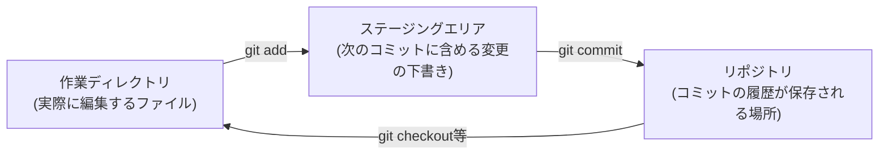

## はじめに

- **この記事で得られること**: [Ansible Vaultでパスワードをgitにプレーンテキストのまま置かないハンズオン](/articles/ansible-vault-handson-guide)のような記事で、説明なく`git add`・`git commit`といったコマンドを使ってきました。この記事では、Gitというツールが管理している3つの領域(作業ディレクトリ・ステージングエリア・リポジトリ)の関係と、コミットという単位でバージョンを管理する仕組みそのものを理解します。
- **対象読者**: `git add`・`git commit`をハンズオンの手順としてコピー&ペーストしたことはあるが、それぞれのコマンドが何をしているのか、コミットとは何なのかを説明できない方を想定しています。
- **読むのにかかる想定時間**: 約20分

この記事は[『上位1%』シリーズ 全記事ガイド](/sitemap)の一部、[Linux/OS基礎シリーズ](/sitemap#シリーズ一覧)の15本目です。

## 全体像をつかむ

Gitは、ファイルの変更履歴を、3つの領域を経由させながら記録していく仕組みです。



## 基礎から徹底解説

### 作業ディレクトリ・ステージングエリア・リポジトリという3つの領域

Gitを理解するうえで最も重要なのが、この3つの領域の役割分担です。

- **作業ディレクトリ**: 普段、エディタで実際にファイルを開いて編集している場所です。
- **ステージングエリア**(インデックスとも呼ばれます): 「次にコミットする変更として、これを含める」と選んだファイルの一覧を、一時的に保持しておく場所です。
- **リポジトリ**: ステージングエリアの内容が、コミットという単位で確定し、履歴として蓄積されていく場所です。

**`git add <ファイル名>`は、作業ディレクトリでの変更を、ステージングエリアへ「移す」コマンドです。** これだけではまだ履歴には残りません。**`git commit`が実行されて初めて、ステージングエリアの内容が、1つのコミットとしてリポジトリに記録されます。**

```bash
git status   # 3つの領域それぞれの状態を確認できる
git add requirements.yml
git commit -m "Pin geerlingguy.nginx to 3.1.4"
```

<details>
<summary>なぜadd(ステージング)とcommitが分かれているのか</summary>

一見、変更したファイルを直接コミットできればよいように思えますが、この2段階に分かれていることには理由があります。**複数のファイルを編集していても、その中の一部だけを選んで、1つの意味のあるまとまり(コミット)として記録できる**からです。たとえば、バグ修正と、無関係な設定ファイルの整理を同時に行っていた場合、バグ修正のファイルだけを`git add`してコミットし、設定ファイルの整理は別のコミットとして分ける、ということができます。この「意味のある単位でコミットを分ける」習慣は、後から履歴を追う際に、変更の意図を追いやすくする、実務上重要な作法です。

</details>

### コミットは「差分」ではなく「スナップショット」

Gitのコミットについて、多くの人が誤解しがちな点があります。**コミットは、前回からの変更点(差分)だけを記録しているのではなく、その時点でのすべてのファイルの状態(スナップショット)を記録しています。** ただし、変更されていないファイルについては、実際には過去のコミットが持つデータへの参照だけを保持し、まったく同じデータを重複して保存しないという工夫がされています。結果として、ユーザーから見れば「差分だけを効率よく記録している」ように見えますが、実際の内部構造は「変更されていないファイルへの参照を再利用した、完全なスナップショットの集合」です。

<details>
<summary>コミットハッシュという、40桁の英数字は何なのか</summary>

`git log`を実行すると、各コミットに`a1b2c3d...`のような、40桁の英数字(コミットハッシュ)が付いていることに気づきます。これは、そのコミットの内容(スナップショットの中身、コミットメッセージ、作成者情報、そして親コミットのハッシュ)全体から計算された、ハッシュ値です。**コミットの内容が1文字でも変われば、このハッシュ値はまったく別の値になります。** そして「親コミットのハッシュ」も計算に含まれているため、すべてのコミットが、鎖のように前のコミットと暗号学的に結びついています。この仕組みにより、過去の履歴を後から改ざんすることが、事実上極めて困難になっています。

</details>

### リモートリポジトリとpush/pull

ここまで扱ってきたのは、自分のPC内で完結する「ローカルリポジトリ」の話です。実務では、GitHubのような、ネットワーク越しに共有される**リモートリポジトリ**と連携させることが一般的です。

- **`git clone <URL>`**: リモートリポジトリの内容を、丸ごと自分のPCへ複製します。
- **`git push`**: ローカルリポジトリに蓄積したコミットを、リモートリポジトリへ反映(アップロード)します。
- **`git pull`**: リモートリポジトリの最新のコミットを、ローカルリポジトリへ反映(ダウンロード)します。

**`git push`で送られるのは、ファイルの最新の状態そのものではなく、まだリモート側に存在していないコミットの履歴一式です。** これは、コミットがスナップショットの集合であるという前述の仕組みと、そのまま対応しています。

## プロが見ている視点(上位1%の理解)

### .gitignoreという、意図的に「追跡しない」ための仕組み

実務のリポジトリには、必ずと言っていいほど`.gitignore`というファイルが存在します。ここに書かれたパターンに一致するファイルは、`git add .`のような一括追加コマンドを実行しても、ステージングエリアに含まれません。**[Ansible Vaultでパスワードをgitにプレーンテキストのまま置かないハンズオン](/articles/ansible-vault-handson-guide)で扱った「機密情報を暗号化してからコミットする」という考え方と並んで、そもそも機密情報を含むファイル自体を`.gitignore`に登録し、Gitの追跡対象から完全に外してしまう**、というのも、実務でよく使われる別の防御策です。暗号化(Vault)と、追跡対象からの除外(.gitignore)は、どちらか一方を選ぶものではなく、両方を組み合わせて使うのが実務での標準です。

## よくある誤解・つまずきポイント

- **誤解1: 「git addを実行した時点で、変更履歴として記録される」**
  `git add`は、あくまでステージングエリアへの一時的な追加です。`git commit`を実行して初めて、履歴として確定します。
- **誤解2: 「コミットは、前回との差分だけを保存している」**
  実際には、コミットのたびにファイル全体のスナップショットが記録されています(内部的には変更のないファイルへの参照を再利用し、効率化されています)。
- **誤解3: 「git pushを実行すると、リモートリポジトリのファイルの中身がそのまま上書きされる」**
  実際に送られているのは、まだリモート側にないコミットの履歴です。ファイルの中身は、そのコミット履歴を辿った結果として再現されます。

## 障害・トラブルシューティングの視点

1. **`git commit`しても、変更した覚えのないファイルが記録されている**: `git status`で、意図しないファイルまで`git add`していないかを確認します。
2. **`git push`が拒否される**: 多くの場合、リモート側に自分がまだ取得していない新しいコミットが存在しています。`git pull`で最新の状態を取り込んでから、再度`push`します。
3. **機密情報を含むファイルを誤ってコミットしてしまった**: 一度リモートへ`push`してしまった場合、単にファイルを削除するコミットを追加するだけでは、過去の履歴に機密情報が残り続けます。専用のツール(`git filter-repo`など)を使った履歴の書き換えと、漏洩した認証情報自体の失効・再発行が必要です。

## まとめ

- Gitは、作業ディレクトリ・ステージングエリア・リポジトリという3つの領域を経由して、変更履歴を記録します。
- `git add`はステージングエリアへの一時的な追加、`git commit`で初めて履歴として確定します。
- コミットは差分ではなく、変更のないファイルへの参照を再利用したスナップショットの集合です。
- `.gitignore`は、機密情報などを最初からGitの追跡対象から外すための、暗号化と並ぶ別の防御策です。

**今日から意識すべきこと**
1. `git commit`する前に、`git status`で本当に含めたい変更だけがステージングされているかを確認しましょう。
2. 機密情報を含むファイルは、暗号化(Vaultなど)と`.gitignore`への登録を、両方組み合わせて防御しましょう。

## 参考文献

- [Git - Book (Pro Git)](https://git-scm.com/book/en/v2)
- [gitignore Documentation | Git](https://git-scm.com/docs/gitignore)
