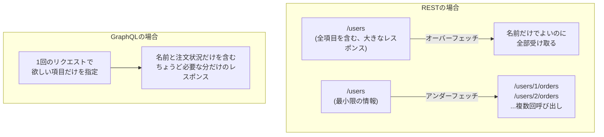

## はじめに

- **この記事で得られること**: [RESTful APIとは何か](/articles/restful-api-guide)で学んだ、URLに対してリソースを指定するという設計思想を前提に、**GraphQL**という、まったく別の設計思想を持つAPI規格が、RESTが抱える**オーバーフェッチ**(必要以上のデータを受け取ってしまう)・**アンダーフェッチ**(1つの画面のために複数回のAPI呼び出しが必要になる)という問題を、どう解決しているのかを体系的に理解します。
- **対象読者**: 「GraphQL」という言葉を聞いたことはあるものの、RESTとの違いを、具体的なリクエスト・レスポンスの形として説明できない方を想定しています。
- **読むのにかかる想定時間**: 約18分

この記事は[『上位1%』シリーズ 全記事ガイド](/sitemap)の一部、[Web/APIシリーズ](/sitemap#シリーズ一覧)の5本目です。

## 前提知識

- **RESTful APIの基本設計**: [RESTful APIとは何か](/articles/restful-api-guide)で扱った、URLでリソースを指定し、HTTPメソッドで操作を表現するという設計思想です。GraphQLは、この設計思想とは異なるアプローチを取ります。

## 全体像をつかむ

### オーバーフェッチとアンダーフェッチ:RESTが抱える、2つの対照的な問題

RESTful APIで、たとえば「ユーザー一覧画面」を作る場合を考えます。

- **オーバーフェッチ**: `/users`エンドポイントが、ユーザーの名前・メールアドレス・住所・購入履歴など、すべての項目を含んだレスポンスを返すとします。画面には名前だけを表示したい場合でも、使わない大量のデータまで、毎回受信することになります。
- **アンダーフェッチ**: 逆に、`/users`が最小限の情報(名前だけ)しか返さない設計だと、各ユーザーの最新の注文状況を表示するために、ユーザー1人ごとに`/users/{id}/orders`を追加で呼び出す必要が出てきます。画面を1つ表示するために、何十回ものAPI呼び出しが必要になることがあります。



## 基礎から徹底解説

### GraphQLの発想:クライアントが「欲しいデータの形」を、クエリとして指定する

GraphQLでは、エンドポイントは基本的に1つだけです(`/graphql`)。**クライアント側が、欲しいデータの項目と構造を、クエリという形で、リクエストの中に直接書き込みます。**

```graphql
query {
  users {
    name
    orders {
      status
    }
  }
}
```

このクエリを送ると、サーバーは、**クエリで指定された項目(名前と、注文のステータスだけ)に、ちょうど一致する形のレスポンスだけ**を返します。メールアドレスや住所のような、クエリで指定していない項目は、レスポンスに一切含まれません。これが、**オーバーフェッチの解消**です。

そして、「ユーザーの名前」と「その注文状況」という、本来は別々のリソース(別々のRESTエンドポイント)にまたがる情報を、**1回のリクエストで、1回のレスポンスとして受け取れます。** これが、**アンダーフェッチの解消**です。

<details>
<summary>GraphQLは、サーバー側で何をしているのか</summary>

GraphQLサーバーは、受け取ったクエリを解析し、クエリの各項目(`name`・`orders`・`status`など)に対応する、**リゾルバ**(Resolver)という関数を、それぞれ呼び出します。`users`に対応するリゾルバがデータベースからユーザー一覧を取得し、その中の`orders`に対応するリゾルバが、それぞれのユーザーの注文情報を取得する、という具合です。**クライアントから見ると1回のリクエストですが、サーバー側の内部では、複数の処理(場合によっては複数のデータベースクエリ)が実行されています。** この「クライアントから見た単純さ」と「サーバー内部の複雑さ」のギャップこそが、GraphQLが提供している価値そのものです。

</details>

### GraphQLにも、トレードオフがある

GraphQLは、オーバーフェッチ・アンダーフェッチを解消する一方で、新しい課題も生み出します。

- **キャッシュの難しさ**: RESTでは、URL(`/users/123`)そのものがキャッシュのキーとして機能します。GraphQLでは、エンドポイントが常に同じ(`/graphql`)で、クエリの内容によってレスポンスが変わるため、[HTTPキャッシュの仕組み](/articles/http-caching-cdn-guide)をそのまま単純に適用することが難しくなります。
- **複雑なクエリによる負荷**: クライアントが、意図的に、あるいは誤って、深く入れ子になった巨大なクエリを送ると、サーバー側で大量のリゾルバが呼び出され、想定外の負荷がかかるリスクがあります。

## プロが見ている視点(上位1%の理解)

### 「RESTとGraphQL、どちらが優れているか」ではなく、「誰が、何を決めるか」の違いである

RESTとGraphQLの本質的な違いは、**「レスポンスの形を、誰が決めるか」という一点**に集約されます。RESTでは、**サーバー側(API設計者)が、エンドポイントごとにレスポンスの形を事前に決めます。** GraphQLでは、**クライアント側が、リクエストのたびに、欲しいレスポンスの形を決めます。** 複数の異なる画面(Webアプリ、モバイルアプリなど)が、それぞれ違う形のデータを必要とする場合、GraphQLは、サーバー側のエンドポイントを増やさずに対応できる、という強みを持ちます。一方で、シンプルな用途や、キャッシュの効率を重視する場合は、RESTの、URLベースの単純さの方が適している場合もあります。**どちらが優れているかという二択ではなく、「誰が、レスポンスの形を決める必要があるか」という、要件に応じた選択だと理解しておくことが重要です。**

## よくある誤解・つまずきポイント

- **誤解1: 「GraphQLは、RESTの後継であり、常にRESTより優れている」**
  GraphQLとRESTは、異なるトレードオフを持つ、別々の設計思想です。キャッシュの効率やシンプルさが重要な場面では、RESTの方が適している場合があります。
- **誤解2: 「GraphQLでは、サーバー側の負荷について心配する必要がない」**
  複雑に入れ子になったクエリは、サーバー側に想定外の負荷をかけるリスクがあります。クエリの深さや複雑さを制限する仕組みが、実務では必要になります。
- **誤解3: 「GraphQLは、常に1回のデータベースクエリで完結する」**
  クライアントから見れば1回のリクエストですが、サーバー内部では、クエリの構造に応じて、複数のリゾルバ(場合によっては複数のデータベースクエリ)が実行されます。

## 障害・トラブルシューティングの視点

1. **GraphQLのレスポンスに、期待した項目が含まれていない**: 送信したクエリの中で、その項目を明示的に指定し忘れていないかを確認します。
2. **特定のクエリだけ、極端に応答が遅い**: クエリが深く入れ子になっていないか、そのクエリによって呼び出されるリゾルバの数が多すぎないかを確認します。
3. **GraphQLのレスポンスが、意図せずキャッシュされてしまう/されない**: GraphQLはURLベースの単純なキャッシュが効きにくいため、専用のキャッシュ戦略(クエリ内容に基づくキャッシュキーの設計など)が必要です。

## まとめ

- オーバーフェッチ(必要以上のデータ受信)とアンダーフェッチ(複数回の呼び出しが必要)は、RESTが抱えがちな、対照的な2つの問題です。
- GraphQLは、クライアント側が欲しいデータの形をクエリとして指定することで、この両方の問題を解消します。
- GraphQLは、レスポンスの形が動的に変わるため、RESTのようなURLベースの単純なキャッシュが効きにくく、クエリの複雑さによる負荷という、新しい課題も抱えています。
- RESTとGraphQLの違いは、「レスポンスの形を、サーバー側とクライアント側のどちらが決めるか」という設計思想の違いです。

**今日から意識すべきこと**
1. API設計で迷ったときは、「レスポンスの形を、サーバー側とクライアント側のどちらに決めさせたいか」を、まず問い直しましょう。
2. GraphQLを採用する場合は、キャッシュ戦略とクエリの複雑さ制限を、設計の初期段階から検討しましょう。

## 参考文献

- [GraphQL Official Documentation](https://graphql.org/learn/)
- [RFC 7234 - HTTP/1.1 Caching](https://datatracker.ietf.org/doc/html/rfc7234)
