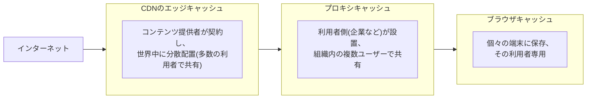
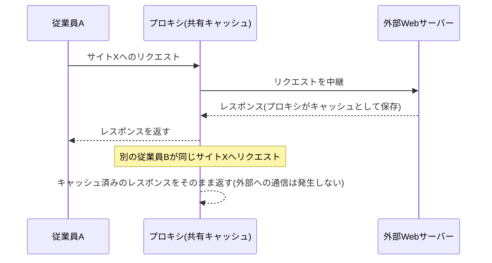
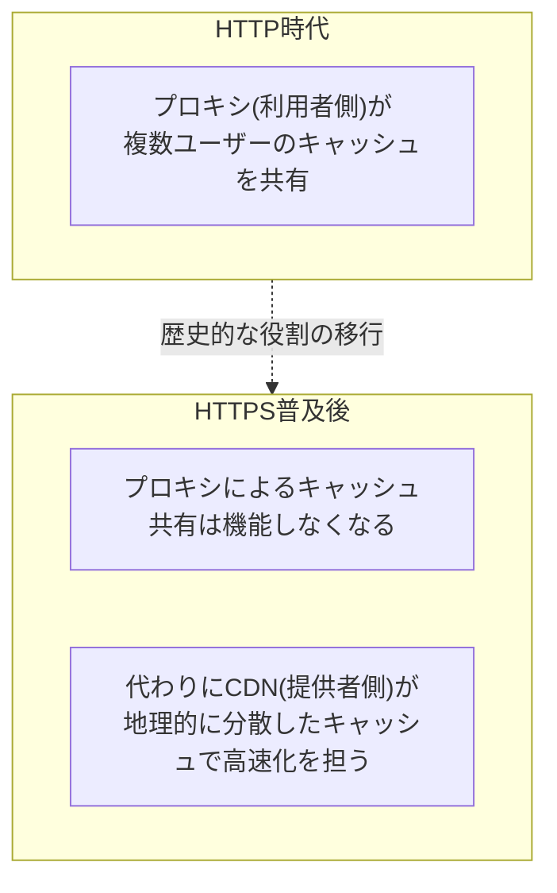

## はじめに

- **この記事で得られること**: 「HTTPS通信が多くなったことで、プロキシがキャッシュとしての役割をほとんど果たせなくなった」と言われる理由を、**プロキシがそもそもどうやってキャッシュを実現していたのか**という仕組みから理解します。あわせて、**ブラウザキャッシュはこの変化の影響を受けているのか**、そして**CDN(Content Delivery Network)がこの変化とどう関わっているのか**までを、3種類のキャッシュのレイヤーを整理しながら体系的に理解します。
- **対象読者**: プロキシ・CDNの運用に携わっているものの、HTTPS化がプロキシキャッシュに与えた影響や、ブラウザキャッシュ・CDNとの役割の違いを具体的に説明できない方を想定しています。
- **読むのにかかる想定時間**: 約17分

この記事は[『上位1%』シリーズ 全記事ガイド](/sitemap)の一部、[Webプロキシ/キャッシュ基礎シリーズ](/sitemap#シリーズ一覧)の2本目です。プロキシの基本的な役割は[プロキシとファイアウォールの使い分けを『上位1%』の視点で理解する](/articles/proxy-firewall-guide)を前提にしています。

## 前提知識

- **HTTPキャッシュ**: WebサーバーがHTTPレスポンスに含める`Cache-Control`などのヘッダーによって、「このコンテンツはどれくらいの期間、再利用してよいか」を制御する仕組みです。

## 全体像をつかむ

### 3種類のキャッシュのレイヤー

Webコンテンツのキャッシュには、**「誰のために」「どこで」保持されるか**が異なる、3つの代表的なレイヤーがあります。

**この記事の核心は、この3つのうち「プロキシキャッシュ」だけが、HTTPSの普及によって実質的に機能しなくなった、という点**です。

## 基礎から徹底解説

### プロキシキャッシュは、そもそもどうやって機能していたのか

HTTP(暗号化されていない通信)の時代、プロキシは、**通過するHTTPレスポンスの中身(URL、レスポンスボディ、`Cache-Control`ヘッダーなど)をそのまま読み取ることができました。** これにより、たとえば社内の複数の従業員がそれぞれ同じ人気の外部Webサイトへアクセスした場合、プロキシは**最初の1人がアクセスした際に取得したコンテンツを手元に保存しておき、2人目以降のリクエストにはそのキャッシュを返す**ことができました。これは、組織内の多数のユーザーで1つのキャッシュを**共有する**、という発想に基づく仕組みです。

### なぜHTTPSの普及でこの仕組みが機能しなくなったのか

HTTPSでは、**クライアントとサーバーの間の通信全体が暗号化**されます。[プロキシとファイアウォールの使い分けを『上位1%』の視点で理解する](/articles/proxy-firewall-guide)で扱った**SSLインスペクション**を行わない、一般的なプロキシの構成では、**プロキシはこの暗号化された通信の中身を一切読み取ることができません。** プロキシから見えるのは、暗号化された不透明なバイト列の中継だけであり、**そのレスポンスがキャッシュ可能かどうか、そもそもどのURLに対する応答なのかさえ、判別できません。**(SNIにより宛先のホスト名までは分かりますが、パス以下やレスポンス本体は不可視です。)

**結果として、プロキシが複数ユーザー間でコンテンツを共有するという、従来のキャッシュとしての役割は、HTTPS通信に対しては実質的に機能しなくなりました。** SSLインスペクションを行えば技術的にはキャッシュも可能になりますが、これは通信内容を復号する必要があるため、プライバシー・処理コストの観点から一般的な運用ではありません。**現在のインターネット上の通信の大半がHTTPS化されている**ことを踏まえると、「プロキシのキャッシュとしての役割はほとんどなくなった」という理解は、正確な現状認識だと言えます。

### ブラウザキャッシュは、なぜこの影響を受けないのか

ここで重要な区別が、**ブラウザキャッシュはプロキシキャッシュとは異なるレイヤーであり、HTTPS化の影響を受けていない**という点です。**ブラウザ自身は、HTTPS通信の終端(復号する側)そのもの**であるため、サーバーから返ってきたレスポンスを復号した後の、平文の状態で内容を読み取れます。したがって、`Cache-Control`ヘッダーなどを解釈し、そのコンテンツをローカルディスクにキャッシュとして保存する、という動作は、HTTPSであっても何も変わらず機能し続けます。

**「HTTPS化がキャッシュの仕組みそのものを破壊した」のではなく、「HTTPS化は、複数ユーザーで共有するプロキシキャッシュという特定の形態のキャッシュだけを無力化し、個々の端末で完結するブラウザキャッシュには影響を与えなかった」**、という整理が正確です。

| キャッシュの種類 | HTTPS化の影響 | 理由 |
|---|---|---|
| プロキシキャッシュ(共有) | ほぼ機能しなくなった | プロキシは暗号化された通信の中身を読み取れないため |
| ブラウザキャッシュ(個別) | 影響を受けていない | ブラウザ自身が暗号化の終端であり、平文の内容を扱えるため |

### CDN(Content Delivery Network)との関わり

ここで、**プロキシキャッシュの終焉と、CDNの普及が表裏一体の関係にある**という視点が重要になります。CDNは、**コンテンツを提供する側(Webサイトの運営者)自身が契約し、自社のコンテンツを、世界中に地理的に分散配置されたエッジサーバーへあらかじめキャッシュさせておく**仕組みです。

**CDNがHTTPS環境でも問題なくキャッシュ・配信できるのは、コンテンツ提供者自身がそのコンテンツとTLS証明書を管理する主体だから**です。プロキシは「利用者側」が設置し、暗号化された他者(サーバー)のコンテンツを外側から中継しようとするため、HTTPS化によってキャッシュができなくなりました。一方CDNは、**「提供者側」がコンテンツの管理者として、正規のTLS終端そのものを担う**ため、HTTPSであることが技術的な障害にはなりません。

**つまり、「利用者側が構築する共有キャッシュ(プロキシ)」から「提供者側が構築する共有キャッシュ(CDN)」へと、キャッシュによる高速化・帯域節約という役割そのものが、HTTPS化を境に主体を変えて引き継がれていった**、という歴史的な流れとして理解すると、この一連の変化がすっきりと整理できます。

## プロが見ている視点(上位1%の理解)

### 現代のプロキシ導入の主目的は、キャッシュではなくセキュリティ・アクセス制御

前述の変化を踏まえると、**現代の企業がプロキシを導入する主な目的は、もはや帯域節約のためのキャッシュではなく、[プロキシとファイアウォールの使い分けを『上位1%』の視点で理解する](/articles/proxy-firewall-guide)で扱ったような、URLフィルタリング・マルウェア検査・アクセス制御といったセキュリティ目的にシフトしている**と理解するのが実態に即しています。プロキシの導入を検討する際、「キャッシュによる帯域節約」を主要な導入効果として見込むのは、現在の通信環境を踏まえると現実的ではありません。

### CDNのキャッシュ制御の考え方

CDNは、`Cache-Control`ヘッダーや`ETag`(コンテンツのバージョンを識別するための値)を活用しつつ、CDN事業者独自の**キャッシュキー**(URLに加えて、特定のヘッダーやクエリパラメータの組み合わせをキャッシュの単位として扱う設定)という仕組みも提供します。同じURLであっても、レスポンス内容がユーザーごとに異なるような動的なコンテンツについては、キャッシュキーの設計を誤ると、**本来別々であるべきユーザー向けのコンテンツが、誤って別のユーザーへ配信されてしまう**という重大な事故につながるリスクがあり、慎重な設計が求められます。

## よくある誤解・つまずきポイント

- **誤解1: 「プロキシを導入すれば、HTTPS通信でも帯域節約になる」**
  SSLインスペクションを行わない一般的な構成では、プロキシはHTTPS通信の中身を読み取れないため、共有キャッシュとしての帯域節約効果はほとんど期待できません。
- **誤解2: 「ブラウザキャッシュとプロキシキャッシュは、基本的に同じ仕組みである」**
  ブラウザキャッシュは個々の端末に閉じたプライベートキャッシュ、プロキシキャッシュは複数ユーザーで共有する共有キャッシュであり、HTTPS化の影響の受け方もまったく異なります。
- **誤解3: 「CDNは、単にプロキシキャッシュをクラウド上に移設したものである」**
  CDNはコンテンツ提供者自身が契約・管理する仕組みであり、利用者側が設置するプロキシとは、主体そのものが異なります。

## 障害・トラブルシューティングの視点

キャッシュ関連の問題は、**「どのレイヤー(プロキシ・ブラウザ・CDN)のキャッシュの話か」を切り分ける**のが基本です。

1. **プロキシのキャッシュヒット率が想定より低い**: 対象の通信がHTTPS化されていないかを確認します。HTTPS化されている場合、SSLインスペクションを行わない限り、そもそもキャッシュとして機能しません。
2. **Webサイトを更新したのに、古い内容がブラウザに表示され続ける**: `Cache-Control`ヘッダーの設定と、ブラウザ側のキャッシュを確認します(強制再読み込みで一時的に切り分け可能です)。
3. **CDN経由でコンテンツを更新したのに反映されない**: CDN側のキャッシュパージ(強制的な再取得)の操作が必要な場合があります。
4. **動的コンテンツで、あるユーザー向けの内容が別のユーザーへ表示されてしまった**: CDNのキャッシュキー設計に不備がないか、緊急に確認します。

### 予防策・恒久対策

- プロキシの導入効果を検討する際は、現在のHTTPS化率を踏まえ、キャッシュによる帯域節約効果を過大に見積もらない。
- CDNを利用する場合、動的コンテンツのキャッシュキー設計を慎重に行い、ユーザーごとに異なる内容を誤って共有キャッシュしてしまうリスクを排除する。

## まとめ

- プロキシキャッシュは、HTTP時代には複数ユーザー間でコンテンツを共有する仕組みとして機能していましたが、HTTPS化により通信の中身を読み取れなくなったことで、実質的に機能しなくなりました。
- ブラウザキャッシュは、ブラウザ自身が暗号化の終端であるため、HTTPS化の影響を受けず、個々の端末専用のキャッシュとして機能し続けています。
- CDNは、コンテンツ提供者自身がTLS終端とコンテンツを管理する仕組みであるため、HTTPS環境でも問題なくキャッシュ・配信できます。
- プロキシキャッシュの終焉とCDNの普及は、「利用者側の共有キャッシュ」から「提供者側の共有キャッシュ」へと役割が移行した、表裏一体の歴史的な変化として理解できます。

**今日から意識すべきこと**
1. 「プロキシのキャッシュとしての役割」という言葉に出会ったら、それが主にHTTPの時代の話であり、HTTPS環境では成立しにくいことを思い出しましょう。
2. キャッシュ関連のトラブルに遭遇したら、まずプロキシ・ブラウザ・CDNのどのレイヤーの話かを切り分けましょう。

## 参考文献

- [Hypertext Transfer Protocol (HTTP/1.1): Caching | RFC 7234](https://datatracker.ietf.org/doc/html/rfc7234)
- [HTTP Caching | MDN Web Docs](https://developer.mozilla.org/en-US/docs/Web/HTTP/Caching)
- [What Is a CDN? | Cloudflare Learning Center](https://www.cloudflare.com/learning/cdn/what-is-a-cdn/)
