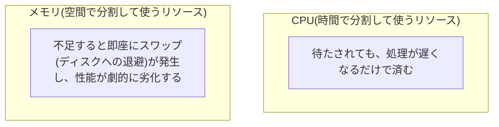
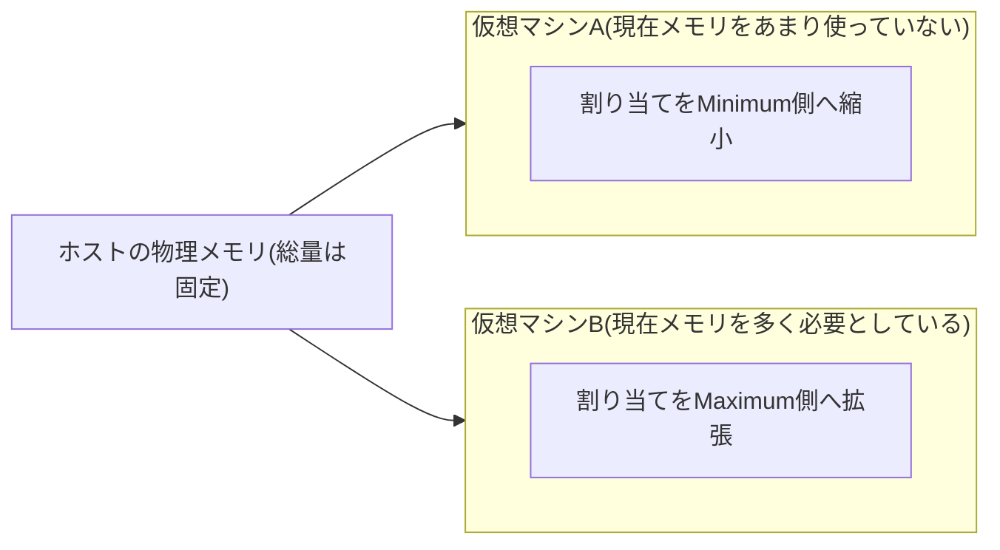

## はじめに

- **この記事で得られること**: 「Hyper-V上にいくつかの仮想マシンを構築する場合、CPUやメモリの使用率はどれくらいになるよう設計する必要があるのか」という疑問に、**CPUのオーバーコミット**と**メモリのオーバーコミット**という、2つの異なる設計軸から答えます。なぜこの2つのリソースでオーバーコミットの許容度が大きく異なるのか、そしてHyper-Vの動的メモリという機能が何をしているのかまでを体系的に理解します。
- **対象読者**: Hyper-V環境での仮想マシンの構築・運用に携わっているものの、CPU・メモリのリソース設計をどのような基準で行うべきかを具体的に説明できない方を想定しています。
- **読むのにかかる想定時間**: 約17分

この記事は[『上位1%』シリーズ 全記事ガイド](/sitemap)の一部、[仮想化基盤シリーズ](/sitemap#シリーズ一覧)の2本目です。仮想化の基本的な仕組み(KVM/QEMUを例にした解説)は[Proxmox VEとは何か——KVM/QEMUによる仮想化の仕組みを『上位1%』の視点で理解する](/articles/proxmox-internals-guide)を参照してください。

## 前提知識

- **オーバーコミット(Overcommit)**: 仮想マシンに割り当てるリソースの合計が、物理的に存在するリソースの量を超えている状態を指します。すべての仮想マシンが同時にリソースを使い切ることは稀である、という前提のもとで行われる設計手法です。

## 全体像をつかむ

### CPUとメモリでは、オーバーコミットの許容度がまったく異なる

Hyper-Vの仮想マシンにCPU・メモリを割り当てる際、<strong>「CPUはオーバーコミットが一般的に行われるが、メモリのオーバーコミットはより慎重な設計が必要」</strong>という、2つのリソース間での性質の違いを理解することが、リソース設計の出発点になります。

## 基礎から徹底解説

### CPUのオーバーコミット:時間分割ゆえの許容度

CPUは、複数の仮想マシンの仮想プロセッサ(vCPU)が、物理的なCPUコアの実行時間を、<strong>極めて短い時間単位で交互に使う(タイムスライス)</strong>ことで共有されるリソースです。**すべての仮想マシンが同時に100%のCPUを要求することは実務上稀である**という前提のもと、物理コア数を超えるvCPUの合計数を割り当てる**CPUのオーバーコミット**が、一般的な設計手法として広く行われています。

具体的な比率(物理コア1つに対して、vCPUをいくつまで割り当てるか)は、**仮想マシン上で動作するワークロードの性質によって大きく変わります。** CPU使用率が低く、断続的にしか処理が発生しないワークロード(一般的な業務システムなど)であれば、比較的高いオーバーコミット比率が許容されますが、常時高いCPU使用率が続くワークロード(データベースサーバーなど)では、オーバーコミット比率を低く抑える、あるいはオーバーコミットを行わない設計が必要になります。

### メモリのオーバーコミット:空間分割ゆえの厳しさ

メモリも、Hyper-Vの<strong>動的メモリ(Dynamic Memory)</strong>という機能を使えば、物理メモリの総量を超える量を仮想マシンに割り当てること自体は可能です。しかし、**メモリはCPUと異なり、不足した瞬間に深刻な性能劣化を引き起こす**という、決定的に異なる性質を持っています。

CPUが不足した場合、仮想マシンは単に<strong>順番待ちの時間が長くなる(処理が遅くなる)</strong>だけで済みますが、メモリが不足した場合、OSは<strong>使用頻度の低いデータをディスク上のページファイルへ退避させる(スワップ)</strong>という処理を行います。ディスクへのアクセスは、メモリへのアクセスと比べて桁違いに低速であるため、**メモリのスワップが発生すると、システム全体の応答性が劇的に悪化します。** この非対称性が、CPUのオーバーコミットは広く受け入れられているのに対し、メモリのオーバーコミットにはより慎重な設計が求められる理由です。

### Hyper-Vの動的メモリ(Dynamic Memory)の仕組み

Hyper-Vの動的メモリは、仮想マシンに対して、次の3つの値を設定することで動作します。

| 設定項目 | 意味 |
|---|---|
| **Startup RAM** | 仮想マシンの起動時に割り当てる初期のメモリ量 |
| **Minimum RAM** | 動作中に縮小できる、最小のメモリ量 |
| **Maximum RAM** | 動作中に拡張できる、最大のメモリ量 |

動的メモリは、**仮想マシン内で実際にどれだけメモリが使われているかを継続的に監視し、Minimum RAMからMaximum RAMの範囲内で、必要に応じてメモリの割り当てを動的に増減させる**仕組みです。これにより、実際にはあまりメモリを使っていない仮想マシンから、その時点で余っているメモリを他の仮想マシンへ回すことができ、物理メモリの利用効率を高めます。

**Minimum RAMを低く設定しすぎると、仮想マシンが本当に必要とするメモリ量が確保されず、スワップの発生につながるリスクがあります。** 動的メモリを使う場合でも、各仮想マシンが実際に必要とする最低限のメモリ量を正しく見積もっておくことが重要です。

## プロが見ている視点(上位1%の理解)

### NUMA(Non-Uniform Memory Access)を意識した設計

大規模な物理サーバーでは、CPUソケットごとに専用のメモリ領域が割り当てられる<strong>NUMA(Non-Uniform Memory Access)</strong>というアーキテクチャが使われています。**仮想マシンに割り当てるvCPU・メモリの量が、1つのNUMAノードの境界を越えてしまう(=別のCPUソケットに属するメモリ領域へアクセスする必要が生じる)構成では、アクセスに余分な遅延が発生し、性能が低下することがあります。** 大規模な仮想マシンを設計する際は、そのホストのNUMA構成(CPUソケットごとの物理コア数・メモリ量)を踏まえ、可能な限り1つのNUMAノードに収まる範囲でリソースを割り当てることが、性能面での実務上の注意点です。

### 継続的なキャパシティプランニングの重要性

CPU・メモリのオーバーコミット比率は、一度設計して終わりではなく、**実際の使用率をパフォーマンスモニタなどで継続的に監視し、想定と実態のズレを定期的に見直す**運用サイクルが重要です。新しい仮想マシンの追加や、既存ワークロードの性質の変化によって、当初設計した比率が適切でなくなることは実務では頻繁に起こります。

## よくある誤解・つまずきポイント

- **誤解1: 「仮想化すれば、物理的なCPU・メモリの制約自体がなくなる」**
  仮想化はリソースの共有・分配を柔軟にする技術ですが、物理的に存在するリソースの総量という制約自体は変わりません。オーバーコミットは、あくまで「同時に使い切ることが稀である」という前提を活用した設計手法です。
- **誤解2: 「メモリも、CPUと同じような比率でオーバーコミットしてよい」**
  CPUは時間分割で共有されるリソースであり不足しても速度低下で済みますが、メモリは不足すると即座に深刻なスワップが発生するため、CPUよりはるかに慎重なオーバーコミット設計が必要です。
- **誤解3: 「動的メモリを有効化すれば、メモリ不足の問題は自動的にすべて解決する」**
  動的メモリはホスト全体のメモリ利用効率を高める仕組みですが、Minimum RAMの設定が不適切であれば、依然としてスワップが発生するリスクがあります。

## 障害・トラブルシューティングの視点

仮想マシンの性能問題は、**「CPU待ちの問題か、メモリスワップの問題か」を切り分ける**のが基本です。

1. **特定の仮想マシンの応答が全体的に遅い**: そのホスト上のCPU使用率とvCPUの待ち時間(CPU Wait)を確認し、CPUのオーバーコミットが過度になっていないかを確認します。
2. **特定の仮想マシンの応答が、特にディスクI/Oを伴う操作で極端に遅い**: メモリのスワップが発生していないかを確認します。動的メモリを使っている場合、Minimum RAMの設定値が実際の必要量に対して低すぎないかを確認します。
3. **大規模な仮想マシンだけ、性能が期待値を下回る**: そのホストのNUMA構成を確認し、割り当てたvCPU・メモリが1つのNUMAノードの境界を越えていないかを確認します。

### 予防策・恒久対策

- CPUのオーバーコミット比率は、ワークロードの性質(CPU使用率の高低)に応じて個別に設計し、単一の比率をすべての仮想マシンに適用しない。
- 動的メモリを使う場合、各仮想マシンが実際に必要とする最低限のメモリ量を事前に見積もり、Minimum RAMへ反映する。
- 定期的にパフォーマンスモニタで実際の使用率を確認し、当初の設計と実態のズレを見直す運用サイクルを確立する。

## まとめ

- CPUは時間分割で共有されるリソースであり、不足しても速度低下で済むため、比較的高いオーバーコミット比率が広く受け入れられています。
- メモリは不足すると即座に深刻なスワップが発生し性能が劇的に劣化するため、CPUよりはるかに慎重なオーバーコミット設計が必要です。
- Hyper-Vの動的メモリは、Startup RAM・Minimum RAM・Maximum RAMという3つの値の範囲内で、実際の使用状況にもとづきメモリ割り当てを動的に調整する仕組みです。
- 大規模な仮想マシンでは、ホストのNUMA構成を踏まえ、1つのNUMAノードに収まる範囲でリソースを割り当てることが性能面で重要です。

**今日から意識すべきこと**
1. CPUとメモリのオーバーコミット比率を検討する際は、両者の許容度がまったく異なることを踏まえ、単一の基準で決めないようにしましょう。
2. 動的メモリを使う場合は、Minimum RAMの設定値が各仮想マシンの実際の必要量を反映しているかを必ず確認しましょう。

## 参考文献

- [Hyper-V Dynamic Memory Overview | Microsoft Learn](https://learn.microsoft.com/en-us/windows-server/virtualization/hyper-v/manage/manage-hyper-v-dynamic-memory)
- [Plan for Hyper-V memory and CPU | Microsoft Learn](https://learn.microsoft.com/en-us/windows-server/virtualization/hyper-v/plan/plan-for-hyper-v-memory)
- [What Is NUMA? | Microsoft Learn](https://learn.microsoft.com/en-us/windows-hardware/drivers/kernel/introduction-to-numa)
