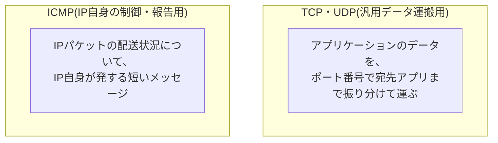
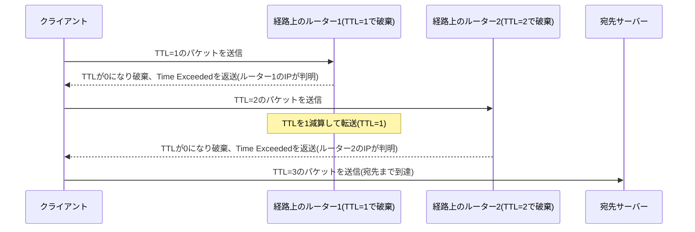

## はじめに

- **この記事で得られること**: 「ICMPはpingで使われるプロトコル」という理解から一歩進み、**ICMPがなぜTCP/UDPのようにポート番号を持たず、ネットワーク層自体の一部として扱われるのか**を体系的に理解します。あわせて、Destination Unreachable・Time Exceededといった主要なメッセージタイプ、`traceroute`がICMPをどう利用して経路を可視化しているのか、そしてファイアウォールでのICMP制御が引き起こしうる、実務でよく遭遇する落とし穴までを整理します。
- **対象読者**: `ping`コマンドの使い方は知っているものの、ICMPというプロトコル自体の構造や、pingや通信断以外の場面でどう使われているのかを具体的に説明できない方を想定しています。
- **読むのにかかる想定時間**: 約18分

この記事は[『上位1%』シリーズ 全記事ガイド](/sitemap)の一部、[プロトコル基礎シリーズ](/sitemap#シリーズ一覧)の2本目です。プロトコルという概念そのものについては[プロトコルとは何かを『上位1%』の視点で理解する](/articles/protocol-design-guide)を、ICMPがポート番号を持たない理由の入り口は[TCP/UDPの「セッション」とポート番号の関係を『上位1%』の視点で理解する](/articles/tcp-udp-session-port-guide)を前提にしています。

## 前提知識

- **IPプロトコル番号**: IPヘッダーに含まれる、そのペイロードが何のプロトコルであるかを示すフィールドです。ICMPはプロトコル番号`1`が割り当てられています。詳しくは[TCP/UDPの「セッション」とポート番号の関係を『上位1%』の視点で理解する](/articles/tcp-udp-session-port-guide)を参照してください。

## 全体像をつかむ

### ICMPは、IPと一心同体の存在

**ICMPは、汎用的なアプリケーションデータを運ぶためのトランスポート層プロトコル(TCP/UDP)とは、そもそも設計上の立ち位置が異なります。ICMPの役目は、IPネットワーク自身が「配送できた/できなかった」を伝えるための、いわばIP自身のエラー報告・制御メッセージ機構**です。

**ICMPがTCP/UDPのようなポート番号を持たないのは、単なる仕様上の制約ではなく、「アプリケーションへデータを届けるための仕組み」ではなく「IPネットワーク自体の状態を報告するための仕組み」であるという、根本的な役割の違いに由来しています。**

## 基礎から徹底解説

### ICMPメッセージの構造

ICMPのメッセージは、TCP/UDPのヘッダーと比べて、非常にシンプルな構造を持っています。

| フィールド | 内容 |
|---|---|
| **Type** | メッセージの大分類(Echo Request、Destination Unreachableなど) |
| **Code** | Typeをさらに細分化するサブタイプ |
| **Checksum** | メッセージの破損検知用 |
| **タイプ固有のデータ** | Typeによって内容が異なる、付随情報 |

**ポート番号というフィールドはそもそも存在しません。** ICMPメッセージは、あるIPパケットの配送に関する状況を、その送信元(または関連する機器)へ直接報告するものであり、アプリケーションごとの宛先を振り分けるという概念自体が不要だからです。

### 主要なICMPメッセージタイプ

| Type | 名称 | 用途 |
|---|---|---|
| 8 / 0 | Echo Request / Echo Reply | `ping`コマンドの本体。相手が生きているか(到達可能か)を確認する |
| 3 | Destination Unreachable | 配送できなかったことの通知。Codeによって「ネットワーク到達不可」「ホスト到達不可」「ポート到達不可」「要フラグメント化(後述)」などに細分化される |
| 11 | Time Exceeded | IPパケットのTTL(生存時間)が0になり破棄されたことの通知 |
| 5 | Redirect | より最適な経路(ゲートウェイ)があることの通知(現在はセキュリティ上の理由から無効化されることが多い) |

### tracerouteは、Time Exceededをどう利用しているのか

`traceroute`(Windowsでは`tracert`)は、経由するルーターを1つずつ可視化するツールですが、**専用のプロトコルを使っているわけではなく、IPパケットのTTLフィールドとICMPのTime Exceededメッセージを巧妙に利用しています。**

**`traceroute`は、TTLを1から順に1ずつ増やしながら同じ宛先へパケットを送り続けます。** TTLが尽きて破棄した経路上の各ルーターは、それぞれ**Time Exceeded**メッセージを送信元へ返すため、**このメッセージの送信元IPアドレスを1つずつ記録していくことで、経路上のルーターを順番に可視化できる**、という仕組みです。

### Path MTU Discovery(PMTUD)と、ファイアウォールでのICMP遮断が招く落とし穴

**Destination UnreachableのCode 4(Fragmentation Needed、要フラグメント化)**は、実務で特に注意が必要なメッセージです。これは、**「このパケットは大きすぎて、途中の経路のMTU(一度に送れる最大データサイズ)を超えているが、フラグメント化(分割)禁止のフラグが立っているため、送信元でパケットサイズを小さくして送り直してほしい」**という通知です。この仕組みは**Path MTU Discovery(PMTUD)**と呼ばれ、送信元が適切なパケットサイズを動的に把握するために使われています。

**ファイアウォールでICMPを安易に「すべて遮断」してしまうと、このFragmentation Needed通知も届かなくなり、PMTUDが機能しなくなります。** その結果、**小さなパケット(TCP接続確立時のSYNパケットなど)は問題なく通るのに、ある程度の大きさを超えるデータを送ろうとした通信だけが、原因不明のまま応答なしでハングする**、という診断の難しい障害につながります。

IPv6でのICMPv6の拡大した役割

IPv6では、ICMPの役割がさらに拡大し、**ICMPv6**として、IPv4時代には別のプロトコルだった機能まで統合されています。代表的なものが**NDP(Neighbor Discovery Protocol、近隣探索プロトコル)**で、IPv4におけるARP(IPアドレスからMACアドレスを解決する、IPとは別のプロトコル)に相当する機能を、ICMPv6のメッセージタイプの1つとして実現しています。IPv6では、この他にもルーター広告・ルーター要請といった機能もICMPv6に統合されており、ICMPが担う役割はIPv4の時代よりも大きくなっています。

## プロが見ている視点(上位1%の理解)

### ICMPを「全部遮断」するのではなく、Type単位で制御する

セキュリティを重視するあまり、ファイアウォールでICMPを一律に遮断する構成が実務では見られますが、前述の通り**Destination Unreachable(特にFragmentation Needed)やTime Exceededといったメッセージは、ネットワークが正常に機能するために必要な情報を運んでいます。** 実務上推奨されるのは、**Echo Request(ping)のような特定のTypeだけを制限し、PMTUDやtracerouteに必要なメッセージタイプは許可する**、という、Type単位でのきめ細かい制御です。

## よくある誤解・つまずきポイント

- **誤解1: 「ICMPは、pingコマンドのためだけに存在するプロトコルである」**
  ICMPはping(Echo Request/Reply)以外にも、配送エラーの通知(Destination Unreachable)、TTL超過の通知(Time Exceeded)など、IPネットワーク自体の状態を報告する多様な役割を持ちます。
- **誤解2: 「ICMPをすべて遮断すれば、セキュリティ的に安全になるだけで副作用はない」**
  ICMPの遮断は、Path MTU Discoveryの機能不全を招き、特定サイズを超えるパケットの通信だけが原因不明にハングするという、診断の難しい障害につながることがあります。
- **誤解3: 「ICMPにもTCP/UDPと同じようにポート番号がある」**
  ICMPのメッセージには、そもそもポート番号というフィールド自体が存在しません。宛先アプリケーションへの振り分けではなく、IP自身の状態報告が目的であるためです。

## 障害・トラブルシューティングの視点

ICMP関連の障害は、**「pingは通るのに他の通信が失敗する」「特定サイズを超えるデータだけ失敗する」といった症状のパターンから、原因を推測する**のが基本です。

1. **小さなデータのやり取りは問題ないが、大きなファイルの転送だけがハングする**: 経路上のどこかでICMPのFragmentation Needed通知が遮断され、PMTUDが機能していない可能性を疑います。
2. **`traceroute`が特定のホップで応答を返さなくなる**: そのホップのルーターがTime Exceededメッセージの送信、あるいはICMP全般を制限している可能性があります(必ずしも障害とは限りません)。
3. **pingが通らないが、他の通信(HTTPSなど)は正常に行える**: Echo Requestだけがファイアウォールで意図的に制限されている可能性が高く、必ずしも異常ではありません。

### 予防策・恒久対策

- ファイアウォールでICMPを制御する際は、一律遮断ではなくType単位で設計し、特にDestination UnreachableとTime Exceededは可能な限り許可する。
- 大きなデータの転送だけが原因不明にハングする障害に遭遇したら、まずPMTUDとICMPの遮断状況を確認する。

## まとめ

- ICMPは、汎用データを運ぶTCP/UDPとは異なり、IPネットワーク自体のエラー報告・制御メッセージを担うプロトコルであり、この役割の違いからポート番号を持ちません。
- Destination Unreachable・Time Exceededなど、Typeごとに異なる役割を持つメッセージがあり、`traceroute`はTime ExceededとTTLの仕組みを利用して経路を可視化しています。
- Destination UnreachableのFragmentation Needed通知はPath MTU Discoveryの根幹を担っており、これをファイアウォールで遮断すると、特定サイズを超えるパケットだけが原因不明にハングする障害につながります。
- ICMPを制御する際は一律遮断ではなく、Type単位できめ細かく設計することが実務上推奨されます。

**今日から意識すべきこと**
1. ICMPを「pingのためだけのプロトコル」と捉えず、IPネットワーク自体の状態報告を担う仕組みとして理解し直しましょう。
2. ファイアウォールでICMPを制御する際は、一律遮断ではなくType単位での制御を検討しましょう。

## 参考文献

- [Internet Control Message Protocol | RFC 792](https://datatracker.ietf.org/doc/html/rfc792)
- [Path MTU Discovery | RFC 1191](https://datatracker.ietf.org/doc/html/rfc1191)
- [Internet Control Message Protocol (ICMPv6) for IPv6 | RFC 4443](https://datatracker.ietf.org/doc/html/rfc4443)
- [Neighbor Discovery for IP version 6 (IPv6) | RFC 4861](https://datatracker.ietf.org/doc/html/rfc4861)
