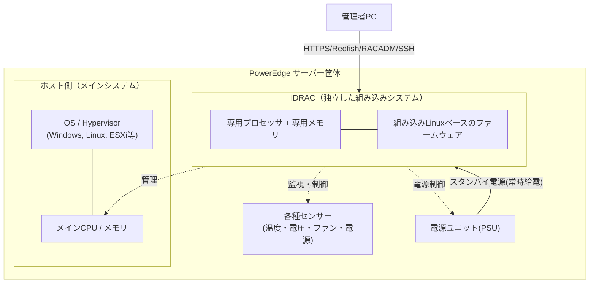
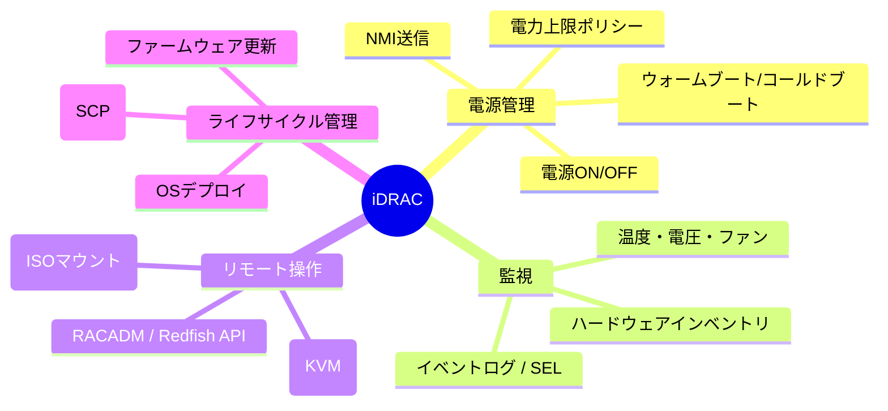

## はじめに

- **この記事で得られること**: DellのPowerEdgeサーバーに搭載されているiDRACについて、「OSの電源操作ができる便利機能」という理解から一歩進み、内部アーキテクチャ・電力設計・ライセンス体系・セキュリティ・障害時の挙動まで含めた体系的な理解が得られます。
- **対象読者**: インフラエンジニアとして就業しており、「iDRACでサーバーの起動やシャットダウンができる」というレベルの理解はあるものの、それがなぜ・どうやって実現されているのかは説明できない方。
- **読むのにかかる想定時間**: 約20〜25分

この記事は[『上位1%』シリーズ 全記事ガイド](/sitemap)の一部です。

まず、今回の出発点になっている理解を確認しておきましょう。

> Dellのサーバにある機能で、OSの起動やシャットダウンができるので、OSがシャットダウンしている状態でも、サーバルームに人間が入る必要がなく、リモートで起動や調査ができる。

これは正しい理解です。ただし、「なぜOSが停止していても操作できるのか」「iDRACはOSの一部なのか、それとも別物なのか」「電源が落ちているのに、どうやって動いているのか」——ここまで踏み込んで説明できる人は、現場でも意外と多くありません。この記事では、そこから先を掘り下げていきます。

## 前提知識

読み進める前に、次の用語だけ押さえておくと理解がスムーズです（知らなくても本文中で補足します）。

- **BMC（Baseboard Management Controller）**: サーバーのマザーボード上に存在し、OSとは独立してハードウェアを監視・制御する管理用コントローラーの業界共通の呼び方です。

そもそも「マザーボード」とは何か

マザーボードとは、CPU・メモリ・ストレージ・拡張カード（PCIeカード）・電源コネクタなどを1枚の基板の上に配置し、それぞれを電気的に接続する「配線と土台」の役割を果たすプリント基板（PCB: Printed Circuit Board）です。基板の中には何層にも重なった非常に細い銅の配線（信号線・電源線）が埋め込まれており、CPUソケット・メモリスロット（DIMMスロット）・PCIeスロット・電源コネクタなどの「差し込み口」同士を、目に見えない内部配線でつないでいます。

マザーボード上には受動的な配線だけでなく、能動的に働く部品も多数搭載されています。代表的なものが次の3つです。

- **チップセット**: CPUと、メモリ以外の周辺機器（USB、SATA、PCIeレーンの一部など）との間のデータのやり取りを仲介する制御チップです。CPU自体が持つ入出力ポートの数には限りがあるため、チップセットが「CPUの手が届かない範囲の入出力」を代行しています。
- **VRM（電圧レギュレータモジュール）**: PSUから届いた電力を、CPU・メモリそれぞれが必要とする細かい電圧にさらに変換する回路です。この仕組み自体は別記事「[サーバー電源の仕組みを『上位1%』の視点で理解する](/articles/idrac-power-guide)」で深掘りしています。
- **BMC（iDRACなど）**: 本記事のテーマそのものであるこのチップも、実はマザーボード上に実装されている部品の1つです。

つまり「マザーボード」とは、CPU・メモリのような「主役」ではなく、それらの部品を正しい配線でつなぎ、正しい電圧で動かすための「舞台装置」だとイメージすると掴みやすいはずです。実物を見る機会がなくても、PCの分解動画などで、CPUソケットの周りに小さな部品（コンデンサやVRMのコイル）がびっしり並んでいる緑色や黒色の基板を見かけたら、それがマザーボードです。

- **IPMI（Intelligent Platform Management Interface）**: BMCを操作するための古くからある業界標準プロトコルです。
- **Redfish**: IPMIの後継として普及しているRESTful API規格で、HTTPS経由でJSON形式のデータをやり取りします。
- **帯域外管理（Out-of-Band管理）**: OSのネットワークスタックを経由せず、OSとは別経路（別のNIC・別のプロセッサ）でサーバーを管理する方式のことです。iDRACの本質はここにあります。

用語をもう少し噛み砕くと（プロトコルとAPIの違い・ネットワークスタック）

- **「プロトコル」と「API」の違い**: 「プロトコル」は、2つの機器・ソフトウェアが通信するときに守るべき「手順・形式のルールそのもの」を指します（例: HTTPは「こういう順番で、こういう形式のリクエストとレスポンスをやり取りする」という手順を定めたプロトコルです）。一方「API」は、あるソフトウェアが「自分に対してこういう操作ができますよ」と外部に公開している窓口・約束事を指します。関係で言うと、**APIはプロトコルの上に成り立つもの**です。RedfishというAPIは、HTTPSというプロトコルが定める通信手順に乗っかったうえで、「このURLにこの形式でリクエストすれば、iDRACの電源状態を取得・変更できます」という具体的な窓口（API）を提供しています。プロトコルが「会話の作法一般」だとすれば、APIは「その作法に則って提供される、個別のサービスの窓口」というイメージです。この違いをHTTPメソッド・ステータスコード・認証方式まで含めて詳しく知りたい方は、別記事「[RESTful APIとは何か？HTTP・JSONの基礎から実務設計まで『上位1%』の視点で理解する](/articles/restful-api-guide)」で深掘りしています。
- **ネットワークスタック**: OSの内部にある、ネットワーク通信を処理するソフトウェアの階層構造（NICのドライバ→IP→TCP/UDP→アプリケーション、という積み重ね）のことです。通常の通信はすべてこの「OSの中の階層」を経由しますが、OSがフリーズ・クラッシュするとこのスタック自体が機能しなくなり、通信できなくなります。iDRACはこのOSのネットワークスタックを一切経由しない独立した通信経路を持つため、OS側が完全に応答不能でも通信・操作が可能なのです。各階層（NICドライバ・IP・TCP/UDP・アプリケーション）が具体的に何をしているのかを図解つきで詳しく知りたい方は、別記事「[ネットワークスタックの仕組みを『上位1%』の視点で理解する](/articles/network-stack-guide)」で深掘りしています。

## 全体像をつかむ

### 一言で言うと

iDRACは「**サーバーの中に埋め込まれた、もう一台の小さなコンピュータ**」です。DellはこれをIntegrated Dell Remote Access Controller（統合Dellリモートアクセスコントローラー）と呼んでおり、業界標準のBMCをDellが独自に拡張して実装したものです。iDRACは独立した組み込みシステムとして機能し、専用のオンボードコンピュータとして帯域外管理を可能にしています。

ポイントは「サーバーのメイン基盤とは別に、独立して動くCPU・メモリ・ストレージ・ネットワークインターフェースを持った、もう一つのミニシステムがマザーボード上に同居している」という点です。あなたのサーバーには、Windows/Linux/ESXiが動く「本体」と、それとは別に、iDRAC専用の小さなLinuxベースの組み込みシステムが常時稼働しています。この二つは電源系統も一部独立しており、ネットワークインターフェースも（設定によっては）別々です。

### システム全体のイメージ

図からわかる通り、管理者はメインOSを経由せず、直接iDRACへネットワーク接続します。iDRACはサーバーのPSU（電源ユニット）からACコードが刺さっている限り常時給電される「**スタンバイ電源**」で動作するため、ホストのメイン電源が完全にオフの状態でもiDRAC自体は生きています。これが「OSが起動していなくても操作できる」からくりの核心です（スタンバイ電源がどういう仕組みなのかは、この後の「なぜOSが落ちていても操作できるのか」の節で詳しく解説します）。

なお図中では、ホスト側の演算チップを「CPU」、iDRAC側の演算チップを「プロセッサ」と呼び分けています。どちらも「演算を行う半導体チップ」という意味では同じ種類のものですが、本記事では、PCやサーバーの主要な処理装置を指す最も一般的な呼び方として「CPU」を、iDRACのような小型の組み込み向けチップを指す言葉として、区別のニュアンスを込めて「プロセッサ」を使い分けています（プロセッサはCPUを含む、より広い概念です）。技術的な優劣や別物という話ではなく、あくまで「本体側の大きなCPU」と「iDRAC側の小さなチップ」を文章上区別するための表記だと理解しておけば十分です。

## 基礎から徹底解説

### iDRACとBMCの関係

「iDRAC」と「BMC」は、現場では同じ意味で使われることも多いですが、厳密には包含関係にあります。BMCはサーバーのマザーボードに組み込まれたハードウェアコンポーネントで、リモートからの監視・管理を可能にするものであり、リモート電源制御・診断・イベントログといった機能を提供します。iDRACはDellによるBMCの実装であり、仮想コンソール・電力モニタリング・ハードウェアインベントリ・ファームウェアアップデート・リモートメディアアクセスといった追加機能を備えることで、より高度で包括的なリモート管理ソリューションとなっています。

つまり「BMC」は業界共通の概念（一般名詞）であり、「iDRAC」はDellというベンダーがその概念を実装した製品名（固有名詞）です。同じ立ち位置の製品として、HPEには「iLO」、富士通には「iRMC」、Lenovoには「XCC（XClarity Controller）」があります。

#### 別ベンダーのBMCとの違いは、サーバー調達の決め手になるか

結論から言うと、「電源管理・センサー監視・仮想コンソール・Redfish/IPMI対応」といった**基本機能は各ベンダーでほぼ同等**であり、BMCの違いだけを理由にサーバーの調達先を決めるケースは多くありません。基本的には「同じ役割を果たす製品が、ベンダーごとに独自の名前・独自のUIで存在している」という理解で大きく間違いはありません。

| 製品 | ベンダー | 一般的に語られる特色 |
|---|---|---|
| iDRAC | Dell | Lifecycle Controller（OS・外部メディア不要でファームウェア更新やRAID構成ができる内蔵ツール群）が強みとされ、大規模環境向けの自動化・構成管理（SCP、OpenManage Enterprise）との親和性が高い |
| iLO | HPE | Web UIやHTML5コンソールの完成度、モバイルアプリ対応など、UI/UXの評価が高いことが多い |
| iRMC | 富士通 | 国内データセンターでの実績・サポート体制、日本語ドキュメントの充実度が評価されることが多い |
| XCC | Lenovo | ThinkSystem製品群に統合された管理体験、XClarity Administrator等の上位管理ツールとの統合 |

とはいえ、実務上まったく違いがないわけではありません。次のような点は、調達・運用設計の際に確認しておく価値があります。

- **ライセンス体系の違い**: 各社とも「無償の基本機能」と「有償の上位ライセンス（仮想コンソール・高度な監視など）」という階層構造を持ちますが、何が無償範囲でどこから有償かは製品によって異なります。
- **監視・自動化ツールとのエコシステムの違い**: 既存の監視基盤（Zabbix、PRTGなど）や構成管理ツールが、どのベンダーのRedfish/IPMI拡張と相性が良いかは環境によって差が出ます。
- **既存資産との統一性**: すでに大量のDell機を運用している環境に一部だけ他ベンダーのサーバーを混在させると、運用チームが複数のBMC操作方法・ツールセットを覚える必要が生じ、運用コストが増えます。「BMCの機能差」よりも「運用の均一性」の観点で、既存ベンダーへ統一する判断が下されることの方が実務では多い、というのが実態に近い理解です。

### なぜOSが落ちていても操作できるのか（電源設計の視点）

ここが「上位1%」の理解と初心者理解の分かれ目です。ポイントは2つあります。

**1. iDRACはホストとは別の電源系統（スタンバイ電源）で動く**

ATX電源設計に準拠したサーバーやPCには、電源スイッチを押していない状態でも、ごく一部の回路にだけ常時電力を供給しておく仕組みがあります。これを**スタンバイ電源（S5状態）**と呼びます。ACケーブルがPSU（電源ユニット）に接続されている限り、メイン基盤（CPU・メモリなど）への電源供給が止まっていても、このスタンバイ電源だけは供給され続けます。PowerEdgeサーバーの場合、iDRACはまさにこのスタンバイ電源だけで動作するように設計されており、ホストのメイン電源が完全オフでも生き続けます。

なお、PowerEdgeには**力率補正（PFC: Power Factor Correction）**というPSUの電力変換効率を高める仕組みが搭載されています。PFCは、PSUがAC電力をDC電力に変換する際の効率（力率）を高める回路であり、スタンバイ電源のようなごく小さな電力を扱う際にも、無駄なく安定して電力を供給できるようにする役割を担っています。つまり「iDRACが動き続けるための、ごくわずかで安定した電力を、効率よく供給し続ける仕組み」がPFCだと理解しておくと正確です。

なぜホストごとスタンバイ電源で動かさず、iDRACという別のコンピュータを用意するのか（Wake on LANとの比較）

ここで自然に浮かぶのが、「同じことがホスト側でもできるなら、なぜiDRACという別のコンピュータをわざわざ用意する必要があるのか」という疑問です。答えは電力の**桁**にあります。スタンバイ電源が供給できるのはせいぜい数W〜十数W程度の「待機用のごくわずかな電力」であり、これはiDRAC専用の小さな組み込みチップを動かすには十分でも、数十コアのCPU・大量のDIMM・PCIeデバイス群を含むホスト側のメインシステムをまともに動かすには全く足りません。ホストを「常時フル起動」させるには結局フルパワーが必要になり、それでは「OSが停止していても省電力に管理する」という帯域外管理の目的そのものが成立しなくなってしまいます。加えて、ホストとiDRACが仮に1つの同じシステムだったとしたら、OSのクラッシュ・ハードウェア障害・ファームウェア破損が起きたときに、管理機能まで道連れで使えなくなるという問題もあります。あえて「別のコンピュータ」として物理的に切り離しておくことで、ホストがどんな状態に陥っても管理経路だけは独立して生き残る、という設計思想がここにあります。

これは家庭用PCにもある**Wake on LAN（WoL）**に近い発想の延長線上にあります。WoLとは、PCの電源が切れていても、NIC（ネットワークカード）の中のごく小さな回路だけがスタンバイ電源で動き続けており、特定のデータ（「マジックパケット」と呼ばれる特殊な信号）をネットワーク越しに受信すると、そのNICが電源ONの信号をマザーボードに送ってPCを起動させる、という仕組みです。iDRACとWoLは「スタンバイ電源で常時待機し、外部からの信号でホストに介入する」という発想は共通していますが、決定的に違うのは、WoLが「電源を入れる」というほぼ1つの機能しか持たないNICチップの一部機能に過ぎないのに対し、iDRACは**フル機能のOSとWebサーバーとAPIサーバーを持った、独立したコンピュータそのもの**である点です。「WoLをホストのNICに統合できるなら、iDRACの機能もホストに統合すればいいのでは」という発想も自然ですが、これも前段落と同じ理由（電力の桁が全く違う、障害時に道連れにならない）で、あえて独立させておくことに意味があります。

**2. 完全に電源を抜いた状態（フリードレイン）だけはiDRACも道連れで停止する**

したがって、UPSのバッテリー切れなどでAC電源そのものが失われた場合は、iDRACも当然停止します。iDRACが「魔法のように電源不要で動く」わけではなく、あくまで「ホストの電源状態とは切り離された、別の給電経路を持っている」というのが正確な理解です。ちなみにDellのサポートでは、この待機電力を意図的に完全放電させる操作を「フリードレイン（flea drain）」と呼び、iDRAC自体が不安定になった際の切り分け手段として案内しています。

参考: 「放電（フリードレイン）」が効く仕組み

**ホスト側はどうやって電源を受け取り、起動しているのか**

管理者がiDRAC経由、あるいは物理の電源ボタンで「電源ON」を指示すると、その信号がPSU（電源ユニット）に伝わり、PSUはそれまでのスタンバイ電源（数W程度）に加えて、CPU・メモリ・PCIeカードなどを動かすためのメインの電源レール（+12V系統など）の出力を開始します。マザーボード上のVRM（電圧レギュレータモジュール）がその+12Vを各コンポーネントが必要とする電圧（CPU用の1V前後など）にさらに変換して供給し、電力が安定して初めてPOST（Power-On Self-Test）が走り、OSの起動プロセスが始まります。「電源ケーブルが刺さっていれば常に一定の電力が流れ込み続ける」わけではなく、PSUは一定の電圧を保ちながら、その時々でホストが要求する分だけの電流を流している、というのが正確な理解です。この電力変換の仕組み（AC/DC変換の必要性、PSUの冗長化設計）を図解つきでさらに詳しく知りたい方は、別記事「[サーバー電源の仕組みを『上位1%』の視点で理解する](/articles/idrac-power-guide)」で深掘りしています。

**「放電（フリードレイン）」は技術的には何をしているのか**

電子回路には、電源を切った直後もコンデンサ（キャパシタ）に電荷が残り続けたり、揮発性メモリ上に中途半端な状態がわずかに保持され続けたりすることがあります（コンデンサ自体がどういう部品で、なぜサーバーの電源回路に必要なのかは、別記事「[サーバー電源の仕組みを『上位1%』の視点で理解する](/articles/idrac-power-guide)」で深掘りしています）。通常はこれが数秒〜数十秒で自然に消えていくのですが、まれに電源制御回路や組み込みコントローラが「中途半端な状態」のまま固まってしまい、電源を入れ直しても正常に再初期化されない、という状態に陥ることがあります。

「フリードレイン（flea drain / flea power drain）」は、ACケーブルを抜いた状態でしばらく放置することで、こうした残留電荷・残留状態を完全にゼロまで落とし切り、次に電源を入れたときに全回路がまっさらな状態から再初期化されることを狙った操作です。ノートPCで「バッテリーを外して30秒放置すると直る」という有名な対処法があるのも原理としては同じで、CMOSやEC（エンベデッドコントローラ）などに残った不正な状態をリセットしていると考えるとイメージしやすいはずです。逆に言えば、フラッシュメモリに書き込まれたファームウェアそのものが壊れている（データが破損している）ようなケースでは放電しても改善せず、ファームウェアの再書き込みやハードウェア交換が必要になります。「放電で直る不具合（揮発性の状態異常）」と「放電で直らない不具合（不揮発性領域のデータ破損）」の境目を意識しておくと、切り分けの精度が上がります。

### アクセス経路：専用NICか、共有LOMか

iDRACにアクセスするには、そもそもネットワーク的に到達できる必要があります。ここで重要になるのがNIC構成の選択です。

| 方式 | 概要 | メリット | デメリット |
|---|---|---|---|
| Dedicated（専用NIC） | iDRAC専用の物理ポートを使用。ホストOSとは共有されず、管理トラフィックを個別の物理ネットワークにルーティングできる | 管理通信と業務通信が完全分離。セキュリティ的に最も推奨される | 専用の配線・スイッチポートが必要でコスト増 |
| Shared LOM | サーバー本体のNIC（LOM）の1つを共用 | 追加配線が不要、ポート数を節約できる | 業務トラフィックと同じ経路を使うため帯域競合・セキュリティリスクが増す |

Dellの公式なセキュリティガイドでも、専用NICの利用が現実的でない場合はVLANを有効にしたShared LOMモードで運用できるが、その場合iDRACの管理トラフィックは本番ネットワークと同じ配線を流れることになる点が明記されています。実務では「専用NIC＋管理専用VLAN／サブネット」が推奨構成であり、iDRACをそのままインターネットに直接公開する設計は明確に非推奨とされています。

### 何ができるのか：主要機能の全体像

これらはすべて、OSやハイパーバイザーの有無・状態に関係なく利用できます。ハードウェアの動作ログについても、Windows等のOS上のログではOSが起動している間のログしか取得できないのに対し、iDRACはハードウェア側の情報であるため、サーバーの電源ONから電源OFFまでの状態を継続して確認できるという違いがあり、障害調査における価値の源泉になっています。

### イベントログの守備範囲：iDRACとOSログの違い

「iDRACはOSとは独立している」という理解に立つと、次に気になるのは「では、メインOS（Windows Serverなど）上で起きたイベントもiDRACは検知できるのか」という点です。答えは「一部は検知でき、一部はできない」であり、両者は守備範囲が異なるログを持つ2つの独立したログシステムだと理解するのが正確です。

| 種別 | iDRACのイベントログ（SEL / Lifecycle Log） | OS（Windows Server等）のイベントログ |
|---|---|---|
| 記録層 | ハードウェア・ファームウェア層（BMC自身が観測できる範囲） | OSカーネル・ミドルウェア・アプリケーション層 |
| OS停止中の記録 | 可能（LANケーブルの抜き差し、ファン異常、電圧異常、シャーシの開閉検知など） | 不可能（OSが動いていない間はそもそもログ主体が存在しない） |
| ハードウェア故障の検知 | 可能（メモリのECC訂正エラー、PSU異常、温度異常、ディスクのSMART異常など） | 一部可能（OSやドライバがハードウェアの異常を検知できた場合のみ。BMCほど網羅的ではない） |
| OS/アプリケーションの異常 | 不可能（アプリクラッシュ、サービス停止、ログオン失敗などはiDRACからは見えない） | 可能（Windowsのシステムログ・アプリケーションログ・セキュリティログなど） |
| 両方に記録されうる領域 | NICリンクダウンなど、ハードウェアとOS双方から観測できる事象 | 同左（iDRAC側はハードウェアイベントとして、OS側はドライバ経由のイベントとして、それぞれ独立に記録される） |

つまり「iDRACはメインOSの中身（アプリケーションの挙動やログオン履歴など）までは一切見ていない」という点が重要です。iDRACが見ているのはあくまでハードウェア・ファームウェアの領域であり、OSの中で何が起きているかはOS自身のログでしか追えません。

ただし例外として、**iDRAC Service Module（iSM）をホストOSにインストールしている場合**、iDRACのLifecycle Log（ハードウェアイベント）の一部を、OS側のイベントログ（Windowsであればイベントビューアーの「Windows ログ」→「システム」に、送信元「iDRAC Service Module」として）に複製する機能があります。これにより、Windows標準の監視・アラート基盤だけを見ている運用チームでも、ハードウェアイベントの存在に気づけるようになります。ただし、これはあくまで「iDRAC側のログをOS側にもコピーしている」だけであり、OS側のログがiDRAC側のログの守備範囲を実質的に広げているわけではない点に注意してください。

**運用としての監視・アラート方法**について、実務でもっとも多いのは次のようなパターンです。

- **SNMPトラップ**: iDRACが監視対象の閾値超過やハードウェア異常を検知すると、指定したSNMPマネージャー（監視サーバー）へトラップ（UDP/162）を送信し、Zabbix・PRTG・OpenManage Enterpriseなどの監視基盤で一元的にアラートを受け取る運用が一般的です。
- **SMTPメールアラート**: iDRAC自身がSMTPサーバーへ直接メールを送信し、管理者へ通知する設定も広く使われています。小〜中規模環境で監視基盤を持たない場合の簡易的な手段としてもよく使われます。
- どちらも「Alerts and Event Filters」と呼ばれる設定で、どのイベント種別（温度・電圧・PSU・ディスクなど）をアラート対象にするかを個別に選択できます。

### アクセス手段：IPMI・Redfish・RACADM

iDRACへのアクセス方法は複数用意されています。GUIに加えて、RedfishやRACADMといったリモートスクリプト言語を使い、プラットフォームの構成やファームウェア更新の適用、システムバックアップの保存・復元、OSの導入までを行うためのアウトオブバンドの仕組みが提供されています。

- **Web GUI**: ブラウザからHTTPS経由でアクセスする標準的な操作方法
- **RACADM (Remote Access Controller ADMin)**: Dellが提供するiDRAC専用のCLI（コマンドラインインターフェース）ツールです。`racadm getniccfg`や`racadm serveraction`などのコマンド群があり、GUIで画面をポチポチ操作する代わりに、コマンド一発で設定確認・変更・スクリプト化ができるのが利点です。実行経路は2パターンあります。
  - **リモートRACADM**: 管理者PCからiDRACへSSH接続し、iDRAC側のシェル上で`racadm`コマンドを直接実行する方式
  - **ローカルRACADM（iSM経由）**: ホストOS側に**iDRAC Service Module（iSM）**というエージェントソフトをインストールしておくと、OS上のターミナルから`racadm`コマンドを実行でき、それがOS内部の専用経路を通じてiDRACへ橋渡しされます。毎回iDRACのIPアドレスやログイン情報を指定しなくてよいのが利点です。
- **IPMI**: 古くからある業界標準プロトコル。汎用性は高いが機能・セキュリティ面でRedfishに劣る
- **Redfish**: HTTPS＋JSONベースのRESTful API。現在Dellが推奨する最新の標準インターフェースで、大規模環境の自動化・オーケストレーションとの親和性が高い

iSMの通信の仕組み（内部専用経路について、および向きの違い）

iSMはホストOSとiDRACを繋ぐ「橋渡し役」のソフトウェアで、通信には業務用ネットワーク経由のIP通信ではなく、マザーボード上に存在する**USB NIC（内部USB接続の仮想的なネットワークインターフェース）**または**KCS（Keyboard Controller Style）インターフェース**と呼ばれる、ホストとBMCの間だけを繋ぐ内部専用のハードウェア経路が使われます。これは業務用のネットワーク（LOMやDedicated NIC）とは物理的に別の経路であるため、通常の管理用ネットワークが障害中であっても、OSさえ生きていればiSM経由でiDRACに到達できる、という点が重要です。

ここで押さえておきたいのが、**iSMはあくまで「ホストOS側からiDRACへ命令を伝える」ための、一方向の通信経路であるという点**です。ローカルRACADM（`racadm`コマンドをOS上のターミナルから実行する）も、後述する「iSM経由のリモートリセット」（管理者がOSにログインし、OS上からiDRACのリセットを指示する）も、いずれも「OS側を起点として、iSMの内部経路を通じてiDRACへ指示を送る」という同じ向きの操作です。

では逆に、**iDRACからホストOSを起動・シャットダウンする際の経路はどうなっているのか**という疑問が浮かびますが、こちらはiSMとは別の仕組みです。iDRAC（BMC）は、マザーボード上の電源制御回路（PSUへの`PS_ON`信号線や、物理電源ボタンと同じ役割を果たす制御ピン）に**直接**アクセスできるようハードウェアレベルで設計されており、OS上で動くソフトウェア（iSMを含む）を一切経由せずに電源ON/OFF・リセットを行えます。これはBMCという仕組みの本質的な設計思想（OSに依存せず、OSが存在しない状態でも制御できること）そのものであり、実際、iSMがインストールされていない、あるいはOSがそもそもインストールされていない状態のサーバーでも、iDRACからの電源操作は問題なく機能します。まとめると、「OS→iDRAC」への経路はiSM（USB NIC/KCS経由）、「iDRAC→ホストの電源制御」への経路はBMCが持つ電源回路への直接アクセス、という向きの異なる2つの独立した経路が存在している、と理解するのが正確です。

補足: なぜブラウザだけでGUI画面が見えるのか（WebサーバーとしてのiDRAC）

iDRACにはデスクトップ環境も専用のクライアントアプリも必要なく、ブラウザからHTTPSでアクセスするだけでGUI管理画面が表示されます。これは特別な魔法ではなく、**iDRACというコンピュータの中に、Webサーバーというソフトウェアが常時起動している**という、Webサイトの仕組みと本質的に同じ理屈で成立しています。

iDRACは組み込みLinux（歴代モデルではBusyBoxベースの軽量な構成）上で稼働しており、その中でHTTPS通信を受け付けるWebサーバー機能（`racadm get idrac.webserver`で有効/無効や設定を確認できるサービス）が常時動いています。画面を構成するHTML・CSS・JavaScriptといった静的ファイルは、iDRAC自身が持つ内蔵のフラッシュストレージ（ホストのディスクとは別の、iDRAC専用の小さなストレージ領域）に格納されています。そして温度・電圧・電源状態といった動的なデータは、ブラウザがページを開くたびにiDRACの内部管理エンジン（Redfish APIのバックエンドと同じ仕組み）へ問い合わせて取得し、そのつどページに埋め込んで返しています。つまり「静的な画面の見た目（フラッシュストレージ内のファイル）」と「動的な中身のデータ（内部エンジンへの問い合わせ結果）」を組み合わせて1つのWebページとして返している、という構造です。

なお、この「デスクトップ環境がなくても、小さなWebサーバープロセスとファイル群、ネットワークソケットさえあればブラウザにGUIを配信できる」という発想は、iDRACに限らずルーター・NASなど、ブラウザで管理画面を持つ機器全般に共通する仕組みです。

## プロが見ている視点（上位1%の理解）

### ライセンスによって「できること」が変わる

iDRACは無条件にフル機能が使えるわけではなく、ライセンス階層によって利用可能な機能が段階的に制限されています。

| ライセンス | 位置づけ | 主な特徴 |
|---|---|---|
| iDRAC Basic (BMC) | ライセンス無し相当 | Web GUIでの基本的な計測のみ |
| Express | 標準搭載されることが多い | 組み込みツール・コンソール統合・簡易リモートアクセスを提供。仮想コンソール機能は含まれない |
| Enterprise | 上位有償ライセンス | 仮想コンソール・仮想メディア・帯域外パフォーマンス監視など豊富な機能が有効化される |
| Datacenter | 最上位（iDRAC9〜） | Enterpriseの全機能に加え、ハードウェアパフォーマンス分析やきめ細かな電源・温度管理に重点を置いた、大規模データセンター向けの拡張機能を提供 |

実務でありがちな落とし穴は、「iDRACが付いているから仮想コンソールも使えるはず」と思い込んで検証を始め、実際にはExpressライセンスのため仮想KVMが使えず時間を浪費するケースです。設計・調達段階でライセンス要件を確認することは、現場では地味に重要な作業です。

### 仮想KVM・仮想コンソールとは何か

「仮想KVM」「仮想コンソール」は、iDRACの文脈ではほぼ同じ意味で使われている表現で、実機にモニタ・キーボードを物理的に接続しなくても、ネットワーク越しにホストの画面操作ができる機能を指します。「KVM」は、1990年代から存在する「KVMスイッチ」というハードウェア機器に由来する言葉で、1台のキーボード・モニタ・マウスを複数のサーバーで切り替えて共有するための装置を指します（Keyboard/Video/Mouseの頭文字）。データセンターのラックに、1台のモニタとキーボードだけを設置し、そこから物理的なスイッチでどのサーバーを操作するか切り替える、という運用は今も現場にあります。

「仮想」という言葉が指しているものは何か

ここでの「仮想」とは、「実機にモニタ・キーボードのケーブルを物理的に接続しなくても、ネットワーク経由で同等の操作ができる」という点を指しています。技術的には、iDRACのサービスプロセッサがホスト側のグラフィックス出力（フレームバッファ）を内部的にキャプチャして画像データとしてエンコードし、管理者のブラウザへネットワーク越しにストリーミング配信する一方、管理者側のキーボード・マウス操作はUSB HID（Human Interface Device）相当の信号としてホスト側に逆方向に注入する、という双方向の仕組みで成立しています。「物理的にモニタとキーボードを繋いだのと同じ体験を、ネットワーク越しに“仮想的に”再現している」と理解しておくと正確です。

### 電源設計はもっと奥が深い

「電源が落ちていても動く」という理解の先には、電源冗長化の設計思想があります。

**A/Bグリッド冗長**とは、サーバーに搭載された複数のPSU（電源ユニット）を、物理的に系統の異なる2つの給電元（グリッドA・グリッドB。たとえばデータセンター内の別々のUPS・別々の配電盤）にそれぞれ接続しておく構成のことです。片方のPSU、あるいはそのPSUが属するグリッド自体（配電盤の故障・ブレーカー断など）に障害が発生しても、もう一方のグリッドに属するPSUが正常であれば、サーバーは電源供給を受け続けられます。ポイントは、「PSUの二重化」だけでなく「給電経路（配電系統）そのものの二重化」までセットで行って初めて、真の意味での電源冗長になるという点です。PSUを2台搭載していても、両方とも同じ配電盤・同じブレーカーに繋いでいては、その配電盤が落ちたときに冗長化の意味がありません。

さらに**ホットスペア機能**を有効にすると、複数のPSUの負荷バランスを動的に制御できます。通常は搭載されているPSUすべてが並行して電流を供給しますが、ホットスペアが有効な状態では、サーバーの消費電力が低いとき、片方のPSUが主体的に電流を供給する「アクティブ状態」、もう片方は必要最小限の電流のみを供給する「スリープ状態」に分かれます。これは、PSUは負荷率が低すぎるとかえって電力変換効率が落ちるという特性を持つため、あえて1台に負荷を寄せて高効率な動作点で運用し、システム全体の電力効率を高めるための仕組みです。サーバーの消費電力が増えてくると、スリープ状態だったPSUも自動的にアクティブ状態へ復帰します。

これは単なる豆知識ではなく、「なぜこの1台のPSUだけ警告が出ているのに、サーバーは正常稼働しているのか」という一次切り分けの場面で直結する知識です。ホットスペア構成では意図的に片方のPSUの負荷を下げているため、そのPSUの電流値が低い・LEDの点灯パターンが違うといった状態を見て「故障している」と誤読しないことが重要です。iDRACのハードウェアログ上でも「PSUがスリープ状態に遷移した」というイベントと「PSUが実際に故障した」というイベントは別のログとして記録されるため、切り分けの際はイベントの種類まで確認する癖をつけると精度が上がります。

なお「複数台のサーバーが同時にホットスペアで片系グリッドへ負荷を寄せてしまうと、その系統の配電経路が過負荷にならないか」という懸念も自然に浮かびますが、これは`System.Power.Hotspare.PrimaryPSU`という設定でサーバーごとにアクティブ側のPSUを意図的に分散配置することと、そもそもデータセンターの配電設計自体が「片方のグリッドだけで全負荷を賄える」前提（N+N設計）で組まれていることの2段構えで対応されています。AC/DC変換の基礎からA/Bグリッド冗長・ホットスペアの内部設計、この過負荷懸念への具体的な対処までを図解つきで深掘りした内容は、別記事「[サーバー電源の仕組みを『上位1%』の視点で理解する](/articles/idrac-power-guide)」にまとめています。

### 大規模・マルチアカウント運用における考慮点

数百台規模のPowerEdgeを運用する現場では、iDRACを1台ずつ手動設定することは非現実的です。Dellはこれに対応するため、Server Configuration Profile（SCP）によるInventory/設定のエクスポート・インポート、Redfish APIによる自動化、OpenManage Enterpriseのような上位管理ツールとの統合を提供しています。iDRAC RESTful APIを利用することで、iDRACはRedfish標準をサポートしつつDell独自の拡張を加え、大規模なPowerEdgeサーバー環境の管理を最適化できる設計になっています。「1台のiDRACの仕組みを知っている」ことと「数百台のiDRACをコード化・自動化して管理できる」ことの間には大きな溝があり、後者に踏み込めるかどうかがシニアエンジニアとの分水嶺になります。

## よくある誤解・つまずきポイント

- **誤解1: 「iDRACはOSの機能の一部だ」**
  実際にはiDRACはOSから完全に独立した組み込みシステムです。OSをクリーンインストールしてもiDRACの設定は消えませんし、逆にiDRACを工場出荷時にリセットしてもOSには影響しません。

では、iDRAC自身のファームウェア（組み込みOS）はどう更新するのか

一般的なOSのようにパッケージ単位で細かくパッチを当てる方式ではなく、iDRACのファームウェア一式をまるごと1つのイメージファイル（DUP: Dell Update Packageと呼ばれる形式）に固めたものを、丸ごと書き換える方式が基本です。適用経路としては主に次の3つがあります。

- **iDRAC Web GUI / RACADMから手動アップロード**: ダウンロードしたファームウェアイメージをiDRACに直接アップロードして更新する、最もシンプルな方法
- **Lifecycle Controller経由**: iDRACに内蔵された管理機能（Lifecycle Controller）が、Dellのリポジトリやローカルの更新ユーティリティ（SUU）を参照し、ファームウェアをまとめて更新する方法
- **Redfish API / OpenManage Enterprise経由の一括更新**: 大規模環境で多数のiDRACのファームウェアバージョンを揃えたい場合に使う、自動化された更新経路

更新中はiDRAC自体が一時的に再起動するため数分間アクセスできなくなりますが、ホストのOS・アプリケーションには影響しません（ホストが起動中でも、通常運用の中で更新をかけられます）。

- **誤解2: 「iDRACのIPアドレスとサーバー本体（OS）のIPアドレスは同じものだ」**
  Dedicated NIC構成の場合、iDRACはホストOSとは別のIPアドレス・別のサブネットを持つことが一般的です。Shared LOM構成でも、iDRAC用のIPとOS用のIPは別に払い出されます。同一だと思い込んでいると、ネットワーク設計時に混乱します。

なぜIPセグメント（サブネット）まで分ける必要があるのか

理由は主にセキュリティ上の「攻撃対象領域（アタックサーフェス）の分離」です。iDRACは電源操作・仮想メディア経由でのOS再インストールまで可能な、いわば「サーバーに対する最強権限を持つ管理インターフェース」です。これが業務トラフィックと同じセグメントに存在していると、業務側のセグメントを乗っ取られた攻撃者が、同一セグメント内のスキャンやARPスプーフィングなどでiDRACにも到達可能になってしまいます。管理用セグメントを物理的・論理的に分離しておけば、たとえ業務側のセグメントが侵害されても、ファイアウォールやACLで管理セグメントへの通信を遮断している限り、iDRACへの侵入経路を断つことができます。「機能的に別のIPが払い出される」だけでなく「意図的にネットワークを分離し、境界でアクセス制御をかける」ところまでがセットになって、初めてセキュリティ上の意味を持ちます。

- **誤解3: 「インターネットに直接つないでも、パスワードさえ強ければ安全」**
  DellはiDRACはインターネットから利用したり、直接インターネットに接続したりするようには設計されておらず、意図もされていないとし、そのように接続した場合はセキュリティ上のリスクにさらされる可能性があると明言しています。デフォルトパスワード（root/calvin）のまま放置された機体がインターネットスキャンで発見される事例は後を絶ちません。

「インターネットスキャン」とは何か

インターネット上に存在する膨大な数のIPアドレスに対して機械的に接続を試み、開いているポートやそこで動いているソフトウェアの種類を洗い出す行為のことです。`masscan`や`zmap`といったツールを使えば、IPv4アドレス空間全体（約43億個）を数分〜数時間程度でスキャンすることも技術的には可能です。攻撃者はこうしたツールでiDRACの管理画面が使う既知のポート（HTTPSの443番など）を持つ機器を大量に洗い出したり、あるいは`Shodan`や`Censys`といった「インターネット上に公開された機器を検索できる専用の検索エンジン」を使えば、「iDRACのログイン画面を持つホスト」を製品名やバナー情報から直接検索することさえできてしまいます。つまり「見つからないだろう」という前提は成立せず、インターネットに公開した時点で機械的に発見される、と考えておくべきです。

- **アンチパターン: iDRACのファームウェアを長期間更新しない**
  過去にはWS-MANや Webインターフェースの認証をバイパスできる深刻な脆弱性（CVE-2019-3705〜3707など）が発見されており、攻撃者が特別に細工したデータをiDRACのWebインターフェースへ送信することで認証を回避し、システムにアクセスできる可能性があるとされていました。iDRACはOSと違い「存在を忘れられがち」なコンポーネントであるため、ファームウェア更新の運用ルールを明示的に定めておく必要があります。

## 障害・トラブルシューティングの視点

### iDRACが無応答になる

RACADMコマンドが「ERROR: Unable to perform requested operation」を返す、SSH/Telnetで接続できずタイムアウトする、iDRACブラウザーにアクセスできない、iDRAC IPアドレスへのpingが失敗するといった症状が典型的です。この場合の切り分け・復旧の代表的な手順は次の通りです。

1. **システム識別ボタン（IDボタン）による物理リセット**: シャーシ前面のIDボタンを一定時間長押しすることでiDRACのみをリセットできます。ホストの電源には影響しません。
2. **iDRAC Service Module（iSM）経由のリモートリセット**: iSM 2.3以降を利用すると、管理者はiDRACが無応答のときでもiDRACをリモートからリセットできます。前述の通りiSMはホストOSとiDRACを繋ぐ内部専用経路（USB NIC/KCS）を使うため、通常の管理ネットワーク経由でiDRACに到達できない状況でも、OSさえ生きていればこの経路でリセットを試みられます。OSが生きている場合はこちらが最も安全な選択肢です。
3. **RACADMによるソフトリセット**: `racadm racreset -f`。この操作の完了までの約30秒間、iDRACは無応答状態になります。
4. **設定リセット（最終手段）**: `racadm racresetcfg`（工場出荷時デフォルトに戻すが、世代によりユーザー・ネットワーク設定は保持される場合あり）、さらに強力な`racadm racresetcfg -rc`（ユーザーを`root`/`calvin`に戻す）。これは構成を破壊する操作のため、あくまで最後の手段として位置づけられています。
5. **待機電力の完全放電（フリードレイン）**: ACコードを抜いて数分間放置し、電源を入れ直す。iDRACの初期化エラーが疑われる場合、待機電力を5分間放電し、それでも解決しない場合はマザーボード交換を検討するという切り分けの流れがDellのサポートフローに存在します。

### Webサーバーだけ応答しない（SSHは通る）というケース

一見矛盾しているように見えますが、実務では意外とよくあるパターンです。SSHでiDRACに接続できるのにブラウザだけ繋がらない場合、Webサーバー機能自体が設定上無効化されている可能性があります。`racadm get idrac.webserver`で`Enable`属性の値を確認し、`Disabled`になっていれば`racadm set idrac.webserver.enable enabled`で有効化します。ネットワークセキュリティ強化の作業中に誤って無効化してしまうケースが典型例です。

### 予防策・恒久対策

- iDRACファームウェアは定期的にアップデートし、既知の脆弱性（認証バイパス・バッファオーバーフロー等）を放置しない。
- Dedicated NICでの運用と、管理用VLAN/サブネットへの隔離を基本方針にする。
- デフォルトパスワードは初回設定時に必ず変更する。
- iDRACライセンスのバックアップを取得しておく（特に`racresetcfg -rc`や工場出荷時リセットを行う前）。

## まとめ

- iDRACはOSの一機能ではなく、サーバーに内蔵された**独立したもう一台のコンピュータ**であり、専用CPU・専用ファームウェアを持つ帯域外管理システムです。
- OSが停止していても操作できるのは、iDRACがホストとは別の**スタンバイ電源経路**で常時給電されているためであり、「魔法」ではなく明確な電源設計に基づいています。
- 利用できる機能はライセンス階層（Basic/Express/Enterprise/Datacenter）によって変わるため、要件定義や調達の段階で確認が必要です。
- iDRACはネットワーク的な露出面（アタックサーフェス）でもあるため、専用NIC＋管理VLANでの隔離、ファームウェア更新、デフォルトパスワード変更が最低限のセキュリティ要件です。

**今日から意識すべきこと**
1. 自分が管理しているサーバーのiDRACが「専用NICか、共有LOMか」「どのライセンス階層か」を一度確認してみましょう。
2. iDRACのファームウェアバージョンと、既知の脆弱性情報（Dell Security Advisories）が対応済みかどうかをチェックする習慣をつけましょう。

なお、本記事で触れた次のテーマについては、それぞれ別記事でさらに図解つきで深掘りしています。

- 電源設計（AC/DC変換の仕組み、A/Bグリッド冗長・ホットスペアの詳細、メインシステムへの給電メカニズム）: [サーバー電源の仕組みを『上位1%』の視点で理解する](/articles/idrac-power-guide)
- RESTful API・HTTP・JSON（Redfishの基盤技術）: [RESTful APIとは何か？HTTP・JSONの基礎から実務設計まで『上位1%』の視点で理解する](/articles/restful-api-guide)
- ネットワークスタック（帯域外管理がなぜOS非経由で成立するのかの基礎）: [ネットワークスタックの仕組みを『上位1%』の視点で理解する](/articles/network-stack-guide)

## 参考文献

- [BMC and iDRAC | Dell Community](https://www.dell.com/community/en/conversations/systems-management-general/bmc-and-idrac/647f7b6ff4ccf8a8de9a7ed7)
- [iDRAC9ユーザーズガイド | Dell 日本](https://www.dell.com/support/manuals/ja-jp/oth-t150/idrac9_7.xx_ug/)
- [Dell システム管理概要ガイド バージョン13.0](https://dl.dell.com/topicspdf/smog_13_ja-jp.pdf)
- [PowerEdge：電源設定 | Dell 日本](https://www.dell.com/support/kbdoc/ja-jp/000202926/poweredge-%E9%9B%BB%E6%BA%90%E8%A8%AD%E5%AE%9A)
- [第14世代PowerEdgeサーバー トラブルシューティングガイド：iDRACライセンスのさまざまなタイプ | Dell 日本](https://www.dell.com/support/manuals/ja-jp/poweredge-r7425/14g_tsg_pub/)
- [iDRAC9 Security Configuration Guide | Dell US](https://www.dell.com/support/manuals/en-us/idrac9-lifecycle-controller-v5.x-series/idrac9_security_configuration_guide/)
- [DSA-2019-028: Dell Technologies iDRAC Multiple Vulnerabilities | Dell US](https://www.dell.com/support/kbdoc/en-us/000176947/dsa-2019-028-dell-emc-idrac-multiple-vulnerabilities)
- [PowerEdge：Dell EMC iDRACの複数の脆弱性（CVE-2018-15774およびCVE-2018-15776） | Dell 日本](https://www.dell.com/support/kbdoc/ja-jp/000177031/)
- [PowerEdge：iDRAC接続のトラブルシューティング | Dell 日本](https://www.dell.com/support/kbdoc/ja-jp/000185547/idrac-%E6%8E%A5%E7%B6%9A-%E3%83%88%E3%83%A9%E3%83%96%E3%83%AB%E3%82%B7%E3%83%A5%E3%83%BC%E3%83%86%E3%82%A3%E3%83%B3%E3%82%B0)
- [Integrated Dell Remote Access Controller (iDRAC)をリセットする方法 | Dell 日本](https://www.dell.com/support/kbdoc/ja-jp/000126703/)
- [iDRAC: CVEの脆弱性 | TLS 1.2を使用した仮想コンソールの保護 | Dell 日本](https://www.dell.com/support/kbdoc/ja-jp/000208968/)
- [Lifecycle Controller Log Replication into Operating System | iDRAC Service Module User's Guide | Dell US](https://www.dell.com/support/manuals/en-us/idrac-service-module/ism_4.0.1_user_guide/lifecycle-controller-log-replication-into-operating-system?guid=guid-32402616-23ff-4b28-88cb-c0013eae6d07&lang=en-us)
- [PowerEdge: How to Configure Email Alerts and SNMP Trap Forwarding in the iDRAC Console | Dell US](https://www.dell.com/support/kbdoc/en-us/000188048/how-to-configure-email-alerts-and-snmp-trap-forwarding-in-the-idrac-console)
- [Dell DRAC | Wikipedia](https://en.wikipedia.org/wiki/Dell_DRAC)
- [KVM switch | Wikipedia](https://en.wikipedia.org/wiki/KVM_switch)
- [iDRAC: Redfish API with Dell Integrated Remote Access Controller | Dell US](https://www.dell.com/support/kbdoc/en-us/000178045/redfish-api-with-dell-integrated-remote-access-controller)
