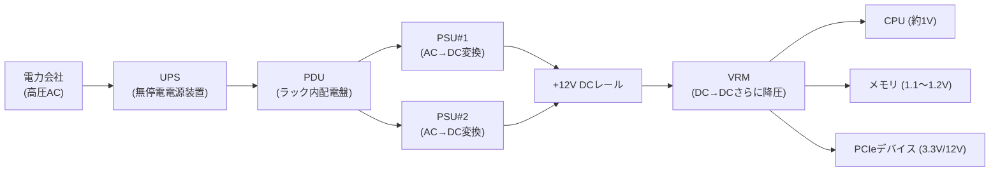
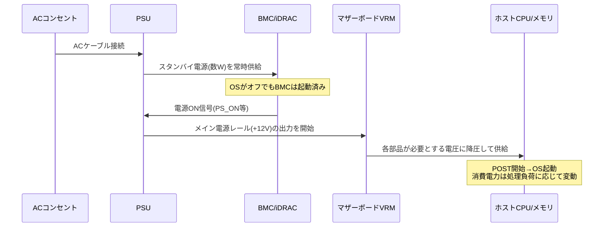

## はじめに

- **この記事で得られること**: サーバーの電源が「なぜAC/DC変換をするのか」「メインシステムはどうやって電力を受け取り起動するのか」「PSUを冗長化するとはどういうことか（A/Bグリッド冗長・ホットスペア）」について、電気の基礎から実務で使う設定・切り分けの視点まで体系的に理解できます。
- **対象読者**: インフラエンジニアとして就業しており、「AC/DCが交流・直流のことだとは知っているが、それ以上の仕組みは説明できない」レベルの方。サーバーの電源設計（AC/DC変換、PSUの冗長化）を電気の基礎から理解したい方を想定しています。
- **読むのにかかる想定時間**: 約15〜20分

この記事は[『上位1%』シリーズ 全記事ガイド](/sitemap)の一部です。

サーバーに搭載されるBMC（管理用コントローラー）がホストとは別の「スタンバイ電源」で常時稼働している、という話を聞いたことがある方も多いはずです。この記事では一歩下がって、「そもそもサーバーの電源とは何をしている装置なのか」という、より基礎的な部分から掘り下げていきます。

## 前提知識

- **AC（交流 / Alternating Current）** : 電流の向きと大きさが周期的に変化する電気。日本の家庭・データセンターの商用電源は50Hz/60HzのACです。
- **DC（直流 / Direct Current）** : 電流の向きと大きさが常に一定の電気。CPUやメモリなどの半導体は基本的にDCでしか動作しません。
- **PSU（Power Supply Unit / 電源ユニット）** : サーバーに搭載される、ACをDCに変換するための装置です。
- **VRM（Voltage Regulator Module）** : マザーボード上でPSUが出力したDCを、CPUなど個々の部品が必要とするさらに細かい電圧に変換する回路です。

## 全体像をつかむ

### 一言で言うと

サーバーの電源とは、「**データセンターの、荒くて不安定な交流電力を、精密な半導体が必要とする安定した直流電力へと、何段階にもわたって変換し続ける仕組み**」です。1回で変換して終わりではなく、PSU→VRMという複数の変換ステージを経て、ようやくCPUが使える1V前後の電圧にたどり着きます。

### 電力が届くまでの全体像

サーバー本体に届く前段階（UPS・PDU）も含めると、電源とは「変換」と「冗長化」を何層にも重ねた設計であることが見えてきます。この記事では、特にサーバー本体内部（PSU・VRM）の変換の仕組みと、PSUの冗長化設計に焦点を当てます。

## 基礎から徹底解説

### 電気の基礎：電圧・電流・電力・抵抗の関係

以降の説明を理解するための最低限の電気の基礎を、水道にたとえて整理しておきます。

| 電気の量 | 単位 | 水道での例え | 意味 |
|---|---|---|---|
| 電圧（Voltage） | V（ボルト） | 水圧 | 電気を押し出す力の大きさ |
| 電流（Current） | A（アンペア） | 水の流量 | 実際に流れている電気の量 |
| 抵抗（Resistance） | Ω（オーム） | 水道管の細さ・詰まり具合 | 電気の流れにくさ |
| 電力（Power） | W（ワット） | 単位時間あたりに水車がした仕事 | 実際に消費・供給される仕事量 |

この4つは次の2つの式で結びついています。

- **オームの法則**: 電圧 = 電流 × 抵抗（`V = I × R`）
- **電力の式**: 電力 = 電圧 × 電流（`P = V × I`）

たとえば「同じ電力を送るにしても、電圧を上げれば電流は下げられる」（`P`が一定なら`V`と`I`は反比例の関係）という関係は、後述のAC送電の話の土台になります。

なぜ「電力＝電圧×電流」という掛け算になるのか（水道の例えで直感的に理解する）

「電圧＝電流×抵抗」は、押し出す力（水圧）を抵抗（水道管の詰まり具合）で割ることで流量が決まる、という1つの物理現象なので直感的にイメージしやすい一方、「電力＝電圧×電流」がなぜ掛け算になるのかはピンとこない、という感覚は自然です。これは「電圧」と「電流」がそれぞれ何を測っているかを分解すると見えてきます。

- **電圧（V）は「電気1粒（正確には電荷1クーロン）あたりが持っている、押し出すエネルギーの大きさ」** です。水道で言えば「1粒の水が、どれだけ高い位置から落ちてきて、どれだけの勢いを持っているか（水圧の高さ）」に相当します。
- **電流（A）は「1秒間に何粒の電気（何クーロンの電荷）が流れているか」** です。水道で言えば「1秒間に何粒の水が水車に当たるか（流量）」に相当します。

水車が1秒間に受け取る総エネルギー（＝仕事率＝電力）は、「水1粒あたりのエネルギー（水圧）」×「1秒あたりに当たる水の粒数（流量）」で決まります。1粒あたりのエネルギーが2倍になっても、1粒あたりのエネルギーが同じで粒数が2倍になっても、どちらも「1秒間に水車へ伝わる総エネルギー」は2倍になります。これが掛け算になる理由です。

具体的な数字で確認すると、`100V × 1A = 100W`のとき、電圧を2倍にして`200V × 1A`にすれば`200W`（2倍）、電流を2倍にして`100V × 2A`にしても同じく`200W`（2倍）になります。電圧・電流のどちらを2倍にしても、「単位時間あたりに運ばれる仕事量」は同じだけ2倍になる、という対称的な関係にあることが、掛け算の意味を裏付けています。

VRM（電圧レギュレータモジュール）が「電流」ではなく「電圧」を管理対象にしているのも、この関係が理由です。CPU・メモリなどの半導体は「常に一定の電圧が供給されること」を前提に回路が設計されており、電圧が変動すると誤動作や破損につながります。一方で電流（＝消費電力）は、CPUの処理内容によって刻々と変化するのが正常な状態です。そのためVRMは「電流をいくら流すか」を能動的に決めているのではなく、「出力電圧を基準値ぴったりに保つ」ことだけをフィードバック制御しており、その結果として、CPU側の状態（オームの法則でいう実効抵抗＝インピーダンスの変化）に応じて電流が自動的に増減する、という設計になっています。VRMの内部では、出力電圧を常時センシングし、基準値より下がれば供給を増やす方向に、上がれば減らす方向にスイッチング動作（後述のPWM制御）を微調整するフィードバックループが働いています。

CPU/メモリは「電力をください」と要求しているのか（電気信号によるプロトコルなのか）

結論から言うと、CPU・メモリがVRMに対して「電力をよこせ」という明示的な信号（デジタル的な要求プロトコル）を送っているわけではありません。電力の増減は、次のような純粋に物理的な現象として起こります。

1. CPUが多くのトランジスタを同時にスイッチングさせる（＝高負荷の演算をする）と、CPU内部の実効的な電気抵抗（インピーダンス）が変化し、同じ電圧下でより多くの電流が自然に流れ込もうとします（オームの法則の帰結です）。
2. VRMはこの電圧の微妙な低下（負荷が増えて電流が増えようとする瞬間、一時的に電圧が下がろうとする）を高速に検知し、スイッチング素子のON/OFFの比率（デューティ比）を調整して、電圧を基準値に戻します。
3. 結果として、CPU側から見れば「必要な分だけ電流が供給される」ように見えますが、これは意志のある要求ではなく、電圧を一定に保とうとするフィードバック制御の副産物です。

「電力を貯めておいて、要求されたら払い出す」という蓄電池のようなイメージも浮かびやすいですが、マザーボード上のコンデンサ（VRM出力に並ぶ「デカップリングコンデンサ」）が果たしている役割は、あくまで**電圧が瞬間的に落ち込む（負荷急増の一瞬に電流供給が追いつかないコンマ数マイクロ秒単位のタイムラグ）のを埋める、ごく短時間のバッファ**です。数秒・数分といった単位で電力を貯めておけるものではなく、PSUからの供給が止まればこのバッファもすぐに枯渇します。「要求すれば無限に電力を出せる」わけではなく、PSU・VRMそれぞれの定格（最大出力）を超える負荷をかければ、電圧が維持できずシステムダウンや保護回路によるシャットダウンが発生します。

そもそも「コンデンサ」とは何をする部品なのか

コンデンサ（キャパシタ）は、2枚の金属板（電極）を、ごくわずかな隙間を空けて向かい合わせただけの、構造としては非常に単純な部品です。電圧をかけると、片方の電極にプラスの電荷が、もう片方の電極にマイナスの電荷が集まり、この「電荷の偏り」という形でエネルギーを蓄えます。2枚の電極は絶縁体（誘電体）で隔てられているため、電荷はそこを飛び越えて流れることはできず、行き場を失ったまま両電極に溜まり続けます。

ここで「電圧差が生まれ、それを打ち消すように電流が流れる」というイメージ自体は正しく、コンデンサはまさにこの性質を利用しています。 **外部の電圧が上がろうとすると、コンデンサはより多くの電荷を蓄えることでその変化に抵抗し（電圧の上昇を緩やかにする）、逆に外部の電圧が下がろうとすると、蓄えていた電荷を放出することでその変化に抵抗します（電圧の低下を緩やかにする）** 。つまりコンデンサは、電圧の急激な変化を鈍らせる「電気的な緩衝材」として働きます。

サーバー（に限らずあらゆるデジタル回路）でこの性質が必要になる理由は、CPUのようなデジタル回路が、トランジスタを一斉にON/OFFさせるたびに、消費電流がナノ秒単位で急激に増減するためです。PSUやVRMのようなフィードバック制御回路にも、電圧の変化を検知してから出力を調整するまでにごくわずかな反応の遅れ（タイムラグ）があります。この「回路が反応しきれない、コンマ数マイクロ秒〜数十ナノ秒の隙間」を埋めて電圧を安定させる役目を担っているのが、VRM出力に並ぶ大量の小さなコンデンサ（デカップリングコンデンサ）です。もしこの緩衝材がなければ、CPUが負荷を上げた瞬間に電圧が一瞬落ち込み、そのわずかな電圧低下だけでトランジスタの0/1判定が誤動作し、演算結果が狂ったりシステムがクラッシュしたりする原因になります。

### なぜAC→DC変換が必要なのか

電力会社からデータセンターに送られてくる電気はACです。ACが使われる理由は、**電圧を変圧器で自由に上げ下げでき、高電圧・低電流にすることで送電時の損失（発熱によるロス）を抑えられる**ためです。長距離送電網が基本的にすべてAC（交流送電）で構築されているのはこのためです。

一方、CPU・メモリ・SSDといった半導体は、内部のトランジスタを正確なタイミングでON/OFFさせて演算する都合上、**極めて安定した一定電圧のDC**でなければ正常に動作しません。電圧が周期的に変動するACをそのまま流すと、回路が誤動作したり破損したりします。したがって「送電に有利なAC」と「演算に必須なDC」という、性質の異なる2つの電気の橋渡し役として、PSUというAC→DC変換装置がサーバーの中に必要になります。

なぜ「高電圧・低電流」だと送電損失が減るのか、なぜACは電圧を変えやすいのか

**送電損失はなぜ電流の大きさで決まるのか**

送電線にも微小な抵抗があり、電流が流れると熱として電力が失われます。この損失は`損失 = 電流² × 抵抗`（前述の電気の基礎で扱った関係の応用）という式で決まり、**電流の2乗**に比例します。つまり、同じ電力（`電力 = 電圧 × 電流`）を送るのであれば、電圧を10倍にして電流を1/10に抑えれば、送電損失は1/100まで減らせる計算になります。これが「長距離送電では電圧をできるだけ高くし、電流をできるだけ小さくしたい」という発想の根拠です。

**なぜACだと電圧を自由に変えられるのか**

ACの電圧を上げ下げする装置が **変圧器（トランス）** です。変圧器は、電磁誘導（コイルに交流電流を流すと、その周囲に発生する磁界の変化が、隣接する別のコイルに新たな電流を誘導する現象）を利用しており、一次側と二次側のコイルの巻き数の比率（巻数比）を変えるだけで、電圧を自在に変換できます。これは「電流の向き・大きさが周期的に変化し続ける」というACの性質があって初めて成立する仕組みです。DCは電流が常に一定方向・一定の大きさのままなので、この電磁誘導による電圧変換の仕組みがそのままでは使えず、DCの電圧を変えるには電子回路（DC-DCコンバータのような能動的なスイッチング回路）が別途必要になります。歴史的に長距離送電がACを基本に発展してきたのは、変圧器という単純で信頼性の高い機械的な装置だけで電圧変換ができたことが大きな理由です（現代では大陸間の海底送電などでHVDC:高圧直流送電も一部使われていますが、これは変換設備のコストを送電距離の長さで正当化できる特殊なケースです）。

なぜ交流電流は電磁誘導を引き起こせるのか（直流ではダメなのか）

電磁誘導の大本にあるのは、次の2つの物理法則です。

1. **電流が流れると、その周りに磁界ができる（アンペールの法則）** 。電線に電流を流すと、電線を取り巻くように磁力線が発生します。電流が大きいほど磁界も強くなります。
2. **磁界が「変化する」と、その変化を打ち消す向きに、近くの導線に新しい電流が生まれる（ファラデーの電磁誘導の法則）** 。ポイントは「磁界が存在するだけ」では何も起きず、あくまで**磁界の強さが時間とともに変化して初めて**、隣の導線に電流（起電力）が発生するという点です。

変圧器の一次コイルにACを流すと、電流の大きさと向きが1秒間に50〜60回、周期的にプラス・マイナスを行ったり来たりします。1で述べた通り「電流が変化すれば、それが作る磁界も同じように変化する」ため、一次コイルの周りの磁界は常に強弱・向きを変え続けます。この「絶えず変化し続ける磁界」が鉄心を通じて二次コイルにも届き、2の法則により二次コイル側にも新たな電流（電圧）が誘導され続けます。

一方、DCを一次コイルに流した場合、流れる電流の大きさは一定なので、それが作る磁界も一定の強さのまま変化しません（電源を入れた瞬間・切った瞬間だけは磁界が変化するため、ごく一瞬だけ二次コイルに電流が生じますが、それ以降は磁界が変化しないため誘導は起こらず電流はゼロになります）。「電流が流れているかどうか」ではなく「磁界が変化し続けているかどうか」が電磁誘導の発生条件であるため、**常に変化し続けるACだけが、変圧器を使った継続的な電圧変換を成立させられる**というのが結論です。

**トランジスタとDCの相性がよい理由**

トランジスタは、ごく微小な電圧・電流の変化で、大きな電流の流れをON/OFFしたり増幅したりできる半導体素子です。CPU内部では、このトランジスタを「電圧が高い状態＝1」「電圧が低い状態＝0」という2つの状態のスイッチとして大量に組み合わせ、論理演算（AND/OR/NOTなど）を行っています。この0/1の判定は、電圧のわずかなブレが誤判定に直結するほどシビアなタイミングで行われるため、周期的に電圧が変動し続けるACでは正確なスイッチングができません。DCの「常に一定」という性質が、この高速で正確な0/1判定と根本的に相性が良いのです。

そもそも「半導体」とは何か（トランジスタがスイッチとして働く仕組み）

半導体とは、シリコンのように「電気を通す導体」と「電気を通さない絶縁体」の中間の性質を持つ物質のことです。ポイントは、**純粋なシリコンはほとんど電気を通さないが、ごくわずかな不純物を混ぜる（ドーピングする）ことで、電気の通しやすさを人為的にコントロールできる**という点にあります。

- リン等の不純物を混ぜると、電子が過剰な「N型半導体」になります。
- ホウ素等の不純物を混ぜると、電子が不足した（電子の抜け穴＝正孔が過剰な）「P型半導体」になります。

トランジスタは、このN型とP型を「N-P-N」または「P-N-P」のようにサンドイッチ状に組み合わせた構造をしています。真ん中の層（ベース）にかける電圧をわずかに変化させるだけで、両端の層（コレクタ・エミッタ）の間を電流が流れる状態と流れない状態を、電気的に切り替えられます。これが「ごく微小な電圧の変化で、大きな電流の流れをON/OFFできる」というトランジスタのスイッチ動作の正体です。半導体という「電気の通しやすさを自在に操作できる」特殊な物質があって初めて、こうした高速・高精度なスイッチを、指の爪ほどのチップに何十億個も集積することが可能になっています。

**家庭用機器も同じ変換をしている**

ノートPCやスマートフォンの充電器（ACアダプタ）も、サーバーのPSUと全く同じ役割（AC→DC変換）を担っています。違いは変換回路がサーバー本体の中（PSU）にあるか、本体の外（電源アダプタという小さな箱）にあるかだけです。ノートPCが一見「ACのままで動いている」ように見えるのは、変換の場所がケーブルの途中（アダプタの中）に移動しているだけで、内部のバッテリー・回路自体はサーバーと同様にDCで動作しています。

なぜデータセンター全体をDCで配電しないのか（DC配電という選択肢）

ここまで読むと「サーバーに届く直前でAC→DC変換するくらいなら、データセンターの配電自体を最初からDCにしてしまえばよいのでは」という発想も自然です。実際、一部のハイパースケール事業者のデータセンターでは、UPSの直後から±380V DCなどの高電圧DCで配電し、ラック単位でDCのまま受電することで、AC/DC変換の回数そのものを減らし、変換ロスを削減する設計が採用されている例があります。ただし、これは「DC配電に対応した専用のPSU・専用の配電設備」を一貫して導入する必要があり、既存の一般的なACベースの設備・機器（標準的なACコンセント、既存のUPS、汎用PSU搭載サーバーなど）との互換性を失うという大きなトレードオフを伴います。一般的なラックマウントサーバーが今もACコンセントで電源を受け、サーバー内部のPSUでAC→DC変換するという設計が主流であり続けているのは、既存設備との互換性・保守性・調達の柔軟性を優先した結果だと理解しておくとよいでしょう。

### UPSとPDUの役割を深掘り

サーバー本体（PSU）に電気が届くまでの前段には、UPSとPDUという2つの重要な脇役がいます。

**UPS（Uninterruptible Power Supply / 無停電電源装置）**

UPSは、商用電源（電力会社からのAC）が瞬断・停電した際に、内蔵バッテリーからの給電へ瞬時に切り替えて、下流の機器への電力供給を継続させる装置です。主な方式は次の3つです。

| 方式 | 動作 | 特徴 |
|---|---|---|
| スタンバイ方式 | 普段は商用電源をほぼそのまま流し、停電を検知してからバッテリー給電に切り替える | 安価だが切り替えにわずかな瞬断（数ms〜数十ms）が発生する |
| ラインインタラクティブ方式 | 電圧の軽微な変動は内部で自動補正しつつ、大きな異常時のみバッテリーに切り替える | スタンバイ方式より安定、コストと性能のバランスが良く中規模環境で主流 |
| オンライン（二重変換）方式 | 常時、商用電源をAC→DC→ACと二重に変換してから出力し、バッテリーも常時この変換経路に組み込まれている | 切り替えによる瞬断が原理的に発生しない。データセンター等のミッションクリティカルな環境で主流 |

データセンターでは、UPS自体も1台故障しても全体が止まらないよう、`N+1`（必要台数+予備1台）や`2N`（同じ構成をまるごと2系統用意する）といった冗長構成を組むのが一般的です。この「UPSを複数系統に分けて冗長化する」という考え方が、本記事後半で扱うサーバー側のA/Bグリッド冗長（グリッドA・グリッドBという別々の給電系統）の、そもそもの土台になっています。

オンライン方式はなぜ、わざわざDCをもう一度ACに変換し直すのか

「一度DCに変換したなら、そのままDCで下流に流してしまえばよいのでは」という疑問は自然です。DCに戻さずACに再変換する理由は主に2つあります。

**1. 下流の機器（サーバーのPSUなど）は、標準的にACの入力を前提に作られているから**

一般的なラックマウントサーバーのPSUは、規格化されたACコンセント（日本なら100V/200V、海外なら230Vなど）からの入力を受け取る前提で設計されています。UPSの出力がDCのままだと、それを受け取るすべての機器がDC入力対応の特殊なPSUでなければならなくなり、既存の汎用的なサーバー・ネットワーク機器・ストレージなどとの互換性が失われてしまいます。ACという「業界標準の入力形式」に揃えて出力することで、UPSの下流にどんな汎用機器を繋いでも、追加の変換なしにそのまま使えるという互換性が保たれます。

**2. 出力段を常時「バッテリー由来の電力を扱う回路」として動かし続けられるから**

二重変換方式のもう1つの狙いは、**出力側のインバータ（DC→AC変換回路）が、入力が商用電源由来かバッテリー由来かを一切気にせず、常に同じDCバスから電力を受け取って動作し続けられる**という点にあります。商用電源が正常なときは「商用電源→整流器→DC→インバータ→AC出力」という経路で、内部のバッテリーも常にこのDCバスに浮かせた状態でぶら下がっています。停電が起きると、整流器からの電力供給が止まる代わりに、同じDCバスにバッテリーからの電力が流れ込むだけで、出力側のインバータから見れば「DCバスの電力の出どころが変わった」という違いに過ぎず、動作そのものは一切変わりません。スタンバイ方式のように「経路そのものを商用電源からバッテリーへ物理的に切り替える」スイッチング動作が存在しないため、原理的に瞬断（切り替えにかかる数ms〜数十ms）が発生しないのです。この「常時同じ変換経路で動き続ける」という設計を実現するための代償として、AC→DC→ACという二重の変換（＝二重の変換ロス）を常に払い続けている、というトレードオフになっています。

**PDU（Power Distribution Unit / ラック内配電盤）**

PDUは、UPSやブレーカーから受け取った電力を、ラック内の各サーバーのコンセントへ分配する装置です。家庭用の電源タップの、業務用・高機能版とイメージすると掴みやすいはずです。

| 種類 | 概要 |
|---|---|
| ベーシックPDU | 単純に電力を分配するだけの、電源タップに近いもの |
| メータードPDU | ラック全体・コンセント単位の消費電力を計測・可視化できる |
| スイッチドPDU | 個別のコンセントをリモートでON/OFF・電源サイクルできる（応答不能なサーバーの強制電源断など、iDRACが使えない場合の最終手段としても使われます） |

前述のA/Bグリッド冗長を実現する際は、1本のPDUだけに全PSUを接続しては意味がありません。グリッドA用のPDUとグリッドB用のPDUを物理的に分け、それぞれ別系統のUPS・別系統のブレーカーに接続して初めて、配電経路の冗長化が成立します。

### PSUのメリット・デメリットとサーバーとの相性

| 観点 | 内容 |
|---|---|
| 変換効率 | 現代のサーバー用PSUはスイッチング方式（SMPS）で、80 PLUS認証（Bronze〜Titanium）などで効率が指標化されています。効率90%台後半に達するモデルもありますが、**負荷率によって効率が変動する**という特性があります |
| 効率のクセ | 効率は負荷率0%付近と100%付近で低下し、多くの場合 **負荷率40〜60%程度が最も効率の良い「スイートスポット」** になります。サーバーの電源設計（後述のホットスペア機能）は、この特性を踏まえて「稼働させるPSUの負荷率をスイートスポット付近に寄せる」ことを狙っています |
| 冗長性 | 1台のみ搭載する非冗長構成はコスト・設置スペースで有利ですが、PSU故障時に即座にサーバー停止するリスクを負います。複数PSU搭載＋冗長化設定によりPSU単体の故障やAC入力の喪失に耐えられます |
| ホットスワップ性 | エンタープライズ向けPSUの多くはサーバー稼働中に無停止で交換可能（ホットスワップ）です。これにより、冗長構成であれば1台故障しても計画停止なしに交換対応できます |

### メインシステムへの給電の仕組み（スタンバイからフルパワーへ）

ここが今回もっとも掘り下げたいポイントです。「電源ケーブルが刺さっていれば常に一定の電力が流れ込み続けている」わけではありません。PSUは電圧を一定に保つよう動作する装置であり、**そこから実際にどれだけの電流（＝電力）が流れるかは、下流の部品がその瞬間にどれだけの電力を要求しているかによって決まります**。これはオームの法則に基づく、電気回路のごく基本的な性質です。

**1. ACが刺さっている間、PSUは常に「スタンバイレール」という小さな回路にだけ電力を供給し続けています。** これはBMC（iDRACなど）専用の小さな待機電力（数W〜十数W程度）で、ホストのメイン電源がオフの間もここだけは生きています。

**2. 電源ON操作（物理ボタン、またはiDRAC経由のコマンド）が入ると、PSUはメインの電源レール（+12V系統など）の出力を開始します。** この「メインレールを出すか出さないか」の切り替えは、`PS_ON`と呼ばれる制御信号線をLow/Highに切り替えることで行われます。これはATX電源設計に由来する古くからの業界標準の仕組みです。

**3. メインレールが出力されると、マザーボード上のVRMがそれをさらに細かい電圧（CPU用の1V前後、メモリ用の1.1V前後など）に変換します。** 電力供給が安定して初めてPOST（Power-On Self-Test）が実行され、OSの起動プロセスが始まります。

**4. 起動後、実際に流れる電流の量はホストの処理負荷に応じて動的に変化します。** CPUがアイドル状態のときは消費電力が下がり、高負荷になれば消費電力が上がります（動的電圧・周波数スケーリングなどの省電力機構が働くため）。つまり「一定の電力が流れ込み続ける」のではなく、「PSUは一定の電圧を保ちながら、その時々でホストが要求する分だけの電流を流している」というのが正確な理解です。

## A/Bグリッド冗長を深掘り

**A/Bグリッド冗長**とは、サーバーに搭載された複数のPSUを、物理的に系統の異なる2つの給電元（グリッドA・グリッドB。データセンター内の別々のUPS・別々の配電盤）にそれぞれ接続しておく構成のことです。片方のPSU、あるいはそのPSUが属するグリッド自体（配電盤の故障・ブレーカー断など）に障害が発生しても、もう一方のグリッドに属するPSUが正常であれば、サーバーは電源供給を受け続けられます。

iDRACのRACADMでは、この冗長ポリシーを`System.Power.RedundancyPolicy`という設定項目で管理しており、代表的には次の3種類があります。

| ポリシー | 通称 | 内容 |
|---|---|---|
| Not Redundant | 非冗長 | 搭載する全PSUが常時稼働し電力を分担する。最大消費電力に対応できる反面、1台故障すると停止しうる |
| AC Redundant（Input Power Redundant） | AC冗長・A/Bグリッド冗長 | PSUが異なる入力系統（グリッド）に接続されていれば、片方の入力系統が丸ごと失われても稼働継続 |
| PSU Redundant（DC Redundant） | PSU冗長 | PSUを4台搭載する構成（2+1相当）でのみ選択可能。1台のPSU単体故障に耐える構成 |

### ホットスペア機能を深掘り

**ホットスペア機能**を有効にすると、複数のPSUの負荷バランスを動的に制御できます。通常は搭載されているPSUすべてが並行して電流を供給しますが、ホットスペアが有効な状態では、サーバーの消費電力が低いとき、片方のPSUが主体的に電流を供給する「アクティブ状態」、もう片方は必要最小限の電流のみを供給する「スリープ状態」に分かれます。前述の通り、PSUは負荷率が低すぎるとかえって電力変換効率が落ちる特性を持つため、あえて1台に負荷を寄せて高効率な動作点（スイートスポット）で運用し、システム全体の電力効率を高めるための仕組みです。サーバーの消費電力が増えてくると、スリープ状態だったPSUも自動的にアクティブ状態へ復帰します。

ここで自然に浮かぶのが、「複数台のサーバーが同時にホットスペア機能を使うと、結果的に片系（例えばグリッドA側）のPSUばかりが常にアクティブになり、その系統の配電経路に負荷が集中してしまうのではないか」という疑問です。これは実務でも意識すべき正しい懸念です。

この懸念への対応は2段構えになっています。

**1. データセンターの配電設計そのものが「各グリッドが単独で100%の負荷を賄える」前提で組まれている**
冗長構成のデータセンターでは、UPSやPDU、上流のブレーカーを「A系統だけで全負荷を賄えるか、B系統だけで全負荷を賄えるか」という基準（いわゆるN+N設計）でサイジングするのが基本です。したがって、ホットスペアによって特定のグリッドに負荷が寄ったとしても、そのグリッドの配電設備自体は本来「単独で全負荷を受けきれる」容量で設計されているため、即座に過負荷になるわけではありません。とはいえ、電気設備には安全マージン（分電盤の連続使用は定格の80%以下に収めるべき、といった実務ルール）があるため、運用上は「片方のグリッドに全サーバーの負荷が偏り続けている状態」を放置してよいわけではありません。

**2. 個々のサーバー側で「どちらのPSUを優先(プライマリ)にするか」を手動設定できる**
iDRACには`System.Power.Hotspare.PrimaryPSU`という設定項目があり、ホットスペア時にどちらのPSUをアクティブ側（プライマリ）にするかを個別に指定できます。ラック単位・サーバー単位でこのプライマリ設定を意図的に交互に振り分けておく（あるサーバーはPSU1＝グリッドAを優先、別のサーバーはPSU2＝グリッドBを優先、というように)ことで、データセンター全体で見たときにグリッドA・グリッドBそれぞれへの負荷を均等に近づけることができます。これは、データセンターのPDU配線でよく行われる「3相電源のL1/L2/L3にサーバーを順番に振り分けて負荷を均等化する」という考え方と同じ発想です。

## プロが見ている視点（上位1%の理解）

### 電力上限ポリシー（パワーキャッピング）との組み合わせ

iDRACには個々のサーバーの消費電力に上限を設定する電力上限ポリシー（Power Cap）機能もあります。ラック単位・データセンター単位で使える総電力には物理的な上限があるため、大規模環境では「1台あたりの最大消費電力を意図的に抑え、その分ラックに搭載できる台数を増やす」といった、電力を制約条件としたキャパシティプランニングが行われます。PSUの冗長設計（何が起きても電力が絶えないようにする話）と、電力上限ポリシー（そもそも使う電力の総量を管理する話）は、どちらも大規模環境の電源設計における車の両輪です。

### ハイパースケーラーのDC配電という選択肢

前述の通り、一部の大規模事業者はサーバー個々のAC/DC変換ロスすら削減するため、データセンターの配電レイヤーからDC化する設計を採用することがあります。一般的な企業のオンプレミス環境でここまで踏み込むケースは稀ですが、「PSUのAC/DC変換自体にもロスがあり、それを削減する設計思想が存在する」ということを知っておくと、電力効率の議論の解像度が上がります。

## よくある誤解・つまずきポイント

- **誤解1: 「PSUを2台積んでいれば、それだけで冗長化できている」**
  2台のPSUを同じ配電盤・同じブレーカーに接続していては、その配電盤が落ちたときに両方とも電力を失います。「PSUの二重化」だけでなく「給電経路（配電系統）そのものの二重化」までセットで行って初めて、真の意味での電源冗長になります。
- **誤解2: 「ホットスペアでスリープ状態のPSUは、壊れているか電源が入っていない」**
  ホットスペアは意図的に片方のPSUの負荷を下げて高効率運用するための正常な動作です。電流値が低い・LEDの点灯パターンが違うといった状態を見て故障と誤読しないよう、iDRACのイベントログで「スリープ状態への遷移」なのか「実際の故障」なのかを区別することが重要です。
- **誤解3: 「電源ケーブルを挿しっぱなしなら、常に一定の電力が流れ込み続けている」**
  PSUは一定の電圧を保つよう動作しますが、実際に流れる電流（消費電力）はその時々の負荷が要求する分だけです。処理負荷が上がれば消費電力も上がり、アイドル時は下がります。

## 障害・トラブルシューティングの視点

### PSU障害・冗長性喪失のアラートが出た場合

1. まずiDRACのイベントログ／Lifecycle Logで、対象PSUのイベント種別を確認します。「Redundancy lost（冗長性喪失）」「PSU failure（故障）」「PSU entered sleep state（スリープ遷移）」は原因も対応も異なるため、種別を取り違えないことが重要です。
2. `racadm getsensorinfo`でPSUごとの入力電圧・出力状態を確認し、AC入力自体が来ていない（配電盤・ブレーカー側の問題）のか、PSU本体の故障なのかを切り分けます。
3. AC入力は来ているのにPSUがエラーを報告し続ける場合は、PSU本体の交換を検討します。冗長構成であればホットスワップでの無停止交換が可能です。

### 予防策・恒久対策

- 冗長ポリシー（AC冗長かPSU冗長か）を意図した設計と一致させ、定期的に設定ドリフトがないか確認する。
- ホットスペアのプライマリPSU設定を、ラック・データセンター全体で意図的に分散させる。
- PDU・ブレーカーの利用率を定格の80%程度までに収め、片系グリッドへの過度な負荷集中を避ける。
- PSUのファームウェアも本体ファームウェアと同様に更新対象に含め、放置しない。

## まとめ

- サーバー電源とは、送電に有利なACを、半導体が必要とするDCへと段階的に変換し続ける仕組みであり、PSU（AC→DC）とVRM（DC→DCのさらなる降圧）という2段階の変換で構成されています。
- 「電源が刺さっていれば一定の電力が流れ続ける」のではなく、PSUは一定電圧を保ちながら、その時々の負荷が要求する電流だけを流しています。
- A/Bグリッド冗長は「PSUの二重化」と「配電系統の二重化」がセットになって初めて意味を持ちます。
- ホットスペア機能による効率化は、データセンター全体の配電設計（各グリッドが単独で全負荷を賄える設計）とPrimaryPSUの意図的な分散設定の両輪で安全に運用されます。

**今日から意識すべきこと**
1. 自分が管理しているサーバーの`System.Power.RedundancyPolicy`と`Hotspare.PrimaryPSU`が、意図した設計と一致しているか確認してみましょう。
2. PSUのアラートを見たとき、まず「故障」か「スリープ遷移(正常)」かをイベントログで区別する癖をつけましょう。

## 参考文献

- [iDRAC9 with Lifecycle Controller RACADM CLI Guide: System.Power.RedundancyPolicy | Dell US](https://www.dell.com/support/manuals/en-us/idrac9-lifecycle-controller-v3.0-series/idrac_3.00.00.00_racadm/systempowerredundancypolicy-read-or-write?guid=guid-bd4dedeb-8e66-4d80-b471-ff6523deaa6e&lang=en-us)
- [Configuring Power Supply Options | iDRAC9 User's Guide | Dell US](https://www.dell.com/support/manuals/en-us/poweredge-r740/idrac_3.31.31.31_ug/configuring-power-supply-options?guid=guid-8f12589b-c8a1-427b-b356-e20b49f9652e&lang=en-us)
- [Hot Spare Feature | Dell PowerEdge R730xd Owner's Manual | Dell US](https://www.dell.com/support/manuals/en-us/poweredge-r730xd/r730xd_ompublication/hot-spare-feature?guid=guid-de802c03-9996-495c-9942-249068f1f3e4&lang=en-us)
- [PowerEdge: Power Settings | Dell US](https://www.dell.com/support/kbdoc/en-us/000202926/poweredge-power-settings)
- [Quick Guide to Power Distribution Handbook | Eaton](https://www.eaton.com/content/dam/eaton/products/backup-power-ups-surge-it-power-distribution/power-distribution-for-it-equipment/eaton-power-distribution-handbook-MZ155002EN.pdf)
- [Data Center Cabinet Load Balancing | Raritan](https://www.raritan.com/blog/detail/data-center-cabinet-load-balancing-theres-a-less-complicated-way)
