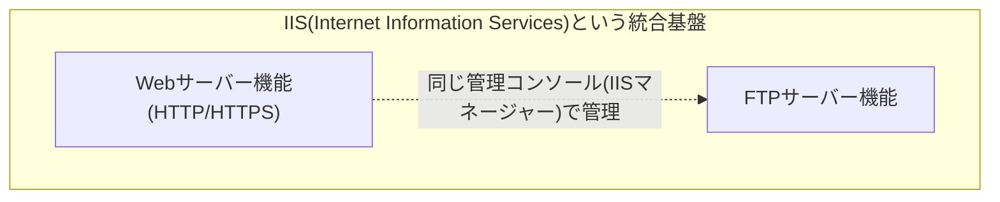

## はじめに

- **この記事で得られること**: IISは主にWebサーバー(HTTP)機能として認識されがちですが、実際には**FTPサーバーとしての役割サービスも追加でインストールできる**、複数のインターネットサービスを統合的に提供するソフトウェアです。この記事では、**IISとFTPの関係**、なぜ両者が同じ管理基盤に統合されているのか、そしてFTPプロトコル自体のアクティブモード・パッシブモードの違いや、FTPS・SFTPとの違いまでを体系的に理解します。
- **対象読者**: IISサーバーの構築・運用に携わったことはあるものの、IISとFTPの関係や、FTP自体の内部動作を具体的に説明できない方を想定しています。
- **読むのにかかる想定時間**: 約16分

この記事は[『上位1%』シリーズ 全記事ガイド](/sitemap)の一部、[Windows Server運用シリーズ](/sitemap#シリーズ一覧)の4本目です。IISのWeb(HTTP)機能そのものについては[IISとASP.NETの仕組みを『上位1%』の視点で理解する](/articles/iis-fundamentals-guide)を前提にしています。

## 前提知識

- **FTP(File Transfer Protocol)**: ファイルの送受信を目的とした、古くから使われているプロトコルです。
- **NAT**: プライベートIPアドレスの内部ネットワークを、パブリックIPアドレスへ変換してインターネットへ中継する仕組みです。詳しくは[NAT/NAPTの仕組みを『上位1%』の視点で理解する](/articles/nat-guide)を参照してください。

## 全体像をつかむ

### IIS(Internet Information Services)という名前の意味

**IIS(Internet Information Services)という名前自体が、「HTTP専用のサーバー」ではなく、「複数の"インターネットサービス"を統合的に提供する基盤」という設計思想を表しています。** サーバーマネージャーで「Webサーバー(IIS)」の役割を追加する際、Web(HTTP)機能とは別に、**FTPサーバー**という役割サービスを個別に選択してインストールできます。

## 基礎から徹底解説

### FTPプロトコルの特殊な構造:制御チャネルとデータチャネル

IISのFTP機能を理解する前提として、FTPプロトコル自体が持つ、**HTTPとは大きく異なる特殊な構造**を押さえておく必要があります。**FTPは、コマンドをやり取りする「制御チャネル」(既定でポート21番)と、実際のファイルの内容を転送する「データチャネル」という、2本の別々の接続を使う**プロトコルです。

さらに、このデータチャネルの確立方法には、**アクティブモード**と**パッシブモード**という2つの方式があります。

| モード | データチャネルの確立方法 | NAT/ファイアウォールとの相性 |
|---|---|---|
| **アクティブモード** | サーバー側が、クライアントへ向けて新規にデータチャネルの接続を張る | クライアント側がNATの内側にいる場合、サーバーからの新規接続をNAT機器が正しく通過させられず、接続が失敗しやすい |
| **パッシブモード** | クライアント側が、サーバーへ向けてデータチャネルの接続を張る(通常の接続と同じ方向) | クライアント側がNATの内側にいても、クライアントが発信元になるため問題が起きにくい |

**現在のインターネット環境ではNATが極めて広く普及しているため、実務ではほぼ常にパッシブモードが使われます。** [NAT/NAPTの仕組みを『上位1%』の視点で理解する](/articles/nat-guide)で扱った通り、NATは基本的に内側から外側への発信をもとに変換テーブルを構築する仕組みであり、外側から内側への新規接続(アクティブモードでサーバーが行う接続)を正しく中継できないケースが多いため、この非対称性がアクティブモードの実務上の弱点になっています。

### IISのFTP機能は、HTTP機能と内部的に独立している

**IISのFTPサーバー機能は、HTTP機能(HTTP.sysやアプリケーションプールの仕組み)とは、内部的に完全に独立したコンポーネント**として実装されています。FTPサービス専用のリスナー・処理系が別途動作しており、[IISとASP.NETの仕組みを『上位1%』の視点で理解する](/articles/iis-fundamentals-guide)で説明したASP.NETやアプリケーションプールの仕組みは、FTP機能には一切関与しません。

**両者が同じIISという管理基盤に統合されているのは、歴史的に「静的なコンテンツ・ファイルを外部へ公開する」という共通の目的を持つサービス群を、1つの管理コンソール(IISマネージャー)から一元的に管理できるようにする、という利便性のため**です。内部の実装・プロトコルとしては、HTTPとFTPは完全に別物であるという理解が正確です。

### FTPS・SFTPとの違い

FTPを取り扱う際、しばしば混同されるのが**FTPS**と**SFTP**です。

- **FTPS(FTP over SSL/TLS)**: 従来のFTPプロトコルに、SSL/TLSによる暗号化を追加したものです。制御チャネル・データチャネルの構造自体はFTPと同じですが、通信内容が暗号化されます。**IISのFTPサーバー機能は、このFTPSに対応しています。**
- **SFTP(SSH File Transfer Protocol)**: 名前に「FTP」を含みますが、実際にはFTPとは別系統の、**SSHのサブシステムとして実装されたファイル転送プロトコル**です。制御チャネル・データチャネルの分離構造を持たず、SSHの単一の接続の中でファイル転送を行います。**IISのFTPサーバー機能はSFTPには対応しておらず、WindowsでSFTPサーバーを構築したい場合は、別のソフトウェア(OpenSSHのSFTPサブシステムなど)が必要**です。

名前が似ているだけで、実装は完全に別物

FTPS・SFTPは、名前の響きが似ているために同じ系統の技術だと誤解されやすいですが、**FTPSはFTPプロトコルの拡張(暗号化の追加)、SFTPはSSHという全く別のプロトコルのサブシステム**であり、実装としては完全に独立した別物です。IISのFTP機能を有効化しても、SFTPが自動的に使えるようになるわけではない、という点は実務上の混同ポイントとしてよく挙がります。

## プロが見ている視点(上位1%の理解)

### パッシブモードのポート範囲設定とファイアウォール

パッシブモードでは、クライアントがサーバーへデータチャネルの接続を張る際、**サーバー側が「このポート番号を使ってください」とクライアントへ伝える**という手順があります。IISのFTPサーバー機能では、このパッシブモード用のポート範囲を明示的に設定でき、**ファイアウォールでは、制御チャネル(21番)に加えて、この設定したポート範囲全体を、インバウンド方向で許可しておく**必要があります。この設定を見落とすと、制御チャネルの接続(ログインなど)は成功するのに、実際のファイル一覧取得やアップロード・ダウンロードだけが失敗する、という分かりにくい症状が発生します。

## よくある誤解・つまずきポイント

- **誤解1: 「IISはWebサーバー専用のソフトウェアであり、FTPとは無関係である」**
  IIS(Internet Information Services)という名前自体が示す通り、IISは複数のインターネットサービスを統合的に提供する基盤であり、FTPサーバー機能も役割サービスとして追加できます。
- **誤解2: 「IISのFTP機能を有効化すれば、SFTPも自動的に使えるようになる」**
  SFTPはFTPとは別系統の、SSHのサブシステムとして実装されたプロトコルです。IISのFTP機能はFTPS(FTPの暗号化拡張)には対応していますが、SFTPには対応していません。
- **誤解3: 「アクティブモードとパッシブモードは、単なる設定の好みの違いである」**
  現在のNATが広く普及した環境では、アクティブモードは構造的に接続が失敗しやすく、パッシブモードが実務上の標準です。単なる好みの問題ではありません。

## 障害・トラブルシューティングの視点

IISのFTP関連の障害は、**「制御チャネルの問題か、データチャネル(パッシブモードのポート範囲)の問題か」を切り分ける**のが基本です。

1. **FTPへの接続・ログイン自体はできるが、ファイル一覧やアップロード・ダウンロードが失敗する**: パッシブモード用のポート範囲が、ファイアウォールでインバウンド方向に正しく許可されているかを確認します。
2. **FTP接続自体が最初から失敗する**: 制御チャネル(既定21番ポート)への到達性と、認証情報が正しいかを確認します。
3. **SFTPクライアントからIISサーバーへ接続できない**: IISのFTP機能はSFTPに対応していないため、別途SFTP対応のソフトウェア(OpenSSHなど)が導入されているかを確認します。

### 予防策・恒久対策

- パッシブモード用のポート範囲を明示的に設定し、その範囲全体をファイアウォールで許可しておく。
- 平文のFTPではなく、FTPS(またはSFTPが必要な場合は別ソフトウェア)による暗号化された転送を標準とする。
- FTPとSFTPが別系統のプロトコルであることを運用ドキュメントに明記し、要件定義の段階での混同を防ぐ。

## まとめ

- IIS(Internet Information Services)という名前は、複数のインターネットサービスを統合的に提供する基盤という設計思想を表しており、FTPサーバー機能も役割サービスとして追加できます。
- FTPは制御チャネルとデータチャネルという2本の接続を使うプロトコルであり、データチャネルの確立方法にアクティブモード・パッシブモードという2つの方式があります。NATが広く普及した現在ではパッシブモードが実務上の標準です。
- IISのFTP機能は、HTTP機能とは内部的に完全に独立したコンポーネントとして実装されています。
- FTPS(FTPの暗号化拡張)とSFTP(SSHのサブシステム)は名前が似ていますが実装は完全に別物で、IISのFTP機能はFTPSには対応していますがSFTPには対応していません。

**今日から意識すべきこと**
1. FTPの接続トラブルに遭遇したら、制御チャネルとデータチャネル(パッシブモードのポート範囲)のどちらの問題かをまず切り分けましょう。
2. SFTPが必要な要件に遭遇したら、IISのFTP機能では対応できないことを踏まえ、別のソフトウェアの導入を検討しましょう。

## 参考文献

- [FTP Extensions for IIS | Microsoft Learn](https://learn.microsoft.com/en-us/iis/extensions/ftp-extensibility)
- [File Transfer Protocol (FTP) | RFC 959](https://datatracker.ietf.org/doc/html/rfc959)
- [SSH File Transfer Protocol | IETF Draft](https://datatracker.ietf.org/doc/html/draft-ietf-secsh-filexfer)
