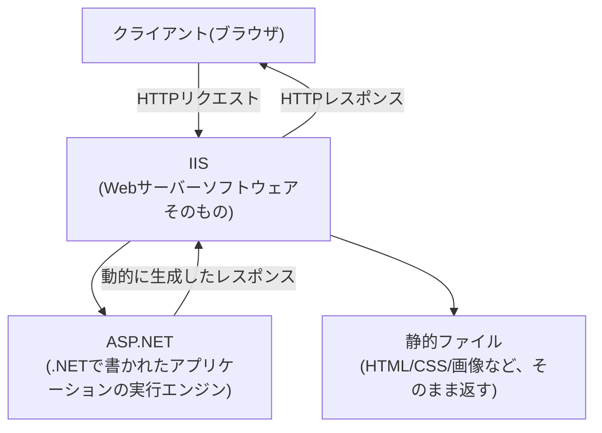
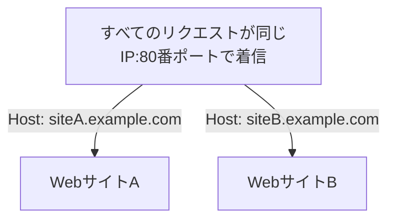

## はじめに

- **この記事で得られること**: Windows Serverの役割として追加する**IIS(Internet Information Services)**と、その上で動く**ASP.NET**が、それぞれ何を担っているソフトウェアなのかを整理します。あわせて、IISマネージャーを開くと必ず表示される**Default Web Site**の正体、複数のWebサイトを1台のサーバーで運用する際に必要な**バインド設定**、そして**HTTP応答ヘッダー**の追加・変更の仕組みまでを体系的に理解します。
- **対象読者**: IISサーバーの構築・運用に携わったことはあるものの、IISとASP.NETの役割分担や、バインド設定が何を制御しているのかを具体的に説明できない方を想定しています。
- **読むのにかかる想定時間**: 約18分

この記事は[『上位1%』シリーズ 全記事ガイド](/sitemap)の一部、[Windows Server運用シリーズ](/sitemap#シリーズ一覧)の3本目です。

## 前提知識

- **HTTP**: クライアント(ブラウザなど)がサーバーへリクエストを送り、サーバーがレスポンスを返す、Webの基本的な通信プロトコルです。詳しくは[RESTful APIとは何か?『上位1%』の視点で理解する](/articles/restful-api-guide)を参照してください。

## 全体像をつかむ

### IISとASP.NETの役割分担

**IIS(Internet Information Services)は、HTTPリクエストを受け付けて処理する「Webサーバーソフトウェアそのもの」です。ASP.NETは、そのIISという土台の上で動く「動的なWebアプリケーションを実行するためのフレームワーク」の1つ**です。

**IISは、あくまでHTTPというプロトコルを受け付ける汎用的な土台であり、その上で実行するアプリケーションの種類自体には依存しません。** ASP.NETはIIS上で動く代表的な実行エンジンの1つですが、PHPやその他の言語向けのモジュールをIIS上に組み込むことも可能です。**「IIS=Webサーバー」「ASP.NET=そのWebサーバー上で動く、.NET向けアプリケーション実行の仕組み」という役割の違い**を区別しておくことが、以降の理解の土台になります。

## 基礎から徹底解説

### IISの内部構成:HTTP.sys・アプリケーションプール・ワーカープロセス

IISの内部は、大きく3つの要素で構成されています。

| 構成要素 | 役割 |
|---|---|
| **HTTP.sys** | Windowsカーネルモードで動作する、HTTPリクエストの受信を担うコンポーネントです。ポート80・443番などを実際に監視し、受信したリクエストを適切なアプリケーションプールへ振り分けます。 |
| **アプリケーションプール** | 複数のWebサイト・アプリケーションを、プロセスレベルで分離するための「箱」です。1つのアプリケーションプールに異常(クラッシュ、メモリリークなど)が発生しても、別のアプリケーションプールで動いている他のWebサイトには影響しません。 |
| **ワーカープロセス(w3wp.exe)** | 実際にアプリケーションのコード(ASP.NETなど)を実行する、ユーザーモードのプロセスです。各アプリケーションプールごとに、専用のワーカープロセスが起動します。 |

**この3層構造のうち、アプリケーションプールによる分離が、実務上とくに重要な設計要素**です。複数のWebアプリケーションを1台のIISサーバーで運用する場合、それぞれを別々のアプリケーションプールに割り当てておくことで、1つのアプリケーションの不具合が他のアプリケーション全体を巻き込んで停止させてしまう事態を防げます。

### Default Web Siteとは何か

IISの役割をインストールすると、既定で**Default Web Site**という名前のWebサイトエントリが自動的に作成されます。これは、**IISが最初から持っている「最初のWebサイト」の枠**であり、既定ではポート80(HTTP)にバインドされ、物理パスとして`%SystemDrive%\inetpub\wwwroot`(通常`C:\inetpub\wwwroot`)を参照するよう構成されています。

実務では、**このDefault Web Siteをそのまま使って小規模なサイトを運用する構成もあれば、独自のWebサイトを新規に作成し、Default Web Site自体は停止・削除してしまう構成もあります。** Default Web Siteは特別な予約された仕組みではなく、あくまで「最初から用意されている、通常のWebサイトエントリの1つ」に過ぎないため、要件に応じて自由に停止・削除・変更して構いません。

### バインド設定:1台のサーバーで複数のWebサイトを振り分ける仕組み

1台のIISサーバーで複数のWebサイトを同時にホストする場合、**HTTP.sysが受信したリクエストを、どのWebサイトへ振り分けるべきかを判断するための設定が「バインド」**です。バインドは、次の3つの要素の組み合わせで定義されます。

- **IPアドレス**: 特定のIPアドレス宛のリクエストだけを受け付けるか、すべてのIPアドレスを受け付けるか。
- **ポート番号**: HTTPであれば80番、HTTPSであれば443番が一般的ですが、任意のポート番号を指定できます。
- **ホスト名(Hostヘッダー)**: HTTPリクエストに含まれる`Host`ヘッダーの値によって、同じIPアドレス・ポート番号であっても、異なるWebサイトへ振り分けることができます。

**同じIPアドレス・同じポート番号であっても、ホスト名が異なれば別々のWebサイトとして振り分けられる**という、いわゆる**名前ベースの仮想ホスティング**が、複数サイトを1台のサーバーに集約する際の基本的な仕組みです。

HTTPSにおけるホスト名ベースの振り分け(SNI)

HTTPの場合、`Host`ヘッダーは暗号化されていないリクエストの中に含まれているため、単純にその値を見て振り分けられます。一方HTTPSの場合、TLSによる暗号化のハンドシェイクが完了する前に、どの証明書を提示すべきかを決める必要があるという課題があり、これは**SNI(Server Name Indication)**という、TLSハンドシェイクの初期段階でクライアントが希望するホスト名を平文で伝える拡張機能によって解決されています。現在のIISは、このSNIに対応しており、1つのIPアドレス・ポートで複数の異なる証明書を持つHTTPSサイトを同時にホストできます。

### HTTP応答ヘッダーの追加・変更

IISマネージャーでは、Webサイト単位・アプリケーション単位で、**HTTPレスポンスに含めるカスタムヘッダーを追加・変更**できます。これはアプリケーションのコード内で明示的にヘッダーを設定する方法とは別の、**IIS側の設定だけで実現できる仕組み**です。

代表的な用途には、次のようなものがあります。

- **セキュリティ関連ヘッダーの追加**: `X-Frame-Options`(クリックジャッキング対策)、`Strict-Transport-Security`(HTTPS通信の強制)など、セキュリティを強化するためのヘッダーを、アプリケーションのコードを変更せずにIIS側の設定だけで一括追加できます。
- **サーバー識別情報の変更・削除**: 既定でレスポンスに含まれる`Server`ヘッダー(使用しているサーバーソフトウェアの種類やバージョンを示す情報)を、セキュリティ上の理由(攻撃者に手がかりを与えないため)から変更・削除する設定です。

## プロが見ている視点(上位1%の理解)

### アプリケーションプールの分離設計が実務上重要な理由

複数のWebアプリケーションを、深く考えずに同じアプリケーションプールへまとめてしまうと、**1つのアプリケーションのメモリリークやクラッシュが、そのプール全体(=そこに割り当てられた他のすべてのアプリケーション)を巻き込んで停止させてしまうリスク**があります。実務では、**重要度や更新頻度が異なるアプリケーションは、原則として別々のアプリケーションプールへ分離しておく**ことが、可用性の観点から推奨されるベストプラクティスです。

### バインド設計と証明書管理の実務上の注意点

複数のHTTPSサイトを1台のIISサーバーに集約する場合、SNIによってホスト名ベースの振り分けが可能になっている一方で、**証明書の有効期限やホスト名の管理が、サイトの数に比例して煩雑になっていく**という運用上の課題があります。証明書の更新作業を一元管理する仕組み(自動更新ツールの導入など)を、サイト数が増える前の段階から検討しておくことが実務上重要です。

## よくある誤解・つまずきポイント

- **誤解1: 「IISとASP.NETは同じものを指す別名である」**
  IISはHTTPリクエストを受け付けるWebサーバーソフトウェアそのもの、ASP.NETはその上で動く.NET向けのアプリケーション実行フレームワークであり、明確に異なるレイヤーです。
- **誤解2: 「Default Web Siteは、システムの動作に必須の特別な存在であり、削除してはいけない」**
  Default Web Siteは、最初から用意されている通常のWebサイトエントリの1つに過ぎません。要件に応じて自由に停止・削除・変更して構いません。
- **誤解3: 「HTTP応答ヘッダーは、アプリケーションのコードの中でしか設定できない」**
  IISマネージャーの設定だけで、Webサイト・アプリケーション単位のカスタムHTTP応答ヘッダーを追加・変更できます。

## 障害・トラブルシューティングの視点

IIS関連の問題は、**「バインドの設定に起因する問題か、アプリケーションプールの分離設計に起因する問題か」を切り分ける**のが基本です。

1. **新しいWebサイトを追加しようとしたら、バインドの競合エラーが発生した**: 同じIPアドレス・ポート番号・ホスト名の組み合わせを、既に別のWebサイトが使用していないかを確認します。
2. **1つのアプリケーションの不具合で、他のアプリケーションまで停止してしまった**: それらのアプリケーションが同じアプリケーションプールに割り当てられていないかを確認し、必要に応じて分離します。
3. **HTTPSサイトで、意図しない証明書が提示される**: SNIの設定と、各バインドに割り当てられている証明書の対応関係を確認します。

### 予防策・恒久対策

- 重要度・更新頻度が異なるアプリケーションは、原則として別々のアプリケーションプールへ分離する。
- 複数サイトを運用する環境では、証明書の有効期限管理を一元化する仕組みを早い段階から導入する。
- セキュリティ関連のHTTP応答ヘッダー(X-Frame-Options、Strict-Transport-Securityなど)を、IIS側の設定でサイト単位に統一して適用する。

## まとめ

- IISはHTTPリクエストを受け付けるWebサーバーソフトウェアそのもの、ASP.NETはその上で動く.NET向けのアプリケーション実行フレームワークであり、明確に異なるレイヤーです。
- IISはHTTP.sys・アプリケーションプール・ワーカープロセスという3層構造で構成され、アプリケーションプールによる分離が可用性の観点で重要な設計要素です。
- Default Web Siteは特別な予約された仕組みではなく、最初から用意されている通常のWebサイトエントリの1つです。
- バインド設定は、IPアドレス・ポート番号・ホスト名の組み合わせによって、1台のサーバー上の複数のWebサイトへリクエストを振り分ける仕組みです。

**今日から意識すべきこと**
1. IISとASP.NETという用語に出会ったら、Webサーバーそのものとアプリケーション実行フレームワークという、異なるレイヤーを指していることを意識しましょう。
2. 複数のWebアプリケーションを1台のIISサーバーで運用する際は、アプリケーションプールの分離設計を最初から検討しましょう。

## 参考文献

- [Introduction to IIS Architecture | Microsoft Learn](https://learn.microsoft.com/en-us/iis/get-started/introduction-to-iis/introduction-to-iis-architecture)
- [ASP.NET Core Module overview | Microsoft Learn](https://learn.microsoft.com/en-us/aspnet/core/host-and-deploy/iis/aspnet-core-module)
- [Configure Websites in IIS | Microsoft Learn](https://learn.microsoft.com/en-us/iis/manage/configuring-security/understanding-sites-applications-and-virtual-directories-on-iis)
- [Transport Layer Security (TLS) Extensions: Extension Definitions | RFC 6066 (SNI)](https://datatracker.ietf.org/doc/html/rfc6066)
