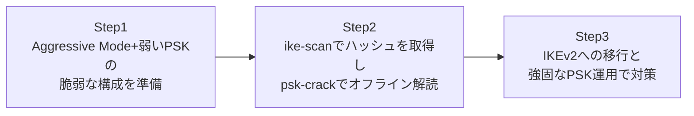

## はじめに

- **この記事で得られること**: [L2TP/IPsecの仕組みを『上位1%』の視点で理解する](/articles/l2tp-ipsec-guide)で扱ったIKEフェーズ1に、**Aggressive Mode**という、Main Modeより通信回数を減らした古いモードが存在します。この記事では、Aggressive Modeと弱い事前共有鍵(PSK)を組み合わせた設定が、なぜオフラインの辞書攻撃を成立させてしまうのかを、実際に安全な検証環境で再現します。
- **対象読者**: IKEのPSK認証の基本的な仕組みは理解しているが、それが実際にどう悪用されうるのか、攻撃者側の視点を体験したことがない方を想定しています。**このハンズオンは、自分が管理する検証環境の防御力を高めるための、教育・防御目的のものです。実運用中の他者の環境に対して、許可なくこの手順を実行しないでください。**
- **読むのにかかる想定時間**: 約30分

この記事は[『上位1%』シリーズ 全記事ガイド](/sitemap)の一部です。

## 前提知識

- **IKE(Internet Key Exchange)とPSK認証**: [L2TP/IPsecの仕組み](/articles/l2tp-ipsec-guide)で扱った、IKEフェーズ1が暗号鍵の合意と相手認証を行うという役割を前提とします。
- **Main ModeとAggressive Modeの違い**: Main Modeは6往復のメッセージで身元情報を暗号化してからやり取りしますが、Aggressive Modeは3往復に短縮する代わりに、身元情報を暗号化せずに送ります。

## 全体像をつかむ



## ハンズオン手順

### Step 1: 脆弱な構成(Aggressive Mode+弱いPSK)を準備する

検証用のstrongSwanサーバーに、Aggressive Modeを許可し、辞書に含まれる程度の弱いPSKを設定します。

```
# /etc/ipsec.conf
conn vulnerable-ike
    left=%defaultroute
    right=%any
    authby=secret
    aggressive=yes
    ike=aes256-sha256-modp2048!
    keyexchange=ikev1
```

```
# /etc/ipsec.secrets
%any %any : PSK "Summer2024!"
```

**このPSKは、`Summer2024!`という、辞書攻撃で突破されうる程度の強度しかありません。** 多くの現場で、拠点間VPNの初期構築時に設定されたPSKが、長年見直されないまま放置されがちです。

### Step 2: ike-scanでハッシュを取得し、psk-crackでオフライン解読する

攻撃者側のマシンに、`ike-scan`をインストールします。

```bash
sudo apt install -y ike-scan
```

Aggressive Modeで接続を試み、サーバーからの応答(ハッシュを含む)を取得します。

```bash
sudo ike-scan -M -A --id=vpnuser <サーバーのIPアドレス> --pskcrack=hash.txt
```

**Aggressive Modeでは、この最初の応答の中に、PSKから導出されたハッシュ値が、暗号化されずに含まれています。** Main Modeであれば、この身元情報とハッシュは、事前に確立された暗号鍵で保護されるため、この段階では取得できません。

取得したハッシュに対して、`psk-crack`で辞書攻撃を仕掛けます。

```bash
psk-crack -d /usr/share/dict/words hash.txt
```

**辞書に含まれる単語であれば、比較的短時間で、`Summer2024!`というPSKそのものが解読されます。** この攻撃は、サーバー側に一切追加の通信を発生させない、完全にオフラインの計算処理であるため、アカウントロックアウトのような防御機構の対象にもなりません。

### Step 3: IKEv2への移行と、強固なPSK運用で対策する

この問題への根本的な対策は、Aggressive Mode自体を無効化することです。

```
# /etc/ipsec.conf
conn hardened-ike
    left=%defaultroute
    right=%any
    authby=secret
    keyexchange=ikev2
```

**IKEv2には、そもそもAggressive Modeに相当する、身元情報を先出しする短縮モードが存在しません。** [L2TP/IPsecと現代的なVPNプロトコルを『上位1%』の視点で比較する](/articles/vpn-protocols-comparison-guide)で扱った通り、IKEv2はMain Modeと同等以上の保護を、より少ない往復回数で実現する設計になっています。あわせて、`Summer2024!`のような辞書に載る単語ではなく、ランダムに生成された長大な文字列をPSKに使うことも、有効な追加対策です。

## プロが見ている視点(上位1%の理解)

### Aggressive Modeが今も使われ続けている理由と、そのリスク

Aggressive ModeがMain Modeより脆弱であることは、IKEの仕様上、以前から広く知られています。**それでもなお現場で使われ続けている最大の理由は、リモートアクセスVPNのクライアントが動的IPアドレスを持つ場合、Main Modeでは相手のIPアドレスをキーにしてPSKを検索する仕組みと相性が悪く、Aggressive Modeの「相手のID(IPアドレスではない識別子)を先に受け取ってからPSKを決定する」という順序が、運用上必要とされてきたためです。** ただし、拠点間VPNのように双方のIPアドレスが固定されている構成では、この制約自体が存在しないため、**Aggressive Modeを使う実務上の必然性は、ほとんどのケースで存在しません。** 拠点間VPNの構成でAggressive Modeが有効になっている場合は、それだけで見直すべき設定である、と理解しておく必要があります。

### 「PSKが漏洩していない」ことと「PSKが解読できない」ことは別問題

このハンズオンで再現した攻撃は、PSKそのものが漏洩・流出したわけではなく、**正規のプロトコルのやり取りの中で、正当な手順に従って取得できる情報だけから、オフラインで解読された**という点が重要です。「PSKは誰にも教えていないから安全」という考え方は、Aggressive Modeが有効な環境では通用しません。ハッシュを取得すること自体を防ぐ(=Aggressive Modeを無効化する)か、取得されても解読に現実的な時間がかかる強度までPSKを強化するか、のどちらか(理想的には両方)が必要です。

## よくある誤解・つまずきポイント

- **誤解1: 「PSK認証は、証明書認証より本質的に脆弱な方式である」**
  脆弱性の本質はPSK認証自体ではなく、Aggressive Modeという身元情報を先出しするモードと、弱いPSKの組み合わせにあります。IKEv2+強固なPSKであれば、実務上十分な強度を確保できます。
- **誤解2: 「この攻撃には、サーバーへの継続的な不正アクセスが必要である」**
  ハッシュの取得は正規のプロトコルのやり取りの範囲内で完了し、その後の解読作業は完全にオフラインで行われるため、サーバー側への追加の通信は発生しません。
- **誤解3: 「Aggressive Modeを無効化すれば、PSKの強度は気にしなくてよい」**
  Aggressive Modeの無効化は有効な対策ですが、PSK自体の強度を高めることも、多層防御の観点から独立して重要です。

## 障害・トラブルシューティングの視点

1. **拠点間VPNの構成で、Aggressive Modeが必要かどうか判断したい**: 双方のIPアドレスが固定されているかを確認します。固定されていれば、Aggressive Modeを使う必然性は通常ありません。
2. **既存のPSKの強度を確認したい**: `psk-crack`のような辞書攻撃ツールで、実際に解読を試みることで、現実的な強度を確認できます。
3. **IKEv2への移行時に、クライアント側で接続できなくなった**: クライアント側の実装がIKEv2に対応しているか、`keyexchange=ikev2`の設定が双方で一致しているかを確認します。

## まとめ

- IKEv1のAggressive Modeは、身元情報とPSKから導出されたハッシュを暗号化せずに送るため、`ike-scan`のようなツールで取得できてしまいます。
- 取得したハッシュに対する`psk-crack`のようなオフライン辞書攻撃は、サーバー側への追加通信を必要とせず、防御機構の対象にもなりません。
- 根本的な対策は、Aggressive Mode自体を無効化する(IKEv2へ移行する)ことと、PSKを辞書に載らない強度まで強化することの組み合わせです。

**今日から意識すべきこと**
1. 拠点間VPNの構成で、Aggressive Modeが有効になっていないかを棚卸ししましょう。
2. 双方のIPアドレスが固定されている構成では、Aggressive Modeを使う必然性がないことを前提に、設定を見直しましょう。

## 参考文献

- [ike-scan | Kali Tools](https://www.kali.org/tools/ike-scan/)
- [strongSwan Documentation: IKEv1 vs IKEv2](https://docs.strongswan.org/docs/latest/features/ikev1.html)
