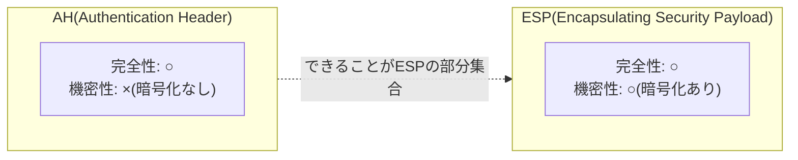
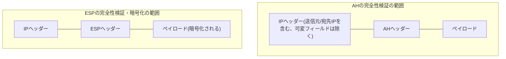
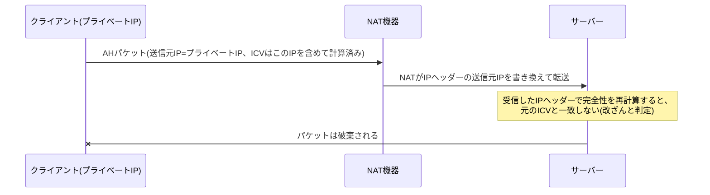

## はじめに

- **この記事で得られること**: [L2TP/IPsecの仕組みを『上位1%』の視点で理解する](/articles/l2tp-ipsec-guide)で扱ったESP(Encapsulating Security Payload)に加えて、IPsecにはもう1つ<strong>AH(Authentication Header)</strong>というプロトコルが存在します。この記事では、AHが何を保護する仕組みなのか、ESPと何が違うのか、AHが暗号化機能を持たないという設計が特定の国の輸出規制と関係していると言われる理由、そしてAHが現在の実務でほとんど使われず、NAT環境と決定的に相性が悪い理由までを体系的に理解します。
- **対象読者**: IPsecはESPを中心に理解しているものの、AHというプロトコルが具体的に何をしているのか、なぜ実務で見かけないのかを説明できない方を想定しています。
- **読むのにかかる想定時間**: 約16分

この記事は[『上位1%』シリーズ 全記事ガイド](/sitemap)の一部、[リモートアクセスVPN/L2TP・IPsecシリーズ](/sitemap#シリーズ一覧)の発展編です。[L2TP/IPsecの仕組みを『上位1%』の視点で理解する](/articles/l2tp-ipsec-guide)でのESP・NATトラバーサルの説明を前提にしています。

## 前提知識

- **ESP(Encapsulating Security Payload)**: IPsecでデータの暗号化と改ざん検知を行うプロトコルです。詳しくは[L2TP/IPsecの仕組みを『上位1%』の視点で理解する](/articles/l2tp-ipsec-guide)を参照してください。
- **完全性(Integrity)と機密性(Confidentiality)**: 完全性は「データが送信時から改ざんされていないことを検証できる」性質、機密性は「データの内容を第三者に読み取られないようにする(暗号化する)」性質です。この2つは別々の要件であり、片方だけを提供する仕組みも存在します。

## 全体像をつかむ

### 一言で言うと

**AH(Authentication Header)は、IPパケットに「完全性(改ざんされていないことの証明)」だけを付与するプロトコルであり、ESPと違って機密性(暗号化)の機能を一切持ちません。** この「暗号化しない」という設計こそが、AHという存在の本質であり、後述する歴史的な経緯と、現在ほぼ使われない理由の両方に直結しています。

## 基礎から徹底解説

### AHが保護する範囲:IPヘッダーそのものまで含む

AHとESPの最大の違いは、暗号化の有無だけではありません。**AHは、ペイロード(データ本体)だけでなく、IPヘッダーの大部分(送信元・宛先IPアドレスを含む)までを完全性検証の対象に含める**という点が、ESPとの構造的な違いです。

AHは、認証データ(ICV、Integrity Check Value)を計算する際に、IPヘッダーのうち、経路上のルーターによって書き換えられうる可変フィールド(TTLなど)を除いた部分を計算対象に含めます。これにより、**IPアドレスなどのヘッダー情報自体が途中で改ざんされていないことまで保証できる**という、ESPにはない強みを持ちます。一方でこの強みこそが、後述するNATとの深刻な相性の悪さの直接的な原因になります。

### AHのヘッダー構造

AHは、IPヘッダーの直後に挿入される、次のようなフィールドを持つヘッダーです。

| フィールド | 内容 |
|---|---|
| Next Header | AHの後に続くプロトコル(TCP、UDP、あるいはトンネルモードの場合は内側のIPヘッダーなど)を示す |
| Payload Length | AHヘッダー自体の長さ |
| SPI(Security Parameters Index) | どのセキュリティアソシエーション(SA、暗号鍵や設定の組)を使っているかを識別する値 |
| Sequence Number | リプレイ攻撃(同じパケットを再送して不正に処理させる攻撃)を検知するための連番 |
| Authentication Data(ICV) | 前述の完全性検証の対象範囲から計算された、改ざん検知用のハッシュ値 |

**Sequence Numberによるリプレイ攻撃対策の仕組みはESPとまったく同じ**であり、AHとESPは「認証データの計算対象範囲」と「暗号化の有無」という2点だけが本質的に異なります。

## プロが見ている視点(上位1%の理解)

### なぜAHには暗号化機能がないのか:輸出規制という歴史的経緯

AHが意図的に暗号化機能を持たない設計になっている背景には、**1990年代当時の暗号技術に対する各国の輸出・輸入規制**という歴史的な事情があります。

当時、強力な暗号技術は軍事技術と同様に扱われ、<strong>「デュアルユース(軍民両用)技術」</strong>として輸出管理の対象とされていました(米国の輸出管理規則や、複数国が参加するワッセナー・アレンジメントなど)。暗号化機能を持つ製品は、輸出先の国によっては輸入・使用自体が規制されたり、輸出する側の国でも許可申請や強度の制限が必要になったりする状況がありました。政府による通信の監視能力が、強力な暗号の普及によって損なわれることへの懸念が、この規制の背景にあったとされています。

**AHは、完全性(改ざん検知)だけを提供し、通信内容そのものを秘匿する機密性の機能を持たない**ため、こうした暗号輸出規制の対象になりにくいという特性がありました。「通信内容は誰でも読めるが、途中で改ざんされていないことだけは保証する」という性質は、政府の監視能力を損なわないという理屈が立ちやすく、**暗号化(ESP)を使えない、あるいは使うことが難しい国や組織でも、完全性の保護だけは実現できる手段**として、AHには一定の存在意義があったわけです。

現在ではこの規制自体の重要性は下がっている

2000年前後から、多くの国で暗号輸出規制は大幅に緩和されました(市販されている一般的な暗号技術については、ワッセナー・アレンジメントの規制対象から除外される取り扱いが広がったことなどが背景にあります)。したがって、**「暗号化機能を持たないことが規制回避に有利」という当時の事情は、現在ではほとんど意味を持たなくなっています。** この歴史的な経緯は、AHという設計判断の"生まれた理由"を理解する上では重要ですが、現在AHを選定する理由としては通用しない、という点を押さえておく必要があります。

### なぜAHは現在ほとんど使われないのか:NATとの決定的な相性の悪さ

暗号輸出規制という歴史的制約が緩和された現在でも、AHが実務でほとんど使われない、より直接的で決定的な理由が**NAT(Network Address Translation)との相性の悪さ**です。

[NAT/NAPTの仕組みを『上位1%』の視点で理解する](/articles/nat-guide)で扱った通り、NATは通過するパケットの**IPヘッダーの送信元(または宛先)IPアドレスを書き換える**ことで機能します。しかし、AHは前述の通り、**IPヘッダーの内容(送信元・宛先IPアドレスを含む)そのものを完全性検証の対象に含めています。** NAT機器がAHパケットのIPヘッダーを書き換えてしまうと、受信側で計算する完全性検証用のハッシュ値と、送信側が計算して埋め込んだハッシュ値が一致しなくなり、**AHパケットは改ざんされたものと判定され、破棄されてしまいます。**

この問題は、ESPが[L2TP/IPsecの仕組みを『上位1%』の視点で理解する](/articles/l2tp-ipsec-guide)で扱った<strong>NAT-T(NATトラバーサル)</strong>によって(UDPでカプセル化し、ESPの完全性検証の対象からIPヘッダー自体を除外することで)解決できたのに対し、**AHの完全性検証はIPヘッダーそのものを対象に含めるという設計そのものが、この種の回避策と原理的に相容れません。** NATが極めて広く普及している現在のネットワーク環境において、この制約は決定的です。

ESPだけで、AHが提供していた完全性も実現できるのか

「AHがなくなると、IPヘッダーまで含めた完全性保護ができなくなって困るのでは」と思うかもしれませんが、実務上はほとんど問題になりません。**ESPは、暗号化アルゴリズムを"NULL"(暗号化なし)に設定した上で、完全性検証の機能だけを有効にする、という構成が可能**です(ESP-NULLと呼ばれます)。これにより、「機密性は不要だが完全性だけは欲しい」という、AHが本来満たしていた需要にも、ESPの枠組みの中で対応できます。ESPの完全性検証はAHと異なり外側のIPヘッダー全体を対象に含めないため、NAT環境でも問題になりません。**つまり、AHが提供していた機能的な価値は、ESPの一構成(ESP-NULL)によって代替可能であり、NATに弱いという欠点だけが残るAHを積極的に選ぶ理由は実務上ほぼ存在しません。**

## よくある誤解・つまずきポイント

- **誤解1: 「AHはESPより古い、単なる旧式のプロトコルである」**
  AHとESPはどちらもIPsecの一部として現在も規格上は現役のプロトコルです。「古い」というより、**保護する範囲と機密性の有無という設計思想が異なる、別の用途を意図したプロトコル**という理解が正確です。
- **誤解2: 「AHはESPより暗号化強度が低いだけで、基本的な機能は同じ」**
  AHは暗号化機能を一切持ちません。「強度が低い暗号化」ではなく、**そもそも暗号化(機密性)という機能自体が存在しない**という点が本質的な違いです。
- **誤解3: 「AHを使えばNAT環境でも問題なく通信できる」**
  AHはIPヘッダー自体を完全性検証の対象に含めるため、NATによるIPヘッダーの書き換えと構造的に相容れません。ESPのNAT-Tのような回避策も、AHの設計上は成立しません。

## 障害・トラブルシューティングの視点

AHに関連するトラブルは、**現在ではAHそのものを新規に選定するケースがまれである**ため、主に「歴史的な経緯のある構成が残っている場合」や「教材・試験対策として登場した場合」の理解として扱うのが実務的です。

1. **既存の構成でAHが使われており、NAT環境下で接続が確立できない**: 前述の通り、AHとNATは構造的に相性が悪いため、可能であればESP(必要であればESP-NULL)への移行を検討します。
2. **完全性だけを保証したい要件が出てきた**: AHの選定ではなく、ESPを暗号化アルゴリズムNULLで構成することで、NAT環境にも対応しつつ要件を満たせます。

### 予防策・恒久対策

- 新規にIPsec構成を設計する際は、特別な要件がない限りAHではなくESPを選定する。
- 完全性のみが必要な要件であっても、ESP-NULLという選択肢を検討し、NAT環境との互換性を確保する。

## まとめ

- AHは完全性(改ざん検知)だけを提供し、機密性(暗号化)の機能を一切持たないプロトコルです。
- AHはIPヘッダー自体(送信元・宛先IPアドレスを含む)までを完全性検証の対象に含める点が、ESPとの構造的な違いです。
- AHが暗号化機能を持たない設計は、1990年代の暗号輸出規制を回避しやすくするという歴史的な事情によるものですが、現在ではこの事情自体の重要性は下がっています。
- AHがIPヘッダー自体を検証対象に含める設計は、NATによるIPヘッダーの書き換えと構造的に相容れず、これが現在AHがほとんど使われない決定的な理由です。ESP-NULLによって、AHが提供していた完全性のみという要件も代替できます。

**今日から意識すべきこと**
1. IPsecでAHという用語に出会ったら、「完全性だけを提供し機密性を持たない」という点と、「NATと構造的に相性が悪い」という2点をセットで思い出しましょう。
2. 完全性のみが必要な要件に遭遇したら、AHではなくESP-NULLという選択肢を検討しましょう。

## 参考文献

- [IP Authentication Header | RFC 4302](https://datatracker.ietf.org/doc/html/rfc4302)
- [IP Encapsulating Security Payload (ESP) | RFC 4303](https://datatracker.ietf.org/doc/html/rfc4303)
- [Security Architecture for the Internet Protocol | RFC 4301](https://datatracker.ietf.org/doc/html/rfc4301)
- [Wassenaar Arrangement on Export Controls for Conventional Arms and Dual-Use Goods and Technologies](https://www.wassenaar.org/)
