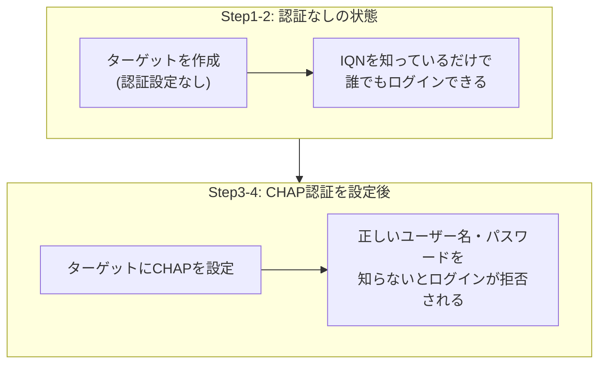

## はじめに

- **この記事で得られること**: [iSCSIの仕組み](/articles/iscsi-guide)で学んだ、イニシエーターとターゲットという関係を前提に、**何も設定しなければ、ターゲットのIQNさえ知っていれば誰でもログインを許可してしまう**という、認証不在の危険性を、安全な検証環境の中だけで再現し、**CHAP認証**を設定することで、正しいユーザー名とパスワードを知らない相手のログインを拒否できることを確認します。
- **対象読者**: [iSCSIの仕組み](/articles/iscsi-guide)を理解したものの、iSCSIのアクセス制御が、具体的にどういう設定によって実現されているのかを説明できない方を想定しています。
- **重要な注意**: **このハンズオンは、自分が管理する検証環境の防御力を高めるための、教育・防御目的のものです。** 実運用中の他者の環境に対して、許可なくこの手順を実行しないでください。本記事で使う検証環境は、自分自身で用意したサーバーに対してのみ通信を送るものであり、第三者のシステムへの攻撃手順は一切含まれていません。
- **読むのにかかる想定時間**: 約25分(ハンズオン実施込み)

この記事は[『上位1%』シリーズ 全記事ガイド](/sitemap)の一部、[ストレージ基礎シリーズ](/sitemap#シリーズ一覧)の12本目です。[ハンズオン準備マニュアル](/articles/handson-prep-guide)で作成したUbuntu Server環境が1台あれば実施できます。

## 前提知識

- **iSCSIの基本的な仕組み**: [iSCSIの仕組み](/articles/iscsi-guide)で扱った、イニシエーター・ターゲット・IQNという用語です。

## 全体像をつかむ

このハンズオンでは、同じ1台のサーバー上で、iSCSIターゲットとイニシエーターの両方を動かし、次の2段階を確認します。



## ハンズオン手順

### Step 1: 認証設定なしのiSCSIターゲットを作成する

```bash
sudo apt install -y tgt open-iscsi
sudo dd if=/dev/zero of=/disk-iscsi.img bs=1M count=100
sudo tgtadm --lld iscsi --mode target --op new --tid 1 -T iqn.2026-11.test.example:storage.disk01
sudo tgtadm --lld iscsi --mode logicalunit --op new --tid 1 --lun 1 -b /disk-iscsi.img
sudo tgtadm --lld iscsi --mode target --op bind --tid 1 -I ALL
```

**`-I ALL`という指定は、「どのIPアドレスからの接続でも許可する」という意味であり、ユーザー名やパスワードによる認証は、まだ一切設定していません。**

### Step 2: 認証なしで、イニシエーター側からログインできることを確認する

```bash
sudo iscsiadm -m discovery -t sendtargets -p 127.0.0.1
sudo iscsiadm -m node -T iqn.2026-11.test.example:storage.disk01 -p 127.0.0.1 --login
```

**実行結果:**

```
Logging in to [iface: default, target: iqn.2026-11.test.example:storage.disk01, portal: 127.0.0.1,3260]
Login to [iface: default, target: iqn.2026-11.test.example:storage.disk01, portal: 127.0.0.1,3260] successful.
```

**ユーザー名もパスワードも、一切入力していないにもかかわらず、ログインに成功しました。** これは、[iSCSIの仕組み](/articles/iscsi-guide)で学んだ、IQNという識別子が、**「通信相手を区別するための名前」であって、「本人確認のための認証情報」ではない**ことを、具体的に示しています。**同じネットワークに接続でき、ターゲットのIQNを知っている相手であれば、誰でもこのストレージの中身を読み書きできてしまう**、という状態です。

<details>
<summary>なぜIQNだけでは、本人確認にならないのか</summary>

[iSCSIの仕組み](/articles/iscsi-guide)で学んだとおり、**IQNは、IPアドレスの変化に関わらず、通信相手を一意に識別し続けるための識別子**でした。しかし、識別子であることと、認証情報であることは、まったく別の性質です。**IQNは、ネットワークの通信内容を覗き見れば、誰でも知ることができる、公開情報に近いものです。** パスワードのように、本人だけが知っている秘密の情報ではないため、IQNを知っているという事実だけでは、相手が正当なイニシエーターであることを、何も証明できません。

</details>

### Step 3: ログアウトし、CHAP認証を設定する

```bash
sudo iscsiadm -m node -T iqn.2026-11.test.example:storage.disk01 -p 127.0.0.1 --logout
sudo tgtadm --lld iscsi --mode account --op new --user tgtuser --password tgtpass12345
sudo tgtadm --lld iscsi --mode target --op bind --tid 1 -I ALL
sudo tgtadm --lld iscsi --mode account --op bind --tid 1 --user tgtuser
```

**これで、ターゲット側は、「tgtuserという名前と、対応するパスワードを提示した相手だけ」を、正当な接続として受け入れるようになりました。** これが「**CHAP**(Challenge-Handshake Authentication Protocol)」認証です。

### Step 4: 認証情報なしでのログインが拒否されることを確認する

```bash
sudo iscsiadm -m node -T iqn.2026-11.test.example:storage.disk01 -p 127.0.0.1 --login
```

**実行結果:**

```
iscsiadm: Could not login to [iface: default, target: iqn.2026-11.test.example:storage.disk01, portal: 127.0.0.1,3260].
iscsiadm: initiator reported error (24 - iSCSI login failed due to authorization failure)
```

**先ほどとは違い、ログインが拒否されました。** 続いて、正しいユーザー名とパスワードを、イニシエーター側に設定してから、再度ログインします。

```bash
sudo iscsiadm -m node -T iqn.2026-11.test.example:storage.disk01 -p 127.0.0.1 \
  -o update -n node.session.auth.authmethod -v CHAP
sudo iscsiadm -m node -T iqn.2026-11.test.example:storage.disk01 -p 127.0.0.1 \
  -o update -n node.session.auth.username -v tgtuser
sudo iscsiadm -m node -T iqn.2026-11.test.example:storage.disk01 -p 127.0.0.1 \
  -o update -n node.session.auth.password -v tgtpass12345
sudo iscsiadm -m node -T iqn.2026-11.test.example:storage.disk01 -p 127.0.0.1 --login
```

**実行結果:**

```
Login to [iface: default, target: iqn.2026-11.test.example:storage.disk01, portal: 127.0.0.1,3260] successful.
```

**正しいユーザー名とパスワードを提示した場合だけ、ログインに成功しました。** Step 2で確認した、「IQNを知っているだけで誰でもログインできる」という危険な状態が、CHAP認証の設定によって、具体的に防がれたことが確認できました。

## プロが見ている視点(上位1%の理解)

### 「デフォルトの設定が、常に安全であるとは限らない」という前提を持つ

このハンズオンの最大の教訓は、**tgtadmでターゲットを作成しただけの初期状態では、認証という防御が、一切有効になっていない**という点です。**多くのストレージ・ネットワーク機器のデフォルト設定は、「まず動作させること」を優先しており、「安全に動作させること」を、利用者が追加で設定する前提になっていることが珍しくありません。** これは、[SMB1のような古いプロトコルが、デフォルトで無効化されるようになった](/articles/windows-server-smb1-hardening-handson-guide)背景とも共通する発想です。**新しい機器やサービスを導入する際には、「初期設定のまま使って問題ないか」を、毎回明示的に確認する習慣**が、上位1%のエンジニアには求められます。

## よくある誤解・つまずきポイント

- **誤解1: 「IQNを知っていることは、本人確認の手段として十分である」**
  IQNは、通信相手を識別するための名前であり、パスワードのような秘密の認証情報ではありません。ネットワークを覗き見れば、誰でも知ることができます。
- **誤解2: 「iSCSIターゲットを作成すれば、自動的に認証が有効になる」**
  `tgtadm`でターゲットを作成しただけの状態では、認証は一切設定されておらず、IQNを知っている全員に接続が許可されています。
- **誤解3: 「CHAP認証を設定すれば、通信内容そのものも暗号化される」**
  CHAP認証は、接続時の本人確認の仕組みであり、ログイン後の実際のデータ通信そのものを暗号化するものではありません。暗号化が必要な場合は、IPsecなど、別の仕組みと組み合わせる必要があります。

## 障害・トラブルシューティングの視点

1. **CHAP認証を設定した後、既存のイニシエーターがログインできなくなった**: イニシエーター側の設定に、正しいユーザー名・パスワードが反映されているかを確認します。
2. **意図しないホストから、iSCSIターゲットへの接続が許可されている**: `tgtadm --mode target --op bind -I ALL`のような、全IPアドレスを許可する設定が残っていないかを確認します。
3. **CHAP認証のパスワードを変更したい**: ターゲット側のアカウント設定と、イニシエーター側の両方を、同時に更新する必要があります。

## まとめ

- iSCSIターゲットは、何も設定しなければ、IQNさえ知っていれば誰でもログインを許可してしまいます。
- IQNは、通信相手を識別するための名前であり、本人確認のための認証情報ではありません。
- CHAP認証を設定することで、正しいユーザー名とパスワードを知らない相手のログインを、拒否できるようになります。
- 多くの機器のデフォルト設定は、安全性よりも、まず動作させることを優先していることが多く、利用者が明示的に防御を追加する必要があります。

**今日から意識すべきこと**
1. 新しいiSCSIターゲットを構築する際は、CHAP認証の設定を、初期構築の手順に必ず含めましょう。
2. ストレージやネットワーク機器を導入する際は、初期設定のまま使って安全かを、毎回明示的に確認しましょう。

## 参考文献

- [RFC 1994 - PPP Challenge Handshake Authentication Protocol (CHAP)](https://datatracker.ietf.org/doc/html/rfc1994)
- [tgtadm(8) Manual Page](https://linux.die.net/man/8/tgtadm)
