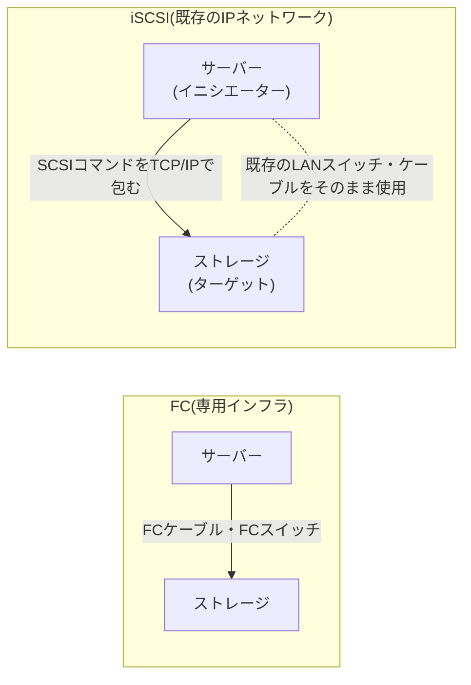

## はじめに

- **この記事で得られること**: [FCケーブル接続とLANケーブル接続の違い](/articles/fc-san-fundamentals-guide)で扱った、FC(Fibre Channel)が専用の配線・機器でSANを構築する仕組みを前提に、**iSCSIが、既存のIPネットワーク上に、同じSAN(ストレージ専用のネットワーク)を実現する仕組み**を体系的に理解します。
- **対象読者**: 「iSCSIは、IPネットワーク上でSANを実現する技術らしい」という理解はあるものの、FCとの具体的な違いや、イニシエーター・ターゲットという用語を説明できない方を想定しています。
- **読むのにかかる想定時間**: 約18分

この記事は[『上位1%』シリーズ 全記事ガイド](/sitemap)の一部、[ストレージ基礎シリーズ](/sitemap#シリーズ一覧)の7本目です。

## 前提知識

- **FCとSASの基礎**: [FCケーブル接続とLANケーブル接続の違い](/articles/fc-san-fundamentals-guide)で扱った、FCがIPアドレスを使わず、WWNという識別子で通信相手を認識する、LANとは独立した専用の規格であるという基礎です。iSCSIは、この独立性を捨てる代わりに、別のメリットを得る設計です。

## 全体像をつかむ

FCがSANを実現する方法は、**「LANとは完全に別の、専用の配線・機器・プロトコルを一式揃える」という、徹底した分離**でした。iSCSIは、これとは正反対の発想を取ります。**「SANを実現するための専用の配線・機器を新たに用意するのではなく、SCSIコマンドそのものを、TCP/IPのパケットの中に、そのまま包んで送ってしまう」という発想**で、既存のLAN(Ethernet/IP)のインフラの上に、SANを実現します。



## 基礎から徹底解説

### イニシエーターとターゲット:SCSIの用語を、そのまま引き継いだ役割分担

iSCSIは、**SCSI(Small Computer System Interface)という、もともとサーバー内部の直結ストレージのために設計された、古くからのコマンドセットを、そのままネットワーク越しに使えるようにする**、という発想で成り立っています。そのため、SCSIの時代から使われている用語が、そのまま引き継がれています。

- **イニシエーター**: 要求を送る側、つまりストレージを利用するサーバー自身を指します。
- **ターゲット**: 要求を受ける側、つまり実際のディスク(ストレージ装置)を指します。

**この「イニシエーター」「ターゲット」という言葉自体は、iSCSI独自の発明ではなく、SCSIという、もともとサーバー内部のコンポーネント同士の通信のために設計された規格から、そのまま引き継がれています。** iSCSIは、「SCSIコマンドを、どうやって伝送するか」という、伝送方式の部分だけを、ネットワーク越しのTCP/IPに置き換えた規格だと理解すると、用語の由来が自然につながります。

### IQN:FCのWWNに対応する、iSCSI独自の識別子

FCは、IPアドレスを使わず、**WWN**という識別子で通信相手を認識していました。iSCSIも、通常のIPアドレスとは別に、**IQN**(iSCSI Qualified Name)という、独自の識別子を使います。

```
iqn.2026-10.test.example:storage.disk01
```

**IQNは、IPアドレスとは別に用意される識別子です。** これは、iSCSIのイニシエーターやターゲットが、IPアドレスの変更(DHCPによる再割り当てなど)に関わらず、常に同じ名前で、互いを一意に識別し続けられるようにするためです。

<details>
<summary>なぜ、IPアドレスだけでは不十分なのか</summary>

もしIPアドレスだけで通信相手を識別する設計だったとしたら、**サーバーのIPアドレスが変わるたびに、ストレージ側の設定(どのサーバーに、どのディスクへのアクセスを許可するか)を、すべて見直す必要が出てきます。** IQNという、IPアドレスとは別の、固定的な識別子を用意することで、IPアドレスが変化しても、「この名前のイニシエーターには、このディスクへのアクセスを許可する」という設定を、変更せずに済ませられます。これは、[DNSが、変化しうるIPアドレスを、変化しにくい名前で抽象化している](/articles/dns-server-fundamentals-guide)のと、発想として近い関係にあります。

</details>

### iSCSIが得るものと、犠牲にするもの

| 観点 | FC | iSCSI |
|---|---|---|
| **必要な専用機器** | FCスイッチ・FC HBA(専用のネットワークカード)が必要 | 既存のEthernetスイッチ・NICで動作可能 |
| **導入・運用コスト** | 専用機器のため高コスト | 既存インフラを流用できるため低コスト |
| **性能・レイテンシ** | TCP/IPのオーバーヘッドがなく、低遅延 | TCP/IPのオーバーヘッドがあり、FCよりレイテンシが高くなりがち |
| **運用の分離** | LANのトラフィックと物理的に完全分離 | 同じLANインフラを共有するため、設計次第で分離が必要 |

**iSCSIが得ているものは「既存インフラの流用によるコストの低さ」であり、犠牲にしているものは「FCが持っていた、専用インフラによる低遅延と、トラフィックの物理的な分離」です。** 実務では、iSCSI専用のVLANを分離するなど、ソフトウェア的な工夫で、この犠牲をある程度補う設計が取られます。

## プロが見ている視点(上位1%の理解)

### 「同じ目的を、まったく異なるレイヤーの手段で実現する」という設計パターン

FCとiSCSIの関係は、[プロキシとファイアウォールの使い分け](/articles/proxy-firewall-guide)で扱った、「同じような目的を持つ技術が、実はまったく異なるレイヤーで動いている」という構図と、よく似ています。FCは、SANという目的のために、ネットワークのレイヤーそのものを新しく作り出しました。iSCSIは、同じSANという目的を、既存のIPネットワークという、まったく別のレイヤーの上に、後付けで実現しています。**「新しい専用のレイヤーを作るか、既存のレイヤーの上に乗せるか」という、この2択の構造は、ストレージの分野に限らず、VPNにおける[現代的なプロトコルとレガシープロトコルの比較](/articles/vpn-protocols-comparison-guide)のような、他の技術分野でも繰り返し登場する、普遍的な設計パターンです。**

## よくある誤解・つまずきポイント

- **誤解1: 「iSCSIは、FCを置き換える、完全な上位互換の技術である」**
  iSCSIは、導入コストの低さと引き換えに、FCが持っていた低遅延・トラフィックの物理的分離を犠牲にしています。どちらが優れているかではなく、要件に応じた選択です。
- **誤解2: 「イニシエーターとターゲットという用語は、iSCSI独自の発明である」**
  この用語は、もともとSCSIという、古くからのコマンドセットの用語を、そのまま引き継いだものです。
- **誤解3: 「IQNは、単にホスト名の別名である」**
  IQNは、ホスト名とは別の、iSCSI独自の識別子です。IPアドレスの変化に関わらず、一意性を保つために設計されています。

## 障害・トラブルシューティングの視点

1. **イニシエーターが、ターゲットを見つけられない**: IQNの指定が正しいか、ネットワーク上でイニシエーターとターゲットの間に、通信を妨げるファイアウォールルールがないかを確認します。
2. **iSCSI経由のディスクアクセスが、予想より遅い**: 同じLANインフラ上に、他の通常のトラフィックが混在していないか、専用のVLANに分離する設計になっているかを確認します。
3. **サーバーのIPアドレスを変更したら、ストレージへのアクセスができなくなった**: ターゲット側のアクセス許可設定が、IPアドレスベースになっていないか、本来はIQNベースで設定すべき箇所を確認します。

## まとめ

- FCが専用のインフラでSANを実現するのに対し、iSCSIはSCSIコマンドをTCP/IPのパケットに包むことで、既存のIPネットワーク上にSANを実現します。
- イニシエーター(要求する側)・ターゲット(要求を受ける側)という用語は、もともとSCSIから引き継がれたものです。
- IQNは、IPアドレスの変化に関わらず、イニシエーター・ターゲットを一意に識別し続けるための、iSCSI独自の識別子です。
- iSCSIは、導入コストの低さを得る一方、FCが持っていた低遅延とトラフィックの物理的分離を、ある程度犠牲にしています。

**今日から意識すべきこと**
1. FCとiSCSIのどちらを選ぶかを検討する際は、「性能・遅延」と「導入・運用コスト」のトレードオフを、具体的に比較しましょう。
2. ストレージへのアクセス許可を設定する際は、変化しうるIPアドレスではなく、IQNのような固定的な識別子を基準にすることを意識しましょう。

## 参考文献

- [RFC 7143 - Internet Small Computer System Interface (iSCSI) Protocol](https://datatracker.ietf.org/doc/html/rfc7143)
- [RFC 3721 - Internet Small Computer Systems Interface (iSCSI) Naming and Discovery](https://datatracker.ietf.org/doc/html/rfc3721)
