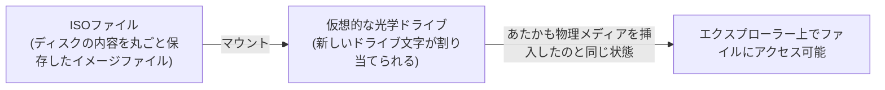

## はじめに

- **この記事で得られること**: DELL Server Update Utilityのようなサーバー向けのアップデートユーティリティをダウンロードすると、実行可能ファイルではなく**ISOファイル**が提供されることがあります。これを右クリックして「**マウント**」する操作が、具体的に何を行っているのか、そしてなぜ今もISO形式での配布が残っているのかを体系的に理解します。
- **対象読者**: ISOファイルを右クリックしてマウントする操作を日常的に行っているものの、その裏側で何が起きているのかを具体的に説明できない方を想定しています。
- **読むのにかかる想定時間**: 約11分

この記事は[『上位1%』シリーズ 全記事ガイド](/sitemap)の一部、[Windowsクライアント運用シリーズ](/sitemap#シリーズ一覧)の9本目です。[インストーラのx64とx86の違い](/articles/windows-install-media-guide)を先に読んでおくと、本記事の理解がスムーズです。

## 前提知識

- **光学メディア(CD/DVD)**: 読み取り専用の光ディスクに、データを記録した記憶媒体です。かつてはソフトウェアの配布・OSのインストールに広く使われていました。

## 全体像をつかむ

### 一言で言うと

**ISOファイルは、CD/DVDなどの光学メディアの内容を、そっくりそのまま1つのファイルとして保存した「ディスクイメージ」です。** これを右クリックして「マウント」すると、Windowsは**そのISOファイルの内容を、実際に物理的な光学ドライブへディスクを挿入したのと同じ状態として認識します。**

## 基礎から徹底解説

### 「マウント」という操作が実際に行っていること

ISOファイルを右クリックして「マウント」を選ぶと、新しい仮想的な光学ドライブ(ドライブ文字が割り当てられる)がエクスプローラー上に出現し、その中にISOファイルの中身がそのまま展開されたかのように表示されます。

**重要なのは、マウントはあくまで「仮想的な読み取り専用のドライブとして認識させる」操作であり、ISOファイルの内容をディスク上の別の場所へ実際に展開・コピーする操作ではない**という点です。マウントを解除すれば、その仮想ドライブは消え、元のISOファイル自体はそのまま残ります。Windows 8以降、この機能はOS標準の機能として搭載されており、追加のソフトウェアなしで右クリックからそのまま実行できます。

### なぜアップデートユーティリティが今もISO形式で配布されているのか

サーバーのファームウェア・ドライバのアップデートユーティリティが、実行可能ファイル単体ではなくISO形式で配布されることが多い背景には、**元々は物理的なCD/DVDメディアで配布・起動することを前提に作られていた慣習が、そのまま引き継がれている**という事情があります。ISO形式であれば、**そのまま物理メディアへ書き込んで、対象サーバーを起動用のメディアとしてブートさせる**ことも可能であり、OSが起動できない状態のサーバーに対しても、単体で起動してアップデート作業を行える、という運用上の利点があります。

## プロが見ている視点(上位1%の理解)

### ISOファイルを直接USBメモリへ書き込む場合との違い

近年では、ISOファイルを物理的なCD/DVDへ書き込む代わりに、専用のツール(Rufusなど)を使ってブート可能なUSBメモリへ直接書き込む運用が主流になっています。この場合、単に「ISOファイルの中身をUSBメモリへコピーする」だけでは、実際にはブート可能なメディアにはなりません。**ブート可能なUSBメモリを作成するツールは、ISOファイルの中身をコピーするだけでなく、USBメモリ自体のパーティション構成やブートセクターを、対象のファームウェア(BIOS/UEFI)が正しく認識できる形式に書き換えるという、追加の処理を行っています。** マウントという操作が「中身をそのまま見せるだけ」であるのに対し、ブート可能メディアの作成は「起動できる構造そのものを作り出す」という、まったく別の処理である点を区別しておくと、単純なファイルコピーとの違いが理解しやすくなります。

## よくある誤解・つまずきポイント

- **誤解1: 「ISOファイルをマウントすると、その内容がディスク上に実際に展開・コピーされる」**
  マウントは、ISOファイルの内容を仮想的な読み取り専用ドライブとして認識させる操作であり、内容を別の場所へ実際にコピー・展開する操作ではありません。
- **誤解2: 「ISOファイルの中身を単純にUSBメモリへコピーすれば、ブート可能なメディアになる」**
  ブート可能なUSBメモリの作成には、パーティション構成やブートセクターの書き換えという、単純なファイルコピー以上の追加処理が必要です。

## 障害・トラブルシューティングの視点

1. **ISOファイルを右クリックしても「マウント」の選択肢が出ない**: 古いWindowsのバージョンでは標準機能として搭載されていない場合があり、サードパーティ製のマウントツールが必要になることがあります。
2. **マウントしたはずのドライブがエクスプローラーに表示されない**: 別のディスクイメージが既にマウントされていないか、あるいはISOファイル自体が破損していないかを確認します。
3. **ISOファイルからブート可能なUSBメモリを作成したのに起動しない**: 単純なファイルコピーで済ませていないか、専用のツール(Rufusなど)でパーティション構成・ブートセクターまで正しく作成されているかを確認します。

### 予防策・恒久対策

- ISOファイルからブート可能なメディアを作成する際は、必ず専用のツールを使い、単純なファイルコピーで済ませない。
- マウントとブート可能メディアの作成は、まったく別の処理であることを区別して理解しておく。

## まとめ

- ISOファイルは、CD/DVDなどの光学メディアの内容を1つのファイルとして保存したディスクイメージです。
- 「マウント」は、ISOファイルの内容を仮想的な読み取り専用ドライブとして認識させる操作であり、内容を実際にディスク上へ展開・コピーする操作ではありません。
- アップデートユーティリティが今もISO形式で配布されているのは、物理メディアでの配布・起動を前提としていた慣習が引き継がれているためです。
- ブート可能なUSBメモリの作成は、単純なファイルコピーとは異なり、パーティション構成・ブートセクターの書き換えという追加処理を伴います。

**今日から意識すべきこと**
1. ISOファイルの「マウント」に出会ったら、それが仮想的な読み取り専用ドライブとしての認識に過ぎないことを思い出しましょう。
2. ISOファイルからブート可能なメディアを作る際は、必ず専用のツールを使いましょう。

## 参考文献

- [Mount and unmount an ISO image | Microsoft Support](https://support.microsoft.com/en-us/windows/mount-and-unmount-a-disc-image-iso-or-vhd-in-windows-63d84dfc-a75f-4c3e-b298-84a3fbec7784)
