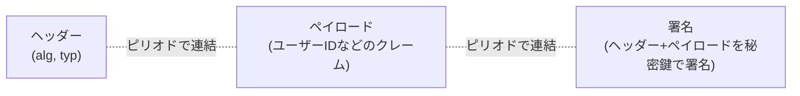

## はじめに

- **この記事で得られること**: [OAuth 2.0の仕組み](/articles/oauth2-guide)で扱ったトークンという概念を前提に、**JWT(JSON Web Token)の「alg」フィールドを、サーバー側が無条件に信用してしまうことで発生する、「alg: none」脆弱性**の原理を、安全な検証環境の中だけで再現し、許可アルゴリズムを明示的に固定することによる防御を確認します。
- **対象読者**: JWTを使った認証・認可の仕組みを扱ったことはあるものの、JWTの検証処理が、具体的にどういう前提のもとに安全性を保っているのかを説明できない方を想定しています。
- **重要な注意**: **このハンズオンは、自分が管理する検証環境の防御力を高めるための、教育・防御目的のものです。** 実運用中の他者の環境に対して、許可なくこの手順を実行しないでください。本記事で使う検証環境は、自分自身で用意したサーバーに対してのみ通信を送るものであり、第三者のシステムへの攻撃手順は一切含まれていません。
- **読むのにかかる想定時間**: 約22分(ハンズオン実施込み)

この記事は[『上位1%』シリーズ 全記事ガイド](/sitemap)の一部、[Web/APIシリーズ](/sitemap#シリーズ一覧)の9本目です。[ハンズオン準備マニュアル](/articles/handson-prep-guide)で作成したUbuntu Server環境が1台あれば実施できます。

## 前提知識

- **トークンベースの認証**: [OAuth 2.0の仕組み](/articles/oauth2-guide)で扱った、リクエストごとにトークンを提示する認証方式です。JWTは、このトークンの、具体的な表現形式の1つです。

## 全体像をつかむ

### JWTの構造:ヘッダー・ペイロード・署名の3層

JWTは、ピリオドで区切られた3つの部分、**ヘッダー**・**ペイロード**・**署名**から構成されています。それぞれがBase64でエンコードされており、`xxxxx.yyyyy.zzzzz`という形をしています。



**ヘッダーには、`alg`というフィールドが含まれており、この署名がどのアルゴリズム(HS256、RS256など)で計算されたかを示します。** サーバー側は、トークンを受け取ると、このヘッダーに書かれた`alg`の値を読み取り、**そのアルゴリズムを使って**、署名が正しいかどうかを検証します。

## 基礎から徹底解説

### 「alg: none」脆弱性:なぜ、署名なしのトークンが受理されてしまうのか

JWTの仕様には、署名アルゴリズムを指定しない、`"alg": "none"`という特殊な値が、歴史的な経緯で定義されています。**この脆弱性は、サーバー側の検証ライブラリが、トークンのヘッダーに書かれた`alg`の値を、無条件に信用し、`none`が指定されていれば、署名の検証そのものを一切スキップしてしまう**という実装上の不備によって発生します。

攻撃者は、正規のトークンのヘッダー部分だけを、`{"alg": "none", "typ": "JWT"}`に書き換え、署名部分を空にして送信します。**この脆弱性を持つサーバーは、「`alg`が`none`だから、署名の検証は不要だ」と判断し、ペイロードの内容(たとえば、ユーザーIDや権限)を、そのまま信用してしまいます。** 攻撃者は、ペイロードの内容を自由に書き換えられるため、たとえば「管理者権限を持つユーザーIDになりすます」といった、深刻な権限昇格が可能になります。

<details>
<summary>そもそも、なぜJWTの仕様に「alg: none」が存在するのか</summary>

「alg: none」は、署名検証が不要な、信頼できる内部システム間の連携など、限定的な用途を想定して、JWTの仕様(RFC 7519が参照するJWA、RFC 7518)に定義されています。**問題の本質は、「alg: none」という値が存在すること自体ではなく、サーバー側の検証処理が、トークンのヘッダーという、本質的には「信頼できない入力の一部」である情報を、何に使うアルゴリズムであるかを決める基準として、無条件に信用してしまっていることにあります。** [HTTPリクエストスマグリング](/articles/load-balancing-request-smuggling-handson-guide)が「矛盾した入力を無条件に解釈してしまう」ことから生まれた問題だったのと、根底にある構造がよく似ています。

</details>

## ハンズオン手順

### Step 1: 脆弱な(alg: noneを無条件に信用する)検証ロジックを実装する

**この検証エンドポイントは、脆弱性を再現するための教育目的のものであり、自分が管理する検証環境の中だけで実行してください。** `vulnerable_verify.py`として保存します。

```python
import json
import base64
from http.server import BaseHTTPRequestHandler, HTTPServer

def b64url_decode(s):
    s += '=' * (-len(s) % 4)
    return base64.urlsafe_b64decode(s)

class Handler(BaseHTTPRequestHandler):
    def do_POST(self):
        length = int(self.headers.get('Content-Length', 0))
        token = self.rfile.read(length).decode().strip()
        header_b64, payload_b64, signature_b64 = token.split('.')
        header = json.loads(b64url_decode(header_b64))
        payload = json.loads(b64url_decode(payload_b64))

        # 脆弱な実装:ヘッダーのalgがnoneなら、署名検証を無条件にスキップしてしまう
        if header.get('alg') == 'none':
            self._respond(200, payload)
            return

        self._respond(401, {"error": "unsupported algorithm"})

    def _respond(self, code, body):
        self.send_response(code)
        self.end_headers()
        self.wfile.write(json.dumps(body).encode())

HTTPServer(('0.0.0.0', 8000), Handler).serve_forever()
```

```bash
python3 vulnerable_verify.py &
```

### Step 2: 「alg: none」トークンを自分の手で作成し、送信する

正規の署名を一切付けずに、`{"alg": "none"}`というヘッダーと、権限を偽装したペイロードだけを持つトークンを作成します。

```python
import json
import base64

def b64url_encode(data):
    return base64.urlsafe_b64encode(data).decode().rstrip('=')

header = b64url_encode(json.dumps({"alg": "none", "typ": "JWT"}).encode())
payload = b64url_encode(json.dumps({"user": "attacker", "role": "admin"}).encode())

forged_token = f"{header}.{payload}."
print(forged_token)
```

このトークンを、脆弱な検証エンドポイントへ送信します。

```bash
TOKEN=$(python3 forge_token.py)
curl -s -X POST http://localhost:8000/ -d "$TOKEN"
```

**実行結果:**

```json
{"user": "attacker", "role": "admin"}
```

**署名を一切付けていない、自分で自由に作成したトークンが、`role: admin`という、本来持っているはずのない権限を持った状態で、そのまま受理されてしまいました。** これが、「alg: none」脆弱性が実際に機能してしまう瞬間です。

### Step 3: 許可アルゴリズムを明示的に固定する、防御版を実装する

**正しい実装では、トークンのヘッダーに書かれた`alg`の値を信用するのではなく、サーバー側があらかじめ「このアルゴリズムしか許可しない」というリストを持ち、それに一致しない場合は無条件に拒否します。** `safe_verify.py`として保存します。

```python
import json
import base64
import hmac
import hashlib
from http.server import BaseHTTPRequestHandler, HTTPServer

SECRET = b"server-only-secret-key"
ALLOWED_ALGORITHMS = {"HS256"}  # サーバー側が許可するアルゴリズムを、事前に固定する

def b64url_decode(s):
    s += '=' * (-len(s) % 4)
    return base64.urlsafe_b64decode(s)

class Handler(BaseHTTPRequestHandler):
    def do_POST(self):
        length = int(self.headers.get('Content-Length', 0))
        token = self.rfile.read(length).decode().strip()
        header_b64, payload_b64, signature_b64 = token.split('.')
        header = json.loads(b64url_decode(header_b64))

        # 防御:ヘッダーのalgを信用せず、許可リストにあるかどうかで判断する
        if header.get('alg') not in ALLOWED_ALGORITHMS:
            self.send_response(401)
            self.end_headers()
            self.wfile.write(b'{"error": "unsupported or disallowed algorithm"}')
            return

        expected_sig = base64.urlsafe_b64encode(
            hmac.new(SECRET, f"{header_b64}.{payload_b64}".encode(), hashlib.sha256).digest()
        ).decode().rstrip('=')

        if not hmac.compare_digest(expected_sig, signature_b64):
            self.send_response(401)
            self.end_headers()
            self.wfile.write(b'{"error": "invalid signature"}')
            return

        payload = json.loads(b64url_decode(payload_b64))
        self.send_response(200)
        self.end_headers()
        self.wfile.write(json.dumps(payload).encode())

HTTPServer(('0.0.0.0', 8001), Handler).serve_forever()
```

```bash
python3 safe_verify.py &
curl -s -X POST http://localhost:8001/ -d "$TOKEN"
```

**実行結果:**

```json
{"error": "unsupported or disallowed algorithm"}
```

**同じ偽造トークンを送信しても、`alg`の値が、サーバー側で事前に固定した許可リスト(`{"HS256"}`)に含まれていないため、署名の検証処理に進む前の段階で、確実に拒否されました。** これが、「alg: none」脆弱性に対する、根本的な防御です。

## プロが見ている視点(上位1%の理解)

### 「トークンの中身」を、検証方法を決める基準にしてはならない

このハンズオンが示す、最も重要な設計原則は、**「信頼できない入力(トークンのヘッダー)の中身を、その入力自体をどう検証するかという、検証方法そのものの決定に使ってはならない」という点**です。サーバー側が「このアルゴリズムで検証すべきか」を、トークン自身の`alg`フィールドに決めさせてしまうと、攻撃者は、検証方法そのものを、自分の都合のよいように選べてしまいます。**正しい設計は、検証方法(許可するアルゴリズム)を、サーバー側の設定として、トークンの外側に、あらかじめ固定しておくことです。** [HTTPリクエストスマグリング](/articles/load-balancing-request-smuggling-handson-guide)で扱った「矛盾した入力自体を拒否する」という防御思想と、この「検証方法を入力に決めさせない」という原則は、根底で同じ考え方を共有しています。

## よくある誤解・つまずきポイント

- **誤解1: 「JWTというトークン形式自体に、脆弱性がある」**
  JWTの仕様自体に問題があるわけではありません。サーバー側の検証ライブラリが、ヘッダーの`alg`フィールドを無条件に信用してしまう、実装上の不備が原因です。
- **誤解2: 「主要なJWTライブラリを使っていれば、この脆弱性は心配しなくてよい」**
  現代の主要なライブラリは、デフォルトでこの脆弱性に対処していますが、ライブラリの古いバージョンや、検証時に許可アルゴリズムを明示的に指定しない誤った使い方では、依然としてリスクが残ります。
- **誤解3: 「署名が付いているトークンであれば、常に安全である」**
  本記事では「alg: none」を扱いましたが、同様の構造を持つ別の攻撃(RS256で署名されたトークンの公開鍵を、HS256の秘密鍵として悪用する、アルゴリズム混同攻撃など)も存在します。「ヘッダーの`alg`を信用しない」という原則は、これらすべてに共通する防御です。

## 障害・トラブルシューティングの視点

1. **正規のトークンが、「unsupported or disallowed algorithm」エラーで拒否されてしまう**: トークン発行時に使用したアルゴリズムが、検証側の`ALLOWED_ALGORITHMS`に正しく含まれているかを確認します。
2. **JWTライブラリの選定時に、何を確認すべきか分からない**: ライブラリのドキュメントで、「検証時に許可アルゴリズムを明示的に指定する設計になっているか」「alg: noneをデフォルトで拒否するか」を確認します。
3. **署名鍵(SECRET)が、ソースコードに直接書かれている**: 本番環境では、環境変数やシークレット管理サービスを使い、ソースコードに鍵を直接含めない運用が必要です。

## まとめ

- 「alg: none」脆弱性は、サーバー側がトークンのヘッダーに書かれた`alg`の値を無条件に信用し、署名検証そのものをスキップしてしまうことで発生します。
- 攻撃者は、署名を一切付けずに、任意のペイロード(権限を偽装した情報など)を持つトークンを自由に作成し、受理させることができます。
- 正しい防御は、サーバー側があらかじめ許可するアルゴリズムを固定しておき、トークンのヘッダーがそれに一致しない場合は、無条件に拒否することです。
- 「信頼できない入力の中身を、その入力の検証方法の決定に使ってはならない」という原則は、JWT以外の多くのセキュリティ対策にも共通する、普遍的な考え方です。

**今日から意識すべきこと**
1. JWTを扱う際は、検証処理が、許可アルゴリズムを明示的に固定しているかを、必ず確認しましょう。
2. 「信頼できない入力が、検証方法そのものを決めてしまっていないか」という視点を、JWT以外のあらゆる検証処理の実装・レビューで持ちましょう。

## 参考文献

- [RFC 7519 - JSON Web Token (JWT)](https://datatracker.ietf.org/doc/html/rfc7519)
- [Critical vulnerabilities in JSON Web Token libraries | Auth0](https://auth0.com/blog/critical-vulnerabilities-in-json-web-token-libraries/)
