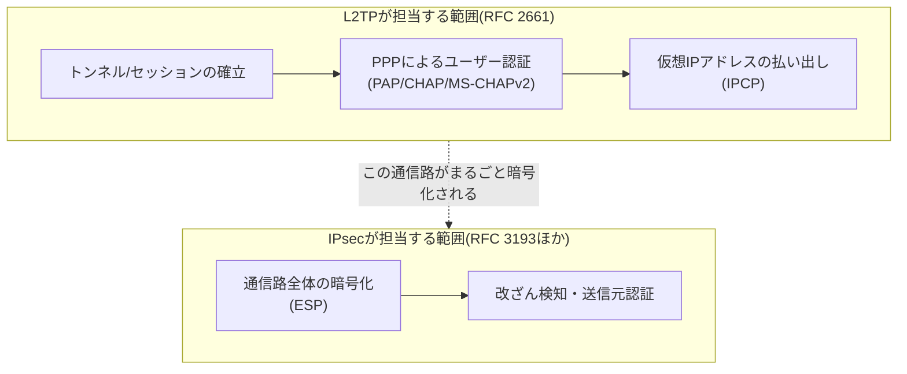
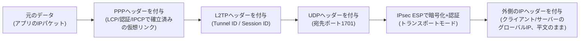
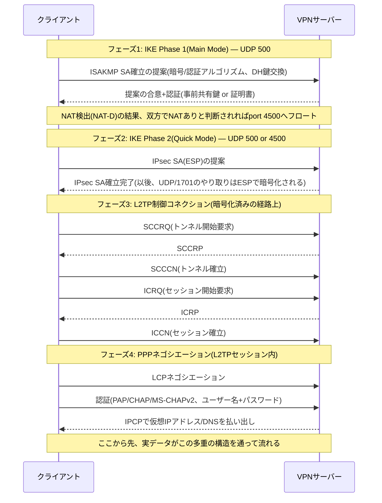
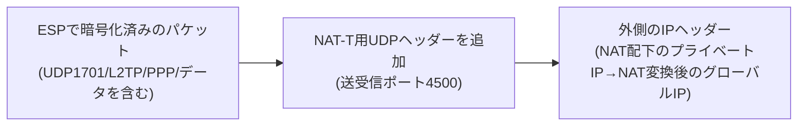

## はじめに

- **この記事で得られること**: 「L2TPというプロトコルとIPsecという暗号化方式を使ってVPN接続する」という理解の、その中身——なぜ役割の異なる2つの規格を組み合わせる必要があるのか、接続確立時に実際何が何段階で起きているのか、NAT越え（NAT-T）はどう成立しているのかを、体系的に理解できます。
- **対象読者**: インフラエンジニアとして就業しており、「L2TPというプロトコルとIPsecという暗号化方式を利用してVPN接続する」ということは知っているものの、それ以上の内部動作（なぜ2つ要るのか、接続確立の手順、暗号化される範囲）を説明できない方を想定しています。
- **読むのにかかる想定時間**: 約25分

この記事は[『上位1%』シリーズ 全記事ガイド](/sitemap)の一部です。

## 前提知識

- **VPN（Virtual Private Network）**: インターネットのような公衆網の上に、あたかも専用線のような論理的な通信路を作る技術の総称です。
- **カプセル化**: あるデータの前後にヘッダー（制御情報）を付け加えて、別のプロトコルの中に包んで運ぶことです。パケットが階層を降りるたびにヘッダーが付与されていく、という基本的な考え方はネットワーク通信全般に共通します。
- **UDP（User Datagram Protocol）**: コネクションレスで、到達確認や再送制御を行わない軽量なトランスポート層プロトコルです。TCPと違い「送りっぱなし」が基本的な性質です。
- **NAT（Network Address Translation）**: プライベートIPアドレスとグローバルIPアドレスを相互に変換する技術です。多くの家庭用ルーター・企業ルーターが、内部の複数端末で1つのグローバルIPを共有するために使っています。

## 全体像をつかむ

### 一言で言うと

「L2TP/IPsec」とは、**「L2TPが仮想的なトンネルを作り、その中でPPP接続によってユーザー認証とIPアドレスの払い出しを行い、IPsecがその通信路全体を暗号化して覗き見・改ざんから守る」という、役割分担された2つの独立した規格の組み合わせ**です。

ここが最初のつまずきポイントです。「L2TP/IPsec」は1つの統一されたプロトコルではなく、**設計思想も策定した団体も異なる2つの規格を、後から組み合わせた**ものです。

なぜ組み合わせる必要があるかというと、**L2TP単体には暗号化機能が一切なく、IPsec単体にはリモートアクセスVPNに必要な「ユーザー単位の認証」と「仮想IPアドレスの自動払い出し」の標準的な仕組みがなかった**からです（後者は現在ではIKEv2のEAP認証で解決していますが、これは後述します）。トンネルを掘る技術と、そのトンネルに鍵をかける技術が、別々の理由でそれぞれ開発され、組み合わさって今の形になった、という歴史的経緯を押さえておくと全体像が掴みやすくなります。

### パケットの中身：ヘッダーが何層に重なるのか

実際の通信では、1つのIPパケットに次のようにヘッダーが重なっていきます。

ポイントは、**ESPが「UDPヘッダー（ポート1701）ごと」暗号化する**ことです（ESP自体の詳しい仕組みは後述の「IPsecが担当する役割」で解説します）。IPsecのトランスポートモードは「元のIPヘッダーはそのまま残し、その中身（この場合はUDP/L2TP/PPP/データすべて）を暗号化する」という方式のため、外側から見える情報は「送信元・宛先のグローバルIPアドレス」と「これがESP（IPプロトコル番号50）のパケットである」ということだけです。UDPポート1701という情報自体が暗号化された中身に隠れてしまい、経路上の機器からは見えません。これは後述の「よくある誤解」でも重要になる点です。

## 基礎から徹底解説

### L2TPが担当する役割：トンネルの生成

L2TP（Layer 2 Tunneling Protocol、RFC 2661）は、CiscoのL2F（Layer 2 Forwarding）とMicrosoftのPPTP（Point-to-Point Tunneling Protocol）を統合する形で標準化されたプロトコルです。名前の通り、**PPP（Point-to-Point Protocol）フレームをIPネットワーク上でトンネリングする**ことが本来の役割です。

なぜVPNに「ダイヤルアップ時代」のPPPが出てくるのか

PPP（RFC 1661）は、もともと電話回線を使ったダイヤルアップ接続で、2点間を直接つなぐために設計されたプロトコルです。「回線を確立する（LCP）」「ユーザー名とパスワードで認証する」「IPアドレスを割り当てる（IPCP）」という一連の手順を規定しています。

**電話回線とIPネットワークの違い**: 電話回線は、通話中は相手との間に1本の物理回線を占有し続ける「回線交換」方式です。ダイヤルアップ接続とは、この電話回線を使って自宅のモデムからISP（後述）のモデムへ電話をかけ、その占有された1本の回線の上でPPPのやり取り（LCP→認証→IPCP）を行うことで、電話回線を「1対1のデータ通信リンク」として使う仕組みです。「ユーザー名とパスワードによる認証を行うことで接続できるようになる仕組み」という解釈はそのまま正しく、これはPPPの認証フェーズそのものです。一方、現在主流のIPネットワークは、1本の回線を多数の通信が共有し、データをパケット単位に分割して宛先ごとに振り分ける「パケット交換」方式です。相手を占有しない代わりに、宛先を識別する仕組み（IPアドレスとルーティング）が別途必要になる、という違いがあります。

**ISP（Internet Service Provider）とは**: 利用者の回線（ダイヤルアップ時代なら電話回線、現在ならxDSL・光回線・モバイル回線など）を、インターネットという世界規模のネットワークに接続する「境目」を担う事業者です。ダイヤルアップ時代であれば、利用者が電話をかけた先にあるISPのモデムプールがPPP接続を受け付けて認証を行い、利用者にIPアドレス（インターネット上で通信するための住所）を払い出した上で、その先の広大なインターネットのバックボーン網へパケットを中継します。「インターネット接続するためのグローバルIPが払い出される境目」というイメージは、まさにこの役割を正しく捉えています。

L2TPは、この「PPPが持っていた1対1のリンク確立・認証・IPアドレス払い出しの仕組み」を、物理的な電話回線ではなくIPネットワーク上の仮想的なトンネルの上で再現するために作られました。つまり「なぜVPNなのにダイヤルアップの規格が出てくるのか」という違和感の正体は、**L2TP/IPsecが実際にダイヤルアップ用のPPPの仕組みをそのまま流用しているから**です。リモートアクセスVPNが「ユーザー名とパスワードでログインし、内部向けのIPアドレスをもらう」という体験になっているのは、この設計の名残です。

### トンネリングとは何か——暗号化との違い

ここで「トンネル」「トンネリング」という言葉の中身を明確にしておきます。**トンネリングとは、あるプロトコルのフレーム（ここではPPPフレーム）を、そっくりそのまま別プロトコル（ここではUDP/IP）のペイロードとしてカプセル化し、運ぶこと**です。中身に手を加える処理ではなく、あくまで「運び方・経路の作り方」の話である点が、暗号化との決定的な違いです。

- **トンネリング**: 中身には一切手を加えず、外側にヘッダーを重ねて「別の経路の上を通れる形」に包み直すこと。中身は誰でも読める状態のまま。
- **暗号化**: 中身そのものを、鍵を持たない第三者には読めない形に変換すること。経路や運び方には関与しない。

この2つは互いに独立した概念です。実際、**L2TP単体（暗号化なしのトンネリング）**も、**IPsecだけでホスト間を直接保護する構成（トンネリングなしの暗号化）**も、それぞれ単独で成立します。L2TP/IPsecは、たまたまこの2つを重ねて使っている組み合わせに過ぎません。

**「PPPフレームをIPネットワーク上でトンネリングする」の意味**は、次のように理解すると腑に落ちます。PPPは本来、電話回線のような「2点間を直接つなぐ専用のシリアルリンク」の上でしか動作しないプロトコルとして設計されています。そのままではパケット交換網であるIPネットワークの上を流れることができません。そこでL2TPは、PPPフレームをUDP/IPのペイロードとして包み込み、離れた2地点の間に**あたかも専用の物理リンクが存在するかのように**PPPに錯覚させます。これが「トンネル」と呼ばれる理由です——物理的な専用線は存在しないのに、論理的には1本の直結線があるかのように振る舞う仮想的な経路だからです。

**なぜL2TPでトンネルを作るのか。PPPのやり取りを暗号化するためだろうか**、という疑問については、答えは明確に「いいえ」です。L2TP自体には暗号化機能が一切ありません（後述の「よくある誤解」でも扱います）。トンネルを作る目的は、あくまで「PPPが要求する1対1のリンクを、共有されたIPネットワークの上でエミュレートすること」であり、暗号化とは無関係です。暗号化は完全に別レイヤーであるIPsec（ESP、後述の「IPsecが担当する役割」で解説します）の仕事です。

もう1つの疑問、**「IPsecですでに暗号化されているのに、なぜPPPネゴシエーションをいきなり始めず、L2TPのトンネル化という手順を挟む必要があるのか」**にも同じ整理が効きます。IPsec（ESP）が提供するのは「2つのIPアドレスの間の、秘匿されたIP通信路」であって、その通信路の中に「PPPが動作できる1対1のリンクの形」を作ってくれるわけではありません。PPPはあくまで「専用リンクの上で1つの相手とだけLCP/認証/IPCPをやり取りする」ことを前提に設計されたプロトコルであり、IPsecが暗号化したIPパケットの流れに直接乗れるようにはできていません。L2TPが挟まることで、暗号化済みの経路の中に、さらに「PPPが動作できる仮想リンク」が用意されるのです。加えて、L2TPのTunnel ID/Session IDは、1台のVPNサーバーに同時多数のユーザーが接続する際、それぞれのPPPセッションを識別・多重化する役割も担っており、これはIPsecのSA（Security Association）だけでは代替できない機能です。

L2TPには、通信の性質が異なる2種類のメッセージがあります。

- **制御メッセージ**: トンネルやセッションを確立・切断するためのメッセージです。SCCRQ/SCCRP/SCCCN（トンネル確立）、ICRQ/ICRP/ICCN（セッション確立）といった名前のメッセージがやり取りされ、内容はAVP（Attribute-Value Pair）という可変長の属性形式で運ばれます。制御メッセージは失われては困るため、Ns/Nr（送信・受信シーケンス番号）による独自の再送制御を持っています。
- **データメッセージ**: 実際のPPPフレームを運ぶメッセージです。こちらにはL2TP層での再送制御はなく、届かなかったパケットの回復は上位層（トンネル内を流れるTCP通信など）に委ねられます。

制御・データいずれのメッセージも、**Tunnel ID**（どのトンネルか）と**Session ID**（トンネル内のどのセッションか）という2つの識別子で多重化されます。これは、TCP/UDPが送信元・宛先ポート番号で「どのアプリケーション宛か」を多重化しているのと同じ発想です。

LAC/LNSという用語について

L2TPの仕様上は、PPPクライアントを収容してトンネルを開始する側を**LAC（L2TP Access Concentrator）**、トンネルの終端でPPPセッションを終端する側を**LNS（L2TP Network Server）**と呼びます。もともとISPが「利用者の最寄りのアクセスポイント（LAC）で受けたPPP接続を、企業側のLNSまでトンネルする」という構成（コンプルソリートンネリング）を想定した用語です。現在一般的なリモートアクセスVPN（WindowsやiOS・Androidに標準搭載されたL2TP/IPsecクライアントから直接VPNサーバーに接続する形態）では、クライアント自身がLACとPPPクライアントの両方を兼ね、VPNサーバー側がLNSを兼ねる「ボランタリートンネリング」という構成になっており、LAC/LNSが別々の機器として登場する場面は限定的です。

### PPPが担当する役割：ユーザー認証とIPアドレス払い出し

L2TPのセッションが確立すると、その中で**PPPのネゴシエーション**が始まります。これは大きく3段階に分かれます。

1. **LCP（Link Control Protocol）**: MRU（最大受信単位）などのリンクパラメータと、この後どの認証方式を使うかを合意します。
2. **認証フェーズ**: 実際にユーザー名・パスワードで認証します。代表的な方式は次の通りです。

    | 方式 | 概要 | 特徴 |
    |---|---|---|
    | PAP（RFC 1334） | ユーザー名・パスワードを平文でそのまま送る | 単体では極めて脆弱。IPsecによる暗号化が前提でなければ使うべきではない |
    | CHAP（RFC 1994） | サーバーが出したチャレンジ値とパスワードのハッシュ値で応答するチャレンジレスポンス方式 | パスワードそのものは流れないが、片方向認証のみ |
    | MS-CHAPv2（RFC 2759） | CHAPを拡張し、クライアント→サーバーとサーバー→クライアントの相互認証に対応 | Windowsのデフォルト。暗号強度自体には既知の弱点があるため後述 |

3. **NCP/IPCP（Network Control Protocol / IP Control Protocol）**: 認証成功後、サーバーがクライアントに仮想IPアドレス（いわゆる社内向けの`10.x.x.x`のようなアドレス）とDNSサーバー情報を払い出します。VPN接続時に「内部ネットワーク用のIPアドレスをもらえる」という挙動は、このIPCPのやり取りそのものです。

### なぜ仮想IPアドレスの払い出しが必要なのか

IPCPで払い出される仮想IPアドレスの意味を、もう一歩掘り下げます。

まず前提として、L2TP/IPsecの典型的な構成でクライアントが得るのは、拠点と**同一のイーサネットセグメント（L2）に物理的に参加する**という意味ではなく、**社内のアドレス体系に属する、ルーティング可能なIPアドレスをL3的に持つ**という意味です（実装によってはブリッジ構成でL2隣接に見せることもありますが、L2TP/IPsecの一般的な構成はL3ルーティングです）。

このIPアドレスが必要になる理由は、**多くの内部サーバーがアクセス制御を「送信元IPアドレスが社内アドレス帯かどうか」で行っている**ことにあります。VPN接続がまだ確立していない状態でも、クライアントはVPNサーバーの公開IPアドレスまでは到達できています。しかしそれはあくまで「VPNサーバーという入口」に到達しているだけです。その先にある個々の内部サーバー（ファイルサーバー、業務アプリなど）からすれば、届いたパケットの送信元IPアドレスが社内アドレス帯でなければ、「社外からの不正なアクセス」として弾かれてしまいます。

仮想IPアドレスを払い出すことで、クライアントが送信するパケットの送信元IPアドレスが社内アドレス帯のものになり、内部サーバーから見て「社内から来た正当なアクセス」に見えるようになります。さらに、内部サーバーからの応答パケットはこの仮想IPアドレス宛に送られてきますが、VPNサーバーは「どの仮想IPアドレスがどのL2TPセッション（トンネル）に対応するか」を管理しているため、応答パケットを正しく該当クライアントまで送り返すことができます。これは「VPNサーバーへの到達性」だけでは実現できない、独立したルーティングの仕組みです。

つまり、**「VPN接続を試みる段階ですでに接続先のサーバーと通信できているのだから、内部IPは不要では」という疑問への答え**は、「到達できているのはVPNサーバーという入口までであり、その先の内部ネットワーク上の各サーバーとの通信には、社内アドレス帯に属する送信元・宛先IPアドレスが必要」ということになります。VPNサーバーは、この仮想IPアドレスを起点に、ルーティングとアクセス制御の両方を成立させるゲートウェイの役割を果たしています。

### IPsecが担当する役割：暗号化と完全性の保証

IPsecは単一のプロトコルではなく、複数の要素技術の集合です。L2TP/IPsecで実際に使われるのは主に次の2つです。

- **IKE（Internet Key Exchange）**: 暗号鍵を安全に合意するためのプロトコル（IKEv1はRFC 2409、IKEv2はRFC 7296）。UDPポート500を使います。
- **ESP（Encapsulating Security Payload、RFC 4303）**: 実際にデータを暗号化し、改ざん検知用の認証情報を付与するプロトコル。IPプロトコル番号50として扱われます。

似た仕組みに**AH（Authentication Header、RFC 4302）**がありますが、AHは改ざん検知・送信元認証のみを行い、暗号化（秘匿性）を提供しません。L2TP/IPsecの目的は通信内容の秘匿にあるため、AH単体が使われることはなく、常にESPが使われます。

さらにIPsecには**トランスポートモード**と**トンネルモード**の2種類の適用方式があります。

| モード | 保護する範囲 | 主な用途 |
|---|---|---|
| トランスポートモード | 元のIPヘッダーはそのまま残し、その中身（トランスポート層以降）だけを暗号化 | L2TP/IPsec（L2TP自身がすでにトンネル機能を持つため、これで十分） |
| トンネルモード | 元のIPパケット全体をヘッダーごと暗号化し、新しい外側のIPヘッダーで包む | 拠点間VPN（site-to-site）など、経路情報そのものも隠したい場合 |

L2TP/IPsecがトランスポートモードで済むのは、**「仮想的なトンネルを作る」という役目がすでにL2TP側で果たされているから**です。ここでさらにトンネルモードを重ねると、IPヘッダーが二重に付くだけの無駄なオーバーヘッドになります。

### 接続確立の全体シーケンス

ここまでの要素を時系列で並べると、実際の接続確立は次の順序で進みます。

**IKEのフェーズ1は接続の土台（安全な制御チャネル）を作る段階、フェーズ2はその土台の上で実際のデータ保護用の鍵（IPsec SA）を作る段階**と理解すると整理しやすくなります。L2TPの制御コネクション・PPPネゴシエーションは、このIPsec SAがすでに確立し暗号化されたあとに、その中を流れる形で行われます。つまりPPP認証で使うユーザー名・パスワードが、ネットワーク上を平文で流れることは、正常に確立したIPsec SAが機能している限りありません。

### IKEフェーズ1の認証：何が渡され、何が検証されるのか

先のシーケンス図の「フェーズ1」では、実際には次のような情報のやり取りと検証が行われています。

1. **DH（Diffie-Hellman）鍵交換**: 双方が公開してよい値（DH公開値）を交換し、それぞれが手元に持つ秘密の値と組み合わせて、**通信経路上を流れた情報だけからは第三者が計算できない共有の秘密値**を双方が独立に導出します。この共有秘密値と、互いに送り合った乱数（nonce）から、以降の通信を保護する暗号鍵一式が導出されます。
2. **身元の証明（認証）**: DH鍵交換だけでは「鍵は共有できたが、相手が本当に正規の相手か」は分かりません。ここで使われるのが事前共有鍵（PSK）または証明書です。

**事前共有鍵（PSK）方式の場合**、双方は「ここまでのやり取り（DH公開値・nonceなど）」と「PSK」を材料にしたハッシュ値（認証用のハッシュ）を計算し、これを相手に送ります。受け取った側は自分も同じPSKを使って同じ計算をやり直し、届いたハッシュ値と一致するかを比較します。一致すれば「相手も自分と同じPSKを知っている」ことが証明されます。PSKそのものは一度もネットワーク上に送られない点が重要です。

**証明書方式の場合**は、もう少し手順が多くなります。

1. クライアントはあらかじめ公開鍵・秘密鍵のペアを生成し、自分の識別情報（ホスト名やユーザー名などの識別子）と公開鍵をセットにした**CSR（Certificate Signing Request）**を作成し、これを自分の秘密鍵で署名した上でCA（認証局）に提出します。
2. CAは何らかの方法で申請者の身元を確認した上で、CSRの内容（識別情報+公開鍵）にCA自身の秘密鍵で署名を行い、**証明書**として発行します。これにより証明書は「このCAが、この識別情報とこの公開鍵の組み合わせを保証する」という意味を持ちます。
3. IKEのフェーズ1では、双方が自分の証明書を相手に提示し、さらに**このハンドシェイクで交換したDH公開値・nonceなどのデータに対して、自分の秘密鍵で署名**したものを送ります。
4. 受け取った側は、(a) 相手の証明書がCAの公開鍵で正しく検証できるか（信頼するCAが発行した本物の証明書か）、(b) 届いた署名を証明書に含まれる公開鍵で検証し、確かに「今回のこのハンドシェイクのために」その秘密鍵の持ち主が署名したものであるかを確認します。両方が成立して初めて認証が成功します。

ここで**nonce（毎回変わる乱数）を含めて署名する**ことが重要です。もし過去のハンドシェイクの署名をそのまま使い回せてしまうと、盗聴者がそれを再送するだけで正規のクライアントになりすませてしまいます（リプレイ攻撃）。毎回異なるnonceを署名対象に含めることで、「今、このセッションのために」署名したことを保証しています。

公開鍵暗号・デジタル署名・CSR・証明書チェーンの検証といったPKI（Public Key Infrastructure）の仕組み自体は、IKEに限らずTLS（HTTPS）やSSHなど幅広い場面で使われる汎用的な技術です。ボリュームが大きく独立したテーマのため、別記事「[PKIとデジタル証明書の仕組みを『上位1%』の視点で理解する](/articles/pki-guide)」で仕組みそのものを徹底的に深掘りしています。

### ESPが実際に暗号化・認証する仕組み

IKEフェーズ2（Quick Mode）で合意されたIPsec SA（ESP用のパラメータ一式）に基づき、ESPは実際のデータに対して次の処理を行います。

- **暗号化**: IKEフェーズ1で導出した鍵材料と、フェーズ2で交換された追加のnonceから、ESP専用の暗号鍵が導出されます。この鍵を使い、AES-CBCやAES-GCMといった共通鍵暗号方式でペイロード（今回の場合はUDP/L2TP/PPP/データ全体）を暗号化します。CBCモードの場合は暗号化のたびに異なるIV（初期化ベクトル）を使うことで、同じ平文でも毎回異なる暗号文になるようにしています。
- **完全性の保証（改ざん検知）**: 暗号化とは別に、パケットの中身（とESPヘッダー自体）からHMAC（鍵付きハッシュ値。AES-GCMを使う場合はAEADの認証タグ）を計算し、パケット末尾のICV（Integrity Check Value）として付与します。受信側は同じ計算をやり直し、届いたICVと一致するかを検証することで、経路上で1ビットでも改ざんされていないかを確認します。
- **リプレイ攻撃対策**: ESPヘッダーには**シーケンス番号**というカウンタが含まれ、送信のたびに1ずつ増加します。受信側はこの番号をスライディングウィンドウ方式でチェックし、すでに処理済みの番号や極端に古い番号のパケットを破棄します。これにより、盗聴者が過去に流れたパケットをそのまま再送しても受理されません。

つまりESPは「暗号化」「完全性・送信元認証」「リプレイ対策」という3つの保護を、1つのプロトコルの中で同時に提供しています。IKEフェーズ1・フェーズ2は、この処理に必要な鍵一式を安全に配送するための「事前準備」だと位置づけると、全体の役割分担がすっきり整理できます。

### 二層の認証モデル

上記のシーケンスから分かる通り、L2TP/IPsecには**性質の異なる2段階の認証**が存在します。

1. **IPsec層の認証（機器/グループ単位）**: フェーズ1で行われる、事前共有鍵（PSK）または証明書による認証です。「この端末はそもそもトンネルを開く権限があるか」を確認します。
2. **PPP層の認証（ユーザー単位）**: フェーズ4で行われる、ユーザー名・パスワードによる認証です。「具体的に誰が接続しているか」を確認します。

この二層構造自体は、1つが破られてももう1つが防波堤になるという設計上の利点がありますが、実運用では**IPsec層のPSKを組織内の全ユーザーで使い回してしまう**構成がよく見られ、これは既知の弱点として後述します。

## プロが見ている視点（上位1%の理解）

### NATトラバーサル（NAT-T）の内部動作

NAT（NAPT）デバイスは、内部の複数端末で1つのグローバルIPを共有するために、「プロトコル種別＋送信元IPアドレス＋送信元ポート番号＋宛先IPアドレス＋宛先ポート番号」の組み合わせを変換テーブルのキーとして管理し、戻ってきたパケットをどの内部端末に転送すればよいかを判断しています。ところがESP自体にはポート番号の概念がありません。そのため、クライアントが家庭用ルーターなどのNAT配下にいる場合、NATデバイスは変換テーブルのキーとして使える情報（ポート番号）を持てず、ESPパケットを正しく転送できない、あるいは複数端末が同時にESP通信をしようとすると区別できないという問題が起きます。これを解決するのが**NAT-T（NAT Traversal、RFC 3947/3948）**です。

1. **NATの検出**: IKEフェーズ1の中で、双方が「送信元IPアドレス+ポート番号のハッシュ値（NAT-Dペイロード）」を計算して交換します。相手が計算したハッシュ値と、自分が実際に受信したパケットの送信元情報から計算したハッシュ値が一致しなければ、途中でNATによってアドレス・ポートが書き換えられたと判断できます。
2. **UDPへのカプセル化**: NATが検出されると、以後のIKEとESPのやり取りはすべて**UDPポート4500**にフロート（切り替え）します。ESPパケットはUDPヘッダーでさらに包まれ（RFC 3948）、NATデバイスは通常のUDPパケットとして送信元・宛先ポートに基づくNAPT変換ができるようになります。同じUDPポート4500の上をIKEメッセージとカプセル化されたESPパケットの両方が流れることになるため、受信側はこの2つを区別する必要があります。これを可能にしているのが**Non-ESPマーカー**です。IKEメッセージの場合はUDPペイロードの先頭に4バイトの`0x00000000`（Non-ESPマーカー）を付けてから通常のIKEメッセージ（ISAKMPヘッダー）を続け、ESPパケットの場合はこのマーカーを付けずESPヘッダーをそのまま続けます。受信側はUDPペイロードの先頭4バイトを見るだけで、どちらの種類のメッセージかを瞬時に判別できます。
3. **キープアライブ**: 家庭用ルーターなどのNAPT変換テーブルは、無通信状態が一定時間（実装によりますが数十秒〜数分程度）続くとエントリを削除してしまいます。ESP/IKEのやり取りが常時発生するとは限らないため、多くの実装は20〜30秒間隔でペイロード1バイトだけのNAT-Tキープアライブパケットを送り、NAT変換テーブルのエントリが失効してセッションが切断されるのを防ぎます。

NAT-Tが有効な環境の最終的なパケット構造は、先ほどの図にもう1段UDPヘッダーが加わった形になります。

### IKEのMain ModeとAggressive Modeのトレードオフ

IKEフェーズ1には、実は2つのモードがあります。

- **Main Mode**: 6往復のメッセージを使い、身元情報（IDや認証ハッシュ）を暗号化した後で交換するため、通信内容を盗聴されても身元情報自体は保護されます。
- **Aggressive Mode**: 3往復に短縮した高速なモードですが、身元情報や認証ハッシュを暗号化前に交換するため、**盗聴した認証ハッシュに対してPSKのオフライン総当たり攻撃が可能**になるという既知の弱点があります。事前共有鍵を使う構成でAggressive Modeを選択すると、この攻撃面が実質的に開いた状態になります。

多くのVPN機器はデフォルトでMain Modeを使いますが、一部のベンダー実装やモバイル向けの互換性設定でAggressive Modeが選ばれることがあり、セキュリティ監査では「PSK認証+Aggressive Mode」の組み合わせが典型的な指摘事項になります。

### 既知の弱点とその位置づけ

- **PSKの使い回し**: 前述の通り、IPsec層のPSKを全ユーザーで共有する構成は非常に多く見られます。この場合、IPsec層自体は「誰でも同じ鍵でトンネルを開ける」状態になり、実質的な個人認証はすべてPPP層のユーザー名・パスワードに依存します。PSKが漏洩・共有された場合、IPsec層の防波堤としての意味は失われます。
- **MS-CHAPv2の暗号強度**: MS-CHAPv2は内部でDES暗号を使っており、既知の手法によって認証ハンドシェイクの解析コストが単一のDES鍵（2^56通り）にまで還元できることが2012年に指摘されています。ただし、これはPPTP（L2TPを介さずMS-CHAPv2単体で保護される構成）で特に致命的とされた弱点です。L2TP/IPsecの場合、PPP認証のやり取りはIPsecのESPによってすでに暗号化された経路の中で行われるため、通信経路上の第三者が平文の認証ハンドシェイクを直接観測することはできません。とはいえ「内側の認証方式単体の強度が低い」という事実自体は変わらないため、可能であれば証明書ベースの認証や、より新しいプロトコル（IKEv2/IPsecなど）への移行が推奨されます。

### 実効MTUの縮小

L2TP/IPsecは、元のIPパケットにPPP・L2TP・UDP・ESP・（必要ならNAT-T用UDP）・外側IPという複数のヘッダーを重ねるため、経路上でそのまま送れる実効的なデータサイズ（実効MTU）は素のイーサネットのMTU（1500バイト）よりかなり小さくなります。目安として、外側IPヘッダー・ESPヘッダー/トレーラー・UDPヘッダー・L2TPヘッダー・PPPヘッダーの合計オーバーヘッドは条件によって40〜60バイト程度になり、実務では安全側に倒して**クライアント側のMTUを1400バイト前後に設定する**、あるいはTCPの場合は**MSSクランピング**（TCPの最大セグメントサイズを経路の実効MTUに合わせて強制的に小さくする）で対処するのが一般的です。この背景にあるフラグメンテーション・PMTUDの基本原理は、[ネットワークスタックの仕組み](/articles/network-stack-guide)で扱っているMTU/PMTUDの一般論がそのまま当てはまります。

L2TPv3との違い(L2TPv2との混同に注意)

ここまで解説してきたのは、リモートアクセスVPNで使われる**L2TPv2**（RFC 2661）です。これとは別に、**L2TPv3**（RFC 3931）という規格も存在しますが、用途がまったく異なります。L2TPv3はPPPを前提とせず、イーサネットフレームなどのレイヤー2フレームそのものをIPネットワーク上でトンネリングする「疑似回線（pseudowire）」技術で、データセンター間でL2セグメントを延伸する用途などで使われます。同じ「L2TP」という名前でも、リモートアクセスVPNの文脈で語られるL2TP/IPsecとは別物として扱う必要があります。

## よくある誤解・つまずきポイント

- **誤解1: 「L2TPが暗号化してくれる」**
  L2TP自体には暗号化機能が一切ありません。暗号化は完全にIPsec（ESP）の役割です。IPsecを無効化した「L2TPのみ」の構成は、通信内容が平文で流れる状態になります。
- **誤解2: 「IPsecだけあれば十分で、L2TPは不要では」**
  IKEv1ベースのIPsec単体には、リモートアクセスVPNに必要な「ユーザー単位の認証」「仮想IPアドレスの自動払い出し」を行う標準的な仕組みがありませんでした（ベンダー独自拡張のXAuthなどで代替されていた歴史があります）。L2TPが持つPPPの認証・IPCPの仕組みを借りることで、この機能を標準的な形で補っていた、というのが組み合わせの理由です。なお現在のIKEv2はEAP認証を標準でサポートしており、IKEv2単体（L2TPを介さない「IKEv2/IPsec」）でユーザー認証と仮想IPアドレス払い出しが完結できるため、新規構築ではL2TPを介さない構成が選ばれることも増えています。
- **誤解3: 「ファイアウォールでUDP 1701を開けないと通信できない」**
  前述の通り、NAT-T環境ではESPパケット自体がUDP4500の中に包まれ、その中のUDP1701ヘッダーはESPによって暗号化された中身の一部になっています。経路上のファイアウォールやルーターから見えるのは「UDP500（IKE)」「UDP4500（NAT-T)」「IPプロトコル番号50（ESP、NAT-Tを使わない場合)」だけであり、UDP1701をエンドポイント以外の中間機器で個別に許可する必要は通常ありません。
- **誤解4: 「同じNATの配下からなら何台でも同時接続できる」**
  実際には、同一のグローバルIPアドレス（同じNAT配下）から複数の端末が同時にL2TP/IPsec接続を張ろうとすると、多くのVPNサーバー・NAT機器の実装は「送信元IPアドレス」を主要な識別子としてセッションを管理しているため、後から接続した端末が既存のセッションを上書きしてしまうことがあります。これは仕様上の制約というより実装上の制約であり、IKEv2への移行や、拠点側にVPNルーターを1台置いて拠点全体をまとめてトンネルする構成で回避されることが多い問題です。

## 障害・トラブルシューティングの視点

L2TP/IPsecの接続失敗は、**「どのフェーズで止まっているか」を切り分ける**のが基本です。前述の接続確立シーケンス（IKEフェーズ1→フェーズ2→L2TP制御コネクション→PPP認証）のどこで止まっているかによって、疑うべき原因がまったく異なります。

1. **IKEフェーズ1が失敗する**: 事前共有鍵の不一致、暗号/ハッシュアルゴリズムの提案が双方で合致しない、あるいはそもそもUDP500/4500がファイアウォールで遮断されている、といった原因が典型的です。Windowsクライアントでは「エラー789（セキュリティレイヤーの初期ネゴシエーション処理エラー）」がこの段階の失敗としてよく現れます。
2. **IKEフェーズ2(ESP SA)が確立できない**: フェーズ1は成功しているが、ESP自体（IPプロトコル番号50）や、NAT配下であればUDP4500が経路上のどこかで遮断されているケースです。「ping（ICMP）は通るのにVPNだけ繋がらない」という症状はここで起きます。
3. **NAT配下特有の失敗**: Windowsクライアントは既定で「サーバーがNATの向こう側にいる」構成をサポートしないため、`HKEY_LOCAL_MACHINE\SYSTEM\CurrentControlSet\Services\PolicyAgent`配下に`AssumeUDPEncapsulationContextOnSendRule`という名前のDWORD値を作成し、値を`2`（クライアント・サーバーどちらもNAT配下にある場合を許容）に設定する必要がある場合があります。
4. **L2TP制御コネクション/セッションが確立できない**: IPsec SAは確立しているが、L2TP層のSCCRQ/ICRQのやり取りに失敗する場合です。VPNサーバー側でL2TPサービス自体が無効になっている、あるいはトンネル数の上限に達しているといった原因が考えられます。
5. **PPP認証で失敗する**: L2TPセッションまでは確立するが、ユーザー名・パスワードが誤っている、認証方式（PAP/CHAP/MS-CHAPv2）がクライアント・サーバー間で一致していない、といった原因です。「エラー691（アクセス拒否）」のような、ユーザー認証失敗特有のエラーコードが現れます。
6. **接続はできるが通信が不安定・タイムアウトする**: フラグメンテーションが疑われます。実効MTUを超えるサイズのパケットが経路上で失われている可能性が高く、クライアント側のMTUを小さくする、あるいはMSSクランピングを設定することで改善するケースが多くあります。

調査には、両エンドポイントでのIKE/IPsecデーモンのログ（Linuxであれば`journalctl`でstrongSwanなどのログを確認、Windowsであればイベントビューアーのエラーコード）に加え、`tcpdump -i <if> udp port 500 or udp port 4500`のようなキャプチャで、そもそもどのフェーズまでパケットが往復しているかを確認するのが定石です。

### 予防策・恒久対策

- 事前共有鍵は十分な長さ・複雑さのものを使い、可能であれば証明書ベースの認証への移行を検討する。
- IKEフェーズ1はAggressive Modeではなく、Main Modeを使う構成にする（既知のPSKオフライン攻撃面を避けるため）。
- ルーター・ファイアウォールでは、UDP500・UDP4500・IPプロトコル番号50（ESP）の3点を確実に許可し、必要以上にポートを絞り込みすぎない。
- クライアント側のMTU/MSSをあらかじめ実効値に合わせて調整し、フラグメンテーション起因の不安定さを未然に防ぐ。

## まとめ

- L2TP/IPsecは、トンネル生成・ユーザー認証・IPアドレス払い出しを担うL2TP(+PPP)と、通信路全体の暗号化・完全性保証を担うIPsec(ESP)という、設計思想の異なる2つの規格を組み合わせたものです。
- 接続確立は「IKEフェーズ1→IKEフェーズ2(ESP SA確立)→L2TP制御コネクション→PPPネゴシエーション」という順序で進み、PPP認証はすでに暗号化された経路の中で行われます。
- NAT配下からの接続は、NAT-T(UDP4500へのフロートとESPのUDPカプセル化)によって成立しており、この仕組みゆえに「経路上のファイアウォールにUDP1701を個別に開ける必要はない」という結論になります。
- 事前共有鍵の使い回しやAggressive Modeの使用は既知の弱点であり、可能であれば証明書ベースの認証やIKEv2ベースの構成への移行を検討する価値があります。

**今日から意識すべきこと**
1. L2TP/IPsecの接続トラブルに遭遇したら、「IKEフェーズ1→フェーズ2→L2TP→PPP」のどの段階で止まっているかをまず切り分けましょう。
2. VPN機器のIKE設定を確認する際は、Main Mode/Aggressive Modeのどちらが使われているかを必ずチェックしましょう。

なお、IKEフェーズ1の証明書認証で使われる公開鍵暗号・デジタル署名・証明書チェーンの検証といったPKIの仕組みそのものは、別記事「[PKIとデジタル証明書の仕組みを『上位1%』の視点で理解する](/articles/pki-guide)」でさらに深掘りしています。

## 参考文献

- [Layer Two Tunneling Protocol "L2TP" | RFC 2661](https://datatracker.ietf.org/doc/html/rfc2661)
- [Securing L2TP using IPsec | RFC 3193](https://datatracker.ietf.org/doc/html/rfc3193)
- [Layer Two Tunneling Protocol - Version 3 (L2TPv3) | RFC 3931](https://datatracker.ietf.org/doc/html/rfc3931)
- [The Point-to-Point Protocol (PPP) | RFC 1661](https://datatracker.ietf.org/doc/html/rfc1661)
- [PPP Challenge Handshake Authentication Protocol (CHAP) | RFC 1994](https://datatracker.ietf.org/doc/html/rfc1994)
- [Microsoft PPP CHAP Extensions, Version 2 | RFC 2759](https://datatracker.ietf.org/doc/html/rfc2759)
- [IP Encapsulating Security Payload (ESP) | RFC 4303](https://datatracker.ietf.org/doc/html/rfc4303)
- [Security Architecture for the Internet Protocol | RFC 4301](https://datatracker.ietf.org/doc/html/rfc4301)
- [The Internet Key Exchange (IKE) | RFC 2409](https://datatracker.ietf.org/doc/html/rfc2409)
- [Internet Key Exchange Protocol Version 2 (IKEv2) | RFC 7296](https://datatracker.ietf.org/doc/html/rfc7296)
- [Negotiation of NAT-Traversal in the IKE | RFC 3947](https://datatracker.ietf.org/doc/html/rfc3947)
- [UDP Encapsulation of IPsec ESP Packets | RFC 3948](https://datatracker.ietf.org/doc/html/rfc3948)
- [Configure L2TP/IPsec server behind NAT-T device | Microsoft Learn](https://learn.microsoft.com/en-us/troubleshoot/windows-server/networking/configure-l2tp-ipsec-server-behind-nat-t-device)
- [Weaknesses in MS-CHAPv2 authentication | Microsoft MSRC Blog](https://www.microsoft.com/en-us/msrc/blog/2012/08/weaknesses-in-ms-chapv2-authentication)
