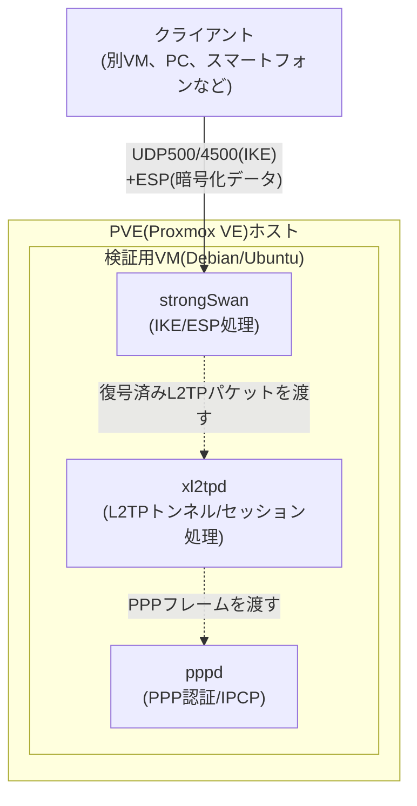

## はじめに

- **この記事で得られること**: 自宅のProxmox VE(PVE)環境に検証用VMを1台立て、strongSwan(IKE/IPsec)とxl2tpd(L2TP)を使ってL2TP/IPsecサーバーを実際に構築し、クライアントから接続した上で、`tcpdump`を使ってIKEフェーズ1→フェーズ2→L2TP制御コネクション→PPPネゴシエーションという接続確立シーケンスを自分の目で確認できるようになります。
- **対象読者**: 自宅にPVEなどの仮想化基盤を持ち、L2TP/IPsecの内部動作を実際に手を動かして検証したいインフラエンジニアを想定しています。
- **読むのにかかる想定時間**: 環境構築・検証を含めて約90分

**この記事について**: 本シリーズは通常、実機・仮想環境での構築手順よりも内部動作の深掘りに紙面を割く方針で書いていますが、この記事は「自作して検証したい」という要望に応えるための、例外的な実践編(ハンズオン教材)です。

この記事は[『上位1%』シリーズ 全記事ガイド](/sitemap)の一部です。

## 前提知識

- **PVE(Proxmox VE)の基本操作**: ISOのアップロード、VMの新規作成、ネットワークブリッジ(`vmbr0`など)へのVM接続ができる程度の知識を前提とします。
- **Linuxの基本操作**: `apt`によるパッケージ管理、`systemctl`によるサービス管理、テキストエディタでの設定ファイル編集ができることを前提とします。
- **L2TP/IPsecの基本用語**: この記事では、IKE(鍵交換)・ESP(暗号化)・L2TP(トンネリング)・PPP(認証・IPアドレス払い出し)・NAT-T(NAT越え)といった用語を、必要な範囲で都度簡潔に説明しながら進めます。

## 全体像をつかむ

### 構築する環境

この記事では、PVE上に1台のLinux VM(サーバー)を立て、そこにIPsec処理を行う**strongSwan**と、L2TPのトンネル・セッション処理を行う**xl2tpd**、PPPのネゴシエーションを行う**pppd**(xl2tpdが内部的に呼び出します)をインストールして、L2TP/IPsecサーバーを構築します。クライアントには、別のVM(Linux)またはお手元のPC・スマートフォンの標準VPN機能を使います。



### 全体の作業の流れ

1. PVE上にサーバー用VMを作成する
2. strongSwan・xl2tpd・pppをインストールする
3. IPsec(strongSwan)を設定する(事前共有鍵によるPSK構成)
4. L2TP(xl2tpd)を設定する
5. PPP認証(chap-secrets)を設定する
6. カーネルのIPフォワーディングとファイアウォールを設定する
7. サービスを起動し、状態を確認する
8. クライアントから接続する
9. `tcpdump`で接続確立シーケンスを実際に観測する
10. NAT配下からの接続(NAT-T)を意図的に発生させて検証する

## 基礎から徹底解説(実際の構築手順)

### Step 0: PVE上にVMを準備する

PVEの管理画面から、Debian 12(または Ubuntu Server 22.04以降)のISOをアップロードし、新規VMを作成します。検証用途であれば、vCPU 1〜2個・メモリ1〜2GB・ディスク8GB程度で十分動作します。

ネットワークの接続方法によって、後述のNAT-T検証のしやすさが変わります。

- **ブリッジ(`vmbr0`)に直結する構成**: VMが家庭内LANのルーターから直接IPアドレスを取得します。クライアントがインターネット越しに接続する構成を模したい場合は、ルーターのポートフォワーディング設定(UDP 500/4500、IPプロトコル番号50)が必要になります。
- **PVE内部にもう1段NATを挟む構成**: VMをNATモードのネットワークに接続すると、クライアント→(NAT)→サーバーという経路になり、意図的にNAT環境を作り出せます。後述の「NAT-Tを意図的に発生させる検証」で使います。

まずはシンプルに、ブリッジ直結でLAN内からの検証から始めることをお勧めします。

### Step 1: 必要なパッケージをインストールする

VMにSSHでログインし、必要なパッケージをインストールします。

```bash
sudo apt update
sudo apt install -y strongswan strongswan-pki libcharon-extra-plugins xl2tpd ppp
```

`libcharon-extra-plugins`には、後述するNAT-D関連の処理を含むIKEのプラグイン群が含まれます。

### Step 2: IPsec(strongSwan)を設定する

まずはシンプルな**事前共有鍵(PSK)方式**で構築します。`/etc/ipsec.conf`を次のように編集します。

```
config setup
    charondebug="ike 1, knl 1, cfg 0"
    uniqueids=no

conn %default
    ikelifetime=60m
    keylife=20m
    rekeymargin=3m
    keyingtries=1
    keyexchange=ikev1

conn L2TP-PSK
    authby=secret
    auto=add
    ike=aes256-sha1-modp1024,aes128-sha1-modp1024,3des-sha1-modp1024!
    esp=aes256-sha1,aes128-sha1,3des-sha1!
    keyingtries=3
    left=%any
    leftprotoport=17/1701
    right=%any
    rightprotoport=17/%any
    type=transport
```

`type=transport`は、「元のIPヘッダーはそのまま残し、その中身だけを暗号化する」というIPsecのトランスポートモードを指定しています。L2TP自身がすでにトンネル機能を持っているため、IPsec側でさらにトンネルモードを重ねる必要がなく、トランスポートモードで足りる、という設計をそのまま反映した設定です。`leftprotoport=17/1701`は「UDP(プロトコル17)のポート1701宛の通信だけをこのIPsecポリシーの対象にする」という指定で、L2TPが使うポートに限定してIPsec保護をかけています。

次に、事前共有鍵を`/etc/ipsec.secrets`に設定します。

```
: PSK "ここに十分な長さ・複雑さの事前共有鍵を設定"
```

パーミッションを絞っておきます。

```bash
sudo chmod 600 /etc/ipsec.secrets
```

### Step 3: L2TP(xl2tpd)を設定する

`/etc/xl2tpd/xl2tpd.conf`を作成します。

```
[global]
port = 1701

[lns default]
ip range = 10.10.10.10-10.10.10.20
local ip = 10.10.10.1
require chap = yes
refuse pap = yes
require authentication = yes
name = L2TPLab
ppp debug = yes
pppoptfile = /etc/ppp/options.xl2tpd
length bit = yes
```

`ip range`が、クライアントに払い出す仮想IPアドレスの範囲です。`local ip`はサーバー側がこのL2TPトンネル内で持つ仮想的なゲートウェイアドレスになります。

### Step 4: PPP認証を設定する

`/etc/ppp/options.xl2tpd`を作成します。

```
require-mschap-v2
ms-dns 8.8.8.8
ms-dns 1.1.1.1
asyncmap 0
auth
crtscts
idle 1800
mtu 1410
mru 1410
nodefaultroute
debug
lock
proxyarp
connect-delay 5000
```

`mtu`/`mru`を1410程度に抑えているのは、L2TP/PPP/ESPなど複数のヘッダーが重なることで実効MTUが縮小するためです(この理屈自体は別記事で詳しく扱っています)。`require-mschap-v2`で、認証方式をMS-CHAPv2に固定しています。

続いて、ユーザー名・パスワードを`/etc/ppp/chap-secrets`に設定します。

```
# client        server  secret                    IP addresses
labuser         L2TPLab "十分な強度のパスワード"      *
```

このファイルもパーミッションを絞ります。

```bash
sudo chmod 600 /etc/ppp/chap-secrets
```

### Step 5: カーネルのIPフォワーディングとファイアウォールを設定する

クライアントが払い出された仮想IPアドレスでインターネットや他のLAN機器にアクセスできるようにするため、IPフォワーディングを有効化します。`/etc/sysctl.conf`に次を追記します。

```
net.ipv4.ip_forward = 1
net.ipv4.conf.all.accept_redirects = 0
net.ipv4.conf.all.send_redirects = 0
```

適用します。

```bash
sudo sysctl -p
```

ファイアウォール(`nftables`または`iptables`)では、IKE・NAT-T・ESP・L2TPに必要なポート/プロトコルを許可し、クライアントの仮想IPアドレス帯がインターネットに出られるようMASQUERADEを設定します(`eth0`は実際のWAN側インターフェース名に置き換えてください)。

```bash
sudo iptables -A INPUT -p udp --dport 500 -j ACCEPT
sudo iptables -A INPUT -p udp --dport 4500 -j ACCEPT
sudo iptables -A INPUT -p udp --dport 1701 -j ACCEPT
sudo iptables -A INPUT -p esp -j ACCEPT
sudo iptables -A FORWARD -s 10.10.10.0/24 -j ACCEPT
sudo iptables -A FORWARD -d 10.10.10.0/24 -j ACCEPT
sudo iptables -t nat -A POSTROUTING -s 10.10.10.0/24 -o eth0 -j MASQUERADE
```

<details>
<summary>なぜUDP1701まで明示的に許可するのか(ESPで暗号化されているはずなのに)</summary>

別記事で解説している通り、ESPのトランスポートモードはUDPポート1701ごと暗号化するため、**経路の途中にある**ファイアウォールやルーターから見ればUDP1701という情報自体は見えません。しかし、このサーバー自身のファイアウォール(`INPUT`チェーン)は事情が異なります。strongSwanのカーネル実装(XFRM)は、ESPパケットを受け取ると復号処理を行った上でOSのネットワークスタックに渡すため、`INPUT`チェーンの評価タイミングによっては、復号後の「宛先UDP1701の平文パケット」として見えることがあります。実装・カーネルバージョンによって挙動が変わりうるため、多くの構築ガイドでは安全側に倒してUDP1701もサーバー自身のファイアウォールでは明示的に許可しておく、という運用が一般的です。

</details>

### Step 6: サービスを起動し、状態を確認する

```bash
sudo systemctl enable --now strongswan-starter xl2tpd
sudo systemctl status strongswan-starter xl2tpd
```

IPsecの状態は次のコマンドで確認できます(接続前は「読み込み済みだが未確立」の状態が表示されます)。

```bash
sudo ipsec statusall
```

### Step 7: クライアントから接続する

**Linux(NetworkManager)の場合**、`network-manager-l2tp`プラグインを使うのが簡単です。

```bash
sudo apt install -y network-manager-l2tp network-manager-l2tp-gnome
```

GUIから「VPNを追加」→「Layer 2 Tunneling Protocol (L2TP)」を選び、ゲートウェイにサーバーのIPアドレス、ユーザー名・パスワードに`chap-secrets`で設定した値、IPsecの事前共有鍵に`ipsec.secrets`で設定した値を入力します。

**Windows・macOS・iOS・Androidの場合**、いずれもOS標準のVPN設定画面から「L2TP/IPsec」(またはそれに相当する種別)を選び、同様にサーバーアドレス・ユーザー名・パスワード・事前共有鍵を入力します。

接続後、サーバー側で次のコマンドを実行すると、確立済みのIPsec SAとL2TPトンネルを確認できます。

```bash
sudo ipsec statusall
sudo journalctl -u xl2tpd -f
```

### Step 8: `tcpdump`で接続確立シーケンスを実際に観測する

ここがこのハンズオンの核心です。クライアントを接続する**前に**、サーバー側で次のコマンドを実行してキャプチャを開始します。

```bash
sudo tcpdump -i any 'udp port 500 or udp port 4500 or udp port 1701' -w /tmp/l2tp-capture.pcap
```

キャプチャを開始した状態でクライアントから接続し、接続完了後に`Ctrl+C`でキャプチャを停止します。取得した`l2tp-capture.pcap`をWiresharkで開くと(SCPなどでファイルを取り出すか、ローカルにWiresharkが入っていれば`tcpdump`のリモートキャプチャ機能でも可)、次のような流れが実際のパケットとして観測できます。

| 観測できるもの | フィルタ例 | 確認できる内容 |
|---|---|---|
| IKEフェーズ1(Main Mode) | `isakmp` | UDP500での鍵交換提案・DH鍵交換・PSK認証のやり取り(6往復のメッセージ) |
| IKEフェーズ2(Quick Mode) | `isakmp` | IPsec SA(ESP)確立の提案・合意 |
| L2TP制御メッセージ | `l2tp` | SCCRQ/SCCRP/SCCCN(トンネル確立)、ICRQ/ICRP/ICCN(セッション確立)——ただしNAT-Tが有効な場合はESPで暗号化されているためWiresharkでは復号なしに中身までは見えません |
| PPPネゴシエーション | (L2TP内にカプセル化) | LCP・CHAP認証・IPCPのやり取り(こちらも暗号化されている場合は中身は見えません) |

**ここで実際に確認してほしいポイント**は、平文で見えるのはUDP500(IKE)のやり取りだけで、UDPポート1701(L2TP)やその中のPPPのやり取りは、ESPによる暗号化が有効になった後は中身が見えなくなる、という点です。ユーザー名・パスワードを使うPPP認証のやり取りが、常にすでに暗号化された経路の中で行われていることを、実際のパケットキャプチャで裏付けられます。strongSwanのデバッグログ(`sudo journalctl -u strongswan-starter -f`)を併用すると、IKEのどのフェーズで何が起きているかをより詳細なテキストで追うこともできます。

## プロが見ている視点(上位1%の理解)

### NAT-Tを意図的に発生させて検証する

前述の「PVE内部にもう1段NATを挟む構成」を使うと、NAT-Tの動作を意図的に発生させて観測できます。PVEでNATモードのネットワーク(`SNAT`されるプライベートネットワーク)にクライアントVMを接続し、そこからサーバーVMへ接続してみてください。

```bash
sudo tcpdump -i any 'udp port 500 or udp port 4500' -w /tmp/nat-t-capture.pcap
```

このキャプチャをWiresharkで確認すると、IKEフェーズ1のメッセージの中にNAT-D(NAT Detection)ペイロードが含まれていること、その後の通信がUDPポート500から **UDPポート4500へフロート(切り替わる)** こと、そしてESPパケットがUDPヘッダーでさらにカプセル化されて送られてくることが、実際のパケットとして確認できます。あわせて、Windowsクライアントを使っている場合は、サーバー自身がNATの内側にある(二重NAT)構成でクライアント側の接続が失敗し、レジストリの`AssumeUDPEncapsulationContextOnSendRule`を`2`に設定することで解決する、という挙動も再現・検証できます。

### PSK運用の弱点を実際の設定ファイルで確認する

`/etc/ipsec.secrets`に設定した事前共有鍵は、接続してくる**すべてのクライアントが同じ値を共有**します。実際に複数の`chap-secrets`エントリ(複数ユーザー)を用意しても、IPsec層の認証は全員が同じPSKを使う構成になっていることを、設定ファイルを見ながら確認してみてください。これは実務でもよく見られる「PSKの使い回し」という構成そのもので、この場合IPsec層は「誰でも同じ鍵でトンネルを開ける」状態になり、実質的な個人認証はPPP層のユーザー名・パスワードにすべて依存することになります。証明書ベースの認証に切り替えることでこの弱点を解消できますが、その場合はCA・クライアント証明書の発行が別途必要になり、構築の難易度が上がります(証明書認証への切り替えは、この記事の範囲を超えるため、別途興味があれば取り組んでみてください)。

## よくある詰まりどころ(トラブルシューティング)

1. **IKE SAがそもそも確立しない**: `sudo journalctl -u strongswan-starter -f`でログを確認し、`NO_PROPOSAL_CHOSEN`のようなエラーが出ていないか確認します。多くの場合、クライアント側とサーバー側で暗号/ハッシュアルゴリズムの提案が一致していないか、ファイアウォールでUDP500/4500が塞がれています。
2. **xl2tpdは起動するがPPPネゴシエーションが進まない**: `chap-secrets`のユーザー名・パスワードのタイプミス、あるいはファイルのパーミッションが厳しすぎて`pppd`が読み取れていないケースがよくあります。`sudo journalctl -u xl2tpd -f`と`/var/log/syslog`のpppd関連ログを確認します。
3. **接続はできるが、クライアントからインターネット・他のLAN機器に到達できない**: `net.ipv4.ip_forward`が有効になっているか、MASQUERADEのiptablesルールが正しいインターフェース名を指しているかを確認します。
4. **NAT配下のWindowsクライアントから接続できない**: サーバー自身もNATの内側にある(二重NAT)構成の場合、Windowsクライアント側でレジストリの`AssumeUDPEncapsulationContextOnSendRule`を設定する必要があります。

## 検証環境のクリーンアップ

検証が完了したら、VMはそのままにしておくと以降の実験(証明書認証への切り替え、NAT-T以外のシナリオの検証など)にも再利用できます。継続して使わない場合は、PVEの管理画面からVMをシャットダウン後に削除するか、設定変更前の状態をスナップショットとして残しておくと、設定を変えて何度も試行錯誤する際に便利です。

## まとめ

- strongSwan(IKE/ESP)・xl2tpd(L2TPトンネル/セッション)・ppp(PPP認証)という3つのコンポーネントを個別にインストール・設定することで、L2TP/IPsecサーバーを自作できます。
- `tcpdump`でIKEフェーズ1・フェーズ2のやり取りを観測すると、UDP500上のIKEメッセージは平文で見える一方、ESPによる暗号化が確立した後のL2TP/PPPのやり取りは中身が見えなくなることを、実際のパケットで確認できます。
- PVE内部にもう1段NATを挟む構成を作ることで、NAT-T(UDPポート4500へのフロート、NAT-Dペイロード)の動作を意図的に発生させて観測できます。
- 事前共有鍵(PSK)を全クライアントで共有する構成の弱点は、実際に設定ファイルを見ることで直感的に理解できます。

**今日から意識すべきこと**
1. 座学で読んだ接続シーケンスは、実際に`tcpdump`で観測して初めて「本当に理解した」と言える段階に到達します。手元の検証環境があるなら、積極的にキャプチャを取る習慣をつけましょう。
2. PSKや設定ファイルのパーミッションなど、検証環境だからと気を抜きがちな部分こそ、本番運用でのセキュリティ意識を養う練習の場になります。

## 参考文献

- [strongSwan Documentation](https://docs.strongswan.org/)
- [xl2tpd | Linux man-pages](https://man7.org/linux/man-pages/man8/xl2tpd.8.html)
- [Proxmox VE Administration Guide](https://pve.proxmox.com/pve-docs/)
- [Configure L2TP/IPsec server behind NAT-T device | Microsoft Learn](https://learn.microsoft.com/en-us/troubleshoot/windows-server/networking/configure-l2tp-ipsec-server-behind-nat-t-device)
