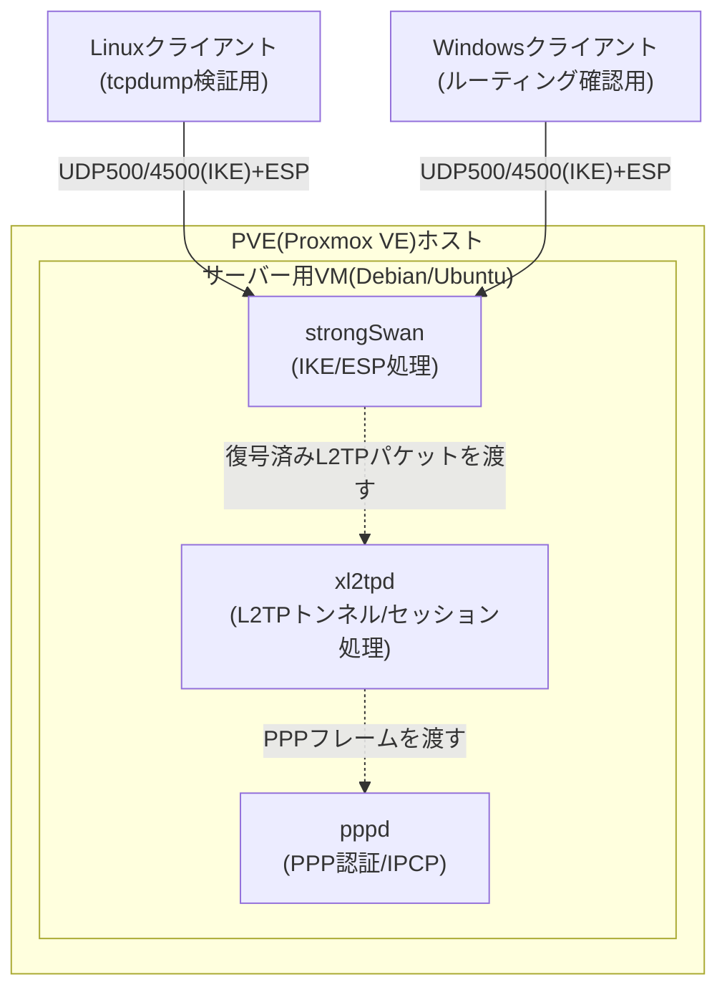

## はじめに

- **この記事で得られること**: [L2TP/IPsecの仕組み](/articles/l2tp-ipsec-guide)・[Windows Server(RRAS)でのL2TP/IPsec VPN構築](/articles/windows-server-l2tp-vpn-guide)・[L2TP/IPsecと現代的なVPNプロトコルの比較](/articles/vpn-protocols-comparison-guide)という3記事で学んだ内容を、自宅のProxmox VE(PVE)環境に実際に構築したL2TP/IPsecサーバーで自分の目で検証できるようになります。座学で読んだ「IKEフェーズ1は6往復かかる」「PPPは点対点リンクだからゲートウェイが要る」「PSKは全クライアントで共有される」といった説明を、パケットキャプチャとクライアントの実際の挙動として体感し、実務・面接で語れる一次情報に変えることが目的です。
- **対象読者**: 上記3記事をすでに読み、自宅にPVEなどの仮想化基盤を持ち、L2TP/IPsecの内部動作を実際に手を動かして検証したいインフラエンジニアを想定しています。3記事の内容(IKE/ESP/L2TP/PPPの役割分担、NAT-T、IKEv1の非効率性)は前提知識として都度深くは繰り返さないため、未読の場合は先にそちらを読むことをお勧めします。
- **読むのにかかる想定時間**: 環境構築・検証を含めて約120分

**この記事について**: 本シリーズは通常、実機・仮想環境での構築手順よりも内部動作の深掘りに紙面を割く方針で書いていますが、この記事は「読んだ理論を自分の手で検証したい」という要望に応えるための、例外的な実践編(ハンズオン教材)です。この記事は[『上位1%』シリーズ 全記事ガイド](/sitemap)の一部です。

## 前提知識

- **PVE(Proxmox VE)の基本操作**: ISOのアップロード、VMの新規作成、ネットワークブリッジ(`vmbr0`など)へのVM接続ができる程度の知識を前提とします。
- **Linuxの基本操作**: `apt`によるパッケージ管理、`systemctl`によるサービス管理、テキストエディタでの設定ファイル編集ができることを前提とします。
- **前提3記事の内容**: IKE(鍵交換)・ESP(暗号化)・L2TP(トンネリング)・PPP(認証・IPアドレス払い出し)・NAT-T(NAT越え)といった用語や、なぜL2TP/IPsecがこの3コンポーネントの組み合わせになっているのかは、[L2TP/IPsecの仕組み](/articles/l2tp-ipsec-guide)で扱った内容を前提とします。

## 全体像をつかむ

### この記事で検証する3つの問い

前提3記事は、それぞれ次のような主張をしていました。この記事では、その主張を実際に自分の目で確かめます。

| 出典記事 | 記事内の主張 | この記事での検証方法 |
|---|---|---|
| [L2TP/IPsecの仕組み](/articles/l2tp-ipsec-guide) | IKEフェーズ1→フェーズ2→L2TPトンネル→PPPネゴシエーションという順序で接続が確立し、NAT配下ではUDP4500へのフロートが起きる | `tcpdump`でパケットキャプチャを取り、実際のシーケンスとNAT-Tの発生を観測する |
| [Windows Server(RRAS)でのL2TP/IPsec VPN構築](/articles/windows-server-l2tp-vpn-guide) | PPPは点対点リンクであり、ARPが使えないためクライアントに明示的なゲートウェイ指定が必要になる | Windowsクライアント接続後の`route print`・`ipconfig /all`で、実際に払い出される仮想インターフェースの状態を確認する |
| [L2TP/IPsecと現代的なVPNプロトコル比較](/articles/vpn-protocols-comparison-guide) | IKEv1のフェーズ1(Main Mode)はフェーズ2と合わせて9往復と、IKEv2の4往復より非効率 | `tcpdump`のタイムスタンプから実際のメッセージ往復回数と所要時間を数え、体感値として記録する |

### 構築する環境

PVE上に1台のLinux VM(サーバー)を立て、そこにIPsec処理を行う**strongSwan**と、L2TPのトンネル・セッション処理を行う**xl2tpd**、PPPのネゴシエーションを行う**pppd**(xl2tpdが内部的に呼び出します)をインストールして、L2TP/IPsecサーバーを構築します。クライアントは、検証内容に応じて次の2種類を用意します。

- **Linuxクライアント(別VM)**: `tcpdump`によるパケットキャプチャや、PVE内部NATを使ったNAT-T誘発検証に使います。
- **Windowsクライアント(PC、または別VM)**: `windows-server-l2tp-vpn-guide`で扱った「ゲートウェイがなぜ必要か」という疑問を、`route print`の実際の出力で確認するために使います。手元にWindows機がなければ、PVE上にWindows VMを1台立てても構いません(評価版ISOで十分です)。



### 全体の作業の流れ

1. PVE上にサーバー用VMを作成する
2. strongSwan・xl2tpd・pppをインストールし、PSK構成でサーバーを立ち上げる
3. Linuxクライアントから接続し、`tcpdump`でIKE→L2TP→PPPのシーケンスとIKEv1の往復回数を実測する
4. Windowsクライアントから接続し、`route print`/`ipconfig`でPPPのゲートウェイ問題を確認する
5. PVE内部にもう1段NATを挟み、NAT-Tを意図的に発生させて観測する
6. PSK運用の弱点を設定ファイルから確認する
7. `iperf3`で単純な性能ベースラインを記録する(次のハンズオンで使います)

## 基礎から徹底解説(実際の構築手順)

### Step 0: PVE上にVMを準備する

PVEの管理画面から、Debian 12(または Ubuntu Server 22.04以降)のISOをアップロードし、サーバー用VMを新規作成します。検証用途であれば、vCPU 1〜2個・メモリ1〜2GB・ディスク8GB程度で十分動作します。Linuxクライアント用にもう1台、同程度のスペックでVMを用意してください。Windowsクライアントは、手元のPCで代用できない場合のみ、別途VMとして用意します。

ネットワークの接続方法によって、後述のNAT-T検証のしやすさが変わります。

- **ブリッジ(`vmbr0`)に直結する構成**: VMが家庭内LANのルーターから直接IPアドレスを取得します。まずはこの構成でLAN内から検証することをお勧めします。
- **PVE内部にもう1段NATを挟む構成**: クライアントVMをNATモードのネットワークに接続すると、クライアント→(NAT)→サーバーという経路になり、意図的にNAT環境を作り出せます。検証3の「NAT-Tを意図的に発生させる検証」で使います。

<details>
<summary>PVE内部にもう1段NATを挟む構成の作り方(検証3で使用)</summary>

Proxmox VEには、VirtualBoxのような「NATモード」のネットワークがあらかじめ用意されているわけではありません。ここでは、Step 4で行うのと**まったく同じ技術(`ip_forward`+`iptables MASQUERADE`)を、PVEホスト自身に対して適用する**ことで、簡易的なNATネットワークを作ります。

1. **物理NICを割り当てない新しいLinuxブリッジを作る**: PVEの管理画面で対象ノードを選び、「System」→「Network」→「Create」→「Linux Bridge」を選択します。`Bridge ports`は空欄のままにし(物理NICと接続しない、PVEホスト内部だけで閉じたブリッジにする)、IPv4アドレスにこのブリッジ自身のアドレス(例: `192.168.100.1/24`)を設定します。名前は`vmbr0`と衝突しないもの(例: `vmbr1`)にします。設定を反映するには、ノードを再起動するか「Apply Configuration」を実行します。
2. **PVEホスト自身でIPフォワーディングを有効にする**: PVEホストのシェルで、サーバーVM側と同じ要領で`/etc/sysctl.conf`に`net.ipv4.ip_forward = 1`を追記し、`sudo sysctl -p`を実行します。
3. **PVEホスト自身にMASQUERADEルールを追加する**: 新しく作ったブリッジ(`vmbr1`)から実際にWANへ出て行くブリッジ(`vmbr0`)へパケットを転送する際に、送信元アドレスを変換します。

   ```bash
   sudo iptables -t nat -A POSTROUTING -s 192.168.100.0/24 -o vmbr0 -j MASQUERADE
   ```

4. **クライアントVMを新しいブリッジに接続する**: クライアントVMの「Hardware」→ネットワークデバイスの接続先ブリッジを`vmbr1`に変更し、VM側で固定IPアドレス(例: `192.168.100.10/24`、ゲートウェイ`192.168.100.1`)を設定します。

これで、クライアントVM→(PVEホストがNAT)→サーバーVMという経路が完成し、クライアントから見るとサーバーは「NATの外側にある」状態になります。Step 4でサーバー用VMに設定したのと同じ`ip_forward`・`MASQUERADE`という2つの仕組みを、今度はPVEホスト自身に適用しているだけだと分かると、NATの正体が「特別な機能」ではなく「経路の途中にあるどのLinuxホストにも仕込める、ごく普通の仕組み」であることが実感できるはずです。

</details>

### Step 1: 必要なパッケージをインストールする

サーバー用VMにSSHでログインし、必要なパッケージをインストールします。

```bash
sudo apt update
sudo apt install -y strongswan strongswan-pki libcharon-extra-plugins xl2tpd ppp
```

`libcharon-extra-plugins`には、NAT-D関連の処理を含むIKEのプラグイン群が含まれます。

### Step 2: IPsec(strongSwan)を設定する

まずはシンプルな**事前共有鍵(PSK)方式**で構築します。`/etc/ipsec.conf`を次のように編集します。

```
config setup
    charondebug="ike 1, knl 1, cfg 0"
    uniqueids=no

conn %default
    ikelifetime=60m
    keylife=20m
    rekeymargin=3m
    keyingtries=1
    keyexchange=ikev1

conn L2TP-PSK
    authby=secret
    auto=add
    ike=aes256-sha1-modp1024,aes128-sha1-modp1024,3des-sha1-modp1024!
    esp=aes256-sha1,aes128-sha1,3des-sha1!
    keyingtries=3
    left=%any
    leftprotoport=17/1701
    right=%any
    rightprotoport=17/%any
    type=transport
```

`type=transport`は、[L2TP/IPsecの仕組み](/articles/l2tp-ipsec-guide)で説明した「L2TP自身がすでにトンネル機能を持っているため、IPsec側でさらにトンネルモードを重ねる必要がない」という設計をそのまま反映した設定です。`leftprotoport=17/1701`は、UDP(プロトコル17)のポート1701宛の通信だけをこのIPsecポリシーの対象にする指定です。

`left`/`right`は「サーバー側」「クライアント側」という役割を指すのではなく、**「この設定ファイルを読み込んでいる自分自身」が`left`、「通信相手」が`right`**という意味です。同じトンネルでも、サーバー側の`ipsec.conf`から見れば自分が`left`・クライアントが`right`ですが、クライアント側の`ipsec.conf`から見ればその逆(自分が`left`・サーバーが`right`)になります。上記のサーバー側設定で`left=%any`・`right=%any`としているのは、「相手が誰であっても(不特定多数のクライアントを)受け付ける」という意味です。後述する検証1のクライアント側設定では、`left=%defaultroute`(自分のWAN側アドレスを自動検出)・`right=<サーバーのIPアドレス>`(相手を明示的に指定)という、非対称な値になります。

<details>
<summary>ここまでで触れていない設定項目の意味(ipsec.conf)</summary>

- **`ikelifetime`/`keylife`/`rekeymargin`/`keyingtries`**: `ikelifetime`はIKE SA(フェーズ1で確立する鍵交換用の管理チャネル)の寿命、`keylife`はIPsec SA(フェーズ2で確立する実際の暗号化通信用の鍵)の寿命です。`rekeymargin`は寿命が切れる何分前から再鍵交換(rekey)を始めるかの猶予時間で、`keyingtries`は鍵交換に失敗したときの再試行回数です。SAの寿命を短くするほど鍵の使い回し期間が減り安全側に倒せますが、再鍵交換の頻度が増えるトレードオフがあります。

</details>

次に、事前共有鍵を`/etc/ipsec.secrets`に設定し、パーミッションを絞ります。

```
: PSK "ここに十分な長さ・複雑さの事前共有鍵を設定"
```

```bash
sudo chmod 600 /etc/ipsec.secrets
```

`chmod 600`は「所有者(root)のみ読み書き可、それ以外のユーザーは読み取りすら不可」にするパーミッション設定です。このファイルには事前共有鍵が平文で書かれているため、もしパーミッションが緩いままだと、同じサーバー上の他の一般ユーザーアカウントから鍵を読み取られてしまいます。実際strongSwanは起動時にこのファイルのパーミッションが緩すぎると警告を出します。

この「全クライアント共有のPSK」が持つ弱点は、Step 6で実際に確認します。

### Step 3: L2TP(xl2tpd)とPPP認証を設定する

`/etc/xl2tpd/xl2tpd.conf`を作成します。

```
[global]
port = 1701

[lns default]
ip range = 10.10.10.10-10.10.10.20
local ip = 10.10.10.1
require chap = yes
refuse pap = yes
require authentication = yes
name = L2TPLab
ppp debug = yes
pppoptfile = /etc/ppp/options.xl2tpd
length bit = yes
```

`ip range`が、クライアントに払い出す仮想IPアドレスの範囲、`local ip`がサーバー側の仮想ゲートウェイアドレスです。この`local ip`こそ、Step 4でWindowsクライアントの`route print`を見るときにゲートウェイとして表示される値です。

<details>
<summary>ここまでで触れていない設定項目の意味(xl2tpd.conf)</summary>

- **`require chap`/`refuse pap`**: PPP認証方式のうち、CHAP(チャレンジレスポンス方式でパスワード自体は流さない)を必須にし、PAP(パスワードをほぼ平文で送る古い方式)を明示的に拒否する設定です。ESPで暗号化された経路の中とはいえ、認証方式自体の強度も下げないための指定です。

</details>

続いて`/etc/ppp/options.xl2tpd`を作成します。

```
require-mschap-v2
ms-dns 8.8.8.8
ms-dns 1.1.1.1
asyncmap 0
auth
crtscts
idle 1800
mtu 1410
mru 1410
nodefaultroute
debug
proxyarp
connect-delay 5000
```

`mtu`/`mru`を1410程度に抑えているのは、L2TP/PPP/ESPなど複数のヘッダーが重なることで実効MTUが縮小するためです。`require-mschap-v2`で認証方式をMS-CHAPv2に固定しています。ユーザー名・パスワードを`/etc/ppp/chap-secrets`に設定します。

<details>
<summary>ここまでで触れていない設定項目の意味(options.xl2tpd)</summary>

- **`nodefaultroute`**: クライアント側でこのPPPリンクを既定のゲートウェイ(デフォルトルート)として自動採用しない設定です。VPN接続時に全トラフィックがVPN経由になる「フルトンネル」を避け、VPN宛のトラフィックだけがこのリンクを通る「スプリットトンネル」にするための指定です。
- **`proxyarp`**: サーバーが、PPPクライアントに払い出した仮想IPアドレス宛のARP要求に対して、サーバー自身のMACアドレスで代理応答する設定です。クライアントの仮想IPは物理LAN上に実在しないため、これがないとLAN上の他機器からクライアント宛の通信が届きません。

</details>

<details>
<summary>あえて含めていない項目: lock</summary>

`lock`は、pppdが使用中のシリアルデバイスに対してUUCPスタイルのロックファイル(`/var/lock/LCK..<デバイス名>`)を作成し、同じデバイスへの多重アクセスを防ぐオプションです。しかし`pppol2tp`プラグイン経由のL2TP接続には、ロック対象となる実体のあるシリアルデバイスが存在しません。この状態で`lock`を指定するとpppdが正常に起動できず、`ppp0`インターフェースが作成されないという分かりにくい失敗の仕方をします(エラーメッセージが明確に出ないこともあります)。L2TP接続の設定ファイルには含めないでください。

</details>

```
# client        server  secret                    IP addresses
labuser         *       "十分な強度のパスワード"      *
```

```bash
sudo chmod 600 /etc/ppp/chap-secrets
```

こちらも`ipsec.secrets`と同じ理由(ユーザー名・パスワードが平文で書かれているため)で、所有者以外は読み取れないようパーミッションを絞っています。

`chap-secrets`の各行は`クライアント名 サーバー名 シークレット 許可IPアドレス`の4フィールドです。2番目の「サーバー名」は、pppdが認証者として動作する際に**自分自身の名前として名乗っている値**とのマッチングに使われますが、この値は呼び出し元(xl2tpdやWindows側のRRASクライアント)によって実際に何が渡されるかが揺れることがあります。ここを`L2TPLab`のように固定値で書いてしまうと、想定と異なる名乗り方をするクライアント(後述のWindowsクライアントなど)からの認証が、ログ上はっきりしたエラーが出ないまま失敗することがあるため、本記事では最初から`*`(ワイルドカード、誰でも可)にしています。

### Step 4: カーネルのIPフォワーディングとファイアウォールを設定する

`/etc/sysctl.conf`に次を追記し、適用します。

```
net.ipv4.ip_forward = 1
net.ipv4.conf.all.accept_redirects = 0
net.ipv4.conf.all.send_redirects = 0
```

```bash
sudo sysctl -p
```

ここで設定している3つの値の意味は次の通りです。

| 設定項目 | 意味 |
|---|---|
| `net.ipv4.ip_forward = 1` | カーネルに、自分宛ではないパケットを別のインターフェースへ転送(ルーティング)する機能を有効にします。デフォルトでは無効(`0`)になっており、これを`1`にしないと、サーバーはVPNクライアントからのパケットを外部(インターネットやLAN)へ中継できません。 |
| `net.ipv4.conf.all.accept_redirects = 0` | ICMPリダイレクト(「もっと近いルーターがあるよ」と経路変更を促すパケット)を受け取っても、自分の経路情報を書き換えないようにします。悪意のあるICMPリダイレクトによって経路を乗っ取られる攻撃を防ぐための設定です。 |
| `net.ipv4.conf.all.send_redirects = 0` | 逆に、自分からICMPリダイレクトを送信しないようにします。このサーバーは単純なVPNゲートウェイであり、他の経路への転送を案内する複雑なルーターとして振る舞う必要がないためです。 |

ファイアウォール(`iptables`)では、IKE・NAT-T・ESP・L2TPに必要なポート/プロトコルを許可し、クライアントの仮想IPアドレス帯がインターネットに出られるようMASQUERADEを設定します(`eth0`は実際のWAN側インターフェース名に置き換えてください)。インターフェース名がわからない場合は、次のコマンドでデフォルトルート(≒WAN側)に使われているインターフェースを確認できます。

```bash
ip route show default
```

`default via <ゲートウェイのIP> dev <インターフェース名>`のように表示される`dev`の後ろの値が、置き換え対象のインターフェース名です。複数のNICがある環境(たとえばStep 0でNAT-T検証用に2つ目のネットワークを追加した場合など)では、どれがWAN側のインターフェースかを一覧から目視で判断するより、デフォルトルート(≒インターネットへの出口)を直接尋ねるこのコマンドの方が確実です。

```bash
sudo iptables -A INPUT -p udp --dport 500 -j ACCEPT
sudo iptables -A INPUT -p udp --dport 4500 -j ACCEPT
sudo iptables -A INPUT -p udp --dport 1701 -j ACCEPT
sudo iptables -A INPUT -p esp -j ACCEPT
sudo iptables -A FORWARD -s 10.10.10.0/24 -j ACCEPT
sudo iptables -A FORWARD -d 10.10.10.0/24 -j ACCEPT
sudo iptables -t nat -A POSTROUTING -s 10.10.10.0/24 -o eth0 -j MASQUERADE
```

<details>
<summary>なぜUDP1701まで明示的に許可するのか(ESPで暗号化されているはずなのに)</summary>

ESPのトランスポートモードはUDPポート1701ごと暗号化するため、**経路の途中にある**ファイアウォールやルーターから見ればUDP1701という情報自体は見えません。しかし、このサーバー自身のファイアウォール(`INPUT`チェーン)は事情が異なります。strongSwanのカーネル実装(XFRM)は、ESPパケットを受け取ると復号処理を行った上でOSのネットワークスタックに渡すため、`INPUT`チェーンの評価タイミングによっては、復号後の「宛先UDP1701の平文パケット」として見えることがあります。実装・カーネルバージョンによって挙動が変わりうるため、多くの構築ガイドでは安全側に倒してUDP1701もサーバー自身のファイアウォールでは明示的に許可しておく、という運用が一般的です。

</details>

サービスを起動します。

```bash
sudo systemctl enable --now strongswan-starter xl2tpd
sudo systemctl status strongswan-starter xl2tpd
sudo ipsec statusall
```

## 検証1: LinuxクライアントとtcpdumpでL2TP/IPsecの理論を確かめる

### クライアントから接続する

Linuxクライアント(別VM)に、サーバーと同じ**strongSwan**・**xl2tpd**・**ppp**をインストールし、CLIだけで接続します。サーバー構築時にすでに使った知識をそのまま流用できるうえ、後述の理由によりこの方法がおすすめです。

```bash
sudo apt update
sudo apt install -y strongswan xl2tpd ppp
```

<details>
<summary>NetworkManagerのGUIプラグイン(network-manager-l2tp)を使わない理由</summary>

Ubuntu/DebianのGNOME環境でL2TP/IPsec接続をGUIから設定したい場合、`network-manager-l2tp`(NetworkManager用のL2TP/IPsecプラグイン本体)と`network-manager-l2tp-gnome`(その設定画面を提供するGUIパネル)という2つのパッケージがあります。

```bash
sudo apt install -y network-manager-l2tp network-manager-l2tp-gnome
```

ただし`network-manager-l2tp-gnome`はGNOMEのデスクトップ環境一式に依存するため、CLIのみのServer版イメージ(Debian/Ubuntu Server)にこれをインストールしようとすると、`sudo apt install -y ubuntu-desktop`のようなデスクトップ環境そのものが芋づる式に入ってきます。検証用に確保した8GB程度のディスクでは、これだけで容量不足(`No space left on device`)になり失敗するケースがあります。GUIでの接続を試したい場合は、クライアントVMのディスクを20GB以上に拡張するか、`ubuntu-desktop-minimal`のような軽量なデスクトップ環境の利用を検討してください。本記事では、この容量問題を避けられ、かつサーバー構築時の知識をそのまま流用できるCLIでの接続方法を本文の手順として採用しています。

</details>

まず`/etc/ipsec.conf`にクライアント用の接続定義を追記します。サーバー側の`conn L2TP-PSK`とほぼ同じ内容ですが、`right`にサーバーのIPアドレスを指定する点が異なります。

```
conn L2TP-PSK
    authby=secret
    auto=add
    keyexchange=ikev1
    ike=aes256-sha1-modp1024,aes128-sha1-modp1024,3des-sha1-modp1024!
    esp=aes256-sha1,aes128-sha1,3des-sha1!
    type=transport
    left=%defaultroute
    leftprotoport=17/1701
    right=<サーバーのIPアドレス>
    rightprotoport=17/1701
```

`/etc/ipsec.secrets`にも、サーバー側と同じ事前共有鍵を設定します。

```
: PSK "サーバー側のipsec.secretsに設定したものと同じ事前共有鍵"
```

```bash
sudo chmod 600 /etc/ipsec.secrets
```

次に`/etc/xl2tpd/xl2tpd.conf`に、接続先サーバーを指す`lac`(LAC: L2TP Access Concentrator、L2TPのクライアント側を指す用語。サーバー側の`lns`(L2TP Network Server)と対になります)セクションを追記します。

```
[lac L2TPLab]
lns = <サーバーのIPアドレス>
ppp debug = yes
pppoptfile = /etc/ppp/options.l2tpd.client
length bit = yes
```

`xl2tpd.conf`はデフォルトで大量のサンプル行が`;`(セミコロン、コメント記号)付きでコメントアウトされた状態になっています。**上記のように新規で追記する場合は問題ありませんが、もし既存のサンプル行(`; [lac marko]`など)を元にコピー&編集する場合は、行頭の`;`を消し忘れないよう注意してください。** `;`が残ったままだとセクション全体が無効なコメント行として読み飛ばされ、`xl2tpd`がこのセクションの存在自体に気づけません。

<details>
<summary>`[lac L2TPLab]`には`=`による値の設定がないのに、なぜこれで有効化されるのか</summary>

`xl2tpd.conf`のようなINI形式の設定ファイルには、`key = value`という**設定項目の行**と、`[セクション名]`という**セクションの見出し行**の2種類があります。`[lac L2TPLab]`は後者で、「ここから`L2TPLab`という名前のLACセクションが始まる」という宣言そのものが情報であり、`=`で何かの値を設定しているわけではありません。`xl2tpd`の設定パーサーは、コメントアウトされていない`[lac <名前>]`セクションを見つけると、それだけで「このLAC定義は有効である」と認識し、内部にLACの一覧として登録します(`enable = yes`のような別のフラグを立てる仕組みは存在しません)。つまり、このセクションが「存在し、かつコメントアウトされていない」こと自体が、有効/無効を切り替えるスイッチの役割を果たしています。エラー調査の基本的な考え方や`journalctl`の使い方は[journalctlでエラーログを調査する](/articles/linux-journalctl-guide)で詳しく扱っています。

</details>

pppdのオプションファイル`/etc/ppp/options.l2tpd.client`を作成します。

```
ipcp-accept-local
ipcp-accept-remote
refuse-eap
require-mschap-v2
noccp
noauth
idle 1800
mtu 1410
mru 1410
defaultroute
usepeerdns
debug
connect-delay 5000
name labuser
```

サーバー側と同じ理由で、`lock`は含めていません(pppol2tp経由の接続にはロック対象の実デバイスが存在しないため)。

`name labuser`は、サーバー側の`/etc/ppp/chap-secrets`に登録したユーザー名です。クライアント側にも同じ内容のファイルを用意します(pppdはCHAP認証時にこのファイルを参照して自分の名乗る名前・パスワードを決めます)。

```
# client        server  secret                    IP addresses
labuser         L2TPLab "サーバー側と同じパスワード"      *
```

```bash
sudo chmod 600 /etc/ppp/chap-secrets
```

設定が揃ったら、サービスを起動して接続します。

```bash
sudo systemctl restart strongswan-starter xl2tpd
sudo ipsec up L2TP-PSK
sudo xl2tpd-control connect-lac L2TPLab
```

`xl2tpd-control`のサブコマンドは`connect`ではなく`connect-lac`です(`xl2tpd-control --help`で一覧を確認できます)。`connect-lac`/`disconnect-lac`はこちらがLAC(クライアント)としてトンネルを張る/切るコマンドで、サーバー側で使う`add-lns`/`status-lns`などLNS向けのコマンドとは別に用意されています。

接続に成功すると、`ppp0`という仮想インターフェースが作成されます。

```bash
ip a show ppp0
```

うまく`ppp0`が現れない場合は、`sudo ipsec statusall`でIKE/IPsec SAが確立しているか、`sudo journalctl -u xl2tpd -f`でL2TP/PPPネゴシエーションのログを確認してください。xl2tpd自身のログにエラーが見当たらないのにppp0が現れない場合は、xl2tpdが子プロセスとして起動する`pppd`側のログを見る必要があります。`pppd`はsystemdのユニットではなくsyslogの識別子(identifier)としてログを出すため、`-u`ではなく`-t`オプションで絞り込みます。

```bash
sudo journalctl -t pppd -n 30 --no-pager
```

### 接続を切断する

次のtcpdumpによるキャプチャは、接続を確立する**瞬間**のパケットを観測するのが目的です。ここまでの手順ですでに`ppp0`が確立している状態のままキャプチャを始めると、新しいネゴシエーションではなく、確立済みのトンネルが送る定期的なキープアライブ(Hello/ZLBメッセージ)しか映らず、期待したMain Mode→Quick Mode→L2TPという順序が観測できません。そこで、キャプチャの前に一度切断します。

```bash
sudo xl2tpd-control disconnect-lac L2TPLab
sudo ipsec down L2TP-PSK
```

### `tcpdump`で接続確立シーケンスを観測する

切断できたら、クライアントを接続する**前に**、サーバー側でキャプチャを開始します。

```bash
sudo tcpdump -i any 'udp port 500 or udp port 4500 or udp port 1701' -w /tmp/l2tp-capture.pcap
```

キャプチャを開始した状態で、上で使った`ipsec up L2TP-PSK`→`xl2tpd-control connect-lac L2TPLab`を再度実行して接続し、接続完了後に`Ctrl+C`でキャプチャを停止します。取得した`l2tp-capture.pcap`をWiresharkで開くと、次のような流れが実際のパケットとして観測できます。

| 観測できるもの | フィルタ例 | 確認できる内容 |
|---|---|---|
| IKEフェーズ1(Main Mode) | `isakmp` | UDP500での鍵交換提案・DH鍵交換・PSK認証のやり取り(6往復のメッセージ) |
| IKEフェーズ2(Quick Mode) | `isakmp` | IPsec SA(ESP)確立の提案・合意(3往復) |
| L2TP制御メッセージ | `l2tp` | SCCRQ/SCCRP/SCCCN(トンネル確立)、ICRQ/ICRP/ICCN(セッション確立)——NAT-Tが有効な場合はESPで暗号化されているため中身までは見えません |
| PPPネゴシエーション | (L2TP内にカプセル化) | LCP・CHAP認証・IPCPのやり取り(こちらも暗号化されている場合は中身は見えません) |

平文で見えるのはUDP500(IKE)のやり取りだけで、UDPポート1701(L2TP)やその中のPPPのやり取りは、ESPによる暗号化が有効になった後は中身が見えなくなります。ユーザー名・パスワードを使うPPP認証のやり取りが、常にすでに暗号化された経路の中で行われていることを、実際のパケットキャプチャで裏付けられます。

<details>
<summary>Main Mode/Quick Modeより前にL2TPのHello/ZLBが見える場合</summary>

理論通りなら`isakmp`(Main Mode→Quick Mode)が先に来て、その後に`l2tp`のトンネル確立メッセージが続くはずです。もしキャプチャの先頭にIKEより前の`l2tp`の`Hello`/`ZLB`メッセージが見えている場合、それは新規のネゴシエーションではなく、**切断し忘れて既存のトンネルが残ったまま**キャプチャを開始してしまい、そのトンネルが送っている定期的なキープアライブを拾ってしまった可能性が高いです。上の「接続を切断する」の手順通り、キャプチャ開始前に確実に`ipsec down`/`xl2tpd-control disconnect-lac`で切断してから接続し直すと、理論通りの順序で観測できます。

</details>

### IKEv1の「9往復」を実際に数える

[L2TP/IPsecと現代的なVPNプロトコル比較](/articles/vpn-protocols-comparison-guide)では、IKEv1がフェーズ1(Main Mode、6往復)+フェーズ2(Quick Mode、3往復)の計9往復かかる一方、IKEv2は基本交換だけで4往復に簡略化されていると説明しました。この差を、実際のキャプチャで確認します。

Wiresharkで`isakmp`フィルタをかけ、`Time`列を見ながら最初のISAKMPパケットから最後のISAKMPパケットまでの数と経過時間を数えてみてください。同一LAN内であれば所要時間そのものは数十ミリ秒程度とごく短いはずですが、パケット数を数えると理論通り9往復(18パケット前後、実装によりリトライ等で前後します)になっていることが確認できます。この後のハンズオン(STEP4)でWireGuardの鍵交換(1往復程度)と比較する際の実測値として、ここでの観測結果を控えておいてください。

## 検証2: WindowsクライアントでPPPのゲートウェイ問題を確認する

[Windows Server(RRAS)でのL2TP/IPsec VPN構築](/articles/windows-server-l2tp-vpn-guide)では、「クライアントも社内サーバーも同じサブネットに見えるのに、なぜVPNクライアント側でゲートウェイの指定が必要になるのか」という疑問を、PPPが点対点リンクであるという性質から説明しました。ここでは、その現象を実際のWindowsクライアントの挙動として確認します。

Windows標準のVPN設定画面(設定→ネットワークとインターネット→VPN→VPN接続を追加)から、種類に「L2TP/IPsec(事前共有キー)」を選び、サーバーアドレス・ユーザー名・パスワード・事前共有鍵を入力して接続します。接続後、コマンドプロンプトで次を実行します。

```
ipconfig /all
route print
```

`ipconfig /all`では、PPPアダプター(通常「イーサネット アダプター PPP接続」のような名前で表示されます)に、`xl2tpd.conf`の`ip range`から払い出された仮想IPアドレスが設定されていることを確認できます。ここで着目してほしいのは、**サブネットマスクが`255.255.255.255`になっている点**です。これは、このリンクが「ネットワーク」ではなく「1対1の専用リンク」として扱われていることの直接的な証拠です。

続いて`route print`で、このPPPアダプター経由のルートエントリを確認します。ここで注意が必要なのは、**ゲートウェイの欄に`xl2tpd.conf`の`local ip`(`10.10.10.1`)がそのまま数値で表示されるわけではない**ことです。実際には、`0.0.0.0/0`(既定ルート)や`10.10.10.10/32`(自分自身の払い出しIP)宛の行のゲートウェイ欄が「リンク上」(on-link)と表示されます。

これは矛盾ではなく、むしろ「点対点リンクだから」という主張をさらに裏付ける結果です。イーサネットのような通常のネットワークでは、同じセグメント内の複数の宛先の中から「次にどのIPへパケットを投げるべきか」をゲートウェイの数値で明示する必要があります。しかしPPPのような1対1の専用リンクには、**そもそも次のホップになり得る相手が1つしか存在しません**。行き先の候補が1つしかないなら、それは事実上「リンクの向こう側(オンリンク)に投げれば必ず届く」のと同じであり、OS側であえて`10.10.10.1`という数値を明示する必要がない、というのがWindowsの実装上の解釈です。`ipconfig /all`で見た「サブネットマスクが`255.255.255.255`」という特徴と合わせて、「相手が1つしかいないリンクにはARPも、数値としての明示的なゲートウェイも、そもそも必要ない」という一段深い理解につながります。

## 検証3: NAT-Tを意図的に発生させて検証する

Step 0で用意した「PVE内部にもう1段NATを挟む構成」を使うと、NAT-Tの動作を意図的に発生させて観測できます。PVEでNATモードのネットワーク(SNATされるプライベートネットワーク)にLinuxクライアントVMを接続し、そこからサーバーVMへ接続してみてください。

```bash
sudo tcpdump -i any 'udp port 500 or udp port 4500' -w /tmp/nat-t-capture.pcap
```

このキャプチャをWiresharkで確認すると、IKEフェーズ1のメッセージの中にNAT-D(NAT Detection)ペイロードが含まれていること、その後の通信がUDPポート500から**UDPポート4500へフロート(切り替わる)**こと、そしてESPパケットがUDPヘッダーでさらにカプセル化されて送られてくることが、実際のパケットとして確認できます。あわせて、Windowsクライアントを使っている場合は、サーバー自身がNATの内側にある(二重NAT)構成でクライアント側の接続が失敗し、レジストリの`AssumeUDPEncapsulationContextOnSendRule`を`2`に設定することで解決する、という挙動も再現・検証できます。

## 検証4: PSK運用の弱点を実際の設定ファイルで確認する

`/etc/ipsec.secrets`に設定した事前共有鍵は、接続してくる**すべてのクライアントが同じ値を共有**します。複数の`chap-secrets`エントリ(複数ユーザー)を用意しても、IPsec層の認証は全員が同じPSKを使う構成になっていることを、設定ファイルを見ながら確認してみてください。これは実務でもよく見られる「PSKの使い回し」という構成そのもので、この場合IPsec層は「誰でも同じ鍵でトンネルを開ける」状態になり、実質的な個人認証はPPP層のユーザー名・パスワードにすべて依存することになります。証明書ベースの認証への切り替えはこの記事の範囲を超えるため、次のハンズオン(STEP4: IKEv2/IPsecへの証明書認証移行)で扱います。

## プロが見ている視点(上位1%の理解):性能ベースラインを記録する

`iperf3`を使って、このL2TP/IPsecトンネル越しの単純なスループットを計測し、記録しておきます。サーバー側で`iperf3 -s`を実行し、クライアント側(トンネル経由)から次を実行します。

```bash
iperf3 -c <サーバーの仮想IPアドレス> -t 30
```

得られたスループット(Mbps)と、Step 3で観測したIKEネゴシエーションの所要時間を、次のハンズオン(STEP4: OpenVPN/WireGuardとの性能比較)のために控えておいてください。L2TP/IPsecはIPsec(ESP)のカーネル空間実装(XFRM)を活用できるため、[L2TP/IPsecと現代的なVPNプロトコル比較](/articles/vpn-protocols-comparison-guide)で説明した「IPsec系・WireGuardの方がOpenVPNより有利」という傾向が、自分の環境でどう現れるかを比較する基準値になります。

## よくある詰まりどころ(トラブルシューティング)

このハンズオンで実際によく発生する事象を、「まずどのコマンドで確認するか」を軸に一覧にしています。より詳しい原因の解説やケース別のFAQは、記事末尾のFAQセクションと[journalctlでエラーログを調査する](/articles/linux-journalctl-guide)も参照してください。

1. **IKE SAがそもそも確立しない**: `sudo journalctl -u strongswan-starter -f`でログを確認し、`NO_PROPOSAL_CHOSEN`のようなエラーが出ていないか確認します。多くの場合、クライアント側とサーバー側で暗号/ハッシュアルゴリズムの提案が一致していないか、ファイアウォールでUDP500/4500が塞がれています。
2. **`xl2tpd.conf`のセクションが認識されない**: `sudo journalctl -u xl2tpd`に`parse_config`関連のエラーが出ている場合、該当セクション(`[lac ...]`など)の行頭に`;`が残っていないか確認してください。
3. **xl2tpdは起動するがPPPネゴシエーションが進まない**: `chap-secrets`のユーザー名・パスワードのタイプミス、あるいはファイルのパーミッションが厳しすぎて`pppd`が読み取れていないケースがよくあります。`sudo journalctl -u xl2tpd -f`に加えて、`sudo journalctl -t pppd -n 30 --no-pager`でpppd自身のログ(syslog識別子`pppd`)を確認します。
4. **`ipsec`/`xl2tpd`のSAは確立しているのに`ppp0`が作成されない**: `sudo journalctl -t pppd`で確認できるオプションファイル(`options.xl2tpd`/`options.l2tpd.client`)のタイポや、`lock`のような環境によっては使えないオプションが原因であることが多いです。
5. **`xl2tpd-control`実行時に`error: no such command`**: サブコマンドは`connect`/`disconnect`ではなく`connect-lac`/`disconnect-lac`です。
6. **接続はできるが、クライアントからインターネット・他のLAN機器に到達できない**: `net.ipv4.ip_forward`が有効になっているか、MASQUERADEのiptablesルールが正しいインターフェース名を指しているかを確認します。
7. **Windowsクライアントの`route print`にPPPのルートが出てこない**: 接続直後は反映に数秒かかることがあります。`ipconfig /all`でPPPアダプター自体が生成されているかを先に確認してください。なお正常な場合でも、ゲートウェイ欄は数値ではなく「リンク上」と表示されます。
8. **NAT配下のWindowsクライアントから接続できない**: サーバー自身もNATの内側にある(二重NAT)構成の場合、Windowsクライアント側でレジストリの`AssumeUDPEncapsulationContextOnSendRule`を設定する必要があります。

## 検証環境のクリーンアップ

検証が完了したら、VMはそのままにしておくと以降の実験(次のハンズオンでのOpenVPN/WireGuard構築、IKEv2への証明書認証移行など)にも再利用できます。継続して使わない場合は、PVEの管理画面からVMをシャットダウン後に削除するか、設定変更前の状態をスナップショットとして残しておくと便利です。

## まとめ

- strongSwan(IKE/ESP)・xl2tpd(L2TPトンネル/セッション)・ppp(PPP認証)という3つのコンポーネントを個別にインストール・設定することで、L2TP/IPsecサーバーを自作できます。
- `tcpdump`でIKEフェーズ1・フェーズ2のやり取りを観測すると、平文で見えるのはUDP500上のIKEメッセージだけであること、そしてIKEv1が理論通り9往復のメッセージ交換を行っていることを、実際のパケットで確認できます。
- Windowsクライアントの`route print`/`ipconfig`を見ると、PPPアダプターのサブネットマスクが`255.255.255.255`になっていること、そして既定ルートのゲートウェイ欄が数値ではなく「リンク上」と表示される(=次のホップの候補がリンクの相手1つしかない)ことから、「PPPは点対点リンクである」という主張を実機で裏付けられます。
- PVE内部にもう1段NATを挟む構成で、NAT-T(UDPポート4500へのフロート、NAT-Dペイロード)の動作を意図的に発生させて観測できます。
- 事前共有鍵(PSK)を全クライアントで共有する構成の弱点は、実際に設定ファイルを見ることで直感的に理解できます。
- `iperf3`で記録した性能ベースラインは、次のハンズオン(OpenVPN/WireGuardとの性能比較)で使います。

**今日から意識すべきこと**
1. 座学で読んだ接続シーケンスや性能特性は、実際に`tcpdump`や`iperf3`で観測して初めて「本当に理解した」と言える段階に到達します。手元の検証環境があるなら、積極的に数値を取る習慣をつけましょう。
2. PSKや設定ファイルのパーミッションなど、検証環境だからと気を抜きがちな部分こそ、本番運用でのセキュリティ意識を養う練習の場になります。

## 参考文献

- [strongSwan Documentation](https://docs.strongswan.org/)
- [xl2tpd | Linux man-pages](https://man7.org/linux/man-pages/man8/xl2tpd.8.html)
- [Proxmox VE Administration Guide](https://pve.proxmox.com/pve-docs/)
- [Configure L2TP/IPsec server behind NAT-T device | Microsoft Learn](https://learn.microsoft.com/en-us/troubleshoot/windows-server/networking/configure-l2tp-ipsec-server-behind-nat-t-device)
- [iPerf - The TCP, UDP and SCTP network bandwidth measurement tool](https://iperf.fr/)
