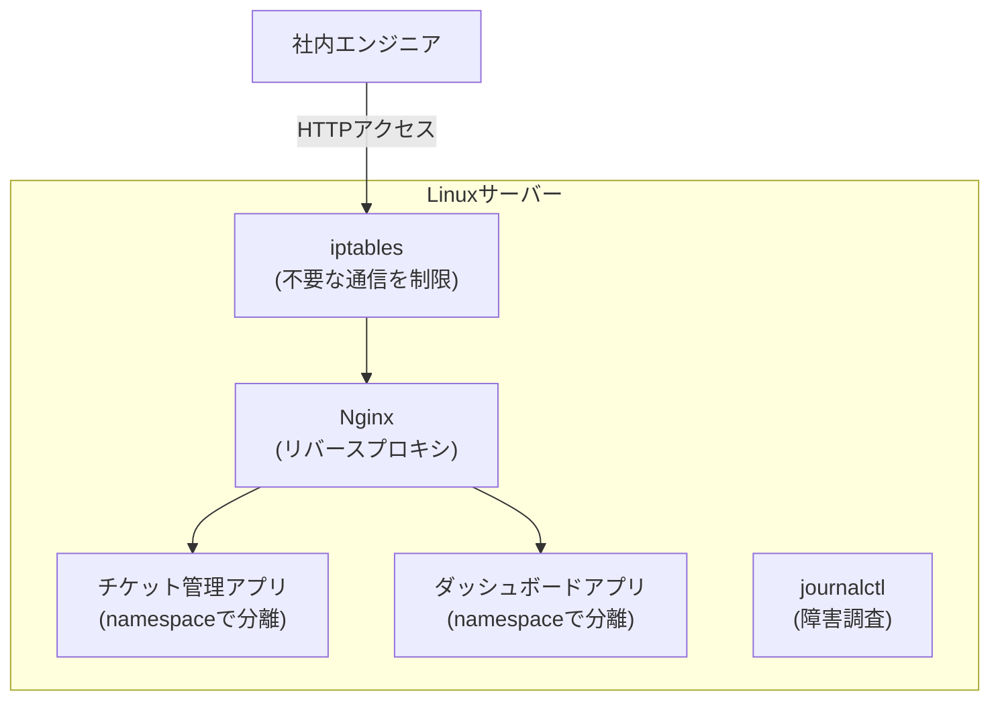

## はじめに

- **この記事で得られること**: ここまでのハンズオンで、1つずつ個別に習得してきた技術(findコマンドでの調査、Nginxによるリバースプロキシ構築、namespaceによるプロセス分離、SUIDを避けたCapabilitiesによる最小権限設計)と、座学で学んだ知識(デーモン・パーミッション・iptables・journalctl・設定ファイルの反映)を、**1つの架空の社内開発プラットフォームへ、自分の力で統合する**、Linux基盤学科の卒業制作です。これまでの記事が「手順をなぞって、1つの技術を確実に身につける」ことを目的としていたのに対し、この記事は**要件だけを提示し、どの技術を、どう組み合わせるかを、自分で設計する**という、実務そのものに近い形式を取ります。
- **対象読者**: Linux基盤学科の3年生・4年生・大学院の内容を一通り終え、個々のハンズオンは実施できるが、それらを組み合わせて1つのサーバー基盤を設計した経験がない方を想定しています。
- **読むのにかかる想定時間**: 設計・構築・文書化を含めて、数日〜1週間程度を想定しています(1回のハンズオンとしては最も重量級です)。

この記事は[『上位1%』シリーズ 全記事ガイド](/sitemap)の一部です。[Linux基盤学科の全カリキュラム](/university#linux基盤学科)の、卒業制作にあたる位置づけです。

## 前提知識

このハンズオンは、新しい技術を教えるものではありません。**以下の、すでに実施済みの座学・ハンズオンで習得した技術を、組み合わせて使います。**

- [デーモン(daemon)とは何か](/articles/linux-daemon-guide)
- [パーミッション(chmod)とは何か](/articles/linux-file-permissions-guide)
- [iptables(netfilter)の仕組み](/articles/linux-iptables-guide)
- [設定ファイルが「効く」までの仕組み](/articles/linux-config-activation-guide)
- [journalctlでエラーログを調査する方法](/articles/linux-journalctl-guide)
- [findコマンドでファイル・ディレクトリを自力で探し当てるハンズオン](/articles/linux-find-guide)
- [Nginxの仕組み](/articles/nginx-fundamentals-guide)
- [Nginxで独自の仮想ホストとリバースプロキシを構築するハンズオン](/articles/nginx-handson-guide)
- [Linuxのnamespaceを自分の手で構築し、『コンテナ』の正体を体験するハンズオン](/articles/linux-namespaces-handson-guide)
- [SUIDビットの危険性を自分の手で再現し、Capabilitiesによる最小権限の防御を確認するハンズオン](/articles/linux-suid-capabilities-handson-guide)

## 課題設定:架空の社内開発プラットフォーム

**あなたは、架空のスタートアップ「KoiKoi Dev」のインフラエンジニアです。この会社では、社内のエンジニアが使う複数の小さな社内ツール(チケット管理・簡易ダッシュボードなど)を、これまで各自のノートPCでそれぞれ動かしており、URLの共有や、障害時の調査が困難という課題を抱えていました。あなたに与えられた課題は、次の要件をすべて満たす、社内開発プラットフォームを、1台のLinuxサーバー上に、自分の手で構築することです。**

### 要件1: 複数の社内ツールを、1つのURL構造の中で、適切に振り分けて公開する

**チケット管理アプリとダッシュボードアプリを、それぞれ異なるパスで公開してください。** 将来的にツールが増えても、同じ構造で追加できるようにしてください。

### 要件2: サーバーへの不要なネットワークアクセスを、明確なルールで制限する

**社内エンジニアがアクセスする必要のあるポート以外への通信を、拒否してください。** どのルールを、どういう理由で設定したかを、説明できるようにしてください。

### 要件3: 各アプリケーションを、互いに影響を与えないように分離する

**1つのアプリケーションの不具合や高負荷が、他のアプリケーションへ影響を及ぼさないようにしてください。** 完全に別々の物理サーバーを用意するのではなく、1台のサーバー上で、実用的な分離を実現する方法を検討してください。

### 要件4: アプリケーションに、必要以上の権限を与えない

**アプリケーションが、特権ポートへのバインドなど、通常は root権限が必要な処理を行う必要がある場合でも、安易にroot権限やSUIDで実行しないでください。** 本当に必要な権限だけを、具体的に切り出して付与する方法を検討してください。

### 要件5: 障害が発生した際に、原因を迅速に特定できる体制を整える

**いずれかのアプリケーションが応答しなくなった場合に、運用者が、関連するログを迅速に特定し、原因を調査できる手順を用意してください。**

### 要件6: 設定変更が、意図通りに反映されたことを、確実に確認できる運用にする

**Nginxやiptablesの設定を変更した際に、その変更が実際に反映されたかどうかを、確実に確認する手順を、運用フローに組み込んでください。**

## 成果物の要件:ポートフォリオとしてまとめる

**このハンズオンの最終的な成果物は、実際に動いた構成の確認結果だけではありません。** GitHubなどのリポジトリに、次の内容を含む形でまとめてください。

- **README.md**: このシナリオの概要、あなたが採用した社内開発プラットフォームの全体像(mermaidなどの図を含む)
- **設計判断の記録**: 「なぜその技術・構成を選んだのか」という、判断の理由。特に、分離の方法と、権限設計のトレードオフが発生した箇所について
- **実施手順**: 実際に実行した設定や、検証コマンドの記録
- **障害対応手順書**: いずれかのアプリケーションが応答しなくなった際に、運用者が取るべき具体的な調査手順
- **振り返り**: 実施してみて分かった課題、実際の実務であれば追加で検討すべき点(CI/CDとの連携、監視ツールとの統合など)

**この成果物こそが、転職活動やポートフォリオとして提示できる、具体的な実績になります。** 単に「Nginxでリバースプロキシを構築しました」と説明するよりも、「複数のアプリケーションが共存する実運用環境という現実的な制約の中で、複数の技術を組み合わせて設計し、分離と権限設計のトレードオフを言語化できる」ことを示せる方が、はるかに説得力があります。

## プロが見ている視点(上位1%の理解)

### 「手順をなぞる力」と「要件から設計する力」は、まったく別のスキルである

これまでのハンズオンは、いずれも「Step 1、Step 2……」という、決められた手順をなぞる形式でした。**しかし、実際の実務で評価されるのは、手順書通りに作業を実行する力ではなく、与えられた要件(この記事でいう「要件1〜6」)から、どの技術を、どう組み合わせるべきかを、自分で設計する力です。** この2つは、似ているようでまったく別のスキルです。個々のハンズオンをすべて完了していても、それらを組み合わせて1つの一貫したサーバー基盤を設計した経験がなければ、実務での即戦力にはなりません。この卒業制作は、その橋渡しを行うための、意図的な設計になっています。

### なぜ「複数アプリの共存+最小権限」という設定なのか

このハンズオンが、単発の技術デモではなく、あえて「複数の社内ツールが、1台のサーバー上で共存する」という、現実的なプロジェクトを模した設定にしているのには理由があります。**実務のLinuxサーバー運用の多くは、単一のアプリケーションだけで完結せず、複数のアプリケーションの分離・ネットワークアクセスの制限・権限の最小化・障害時の調査性という、複数の軸を同時に満たす必要があります。** Nginxの基本的な設定だけを知っていても、その先にあるnamespaceによる分離・Capabilitiesによる最小権限設計・journalctlを使った障害調査までを見通せなければ、実際のプロジェクトでは通用しません。この卒業制作を通じて、個々の技術の知識を、**サーバー基盤全体の設計を見通す力**へと昇華させることが、最終的な狙いです。

## よくある誤解・つまずきポイント

- **誤解1: 「このハンズオンは、決められた1つの正解の構成が存在する」**
  このハンズオンには、唯一の正解はありません。要件を満たす設計であれば、複数の妥当なアプローチが存在します。README.mdに、あなたが選んだ設計とその理由を記録することが重要です。
- **誤解2: 「成果物は、動作した証拠の確認結果だけで十分である」**
  動作確認は重要ですが、それだけでは不十分です。設計判断の理由を言語化できることが、このハンズオンの本当の価値です。
- **誤解3: 「個々のハンズオンをすべて完了していれば、このハンズオンも簡単に終わる」**
  個々の技術を知っていることと、それらを1つの一貫した設計へ統合することの間には、大きな距離があります。多くの時間を要することを想定しておいてください。

## 障害・トラブルシューティングの視点

このハンズオンは、個々の技術的なトラブルシューティングよりも、**設計上の手戻り**が主な課題になります。

1. **要件を満たしているつもりが、後から矛盾に気づく**: 実装を始める前に、README.mdの設計部分だけを先に書き上げ、要件1〜6のすべてを満たせているかを、文章の段階で確認してください。
2. **個々のハンズオンの手順を忘れてしまっている**: 各要件に対応する前提記事のリンクを、遠慮なく読み返してください。この卒業制作は、暗記力ではなく設計力を試すものです。
3. **どこまで作り込めばよいか分からない**: 「転職活動で、初対面の面接官にこのREADME.mdを見せて、設計判断を説明できるか」を、完成度の目安にしてください。

## まとめ

- この卒業制作は、Linux基盤学科でこれまで個別に習得した技術を、1つの架空の社内開発プラットフォームへ統合する、総合演習です。
- 求められているのは、手順をなぞる力ではなく、要件から自分で設計する力です。
- 成果物は、動作確認の結果だけでなく、設計判断の理由を言語化した文書として、ポートフォリオにまとめてください。

**今日から意識すべきこと**
1. 個々のハンズオンを学ぶときも、「これは、将来どんな要件の中で使うことになるか」を意識する習慣をつけましょう。
2. 技術的な成果物だけでなく、分離と権限設計のトレードオフを言語化する習慣を、日々の業務でも意識しましょう。

## 参考文献

- [Linux基盤学科の全カリキュラム](/university#linux基盤学科)
