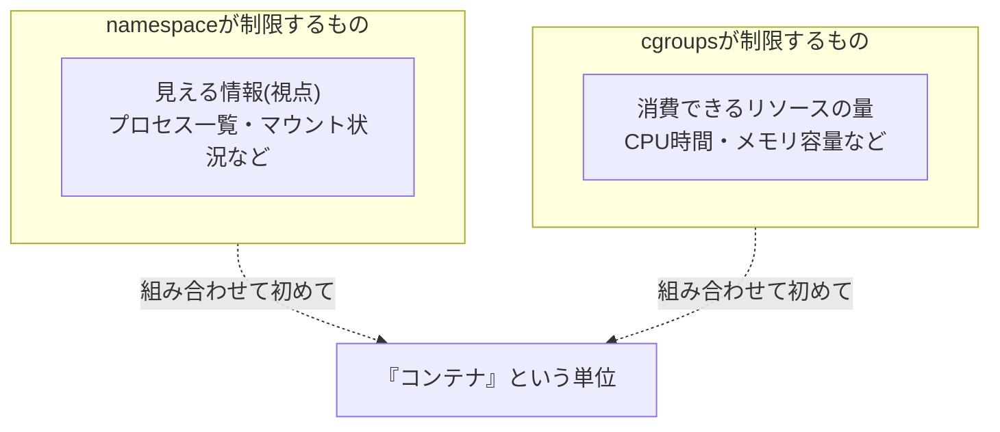

## はじめに

- **この記事で得られること**: [Linuxのnamespaceを自分の手で構築し、『コンテナ』の正体を体験するハンズオン](/articles/linux-namespaces-handson-guide)で扱った、「**コンテナ = namespace + cgroups**」という組み合わせのうち、まだ手を動かしていなかった**cgroups**(コントロールグループ)の仕組みを、実際にCPU・メモリへ上限を設定することで体験します。namespaceが「見える範囲を制限する」仕組みだったのに対し、**cgroupsは「消費できるリソースの量そのものを制限する」仕組み**であるという、決定的な役割の違いを理解します。
- **対象読者**: namespaceのハンズオンは経験したものの、「cgroupsによるリソース制限」という、もう半分の仕組みを、実際に自分の手で試したことがない方を想定しています。
- **読むのにかかる想定時間**: 約22分(ハンズオン実施込み)

この記事は[『上位1%』シリーズ 全記事ガイド](/sitemap)の一部、[Linux基盤シリーズ](/sitemap#シリーズ一覧)の19.1本目です。[ハンズオン準備マニュアル](/articles/handson-prep-guide)で作成したUbuntu Server環境が1台あれば実施できます。

## 前提知識

- [Linuxのnamespaceを自分の手で構築し、『コンテナ』の正体を体験するハンズオン](/articles/linux-namespaces-handson-guide): namespaceが「視点を制限する」仕組みであり、コンテナがnamespaceとcgroupsの組み合わせであるという理解が前提になっています。

## 全体像をつかむ

namespaceのハンズオンで確認した通り、**namespaceは、あるプロセスから見える情報(他のプロセスの一覧、マウント状況など)を制限するだけであり、CPUやメモリをどれだけ消費してよいかについては、何も制限していません。** つまり、**namespaceだけでは、隔離されたつもりのプロセスが、ホスト全体のリソースを使い尽くしてしまう**可能性が残ります。



## ハンズオン手順

### Step 1: 制限なしの状態で、メモリを消費し尽くすプロセスを動かす

まず、制限がない状態で、意図的に大量のメモリを確保するプロセスを用意します。

```bash
python3 -c "
data = []
while True:
    data.append(' ' * 10**8)  # 約100MBずつ確保
    print(f'{len(data) * 100}MB allocated')
" &
MEMHOG_PID=$!
sleep 3
kill $MEMHOG_PID
```

**この状態では、何の制限もないため、メモリを確保し続ける限り、ホスト全体のメモリが圧迫されていきます。**

### Step 2: cgroupを作成し、メモリの上限を設定する

cgroups v2(現在主流のインターフェース)を使い、新しいcgroupを作成します。

```bash
sudo mkdir /sys/fs/cgroup/memhog-demo
echo "100M" | sudo tee /sys/fs/cgroup/memhog-demo/memory.max
```

**`memory.max`というファイルへ`100M`と書き込むだけで、このcgroupに所属するプロセス全体が消費できるメモリの合計量に、100MBという上限が設定されます。** [procfsが「生きたファイル」として、カーネルの設定値をファイルとして見せかけていた](/articles/linux-sysctl-guide)のと同じ発想で、cgroupsの設定も、通常のファイルの読み書きとして行えます。

### Step 3: このcgroupへプロセスを所属させ、上限を超えたときの挙動を確認する

```bash
echo $$ | sudo tee /sys/fs/cgroup/memhog-demo/cgroup.procs
python3 -c "
data = []
while True:
    data.append(' ' * 10**8)
    print(f'{len(data) * 100}MB allocated')
"
```

**実行結果(イメージ):**

```
100MB allocated
Killed
```

**メモリの確保が、100MBを超えようとした瞬間に、このプロセスが強制終了(OOM Kill)されました。** `cgroup.procs`へ自分自身のプロセスID(`$$`)を書き込むことで、現在のシェルとその子プロセスが、このcgroupの制限下に入ります。**namespaceによる視点の制限とは、まったく独立した仕組みとして、リソースの消費量そのものが、カーネルによって強制的に遮断されている**ことが確認できます。

<details>
<summary>この挙動は、通常のメモリ不足(ホスト全体のOOM)と、どう違うのか</summary>

**通常、ホスト全体の物理メモリが不足すると、カーネルは、システム全体の中から、最もメモリを多く消費しているプロセスなどを基準に、OOM Killの対象を選びます。** これに対し、**cgroupに`memory.max`が設定されている場合、そのcgroup自身が割り当てられた上限を超えた時点で、そのcgroup内のプロセスだけが対象になります。** ホスト全体にはまだ十分な空きメモリがあっても、**このcgroupに割り当てられた、あくまで「取り決めとしての上限」を超えた**という理由だけで、強制終了が発生する点が、決定的な違いです。

</details>

### Step 4: CPU使用率にも、同様に上限を設定する

```bash
sudo mkdir -p /sys/fs/cgroup/cpuhog-demo
echo "50000 1000000" | sudo tee /sys/fs/cgroup/cpuhog-demo/cpu.max
echo $$ | sudo tee /sys/fs/cgroup/cpuhog-demo/cgroup.procs
yes > /dev/null &
sleep 5
top -b -n 1 | grep yes
```

**`cpu.max`への`"50000 1000000"`という設定は、「1,000,000マイクロ秒(1秒)ごとの期間のうち、50,000マイクロ秒(0.05秒)分だけ、CPU時間の使用を許可する」という意味です。** これにより、**本来であれば1つのCPUコアを100%占有してしまうはずの`yes`コマンドが、約5%のCPU使用率に制限される**様子を確認できます。

## プロが見ている視点(上位1%の理解)

### 「namespace + cgroups」という組み合わせは、問題の種類ごとに別々の道具を使うという設計思想の実例

このハンズオンと、[namespaceのハンズオン](/articles/linux-namespaces-handson-guide)を通じて確認できた最大の発見は、**「隔離」という、一見1つの目的に見える要求が、実際には「何が見えるか」(namespace)と「どれだけ使えるか」(cgroups)という、2つの独立した問題に分解できる**という点です。**Dockerのようなツールが「コンテナ」という1つの概念として提供しているものは、実際には、この2つの、まったく別の仕組みへの操作を、まとめて代行しているだけ**です。上位1%のエンジニアは、新しい抽象化された概念に出会ったときに、「これは、実際には、どんな独立した仕組みの組み合わせなのか」を、常に分解して捉える習慣を持っています。

## よくある誤解・つまずきポイント

- **誤解1: 「cgroupsは、namespaceと同じように、プロセスから見える情報を制限する仕組みである」**
  cgroupsが制限するのは、消費できるリソースの量(CPU時間・メモリ容量など)であり、見える情報の範囲(namespaceの役割)とは、まったく別の軸です。
- **誤解2: 「メモリの上限を設定すれば、プロセスは自動的にメモリ使用量の少ない動作に切り替わる」**
  cgroupsは、上限を超えた場合に強制終了(OOM Kill)を発生させる仕組みであり、プロセス自身の挙動を、メモリ消費の少ない方式へ自動的に変更するものではありません。
- **誤解3: 「cgroupの制限を受けているプロセスが強制終了されるのは、ホスト全体のメモリが不足しているからである」**
  ホスト全体には十分な空きメモリがあっても、そのcgroup自身に割り当てられた上限を超えただけで、強制終了が発生します。

## 障害・トラブルシューティングの視点

1. **コンテナ内のプロセスが、突然「Killed」というメッセージだけを残して終了する**: そのコンテナに割り当てられたメモリ上限(`memory.max`相当の設定)を超えていないかを、まず確認します。
2. **特定のプロセスのCPU使用率が、想定より低く頭打ちになる**: そのプロセスが所属するcgroupに、`cpu.max`による制限が設定されていないかを確認します。
3. **cgroupを作成しようとしたのに、ファイルが見つからない**: cgroups v1とv2では、インターフェースが異なります。`/sys/fs/cgroup`の構成を確認し、どちらのバージョンで動作しているかを確認します。

## まとめ

- namespaceは、プロセスから見える情報の範囲を制限する仕組みであり、cgroupsは、消費できるリソースの量そのものを制限する、まったく独立した仕組みです。
- cgroupsの設定は、`/sys/fs/cgroup`以下のファイルへの読み書きとして行われ、`memory.max`でメモリ、`cpu.max`でCPU使用率に上限を設定できます。
- cgroupの上限を超えると、ホスト全体のリソースに余裕があっても、そのcgroup内のプロセスが強制終了・制限されます。
- コンテナ技術は、namespace(何が見えるか)とcgroups(どれだけ使えるか)という、2つの独立した仕組みの組み合わせを、1つの概念として自動化したものです。

**今日から意識すべきこと**
1. コンテナのリソース使用量に関する障害に遭遇したら、まずそのコンテナに設定されているcgroupsの上限を確認しましょう。
2. 新しい抽象化された概念に出会ったときは、「これは、実際にはどんな独立した仕組みの組み合わせなのか」を、分解して捉える習慣をつけましょう。

## 参考文献

- [Control Group v2 | The Linux Kernel Documentation](https://docs.kernel.org/admin-guide/cgroup-v2.html)
- [cgroups(7) Manual Page](https://man7.org/linux/man-pages/man7/cgroups.7.html)
