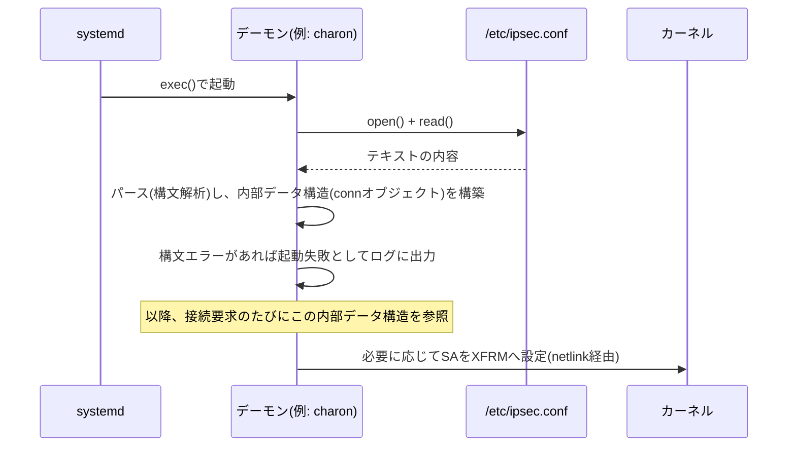

## はじめに

- **この記事で得られること**: `/etc/ipsec.conf`に`type=transport`のような人間が読めるテキストを書くだけで、なぜstrongSwanの実際の暗号化通信の挙動が変わるのか——設定ファイルが「ただのテキスト」から「動いているプログラムの実際の挙動」に変わるまでの一連の流れを、デーモンの起動処理・パース処理・reload/restartの意味まで含めて体系的に理解できます。
- **対象読者**: 設定ファイルを編集して「あとはデーモンを再起動すれば反映される」という手順は知っているものの、なぜそれだけで反映されるのか、裏側のメカニズムを説明できない方を想定しています。
- **読むのにかかる想定時間**: 約15分

この記事は[『上位1%』シリーズ 全記事ガイド](/sitemap)の一部です。[L2TP/IPsecサーバー自作ハンズオン](/articles/l2tp-ipsec-lab-guide)で`/etc/ipsec.conf`や`/etc/xl2tpd/xl2tpd.conf`を編集した箇所から派生した記事です。

## 前提知識

- **デーモン**: バックグラウンドで常駐し続けるプロセスです。詳しくは[デーモン(daemon)とは何か](/articles/linux-daemon-guide)で扱っています。
- **システムコール**: プログラムがカーネルの機能を呼び出す正規の手段です。詳しくは[ユーザー空間とカーネル空間の仕組み](/articles/linux-user-kernel-space-guide)で扱っています。

## 全体像をつかむ

### 一言で言うと

**設定ファイルそのものには、何かを実行する力は一切ありません。設定ファイルが「効く」のは、それを読み込んで解釈し、実際の処理に反映させる「デーモン」というプログラムが別途存在するからです。** `/etc/ipsec.conf`はstrongSwanの`charon`デーモンにとっての単なる「入力データ」であり、このファイルを`open()`・`read()`して中身をパースし、プログラム内部のデータ構造として保持し、必要な処理(ソケットの待ち受け、暗号化パラメータの選択など)に活用して初めて、設定は「効いた」ことになります。

## 基礎から徹底解説

### デーモンの起動処理としての「設定の読み込み」

多くのデーモンは、起動直後にまず自分の設定ファイルを探しに行き、内容を解析(パース)します。この処理は、[デーモン(daemon)とは何か](/articles/linux-daemon-guide)で説明した「端末から切り離してバックグラウンドで待ち受け続ける」という一連の起動手順の中に組み込まれています。

`/etc/ipsec.conf`の`conn L2TP-PSK`ブロックは、パース後にstrongSwan内部で「connオブジェクト」というプログラム上のデータ構造(C言語で言えば構造体)に変換されます。以降、クライアントから接続要求が来るたびに、strongSwanはこの内部データ構造を参照して、`ike=`で指定された暗号アルゴリズムの提案を作ったり、`leftprotoport=`で指定された条件に一致するかを判定したりします。**テキストファイルの中身が「効く」のは、この変換されたメモリ上のデータ構造が、実際の処理ロジックの中で参照され続けているから**です。

### なぜ編集しただけでは反映されないのか

`/etc/ipsec.conf`をテキストエディタで書き換えても、charonデーモンが起動中であれば、**その変更を自動的には検知しません**。これは[sysctlの記事](/articles/linux-sysctl-guide)で説明した「`/etc/sysctl.conf`を編集しただけではカーネルに反映されない」という現象と、根っこは同じ構造です——**設定ファイルは受動的なデータであり、能動的に何かを見張って自分から反映してくれるわけではない**という点です。デーモンに変更を反映させるには、次のいずれかの操作で「もう一度読み込ませる」必要があります。

| 操作 | 内部で起きていること |
|---|---|
| デーモンの再起動(`systemctl restart`) | プロセスを一度終了させ、新しいプロセスを`exec()`し直す。起動時の読み込み処理が最初からやり直される。 |
| 設定の再読み込み(`sudo ipsec reload`、多くのデーモンでは`systemctl reload`) | プロセスは終了させず、SIGHUPのようなシグナルを送って「設定ファイルをもう一度読み直せ」と指示する。稼働中の接続を切らずに新しい設定を反映できることが多い。 |

`reload`は「プロセスを立てたまま設定だけ差し替える」ため、確立済みの通信を維持したまま変更を反映できる利点がありますが、**すべてのデーモン・すべての設定項目がreloadで反映できるわけではありません**(strongSwanでも一部の設定はreloadでは反映されず、明示的な再起動が必要な場合があります)。どちらの操作が必要かは、対象デーモンのドキュメントで確認するのが確実です。

### 起動時のパース失敗は、設定の「有効化」に失敗する

設定ファイルに構文エラーがあると、デーモンは起動処理の途中で「読み込み・解釈」に失敗し、多くの場合そこで起動自体を中止します。`sudo systemctl status strongswan-starter`が失敗を示しているとき、その原因の多くは**このパース段階でのエラー**です。設定ファイルは「書けば効く」のではなく、**「文法として正しく解釈できて初めて効く候補になる」**という前提がある、と理解しておくとトラブルシューティングが速くなります。

## プロが見ている視点(上位1%の理解)

### 「ユーザー空間の設定」と「カーネル空間の設定」は、反映経路がまったく違う

この記事で扱ってきた`/etc/ipsec.conf`や`/etc/xl2tpd/xl2tpd.conf`は、**strongSwanやxl2tpdというユーザー空間のデーモンが自前でパースする設定**です。一方、[sysctlの記事](/articles/linux-sysctl-guide)で扱った`/etc/sysctl.conf`や、[iptablesの記事](/articles/linux-iptables-guide)で扱ったファイアウォールルールは、**最終的にカーネル自身の内部状態を書き換える設定**です。同じ「テキストファイルを`/etc`に置いて設定する」という見た目でも、反映経路は次のように大きく異なります。

| 設定の種類 | 反映経路 | 反映のきっかけ |
|---|---|---|
| ユーザー空間デーモンの設定(`ipsec.conf`など) | デーモン自身がファイルをパースし、自プロセスのメモリ上のデータ構造を更新する | デーモンの起動、または明示的なreload指示 |
| カーネルパラメータ(`sysctl`) | `sysctl`コマンドが`/proc/sys`へ書き込み、カーネル内部の変数を直接更新する | `sysctl -p`の実行、または起動時の`systemd-sysctl.service` |
| ファイアウォールルール(`iptables`) | `iptables`コマンドがnetlink経由でカーネルのnetfilterへルールを登録する | `iptables`コマンドの実行そのもの(即時) |

**「/etcに置かれたテキストファイル」という見た目の共通性に惑わされず、その設定が最終的にどこで(自プロセスのメモリか、カーネル内部か)、どうやって(自前のパーサーか、専用コマンドの都度実行か)反映されるのかを区別して理解する**のが、この分野を体系的に扱えるようになる鍵です。

### なぜ多くのデーモンは「独自の設定ファイル形式」を採用するのか

`ipsec.conf`のブロック構文も、`xl2tpd.conf`のINIファイル形式も、`sysctl`のkey=value形式も、統一された標準フォーマットは存在しません。これは、**設定ファイルのパーサーがそのデーモンの実装の一部であり、開発者が自分たちのプログラムにとって都合の良い形式を自由に選べる**ためです。近年ではYAMLやJSONのような汎用フォーマットを採用するソフトウェアも増えていますが、`ipsec.conf`や`xl2tpd.conf`のような伝統的なLinuxデーモンの多くは、それぞれ独自の軽量な構文を持つ独自パーサーを実装しています。これは非効率に見えるかもしれませんが、**外部ライブラリへの依存を減らし、起動を高速化できる**という実務上の利点もあります。

## よくある誤解・つまずきポイント

- **誤解1: 「設定ファイルはデーモンが常に監視していて、保存した瞬間に自動的に反映される」**
  多くの伝統的なLinuxデーモンは設定ファイルを監視していません。反映には明示的なreloadまたは再起動が必要です(ただし、`inotify`のようなファイル変更通知の仕組みを使って自動リロードする現代的なソフトウェアも一部存在します)。
- **誤解2: 「reloadと再起動は同じことをしている」**
  reloadはプロセスを維持したまま設定だけ差し替える操作、再起動はプロセス自体を終了・再作成する操作です。稼働中の接続への影響が大きく異なります。
- **誤解3: 「設定ファイルの構文が正しければ、意図通りに動くことが保証される」**
  構文的に正しくパースできることと、意味的に妥当な設定であることは別問題です。たとえば矛盾する暗号アルゴリズムの指定は、構文エラーにはならなくても、実際の接続確立時にネゴシエーション失敗という形で問題が表面化します。

## 障害・トラブルシューティングの視点

1. **設定を変更したのに反映されていない**: まず`sudo systemctl status <service>`でデーモンが実際に再起動/reloadされたか(直近の起動時刻)を確認します。変更後にreload/restartを実行し忘れているケースが最も多い原因です。
2. **デーモンが起動しない**: `sudo journalctl -u <service> -e`で直近のログを確認し、設定ファイルの構文エラー(パース段階での失敗)を示すメッセージがないか探します。
3. **reloadしたのに一部の設定が反映されない**: 対象のデーモンが、その設定項目をreloadでは反映できない仕様になっている可能性があります(ドキュメントで「requires restart」のような記載がないか確認します)。確実なのは再起動です。

### 予防策・恒久対策

- 本番環境で設定を変更する前に、`ipsec.conf`のような構文チェック機能を持つコマンド(strongSwanなら`ipsec rereadsecrets`前の構文確認など)があれば、反映前に検証する。
- reloadで反映される設定と再起動が必要な設定を、社内のドキュメントとして整理しておき、変更のたびに判断に迷わないようにする。
- 設定変更の反映を確認する手順(該当ログの確認、疎通確認)を変更作業のチェックリストに含め、「ファイルは書き換えたが未反映」のまま放置される状態を防ぐ。

## まとめ

- 設定ファイルそのものには実行力がなく、それを読み込んでパースし、内部データ構造に変換して実際の処理に使う「デーモン」があって初めて設定は「効く」ようになります。
- 稼働中のデーモンは設定ファイルの変更を自動検知しないため、reload(プロセス維持のまま再読込)または再起動(プロセスの作り直し)という明示的な操作が必要です。
- 同じ「/etcのテキストファイル」でも、ユーザー空間デーモンが自前でパースする設定と、最終的にカーネル自身を書き換える設定(sysctl、iptables)とでは、反映経路がまったく異なります。
- 各デーモンが独自の設定ファイル形式を持つのは、パーサーがそのデーモンの実装の一部であり、外部依存を減らして起動を高速化できるという実務上の理由があります。

**今日から意識すべきこと**
1. 設定ファイルを変更したら、「反映のトリガー(reloadか再起動か)」を必ずセットで実行し、変更後にログや疎通確認で反映されたことを確かめる習慣をつけましょう。
2. 見慣れない設定ファイルに出会ったら、「これは誰(どのデーモン、あるいはカーネル自身)が読み込んで、どう反映するのか」を最初に確認する癖をつけましょう。

## 参考文献

- [strongSwan Documentation — ipsec.conf](https://docs.strongswan.org/docs/latest/config/IPsecConfiguration.html)
- [systemd.service — systemd System and Service Manager](https://www.freedesktop.org/software/systemd/man/latest/systemd.service.html)
- [signal(7) — Linux manual page(SIGHUPなどのシグナル)](https://man7.org/linux/man-pages/man7/signal.7.html)
