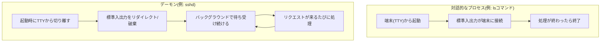
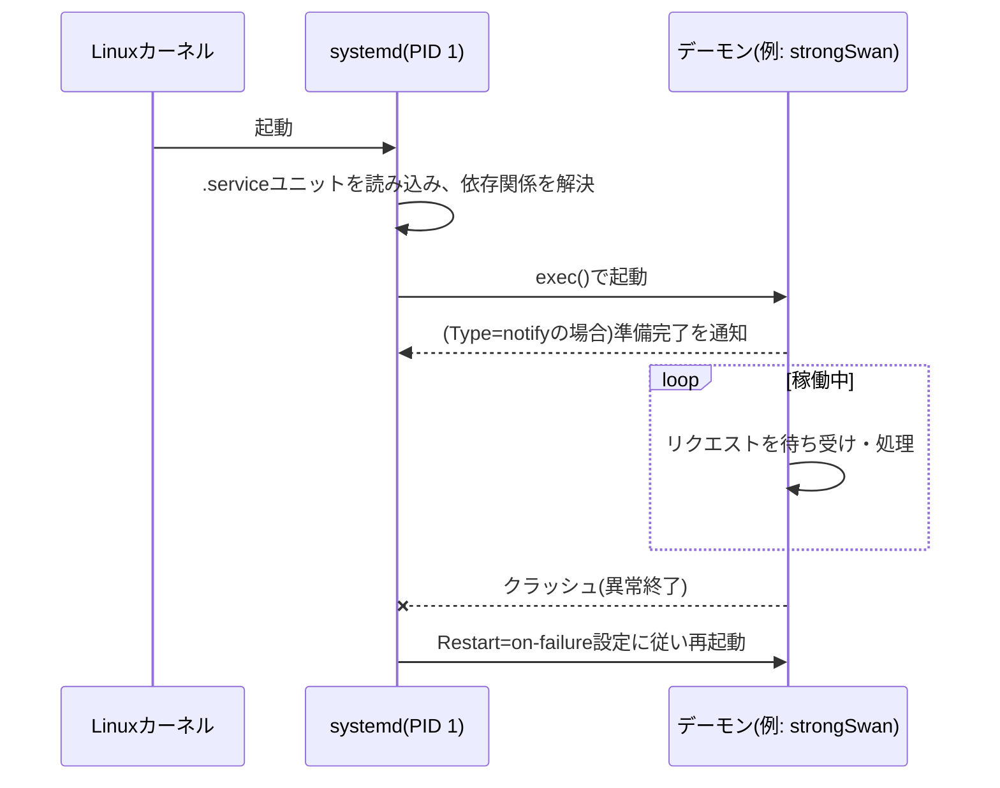

## はじめに

- **この記事で得られること**: 「デーモン」という言葉が指す実体——通常のプロセスと何が違うのか、なぜIKEやL2TPのようなプロトコル処理がデーモンとして実装されるのか、systemdがデーモンをどう起動・監視・再起動しているのかを、体系的に理解できます。
- **対象読者**: サーバー構築・運用に関わるインフラエンジニアで、「デーモン」という言葉を日常的に見聞きしているものの、「ソフトウェアの裏側で動いているもの」という漠然としたイメージ止まりで、通常のプロセスとの違いを明確に説明できない方を想定しています。
- **読むのにかかる想定時間**: 約15分

この記事は[『上位1%』シリーズ 全記事ガイド](/sitemap)の一部です。

## 前提知識

- **プロセス(process)** : 実行中のプログラムの実体です。OSはプロセスごとにメモリ空間・CPU時間・ファイルディスクリプタなどの資源を割り当てて管理します。
- **標準入出力(stdin/stdout/stderr)** : プログラムがキーボード入力を受け取ったり、画面に文字を出力したりするための、OSが用意する3つの基本的な入出力窓口です。
- **シグナル(signal)** : OSやほかのプロセスから、あるプロセスに対して非同期に送られる短い通知です(例: `SIGTERM`は「終了してほしい」という依頼、`SIGKILL`は強制終了)。

## 全体像をつかむ

### 一言で言うと

**デーモンとは、ユーザーが直接操作する画面(端末)を持たず、OSが起動している間ずっとバックグラウンドで動き続け、特定の役割(サービス)を提供し続けるプロセスのことです。** 「悪魔」ではなく、ギリシャ神話の「傍らで見守り働きかける守護霊(daemon)」に由来する命名だとされ、慣習的に名前の末尾に`d`が付きます(`sshd`、`httpd`、`charon`のように付かない例もあります)。

普段何気なく実行している`ls`や`cat`のようなコマンドは、端末から起動され、処理が終わればすぐに終了する「対話的なプロセス」です。これに対しデーモンは、**端末から切り離された状態で常駐し、外部からのリクエスト(ネットワークパケット、ソケット通信、タイマーなど)をきっかけに処理を行う**という、根本的に異なるライフサイクルを持っています。

## 基礎から徹底解説

### 通常のプロセスとデーモンを分けるもの

デーモンは特別な種類のプログラミング言語や実行形式を使っているわけではなく、**通常のプログラムが、起動時に次のような手順(デーモン化: daemonizing)を踏むことでデーモンになります**。

1. **`fork()`して親プロセスを終了させる**: 呼び出し元の端末のプロセスグループから独立するための古典的な手法です。
2. **新しいセッションを作る(`setsid()`)**: 制御端末(TTY)との紐付けを切り離し、端末を閉じてもプロセスが道連れで終了しないようにします。
3. **標準入出力を`/dev/null`や専用のログファイルにリダイレクトする**: 端末という「画面」がもう存在しないため、出力先を明示的に決め直す必要があります。
4. **作業ディレクトリをルート(`/`)などの安定した場所に変更する**: 起動時のカレントディレクトリがマウント解除されても困らないようにするためです。

現代のLinuxでは、この一連の手順を各プログラムが自前で実装する代わりに、**init システム(systemd)がデーモン化の面倒を肩代わりする**構成が主流です。プログラム自体は普通のプロセスとして書き、systemdの`.service`ユニットファイルに`Type=simple`や`Type=forking`を指定するだけで、上記の手順に相当する処理をsystemdが代行してくれます。

### なぜプロトコル処理を「デーモン」として実装するのか

L2TP/IPsecの記事やVPNプロトコル比較の記事で登場した **IKEデーモン(strongSwanの`charon`)、L2TPデーモン(`xl2tpd`)、PPPデーモン(`pppd`)** は、いずれもこの「バックグラウンドで待ち受け続ける」という性質を利用して、それぞれのプロトコルが持つ **状態機械(ステートマシン)** を実装しています。

- IKEはUDPポート500/4500で待ち受け、相手から届いたIKEメッセージの種類に応じて「フェーズ1が進行中」「SA確立済み」といった内部状態を遷移させながら処理を続けます。
- L2TPデーモンは、複数のトンネル・セッションを同時に管理し、それぞれの状態(未確立・確立中・確立済み)をテーブルとして保持し続けます。

こうした処理は、**1回のリクエストに応答して終了する短命なプログラム(CGIスクリプトのようなもの)には向きません**。プロトコルのネゴシエーションは複数のメッセージのやり取りにまたがり、途中経過の状態(暗号鍵、シーケンス番号、タイマー)をメモリ上に保持し続ける必要があるためです。デーモンとして常駐させることで、こうした状態をプロセスのメモリ上に安全に保持しながら、複数の接続を並行して処理できます。

補足: デーモンと「サービス」という言葉の関係

実務では「デーモン」と「サービス」がほぼ同じ意味で使われますが、厳密には視点の違いがあります。**「デーモン」はプロセスとしての実体**(例: `sshd`というバイナリが動いているプロセス)を指すのに対し、**「サービス」はsystemdなどのinitシステムから見た管理単位**(例: `sshd.service`というユニット)を指します。1つのサービスユニットが複数のデーモンプロセスを起動・管理することもあれば、Windowsの「サービス」も概念としてはUnix系のデーモンとほぼ対応します。

### systemdによるデーモンの起動・監視・再起動

現代のLinuxディストリビューションでは、**systemd**がPID 1(最初に起動するプロセス)として動作し、デーモンの起動順序・依存関係・異常終了時の自動再起動までを一括管理しています。

代表的な運用コマンドは次の通りです。

| コマンド | 用途 |
|---|---|
| `systemctl start/stop <service>` | デーモンの起動・停止 |
| `systemctl enable <service>` | 次回OS起動時に自動起動する設定を有効化 |
| `systemctl status <service>` | 現在の稼働状態・直近のログ抜粋を確認 |
| `journalctl -u <service>` | そのデーモンが出力したログをまとめて閲覧 |

systemdのユニットファイルには`Restart=on-failure`のような設定を書けるため、**デーモンがクラッシュしても自動的に再起動させる**、**依存する別のデーモン(例: ネットワークが上がってから起動する)を待ってから起動する**といった制御が、アプリケーション側のコードを一切変更せずに実現できます。これが、個々のプログラムが自前でデーモン化の処理を書く必要が薄れた実務上の理由です。

## プロが見ている視点(上位1%の理解)

### 複数デーモンの連携が「障害点の分散」でもあり「複雑さの温床」でもある

L2TP/IPsecのようにIKEデーモン・L2TPデーモン・PPPデーモンという3つの独立したデーモンが連携する構成は、**1つのデーモンがクラッシュしても他のデーモンやOS全体には直接影響しない**という障害の局所化(fault isolation)の利点を持ちます。一方で、**接続シーケンス全体を追うには複数のデーモンのログを横断的に確認する必要がある**ため、障害の切り分けコストが上がるという設計上のトレードオフがあります。WireGuardのようにLinuxカーネル本体に処理を組み込む設計(デーモンすら介さない)は、この複雑さを構造的に避ける選択と見ることができます。

### ログの出力先とsyslog/journaldの役割

伝統的なデーモンは、標準出力の代わりに**syslog**というログ集約の仕組みにメッセージを送るよう設計されています。現代のsystemd環境では、標準出力・標準エラー出力がそのまま`journald`に取り込まれ、`journalctl`で一元的に閲覧できるようになっています。これにより、デーモンごとにログファイルの置き場所やローテーション設定を個別に気にする必要がなくなり、障害調査時に「どのログを見ればよいか」を統一的に扱えます。

## よくある誤解・つまずきポイント

- **誤解1: 「デーモンは特殊な作りのプログラムで、普通のプログラムとは別物だ」**
  実際にはデーモンも通常の実行ファイルであり、特別なコンパイル方法や専用の言語機能を必要としません。「端末から切り離してバックグラウンドで常駐する」という起動のされ方の違いがあるだけです。
- **誤解2: 「デーモンが動いていれば、そのサービスは必ず正常に機能している」**
  `systemctl status`が「active (running)」と表示していても、それはプロセスが生きていることを示しているだけで、デーモンが正しく設定・接続を処理できているとは限りません。実際の疎通確認やログの内容確認まで行って初めて「正常」と判断できます。
- **誤解3: 「1つのサービスにつき、デーモンは1つだけ存在する」**
  L2TP/IPsecの例のように、1つの機能(リモートアクセスVPN)を成立させるために複数のデーモンが連携して動作するケースは珍しくありません。

## 障害・トラブルシューティングの視点

デーモン関連のトラブルは、**「プロセスとして生きているか」と「役割を正しく果たせているか」を分けて切り分ける**のが基本です。

1. **デーモンが起動していない**: `systemctl status <service>`でプロセスの有無と直近の終了理由(設定ファイルの構文エラー、ポートの二重待ち受けなど)を確認します。
2. **デーモンは動いているが応答がない**: `ss -tulnp`のようなコマンドで、期待するポートを実際にそのデーモンが待ち受けているかを確認します。設定ファイルの記述ミスで別のインターフェース・ポートにバインドしているケースが典型的です。
3. **特定のリクエストだけ処理に失敗する**: `journalctl -u <service> -f`でリアルタイムにログを追いながら、問題のリクエストを再現し、デーモン内部でどの処理段階まで進んでからエラーになっているかを特定します。

### 予防策・恒久対策

- systemdの`Restart=on-failure`と`StartLimitBurst`を適切に設定し、クラッシュ時の自動復旧と、無限リスタートループの防止を両立させる。
- デーモンのログを`journald`に一元化し、複数デーモンが連携するサービス(L2TP/IPsecなど)では、関係するすべてのユニット名を把握した上で横断的にログを追えるようにしておく。
- 本番導入前に、意図的にデーモンを`kill`して自動再起動が機能するか、依存関係のあるデーモンの起動順序が正しいかを検証しておく。

## まとめ

- デーモンとは、端末から切り離されバックグラウンドで常駐し続けるプロセスのことで、特別な実行形式ではなく起動のされ方(デーモン化)の違いによって区別されます。
- IKEデーモン・L2TPデーモンのようなプロトコル処理は、複数メッセージにまたがる状態を保持し続ける必要があるため、常駐するデーモンとして実装するのが自然な設計です。
- 現代のLinuxでは、systemdがデーモン化・起動順序の制御・クラッシュ時の自動再起動・ログの一元管理を肩代わりしており、個々のプログラムが自前でこれらを実装する必要性は薄れています。
- 複数デーモンの連携構成は障害の局所化という利点がある一方、切り分けの複雑さというトレードオフも伴います。

**今日から意識すべきこと**
1. `systemctl status`は「プロセスが生きているか」の確認にすぎず、「役割を正しく果たしているか」は別途ログや疎通確認で検証する習慣をつけましょう。
2. 複数のデーモンが連携するサービスでは、障害調査に必要な全ユニット名をあらかじめ把握しておきましょう。

## 参考文献

- [systemd.service — systemd System and Service Manager](https://www.freedesktop.org/software/systemd/man/latest/systemd.service.html)
- [daemon(7) — Linux manual page](https://man7.org/linux/man-pages/man7/daemon.7.html)
- [journalctl(1) — Linux manual page](https://man7.org/linux/man-pages/man1/journalctl.1.html)
