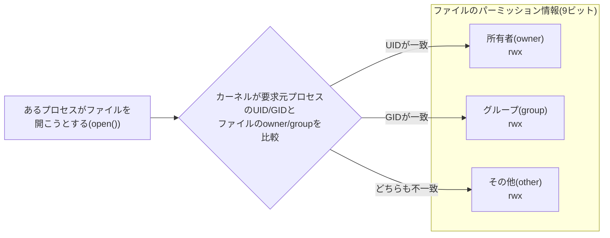

## はじめに

- **この記事で得られること**: `chmod 600`のような一見暗号めいたコマンドが、なぜ・どうやってファイルへのアクセスを制御できるのかを、rwxビットの意味、数値表記と記号表記の対応、setuid/sticky bitといった特殊権限、そしてこの仕組みをカーネルがどう実行しているのかまで含めて体系的に理解できます。
- **対象読者**: `chmod 600 /etc/ipsec.secrets`のようなコマンドを設定ガイドに従って実行はできるものの、なぜ600という数字が「所有者だけが読み書きできる」ことを意味するのか、数字の根拠を説明できない方を想定しています。
- **読むのにかかる想定時間**: 約15分

この記事は[『上位1%』シリーズ 全記事ガイド](/sitemap)の一部です。[L2TP/IPsecサーバー自作ハンズオン](/articles/l2tp-ipsec-lab-guide)で`/etc/ipsec.secrets`や`/etc/ppp/chap-secrets`に`chmod 600`を実行した箇所から派生した記事です。

## 前提知識

- **プロセス・ユーザーID(UID)**: Linux上で実行中のプログラム(プロセス)には、それを実行したユーザーを識別する数値(UID)が紐づいています。詳しくは[デーモン(daemon)とは何か](/articles/linux-daemon-guide)で扱っています。
- **システムコール**: ユーザー空間のプログラムがカーネルの機能(ファイルの読み書きなど)を呼び出す正規の手段です。詳しくは[ユーザー空間とカーネル空間の仕組み](/articles/linux-user-kernel-space-guide)で扱っています。

## 全体像をつかむ

### 一言で言うと

**Linuxのファイルパーミッションとは、「誰が」「何を」できるかを、ファイルごとに保持された9ビットの情報として表現し、カーネルがファイルへのアクセス要求のたびにこの9ビットを検査することで実現しているアクセス制御の仕組みです。** 「誰が」は所有者(owner)・グループ(group)・その他(other)の3区分、「何を」は読み取り(read)・書き込み(write)・実行(execute)の3種類で、3区分×3種類=9ビットがすべての基本になります。



`ls -l`で見える`-rw-------`のような11文字の先頭1文字はファイル種別、残り9文字がこの9ビットです。`chmod`コマンドは、この9ビットを書き換えるための操作にすぎません。

## 基礎から徹底解説

### rwxビットと数値表記の対応

読み取り(r)・書き込み(w)・実行(x)の3つの権限は、それぞれ4・2・1という数値が割り当てられており、この合計値で1区分の権限を1桁の数字として表現します。

| 権限 | 記号 | 数値 |
|---|---|---|
| 読み取り(read) | r | 4 |
| 書き込み(write) | w | 2 |
| 実行(execute) | x | 1 |

たとえば「読み取り+書き込みのみ」は4+2=**6**、「読み取り+実行のみ」は4+1=**5**、「すべて」は4+2+1=**7**になります。これを所有者・グループ・その他の3区分ぶん並べたものが、`chmod 600`や`chmod 755`のような3桁の数値です。

| コマンド | 所有者 | グループ | その他 | 意味 |
|---|---|---|---|---|
| `chmod 600 file` | rw- | --- | --- | 所有者のみ読み書き可(パスワード・秘密鍵などの定番) |
| `chmod 644 file` | rw- | r-- | r-- | 所有者は読み書き可、他は読み取りのみ(一般的な設定ファイル) |
| `chmod 755 file` | rwx | r-x | r-x | 所有者は全権限、他は読み取り・実行のみ(実行ファイルやディレクトリの定番) |

`/etc/ipsec.secrets`に`chmod 600`をかけるのは、まさにこの表の1行目の設定にすることで、事前共有鍵をファイルの所有者(通常root)以外の誰からも読み取れなくするためです。

<details>
<summary>数値表記(chmod 600)と記号表記(chmod u+rw,go-rwx)の違い</summary>

`chmod`には、この記事で扱っている数値表記(絶対モード)のほかに、`u`(user=所有者)・`g`(group)・`o`(other)・`a`(all)と`+`/`-`/`=`を組み合わせる記号表記(相対モード)もあります。たとえば`chmod u+x file`は「所有者にだけ実行権限を追加する」、`chmod go-rwx file`は「グループとその他からすべての権限を剥奪する」という意味です。数値表記は「9ビット全体を一度に確定させる」操作、記号表記は「現在の状態に対する差分」を指定する操作という違いがあり、既存の権限を保ったまま一部だけ変更したい場合は記号表記が便利です。

</details>

### ディレクトリに対するrwxは、ファイルとは意味が異なる

rwxの意味は、対象がファイルかディレクトリかで解釈が変わります。この違いを知らないと、「読み取り権限はあるのにファイルの中身にアクセスできない」といった現象に遭遇します。

| 権限 | ファイルの場合 | ディレクトリの場合 |
|---|---|---|
| r | ファイルの中身を読める | ディレクトリ内のファイル名一覧を`ls`で見られる |
| w | ファイルの中身を書き換えられる | ディレクトリ内にファイルを作成・削除できる(**ファイル自体の権限とは無関係**) |
| x | ファイルをプログラムとして実行できる | ディレクトリに`cd`で入り、中のファイルに(名前がわかっていれば)アクセスできる |

特に見落とされがちなのが、**あるファイルを削除・リネームできるかどうかは、そのファイル自身の権限ではなく、そのファイルが置かれている「親ディレクトリ」の書き込み権限で決まる**という点です。ファイルの中身がどれだけ`600`で厳重に守られていても、親ディレクトリが書き込み可能であれば、そのファイル自体を削除して新しいファイルに差し替えることは可能です。

### chown/chgrp:「誰の持ち物か」を変更する

`chmod`が「何ができるか」を変更するのに対し、`chown`(change owner)は「誰の持ち物か」を変更します。

```bash
sudo chown alice:developers file.txt
```

これは、ファイルの所有者を`alice`、所有グループを`developers`に変更する例です。所有者の変更(`chown`)は**root権限が必要**です(一般ユーザーが自分のファイルを他人に「譲渡」して、ディスク容量の割り当てなどの帰属を勝手に変えられると都合が悪いためです)。一方、所有グループの変更(`chgrp`、または`chown`の`:グループ名`部分)は、**ファイルの所有者自身が、自分の所属するグループの範囲内でなら**変更できます。

### setuid・sticky bit:特殊な3ビット

9ビットに加えて、あと3ビット(setuid・setgid・sticky bit)が存在し、`chmod`の数値表記では4桁目(先頭)として表現されます(例: `chmod 4755`)。

- **setuid(4000)**: 実行ファイルに設定すると、**そのプログラムを実行したユーザーが誰であっても、プログラムはファイルの所有者の権限で動作します**。代表例が`/usr/bin/passwd`です。`passwd`コマンドは`/etc/shadow`(root以外読み書き不可)を書き換える必要がありますが、一般ユーザーが直接この設定ファイルを編集することは許されていません。そこで`passwd`実行ファイル自体にsetuidを立ててroot所有にしておくことで、「`passwd`というプログラムを通じてのみ、決まった検証ロジックを経て`/etc/shadow`を書き換えられる」という、権限昇格の抜け道を1箇所に限定した安全な仕組みを作っています。
- **sticky bit(1000)**: ディレクトリに設定すると、**そのディレクトリ自体が書き込み可能であっても、各ファイルを削除・リネームできるのはファイルの所有者(またはroot)のみ**という制約が追加されます。`/tmp`はこの代表例で、誰でも書き込めるディレクトリでありながら、他のユーザーが作成した一時ファイルを勝手に消せないようになっています。

## プロが見ている視点(上位1%の理解)

### カーネルは「毎回」この9(+3)ビットを検査している

パーミッションは、一度設定したら終わりの静的な飾りではありません。プロセスが`open()`・`read()`・`write()`のようなシステムコールでファイルにアクセスしようとするたびに、**カーネルのVFS(仮想ファイルシステム)層が、要求元プロセスの実効UID/GIDと、対象ファイルのinode(メタデータ)に記録されたowner/group/モードビットを突き合わせ、許可するかどうかをその都度判定しています**。「`chmod 600`にしたら、他ユーザーから読めなくなる」という現象は、設定ファイルという静的な情報が、システムコールという実行時の経路の上で、毎回動的に効いていることの表れです。この検査ロジックはカーネル空間で実行されるため、ユーザー空間のプログラム側でこの検査を迂回することはできません([ユーザー空間とカーネル空間の仕組み](/articles/linux-user-kernel-space-guide)で扱った特権レベルの分離が、ここでも安全性の土台になっています)。

### setuidが効かない典型ケース:シェルスクリプトへの落とし穴

`chmod u+s script.sh`のように、シェルスクリプトにsetuidを立てても、多くのLinuxディストリビューションでは意図通りに動きません。これは、setuidが「実行ファイルのinode」に対する属性であるのに対し、シェルスクリプトの実行は「カーネルがまずシェバン(`#!/bin/bash`)を見てシェル本体を`exec`し、スクリプトファイルはそのシェルへの引数として渡される」という2段階の間接呼び出しになっており、この間に競合状態(race condition)を悪用した権限昇格が成立しやすいためです。setuidを安全に使うのは、C言語などでコンパイルされたバイナリに限定するのが実務上の鉄則です。

## よくある誤解・つまずきポイント

- **誤解1: 「rootならどんなパーミッションでも無視してアクセスできる」**
  実務上はほぼその通りですが、正確には「root(UID 0)はパーミッションのチェックそのものを実質的にバイパスできる特権を持つ」という扱いです。Linuxカーネルの`capabilities`機構を使えば、root権限をさらに細分化し、「ファイルパーミッションを無視する権限」だけを持たない特殊なroot相当のプロセスを作ることもできます。
- **誤解2: 「グループの権限を上げれば、所有者の権限より強くなる」**
  カーネルの検査は「所有者に一致→所有者の権限を適用」「一致しなければグループを確認」という順序で、**最初に一致した区分の権限がそのまま適用され、他の区分の権限とは合算されません**。所有者自身がそのファイルのグループにも属している場合でも、適用されるのは所有者区分の権限だけです。
- **誤解3: 「ファイルの権限を600にすれば、そのファイルは完全に安全だ」**
  `chmod 600`は同じサーバー上の他ユーザーからのアクセスを防ぐだけです。サーバー自体への侵入(SSH経由でrootを奪われる等)や、バックアップ・ログへの平文コピーの漏洩までは防げません。パーミッションは多層防御の1層に過ぎないと理解しておく必要があります。

## 障害・トラブルシューティングの視点

1. **`Permission denied`でファイルにアクセスできない**: `ls -l`でファイル自体の権限を確認するのはもちろん、**親ディレクトリすべての実行権限(x)**も確認してください。途中のディレクトリのどこか1つでもxが欠けていると、その配下には`cd`で到達できません。
2. **パーミッションは正しいはずなのにアクセスできない**: SELinuxやAppArmorのようなMAC(強制アクセス制御)が別途有効になっている環境では、通常のパーミッション(DAC: 任意アクセス制御)が許可していても、MAC側のポリシーで拒否されることがあります。`getenforce`や`aa-status`で有効化状況を確認します。
3. **サービスがsetuidバイナリ経由の処理で失敗する**: マウントオプションに`nosuid`が指定されているファイルシステム上では、setuidビットが立っていても無視されます。`mount`コマンドでマウントオプションを確認してください。

### 予防策・恒久対策

- 秘密鍵やパスワードを含む設定ファイルは、作成した直後に必ず`chmod 600`(または対象デーモンが必要とする最小限の権限)を適用する運用をチェックリスト化しておく。
- setuidバイナリは新規に作らず、必要な権限昇格は`sudo`のポリシー(`/etc/sudoers`)で個別に許可する設計を優先する(setuidバイナリは一度侵害されると影響範囲が広いため)。
- CI/CDやプロビジョニングツール(Ansibleなど)でパーミッション設定を明示的にコード化し、手作業での設定漏れを防ぐ。

## まとめ

- ファイルパーミッションは、所有者・グループ・その他の3区分×読み取り・書き込み・実行の3種類=9ビットで表現され、`chmod`の数値表記はこの9ビットをr=4/w=2/x=1の合計として3桁の数字にしたものです。
- ディレクトリに対するrwxはファイルとは意味が異なり、特にファイルの削除可否は親ディレクトリの書き込み権限で決まる点に注意が必要です。
- setuid/sticky bitという特殊な3ビットは、`passwd`コマンドや`/tmp`のような、限定的な権限昇格や共有ディレクトリの保護に使われています。
- この仕組みは静的な設定ではなく、カーネルがシステムコールのたびにVFS層で動的に検査している、実行時のアクセス制御です。

**今日から意識すべきこと**
1. 秘密情報を含むファイルを新規作成したら、反射的に`chmod 600`(または必要最小限の権限)を適用する習慣をつけましょう。
2. `Permission denied`に遭遇したら、対象ファイルだけでなく親ディレクトリの権限も確認する癖をつけましょう。

## 参考文献

- [chmod(1) — Linux manual page](https://man7.org/linux/man-pages/man1/chmod.1.html)
- [path_resolution(7) — Linux manual page](https://man7.org/linux/man-pages/man7/path_resolution.7.html)
- [credentials(7) — Linux manual page(UID/GIDとcapabilitiesの関係)](https://man7.org/linux/man-pages/man7/credentials.7.html)
