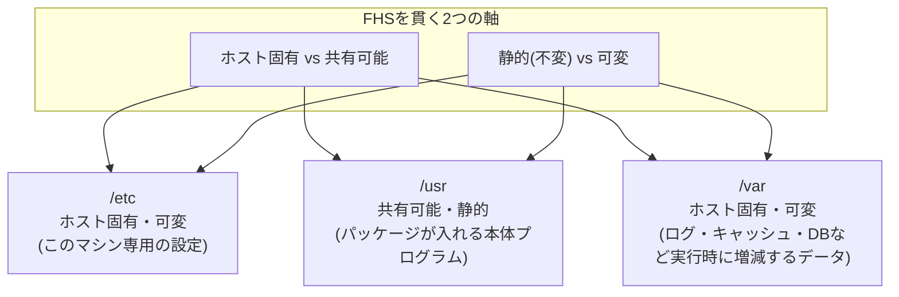

## はじめに

- **この記事で得られること**: `/etc/ipsec.conf`や`/etc/xl2tpd/xl2tpd.conf`のように、Linuxの設定ファイルがなぜ判で押したように`/etc`以下に置かれるのか、そして`/var`・`/usr`・`/bin`・`/home`といった他のトップレベルディレクトリがそれぞれ何のために存在するのかを、個別の暗記ではなく一貫した設計思想として理解できます。
- **対象読者**: `cd /etc`や`ls /var/log`のようなコマンドは使えるものの、なぜその情報がそのディレクトリに置かれているのか、ディレクトリ構成全体を貫くルールを説明できない方を想定しています。
- **読むのにかかる想定時間**: 約14分

この記事は[『上位1%』シリーズ 全記事ガイド](/sitemap)の一部です。[L2TP/IPsecサーバー自作ハンズオン](/articles/l2tp-ipsec-lab-guide)で`/etc/ipsec.conf`を編集した箇所から派生した記事です。

## 前提知識

- **ファイルシステム**: ディスク上のデータをファイル・ディレクトリという階層構造で扱うための仕組みです。
- **パッケージ管理**: `apt`のようなツールで、OS上にソフトウェアをインストール・アップデート・削除する仕組みです。詳しくは[ライブラリ(library)とは何か](/articles/software-library-guide)で扱っています。

## 全体像をつかむ

### 一言で言うと

**LinuxのディレクトリはFHS(Filesystem Hierarchy Standard)という業界標準の取り決めに従って構成されており、この取り決めの背骨にあるのは「このデータは(a)ホスト固有か、それとも複数マシンで共有・使い回せる汎用データか」「(b)一度インストールしたら変わらない静的なデータか、それとも運用中に書き換わる可変データか」という2つの軸です。** `/etc`が設定ファイルの定位置になっているのは、単なる慣習ではなく、この軸で分類したときに「ホスト固有・かつ人間が手で編集する可変データ」という明確な位置づけを持っているためです。

## 基礎から徹底解説

### 主要なトップレベルディレクトリの役割

FHSが定めるトップレベルディレクトリのうち、実務で頻繁に目にするものを、前述の2軸で整理すると次のようになります。

| ディレクトリ | 役割 | ホスト固有か | 可変か |
|---|---|---|---|
| `/etc` | システム全体の設定ファイル | ホスト固有 | 可変(人間が編集) |
| `/usr` | パッケージがインストールするプログラム本体・共有ライブラリ・ドキュメント | 共有可能(他マシンにコピーしても動く) | 静的(パッケージ管理で更新) |
| `/bin`、`/sbin` | 基本的な実行コマンド(現代のディストリでは多くが`/usr/bin`、`/usr/sbin`へのシンボリックリンク) | 共有可能 | 静的 |
| `/var` | ログ・キャッシュ・データベースなど、実行時に増減するデータ | ホスト固有 | 可変(プログラムが自動生成) |
| `/home` | 一般ユーザーの個人データ | ホスト固有 | 可変 |
| `/tmp` | 一時ファイル(再起動時にクリアされることが多い) | ホスト固有 | 可変・一時的 |
| `/opt` | パッケージ管理の対象外の、サードパーティ製ソフトウェア一式 | どちらもありうる | 静的 |
| `/root` | rootユーザーのホームディレクトリ(`/home`とは別扱い) | ホスト固有 | 可変 |

`/etc/ipsec.conf`を`nano`で開いて手作業で編集する、という行為そのものが、「ホスト固有で、かつ人間が可変的に書き換えるデータ」という`/etc`の定義にそのまま合致しています。

なぜ`/bin`が`/usr/bin`へのシンボリックリンクになっているディストリビューションが多いのか(usrmerge)

歴史的には、OS起動直後のごく初期(まだ`/usr`がマウントされていない段階)でも使える最小限のコマンド群を`/bin`・`/sbin`に、それ以外の大半のコマンドを`/usr/bin`・`/usr/sbin`に置くという役割分担がありました。しかし、現代のLinuxでは初期RAMディスク(initramfs)の仕組みが発達し、この区別を維持する実用上のメリットがほとんどなくなったため、多くのディストリビューション(Debian/Ubuntuなど)は`/bin`・`/sbin`を`/usr/bin`・`/usr/sbin`への単なるシンボリックリンクにする「usrmerge」を採用し、ディレクトリ構成をシンプルにしています。

### サービスごとのサブディレクトリという慣習

`/etc`直下には無数の設定ファイルが並ぶことになるため、複数の設定ファイルを持つソフトウェアは、`/etc/xl2tpd/xl2tpd.conf`や`/etc/ppp/chap-secrets`のように、**サービス名を冠したサブディレクトリの下にまとめる**という慣習があります。これはFHSが個々のファイル名まで強制しているわけではなく、パッケージ開発者コミュニティの間で定着した実務上の整理方法です。1つの設定ファイルで完結するシンプルなソフトウェアは`/etc/ipsec.conf`のように直下に置かれ、複数のファイルや証明書・鍵を伴う複雑なソフトウェアはサブディレクトリにまとめられる、という緩やかな傾向があります。

### `/etc`と`/usr`の分離が意味すること:アップデートに強い設計

この分離の実務上の利点は、**OSやソフトウェアのアップデート(`apt upgrade`など)が`/usr`以下のプログラム本体を新しいバージョンに差し替えても、`/etc`以下の管理者が手作業で調整した設定は基本的に保護される**という点にあります。パッケージ管理システムは、`/etc`以下の設定ファイルが手動編集されていることを検知すると、無条件に上書きするのではなく、「新しいデフォルト設定ファイルと現在の設定ファイルの差分をどう扱うか」を確認してくることがあります(`dpkg`が設定ファイル更新時に尋ねてくる確認プロンプトはこの一例です)。プログラム本体(`/usr`、使い捨てて良い)と設定(`/etc`、大事に保持すべき)を物理的に別のディレクトリに分けているからこそ、この安全な更新フローが成立します。

## プロが見ている視点(上位1%の理解)

### コンテナ・クラウド時代における`/etc`と`/var`の意味の変化

Dockerコンテナのような使い捨て前提の実行環境では、この「ホスト固有・可変」という`/etc`・`/var`の性質が、**コンテナのイメージそのものには焼き込まず、外部からマウントする(bind mount・volume)対象**として扱われる設計判断に直結しています。コンテナイメージ自体は`/usr`のような「静的・共有可能」なデータの集合体として作り、`/etc`の設定や`/var`のデータは実行時にホスト側やボリュームから注入する、という構成は、FHSの2軸分類を、単一マシンの話からコンテナオーケストレーションの設計原則にまで一般化したものだと理解できます。

### FHSは「強制力のある規格」ではなく「業界の合意」である

FHSはLinux Foundationが管理する仕様書ですが、カーネル自体がこれを強制しているわけではありません。理論上はどのディレクトリにどんなファイルを置くことも技術的には可能です。実務でこの構成がほぼ例外なく守られているのは、**主要なディストリビューションのパッケージ管理システム(`apt`、`dnf`など)が、パッケージ開発者に対してFHSに従うことを事実上の前提として運用されている**ためです。ソフトウェアを自作・カスタマイズする際も、この「業界の暗黙の合意」に従うことで、他の管理者やツールがそのシステムを迷わず扱えるようになります。

## よくある誤解・つまずきポイント

- **誤解1: 「`/etc`はetceteraの略で、特に意味のない「その他」フォルダだ」**
  歴史的な語源として`et cetera`(その他諸々)説はよく語られますが、現代のFHSにおける`/etc`は「その他」ではなく、**「ホスト固有の静的でない設定データ」という明確な役割を持つディレクトリ**として再定義されています。
- **誤解2: 「設定ファイルはどこに置いても、プログラムが指定していれば同じことだ」**
  技術的にはその通りですが、`/etc`以外の場所に設定ファイルを置くと、バックアップツール・監視ツール・他の管理者が「設定は`/etc`を見ればよい」という業界標準の前提を頼りにできなくなり、運用上の見落としにつながります。
- **誤解3: 「/var/logの中身は消しても安全」**
  `/var`以下のデータは可変ではありますが、障害調査に必要なログや、データベースのようにそれ自体が価値を持つデータも含まれます。「可変=いつでも捨てて良い」ではなく、「可変=実行時に変化する、消去には別途の判断が必要」と理解する必要があります。

## 障害・トラブルシューティングの視点

1. **アップデート後に自分で編集した設定が消えた・上書きされた**: パッケージ管理システムの設定ファイル更新時の確認プロンプト(`dpkg`の`.dpkg-new`/`.dpkg-old`ファイルなど)を見落としていないか確認します。多くの場合、旧設定は`.dpkg-old`のような形で退避されており、完全に失われているわけではありません。
2. **`/var`のディスク使用量が急増してディスクフルになる**: ログ(`/var/log`)やパッケージキャッシュ(`/var/cache`)が肥大化する典型パターンです。`du -sh /var/*`で内訳を確認し、`logrotate`の設定(ログの自動ローテーション・圧縮・削除)が機能しているかを確認します。
3. **手動で置いたファイルがパッケージのアップデートで消えた**: パッケージが管理するディレクトリ(`/usr`以下など)に独自ファイルを置いてしまうと、そのパッケージの更新・再インストールで消える可能性があります。独自のファイルは`/usr/local`や`/opt`など、パッケージ管理の対象外として扱われる場所に置くのが安全です。

### 予防策・恒久対策

- 設定ファイルへの変更は必ずバージョン管理(gitなど)下に置くか、変更前に明示的にバックアップを取ってから行う運用を徹底する。
- `/var/log`には`logrotate`のようなログローテーション機構が有効になっているかを、新しいサーバー構築時のチェックリストに含める。
- 独自にインストール・配置するソフトウェアやスクリプトは、`/usr/local`や`/opt`のようなパッケージ管理外の領域に置き、ディストリビューションの標準パッケージと衝突しないようにする。

## まとめ

- Linuxのディレクトリ構成はFHSという業界標準に従っており、「ホスト固有か共有可能か」「静的か可変か」という2つの軸で各ディレクトリの役割を一貫して説明できます。
- `/etc`は「ホスト固有・かつ人間が可変的に編集する設定データ」の定位置であり、この性質が`apt`のようなパッケージ管理システムによる安全なアップデートフローを支えています。
- `/etc/xl2tpd`のようなサービス名サブディレクトリは、FHSそのものではなく、パッケージ開発者コミュニティで定着した実務上の慣習です。
- コンテナ環境では、この`/etc`・`/var`の性質が「イメージに焼き込まず外部からマウントする対象」という設計判断にそのまま引き継がれています。

**今日から意識すべきこと**
1. 新しいソフトウェアの設定ファイルの場所がわからないときは、「これはホスト固有か」「人間が編集するものか」を自問すると、`/etc`配下のどのあたりにありそうか見当がつくようになります。
2. 独自のスクリプトやファイルを置くときは、パッケージ管理システムの管理下にあるディレクトリを避け、`/usr/local`や`/opt`を使う習慣をつけましょう。

## 参考文献

- [Filesystem Hierarchy Standard (FHS) — Linux Foundation](https://refspecs.linuxfoundation.org/FHS_3.0/fhs-3.0.html)
- [hier(7) — Linux manual page](https://man7.org/linux/man-pages/man7/hier.7.html)
- [The /usr Merge — Debian Wiki](https://wiki.debian.org/UsrMerge)
