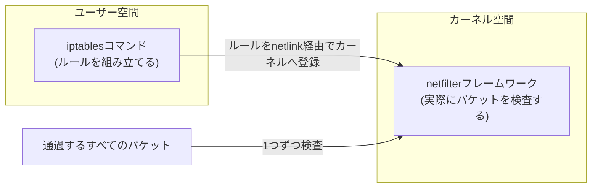
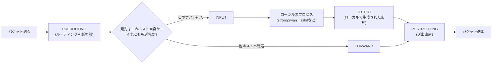

## はじめに

- **この記事で得られること**: `iptables -A INPUT ...`のようなコマンドを積み重ねてファイアウォールを構築するとき、実際にはLinuxカーネルの**netfilter**というフレームワークの何にルールを登録しているのか、パケットがどの順番でどのチェーンを通過するのか、`ACCEPT`/`DROP`以外に`MASQUERADE`のようなターゲットが何をしているのかを、体系的に理解できます。
- **対象読者**: 構築ガイドに書かれた`iptables`コマンドをコピーして実行はできるものの、`INPUT`と`FORWARD`の使い分けや、`MASQUERADE`が具体的に何をしているのかを自分の言葉で説明できない方を想定しています。
- **読むのにかかる想定時間**: 約18分

この記事は[『上位1%』シリーズ 全記事ガイド](/sitemap)の一部です。[L2TP/IPsecサーバー自作ハンズオン](/articles/l2tp-ipsec-lab-guide)でIKE/ESP/L2TP用のポート開放とクライアント向けMASQUERADEを設定した`iptables`コマンド群から派生した記事です。

## 前提知識

- **NAT/NAPT**: 送信元・宛先IPアドレスやポート番号を変換する技術です。詳しくは[NAT/NAPTの仕組み](/articles/nat-guide)で扱っています。
- **カーネル空間**: OSのネットワークスタックが動作する特権的な処理領域です。詳しくは[ユーザー空間とカーネル空間の仕組み](/articles/linux-user-kernel-space-guide)で扱っています。

## 全体像をつかむ

### 一言で言うと

**`iptables`コマンドはルールを直接処理するプログラムではなく、Linuxカーネルの`netfilter`というパケットフィルタリング機構に対して「こういうパケットが来たらこう処理してください」というルールを登録するための、あくまで設定ツールです。** 実際にパケットを1つ1つ検査してACCEPT/DROPを判断しているのはカーネル自身であり、`iptables`コマンドが実行を終えたあとは一切関与しません。

## 基礎から徹底解説

### パケットが通過する5つの関門(フックポイント)

netfilterは、IPパケットがカーネルのネットワークスタックを通過する経路上に、**5つの決まった地点(フックポイント)**を用意しており、そこを通過するすべてのパケットに対してルールを適用できます。

L2TP/IPsecハンズオンで使ったコマンドは、それぞれこのどのフックに関わるルールなのかで整理できます。

| チェーン | 通過するパケット | ハンズオンでの用途 |
|---|---|---|
| `INPUT` | このサーバー自身宛てのパケット | UDP500/4500/1701やESPをサーバー自身が受け取れるように許可 |
| `FORWARD` | このサーバーを経由して他へ転送されるパケット | L2TPクライアントの仮想IP(`10.10.10.0/24`)が行き来する通信を許可 |
| `POSTROUTING` | 送出直前のパケット | クライアントの仮想IPをサーバーの実IPに変換(MASQUERADE)してインターネットへ送り出す |

`INPUT`と`FORWARD`を混同すると、「サーバー自身への接続は許可したのに、クライアントの通信が外に出られない」あるいはその逆、という典型的なハマりどころに直結します。**自分のマシン宛てか、素通りして他へ運ばれるだけか**、この違いが2つのチェーンの使い分けの本質です。

### テーブル:同じフックポイントでも「何をするか」で分類されている

netfilterには複数の**テーブル**があり、それぞれ「フィルタリング(通す/落とす)」「アドレス変換」など役割が異なります。1つのフックポイントで、複数のテーブルのルールが決まった順序で評価されます。

| テーブル | 主な用途 | 主なチェーン |
|---|---|---|
| `filter`(デフォルト) | パケットを通すか落とすかの判断 | INPUT / FORWARD / OUTPUT |
| `nat` | 送信元・宛先アドレスの変換 | PREROUTING / POSTROUTING / OUTPUT |
| `mangle` | パケットのヘッダー情報の書き換え(TTL、TOSなど) | 全チェーン |
| `raw` | connection tracking(後述)の対象から除外するなどの特殊処理 | PREROUTING / OUTPUT |

ハンズオンで使った`sudo iptables -A INPUT -p udp --dport 500 -j ACCEPT`はテーブル省略時のデフォルトである`filter`テーブルへの追加、`sudo iptables -t nat -A POSTROUTING ... -j MASQUERADE`は明示的に`nat`テーブルを指定した追加です。

### ルールは上から順に評価され、最初に一致したもので確定する

1つのチェーンの中には複数のルールを追加でき、**パケットは上から順にルールと照合され、最初に一致したルールのターゲット(`ACCEPT`/`DROP`/`REJECT`など)がそのパケットの処理として確定します**。どのルールにも一致しなかった場合は、チェーンに設定された**デフォルトポリシー**(多くの場合`DROP`または`ACCEPT`)が適用されます。

- `-A`(append): チェーンの**末尾**にルールを追加します。
- `-I`(insert): チェーンの**先頭**(または指定した位置)にルールを挿入します。

順序が重要な理由は、**先に書いた広いルールが、後に書いた狭い例外ルールを覆い隠してしまう**ためです。「すべて拒否」のルールを先頭近くに置いてしまうと、その後に書いた許可ルールは一切評価されずに終わります。

### connection tracking(conntrack):「ステートフル」なファイアウォールの正体

netfilterには**conntrack**という、通過した通信の状態を追跡するサブシステムがあります。これにより、単純な「このポート宛てのパケットを許可する」という判定だけでなく、**「すでに確立された通信の応答パケットだけを許可する」というステートフルな判定**が可能になります。

| 状態 | 意味 |
|---|---|
| `NEW` | この通信の最初のパケット(新規のコネクション) |
| `ESTABLISHED` | 双方向の通信がすでに成立している既存のコネクションに属するパケット |
| `RELATED` | 既存のコネクションと関連はあるが別コネクションのパケット(例: FTPのデータコネクション) |
| `INVALID` | どのコネクションにも該当しない、不正なパケット |

これを使うと、たとえば「クライアントから開始された通信の応答だけを`FORWARD`で許可し、外部から一方的に送りつけられた新規パケットは拒否する」といった、より安全なルール(`-m conntrack --ctstate ESTABLISHED,RELATED -j ACCEPT`)を書けます。ハンズオンのシンプルな構成では省略していますが、実運用のファイアウォール設計ではこのステートフルな判定がほぼ必須になります。

## プロが見ている視点(上位1%の理解)

### MASQUERADEとSNATの違い:「毎回IPを聞きに行くか」というトレードオフ

送信元アドレスを変換するターゲットには`SNAT`と`MASQUERADE`があり、どちらも「複数の内部クライアントが1つの外部IPアドレスを使ってインターネットに出られるようにする」という結果は同じですが、内部動作が異なります。

- **`SNAT`**: 変換後の送信元IPアドレスを`--to-source <IP>`のように**明示的に固定値で指定**します。固定IPを持つサーバーに向いており、パケットごとにIPアドレスを都度確認する必要がないためオーバーヘッドがわずかに小さくなります。
- **`MASQUERADE`**: 変換後の送信元IPアドレスを指定せず、**送出インターフェースに現在割り当てられているIPアドレスをパケットごとに動的に問い合わせて使用**します。DHCPなどでWAN側IPアドレスが変動しうる環境(家庭用ルーターやハンズオンのラボ環境など)で有利です。

ハンズオンで`MASQUERADE`を使ったのは、まさにこの「PVEやホームルーターからDHCPでWAN側IPを取得している可能性がある検証環境」という前提に合わせた選択です。固定IPが確定している本番環境では、`SNAT`の方がわずかに効率的な選択になります。

### iptablesは今や「nftablesの皮を被った互換レイヤー」であることが多い

netfilterには`iptables`より新しい設定ツールである`nftables`があり、多くの現代的なディストリビューション(Debian 10以降やUbuntu 20.04以降など)では、`iptables`コマンドを実行すると、実際には内部で`nftables`のルールセットに変換されて登録される`iptables-nft`という互換レイヤーが使われています。`iptables --version`の出力に`(nf_tables)`と表示されていれば、これに該当します。ルールの見え方・書き方はこれまでの`iptables`と変わりませんが、**実際にカーネル内でパケットを検査しているエンジンはnftablesである**という点は、将来的に`nftables`ネイティブの構文へ移行する際の背景知識として押さえておく価値があります。

## よくある誤解・つまずきポイント

- **誤解1: 「INPUTを許可すればそのポートの通信はすべて通る」**
  `INPUT`チェーンはあくまで「このホスト自身宛て」のパケットにしか適用されません。VPNクライアントの仮想IP宛ての通信(ハンズオンの`10.10.10.0/24`)のように、サーバーを経由して他へ転送される通信には`FORWARD`チェーンのルールが必要です。
- **誤解2: 「ファイアウォールで一度ACCEPTすれば、以降のルールは評価されない」**
  正確には「そのパケット1つに対する判定が確定する」だけです。次に到着する別のパケットは、再びチェーンの先頭からすべてのルールと照合されます。
- **誤解3: 「iptablesのルールは再起動しても保持される」**
  netfilterへ登録されたルールはカーネルのメモリ上の状態であり、**デフォルトでは再起動すると消えます**。`iptables-persistent`パッケージや`iptables-save`/`iptables-restore`を使って明示的に永続化する設定が別途必要です。

## 障害・トラブルシューティングの視点

1. **特定の通信だけ届かない**: `sudo iptables -L -v -n --line-numbers`で各チェーンのルールと、それぞれのルールに何パケットが一致したか(カウンタ)を確認します。想定したルールのカウンタが0のままなら、そのルールより前にある別のルールで先に処理が確定してしまっている可能性が高いです。
2. **ルールを追加したのに反映されていないように見える**: 追加先のテーブル(`-t nat`の指定漏れなど)やチェーン名の誤りがないか確認します。
3. **再起動後にファイアウォール設定が消えている**: 前述の通り、ルールの永続化設定(`iptables-persistent`など)が入っていない可能性が高いです。`sudo iptables -L`で現在のルールが空でないかを確認してください。
4. **MASQUERADEを設定したのにクライアントがインターネットに出られない**: `net.ipv4.ip_forward`が有効になっているか([sysctlの記事](/articles/linux-sysctl-guide)参照)を確認します。`FORWARD`チェーンが許可されていても、カーネルのIPフォワーディング自体が無効なら、そもそもパケットは転送されません。

### 予防策・恒久対策

- ルールセット全体を`iptables-save`でテキスト化し、構成管理ツールやgitで変更履歴を管理する(コマンドの実行順に依存する属人的な運用を避ける)。
- チェーンのデフォルトポリシーは`DROP`にしたうえで必要な通信だけを明示的に`ACCEPT`する、ホワイトリスト方式を基本方針にする。
- 新しいディストリビューションでは`nftables`ネイティブへの移行も選択肢に入れ、`iptables-nft`互換レイヤーに依存し続けることの是非をチームで検討しておく。

## まとめ

- `iptables`コマンドは、Linuxカーネルの`netfilter`にルールを登録するための設定ツールであり、実際のパケット検査はカーネル自身が行います。
- パケットは経路上の5つのフックポイント(PREROUTING/INPUT/FORWARD/OUTPUT/POSTROUTING)を通過し、`INPUT`(自ホスト宛て)と`FORWARD`(素通り)の使い分けが最も基本的な整理軸です。
- ルールは上から順に評価され最初に一致したもので確定するため、順序設計がファイアウォールの正しさを左右します。
- `MASQUERADE`はWAN側IPが動的な環境向けの送信元アドレス変換で、固定IPが確定している環境では`SNAT`の方が効率的です。

**今日から意識すべきこと**
1. ファイアウォールのルールを設計するときは、「このホスト自身宛てか、素通りする通信か」をまず切り分け、`INPUT`と`FORWARD`のどちらに書くべきかを意識しましょう。
2. ルールを追加・変更したら、`iptables -L -v -n`でカウンタを見ながら意図通りにパケットが一致しているかを確認する習慣をつけましょう。

## 参考文献

- [iptables(8) — Linux manual page](https://man7.org/linux/man-pages/man8/iptables.8.html)
- [Netfilter/iptables project home](https://www.netfilter.org/)
- [nftables wiki — What is nftables?](https://wiki.nftables.org/)
