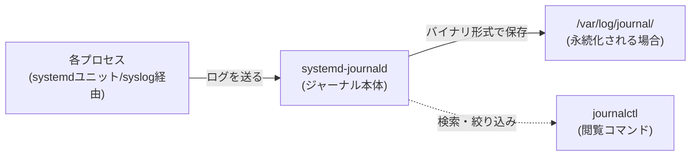
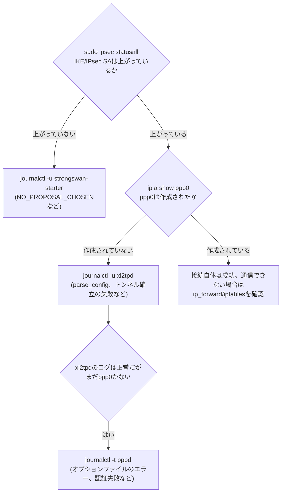

## はじめに

- **この記事で得られること**: サービスが起動しない、接続できない、といったLinux上のトラブルに直面したとき、`journalctl`を使ってどこから手をつければ原因にたどり着けるのかを、コマンドの使い方だけでなく「どの順番で・何を確認するか」という考え方として身につけられます。[L2TP/IPsecサーバー自作ハンズオン](/articles/l2tp-ipsec-lab-guide)で実際に発生した複数のエラーを題材に、実務そのままの調査の流れを追体験します。
- **対象読者**: `systemctl status`でエラーが出たことは分かるが、そこから先どうやって原因を特定すればいいか手順化できていない方、複数のプロセスが連携して動くシステム(VPNサーバーなど)でどのログをどの順番で見ればいいか迷ったことがある方を想定しています。
- **読むのにかかる想定時間**: 約15分

この記事は[『上位1%』シリーズ 全記事ガイド](/sitemap)の一部です。[L2TP/IPsecサーバー自作ハンズオン](/articles/l2tp-ipsec-lab-guide)で発生したxl2tpd/pppdのエラー調査から派生した記事です。

## 前提知識

- **[デーモン(daemon)とは何か](/articles/linux-daemon-guide)**: systemdがデーモンをどう起動・監視しているかの前提知識です。
- **標準出力/標準エラー出力**: プログラムがメッセージを出力する2つの経路です。journalctlはこれらを含む複数のログ経路をまとめて記録・検索できます。

## 全体像をつかむ

### 一言で言うと

**journalctlは、systemdが管理する「ジャーナル」というバイナリ形式のログストアに対する検索コマンド**です。`/var/log/syslog`のようなテキストファイルを`grep`で探す代わりに、サービス名・時刻範囲・優先度(エラーレベル)・出力元プロセスといった条件で構造化されたログを直接絞り込めます。



`journald`は、systemdユニットとして起動されたプロセスの標準出力・標準エラー出力を自動的に収集するのに加えて、**syslog経由で送られてくるメッセージ**(`syslog()`関数を呼ぶ、systemd化されていない古いスタイルのプログラムも含む)も同じジャーナルにまとめて記録します。この「起動方法によらず一箇所に集約される」という性質が、後述する`-u`と`-t`の使い分けにつながります。

## 基礎から徹底解説

### `-u`: systemdユニット単位で見る

最もよく使うのが、特定のsystemdユニット(サービス)のログに絞り込む`-u`です。

```bash
sudo journalctl -u xl2tpd
```

`xl2tpd`のように`systemctl start xl2tpd`のような形でsystemdが直接起動・管理しているプロセスであれば、これで過不足なくログを追えます。

### `-t`: syslog識別子(タグ)で見る——systemdユニットではないプロセスのログ

ここで見落としやすい落とし穴があります。`xl2tpd`はsystemdユニットとして管理されていますが、`xl2tpd`が内部的に呼び出す**`pppd`はsystemdユニットではありません**(`systemctl status pppd`のようなユニットは存在しません)。`pppd`はsyslog経由でログを出力するだけの、通常のプロセスです。このような場合は、`-u`ではなく、syslogの識別子(プログラム名のタグ)で絞り込む`-t`を使います。

```bash
sudo journalctl -t pppd -n 30 --no-pager
```

`-u`で追えるのは「systemdが管理しているプロセス」の範囲までで、そのプロセスがさらに子プロセスとして起動する別プログラムのログは、`-u`の絞り込みに含まれないことがあります。「エラーが起きているはずなのに`-u`で見たログにそれらしいものが出てこない」と感じたら、そのサービスが内部で別のプログラムを呼び出していないか、`ps`やドキュメントで確認し、`-t`での絞り込みも試してみる価値があります。

### `-f`: リアルタイムに追いかける

```bash
sudo journalctl -u xl2tpd -f
```

`-f`(follow)は、`tail -f`と同様に、新しく出力されたログをリアルタイムに表示し続けます。「このコマンドを実行した瞬間に何が起きるか」を確認したいとき(接続を試みる、サービスを再起動するなど)、事前に`-f`で待ち構えておくと、タイミングを取り逃しません。

### `-n`と`--no-pager`: 直近N件だけを、ページャなしで

```bash
sudo journalctl -u xl2tpd -n 30 --no-pager
```

`-n 30`は直近30件だけに絞り込みます。`--no-pager`は、対話的なページャ(`less`のような、スクロールしながら閲覧するツール)を使わず、そのまま標準出力に流します。SSH接続先でコマンドの出力をそのままコピー&ペーストして共有したい場合や、他のコマンドにパイプで渡したい場合は`--no-pager`を付けるのが定石です。

### `-xe`: 直近のエラーと、関連する補足情報をまとめて見る

```bash
sudo systemctl status xl2tpd.service
```

サービス起動に失敗すると、多くの場合`journalctl -xeu <ユニット名>`を実行するよう案内が表示されます。

```bash
sudo journalctl -xeu xl2tpd.service
```

`-e`は末尾(最新のログ)にジャンプし、`-x`はログの内容に応じて、systemd自身が持つ補足説明(「このエラーの一般的な原因は〜」といった追加情報)を付け加えて表示します。単に生ログを眺めるより、何が起きたのかを理解する手がかりが増えます。

<details>
<summary>ジャーナルが永続化されない環境がある</summary>

ディストリビューションや設定によっては、ジャーナルがメモリ上にのみ保持され、再起動すると消える(揮発性)設定になっていることがあります。過去のログを再起動後も残したい場合は、`/var/log/journal`ディレクトリを作成する(`sudo mkdir -p /var/log/journal`し`sudo systemctl restart systemd-journald`)ことで永続化できます。

</details>

## 実践: L2TP/IPsecハンズオンのエラーをjournalctlで追う

[L2TP/IPsecサーバー自作ハンズオン](/articles/l2tp-ipsec-lab-guide)は、strongSwan(IPsec)・xl2tpd(L2TP)・pppd(PPP)という3つの独立したプロセスが連携して動く構成です。接続はこの順番([IKE→L2TP→PPP](/articles/l2tp-ipsec-guide))で確立するため、**トラブルシューティングもこの順番で進めるのが最も効率的**です。



1. **`sudo ipsec statusall`**: まずここでIKE/IPsec SAが確立しているかを見ます。確立していなければ、`journalctl -u strongswan-starter -f`でIKEの提案(プロポーザル)が一致しているか、`NO_PROPOSAL_CHOSEN`のようなエラーが出ていないかを確認します。
2. **`sudo journalctl -u xl2tpd`**: IPsecのSAは確立しているのに`ppp0`が現れない場合、次はxl2tpd自身のログです。`parse_config: line NN: data '...'`のようなエラーが出ていれば、`/etc/xl2tpd/xl2tpd.conf`の該当行の構文(行頭に`;`が残っていないか、など)を疑います。
3. **`sudo journalctl -t pppd -n 30 --no-pager`**: xl2tpdのログにエラーが見当たらないのに接続が確立しない場合、xl2tpdが子プロセスとして起動する`pppd`自身のログを確認します。`unrecognized option`(オプションファイルのタイポ、あるいはその環境で使えないオプション)や`couldn't find any suitable secret`(`chap-secrets`に該当ユーザーの情報がない)といったメッセージは、ほぼここでしか見つかりません。

**サーバー側・クライアント側、両方のホストのログを確認する**ことも重要です。L2TP/IPsecのようにクライアント/サーバーの両方に同じ3プロセスが存在する構成では、「クライアント側は正常に動いているように見えるのに接続できない」というケースの原因が、サーバー側のログにしか出ていないことがよくあります。両方のホストで同じ時刻帯のログを突き合わせると、どちらの側で処理が止まっているかを特定しやすくなります。

## プロが見ている視点(上位1%の理解):エラーメッセージを検索するときのコツ

`unrecognized option 'crtscts'`のような具体的なエラーメッセージが得られたら、そのままの文字列で検索するのが最も早い解決策につながります。一方で、エラーメッセージが出ない「静かな失敗」(`lock`オプションのように、明確なエラーを吐かずにただプロセスが起動に失敗するケース)は、`journalctl`だけでは原因の特定に限界があります。このような場合は、疑わしい設定項目を1つずつコメントアウトして再起動し、どの項目を外すと動くようになるかを二分探索的に絞り込む地道な作業が必要になることがあります。ログから得られる情報と、切り分けのための実験を組み合わせる姿勢が、原因調査の再現性を高めます。

## まとめ

- `journalctl -u <ユニット名>`はsystemdが直接管理するプロセスのログ、`journalctl -t <識別子>`はsystemdユニットではない子プロセス(pppdなど)のログを見るためのものです。
- `-f`はリアルタイム追跡、`-n`は件数制限、`--no-pager`はページャなしでの出力、`-xe`は最新のログと補足説明の表示に使います。
- 複数のプロセスが連携するシステムでは、接続確立の順序(IKE→L2TP→PPP)に沿って、どのログを・どの順番で・どちら側のホストで確認するかを決めると、原因調査が効率的になります。

**今日から意識すべきこと**
1. エラーに遭遇したら、まず`systemctl status`の案内通り`-xeu`で概要をつかみ、次に関係するプロセスを洗い出して、systemdユニットかどうかで`-u`/`-t`を使い分ける、という手順を型として持っておきましょう。
2. 複数ホスト・複数プロセスが絡む障害では、「どの順番で確立されるはずか」という設計知識が、ログをどこから見るべきかの地図になります。

## 参考文献

- [journalctl(1) — Linux manual page](https://man7.org/linux/man-pages/man1/journalctl.1.html)
- [systemd-journald.service(8) — Linux manual page](https://man7.org/linux/man-pages/man8/systemd-journald.service.8.html)
- [xl2tpd | Linux man-pages](https://man7.org/linux/man-pages/man8/xl2tpd.8.html)
