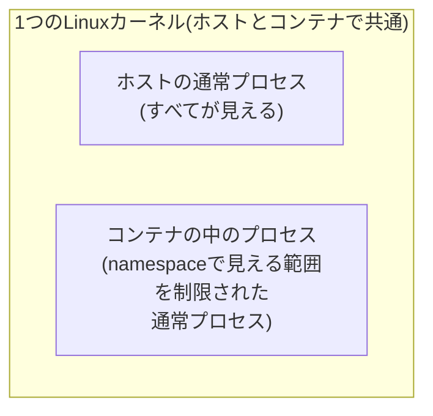

## はじめに

- **この記事で得られること**: [ユーザー空間とカーネル空間](/articles/linux-user-kernel-space-guide)で学んだ、プロセスがカーネルを介して動作するという前提を踏まえ、**「コンテナ」という技術が、専用の仮想化機構ではなく、Linuxカーネルが元々持っているnamespaceという機能を組み合わせただけのものである**ことを、`unshare`コマンドで自分の手でnamespaceを1つずつ組み立てることで体験します。
- **対象読者**: Docker・Podmanなどのコンテナを日常的に使っているものの、「コンテナの中」が、具体的にどういう仕組みで、ホストと隔離されているのかを説明できない方を想定しています。
- **読むのにかかる想定時間**: 約25分(ハンズオン実施込み)

この記事は[『上位1%』シリーズ 全記事ガイド](/sitemap)の一部、[Linux基盤シリーズ](/sitemap#シリーズ一覧)の19本目です。[ハンズオン準備マニュアル](/articles/handson-prep-guide)で作成したUbuntu Server環境が1台あれば実施できます。

## 前提知識

- **ユーザー空間とカーネル空間**: [ユーザー空間とカーネル空間、TUN/TAPデバイスの仕組み](/articles/linux-user-kernel-space-guide)で扱った、プロセスがカーネルの管理下で動作するという前提です。

## 全体像をつかむ

「コンテナの中は、別のOSが動いている」というイメージを持ってしまうと、この後の挙動がすべて説明できなくなります。実際には、コンテナの中のプロセスも、ホストとまったく同じ1つのLinuxカーネルの上で動いています。



## ハンズオン手順

### Step 1: 何も制限せずに、現在のプロセス一覧を確認する

```bash
ps aux | wc -l
```

**実行結果(例):**

```
87
```

**ホストで動いている、すべてのプロセスの数が表示されます。**

### Step 2: PID namespaceを分離し、プロセスの見え方を確認する

```bash
sudo unshare --pid --fork --mount-proc /bin/bash
ps aux
```

**実行結果:**

```
USER       PID %CPU %MEM    VSZ   RSS TTY      STAT START   TIME COMMAND
root         1  0.0  0.1   8376  5244 pts/0    S    12:00   0:00 /bin/bash
root         6  0.0  0.1  10632  3328 pts/0    R+   12:00   0:00 ps aux
```

**先ほど87個あったはずのプロセスが、2個しか見えなくなりました。** これは、プロセスが実際に終了したわけではなく、**この`bash`が、新しいPID namespaceの中に入り、そのnamespaceの外にあるプロセスが、一切見えなくなった**ためです。そして、注目すべきは、**この新しいnamespaceの中では、bash自身のPIDが「1」になっている**ことです。通常、PID 1はホスト全体のinitプロセスだけが持つ特別な番号ですが、**namespaceが分離されていれば、その中だけの「1番目のプロセス」として、別々に存在できる**ことが分かります。

<details>
<summary>なぜ「見えなくする」だけで、隔離が成立するのか</summary>

**namespaceは、「リソースを複製する」仕組みではなく、「あるプロセスから、特定の種類の情報を見せない(別の視点を与える)」仕組みです。** ホストの87個のプロセスは、何一つ実際には変化していません。unshareで作られた新しいbashプロセスだけが、「PID namespaceが別である、自分とその子プロセス以外は、一切見えない」という、特別な視点を与えられているに過ぎません。この「視点を制限する」という発想が、コンテナが持つ、見かけ上の隔離の正体です。

</details>

### Step 3: mount namespaceを分離し、ファイルシステムの見え方を確認する

元のシェルを一度抜け、新しいmount namespaceも組み合わせて作成します。

```bash
exit
sudo unshare --pid --fork --mount-proc --mount /bin/bash
mount -t tmpfs tmpfs /mnt
echo "visible only inside this namespace" > /mnt/secret.txt
cat /mnt/secret.txt
```

**実行結果:**

```
visible only inside this namespace
```

別のターミナルを開き、ホスト側から同じパスを確認します。

```bash
ls /mnt/
cat /mnt/secret.txt
```

**実行結果:**

```
cat: /mnt/secret.txt: No such file or directory
```

**namespaceの中で行った`/mnt`へのマウントとファイル作成が、ホスト側には一切反映されていません。** これは、**mount namespaceが分離されているプロセスは、自分専用の、独立したマウントテーブルを持っている**ためです。コンテナの中でファイルシステムの構造がホストと異なって見えるのは、この仕組みの、直接的な応用です。

## プロが見ている視点(上位1%の理解)

### 「コンテナ技術」は、新しい概念ではなく「既存の機能の組み合わせ」である

このハンズオンで確認した通り、**コンテナという技術は、PID namespace・mount namespace・ネットワークnamespaceといった、Linuxカーネルが以前から持っている個別の機能を、1つのプロセスに対してまとめて適用した結果**です。DockerやPodmanのようなツールは、この`unshare`で手動で行った操作を、cgroupsによるリソース制限とあわせて、自動的かつ便利に行ってくれる、**オーケストレーションレイヤー**に過ぎません。**「コンテナは専用の軽量VMである」という理解では、ホストとコンテナが同じカーネルを共有しているという、セキュリティ上の重要な前提([カーネルの脆弱性が、コンテナの隔離を破る可能性がある](/articles/linux-user-kernel-space-guide)という前提)を見落としてしまいます。** 上位1%のエンジニアは、コンテナを「魔法の隔離装置」ではなく、「namespaceという視点制限の組み合わせ」として理解しています。

## よくある誤解・つまずきポイント

- **誤解1: 「コンテナの中では、ホストとは別のLinuxカーネルが動いている」**
  コンテナの中のプロセスも、ホストとまったく同じ1つのLinuxカーネルの上で動いています。別々に見えるのは、namespaceによって視点が制限されているためです。
- **誤解2: 「PID namespaceを分離すると、ホストのプロセスが実際に停止する」**
  ホストのプロセスは、何も変化していません。新しいnamespaceの中のプロセスから、それらが単に見えなくなっているだけです。
- **誤解3: 「unshareで作ったnamespaceは、Dockerのコンテナと全く同じものである」**
  Dockerのコンテナは、namespace(PID・mount・ネットワークなど複数)とcgroups(リソース制限)を組み合わせ、さらにイメージの管理やネットワーク構成を自動化したものです。unshareは、その土台となる個々のnamespace機能を、手動で体験するためのコマンドです。

## 障害・トラブルシューティングの視点

1. **コンテナの中から、ホストのプロセスが操作できてしまう**: PID namespaceが正しく分離されずに起動していないかを確認します。
2. **コンテナ内のファイルが、再起動後に消えている**: mount namespace内で行った変更は、明示的に永続化されたボリュームでない限り、コンテナの終了とともに失われます。
3. **`unshare`コマンドが権限エラーで失敗する**: PID namespaceやmount namespaceの作成には、通常root権限(`sudo`)が必要です。

## まとめ

- コンテナは、専用の仮想化機構ではなく、ホストとまったく同じLinuxカーネルの上で動く、1つの通常プロセスです。
- namespaceは、「リソースを複製する」のではなく、「特定のプロセスから、特定の情報を見せない」という、視点を制限する仕組みです。
- PID namespaceを分離すると、そのnamespace内のプロセスからは、外部のプロセスが一切見えなくなり、自身のPIDは「1」になります。
- mount namespaceを分離すると、そのnamespace内で行ったマウント操作やファイル変更は、ホスト側には反映されません。

**今日から意識すべきこと**
1. コンテナのセキュリティを検討する際は、「ホストとカーネルを共有している」という前提を、常に意識しましょう。
2. Docker/Podmanの挙動で分からないことに遭遇したら、「これはnamespaceのどの種類による制限か」を、一段掘り下げて考える習慣をつけましょう。

## 参考文献

- [namespaces(7) Manual Page](https://man7.org/linux/man-pages/man7/namespaces.7.html)
- [unshare(1) Manual Page](https://man7.org/linux/man-pages/man1/unshare.1.html)
