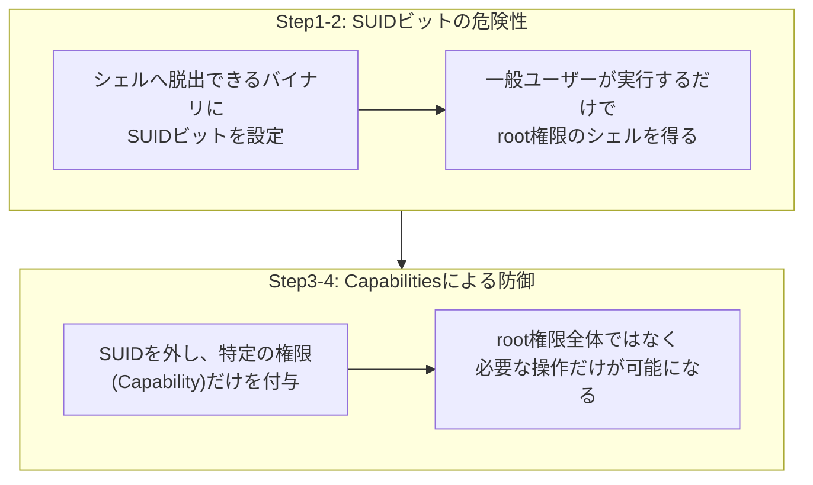

## はじめに

- **この記事で得られること**: [パーミッション(chmod)とは何か](/articles/linux-file-permissions-guide)で学んだ、読み取り・書き込み・実行権限の仕組みを前提に、**SUIDビットを立てたバイナリが、シェルへ脱出する手段を持っているだけで、一般ユーザーがroot権限を奪取する踏み台になってしまう**という危険性を、安全な検証環境の中だけで再現し、**Linux Capabilities**を使って、必要最小限の権限だけを付与することによる防御を確認します。
- **対象読者**: `chmod`によるパーミッション設定は理解しているものの、SUIDビットが、なぜ一般的な権限設定よりも危険視されるのかを、具体的に説明できない方を想定しています。
- **重要な注意**: **このハンズオンは、自分が管理する検証環境の防御力を高めるための、教育・防御目的のものです。** 実運用中の他者の環境に対して、許可なくこの手順を実行しないでください。本記事で使う検証環境は、自分自身で用意したサーバーに対してのみ操作を行うものであり、第三者のシステムへの攻撃手順は一切含まれていません。
- **読むのにかかる想定時間**: 約22分(ハンズオン実施込み)

この記事は[『上位1%』シリーズ 全記事ガイド](/sitemap)の一部、[Linux基盤シリーズ](/sitemap#シリーズ一覧)の20本目です。[ハンズオン準備マニュアル](/articles/handson-prep-guide)で作成したUbuntu Server環境が1台あれば実施できます。

## 前提知識

- **パーミッションの基本**: [パーミッション(chmod)とは何か](/articles/linux-file-permissions-guide)で扱った、読み取り・書き込み・実行権限の仕組みです。

## 全体像をつかむ

このハンズオンでは、次の2段階を確認します。



## ハンズオン手順

### Step 1: シェルへ脱出できるバイナリに、SUIDビットを設定する

検証用に、一般ユーザーを作成し、動作確認用のバイナリを用意します。

```bash
sudo useradd -m testuser
sudo cp /usr/bin/find /usr/local/bin/find-suid-demo
sudo chown root:root /usr/local/bin/find-suid-demo
sudo chmod u+s /usr/local/bin/find-suid-demo
ls -l /usr/local/bin/find-suid-demo
```

**実行結果(該当部分):**

```
-rwsr-xr-x 1 root root ... /usr/local/bin/find-suid-demo
```

**パーミッション表示の`s`が、SUIDビットが立っていることを示しています。** `find`コマンドは、[GNU findutilsの仕様により](/articles/linux-find-guide)、`-exec`オプションで任意のコマンドを実行できる機能を持っています。

### Step 2: 一般ユーザーの権限で、root権限のシェルを取得する

```bash
su - testuser
/usr/local/bin/find-suid-demo . -maxdepth 0 -exec /bin/sh -p \; -quit
whoami
```

**実行結果:**

```
root
```

**一般ユーザーである`testuser`が、root権限のシェルを取得してしまいました。** これは、[SUIDビットが立ったバイナリは、実行したユーザーの権限ではなく、ファイルの所有者(ここではroot)の権限で動作する](/articles/linux-file-permissions-guide)という仕組みを悪用した結果です。`find`コマンド自体は無害な一般的なコマンドですが、**任意のコマンドを実行できる機能を持つバイナリに、安易にSUIDビットを立てることが、どれほど危険かが具体的に示されました。**

<details>
<summary>なぜ`find`のようなコマンドが、この問題の対象になるのか</summary>

SUIDが危険視されるのは、**バイナリの機能そのものに、シェルや任意のコマンドを呼び出す手段が含まれている場合**です。`find`の`-exec`、`vim`の`:!`、`less`の`!`など、一見無害に見える多くの標準コマンドが、実はこの性質を持っています。**「root権限でこの1つの処理だけを行わせたい」という目的のために、安易にSUIDを立てる**という判断が、このような、作成者が意図していない広範囲の権限奪取につながります。

</details>

### Step 3: SUIDを外し、Linux Capabilitiesで必要最小限の権限だけを付与する

まず、Step 1で作成したSUIDバイナリを無効化します。

```bash
exit
sudo chmod u-s /usr/local/bin/find-suid-demo
```

次に、**特定のネットワークポートへバインドする権限だけ**を必要とする、別のデモ用プログラムに対して、Capabilitiesを設定します。

```bash
cat << 'EOF' > /tmp/bind_demo.py
import socket
s = socket.socket(socket.AF_INET, socket.SOCK_STREAM)
s.bind(("0.0.0.0", 80))
print("Bound to port 80 successfully")
EOF
sudo cp /usr/bin/python3 /usr/local/bin/python3-cap-demo
sudo setcap 'cap_net_bind_service=+ep' /usr/local/bin/python3-cap-demo
getcap /usr/local/bin/python3-cap-demo
```

**実行結果:**

```
/usr/local/bin/python3-cap-demo cap_net_bind_service=ep
```

### Step 4: 一般ユーザーの権限で、権限が必要な操作だけが許可されることを確認する

```bash
su - testuser
/usr/local/bin/python3-cap-demo /tmp/bind_demo.py
whoami
```

**実行結果:**

```
Bound to port 80 successfully
testuser
```

**一般ユーザーである`testuser`のまま、通常は root権限が必要な、1024番未満のポートへのバインドだけに成功しました。** `whoami`の結果も、`root`ではなく`testuser`のままです。**`cap_net_bind_service`という、1つの具体的な権限だけを付与したことで、root権限全体を渡すことなく、必要な操作だけを実現できている**ことが確認できました。

## プロが見ている視点(上位1%の理解)

### 「root権限が必要」という理由だけで、SUIDを選んではならない

このハンズオンの最大の教訓は、**「ある処理にroot権限が必要だから」という理由だけで、安易にSUIDビットを選んでしまうと、その処理に無関係な、バイナリの他の機能までもが、root権限で実行可能になってしまう**という点です。**Linux Capabilitiesは、root権限を、`cap_net_bind_service`(特権ポートへのバインド)、`cap_net_raw`(生ソケットの使用)のような、意味のある単位に分割し、本当に必要な権限だけを個別に付与できる仕組みです。** これは、[AWSのIAMポリシー評価ロジック](/articles/aws-iam-policy-evaluation-guide)で扱った、最小権限の原則とも共通する、**「全か無かの権限ではなく、必要な分だけを切り出して渡す」という、権限設計全般に通底する考え方**です。上位1%のエンジニアは、「権限が足りないから、とりあえずrootで動かす」という判断を避け、常に「本当に必要な権限は、具体的に何か」を問い直します。

## よくある誤解・つまずきポイント

- **誤解1: 「SUIDビットは、特定の処理1つだけに、root権限を与える仕組みである」**
  SUIDビットは、バイナリ全体に対してroot権限での実行を許可します。そのバイナリが、シェルや任意のコマンド実行の機能を持っていれば、その機能経由でもroot権限が使えてしまいます。
- **誤解2: 「Capabilitiesを設定すれば、そのバイナリは完全にroot権限で動作する」**
  Capabilitiesは、root権限全体ではなく、`cap_net_bind_service`のような、個別の具体的な権限だけを付与する仕組みです。
- **誤解3: 「この問題は、findコマンド特有の欠陥である」**
  findコマンド自体に欠陥はありません。任意のコマンドを呼び出せる機能を持つバイナリに、安易にSUIDを立てるという運用上の判断が、問題の本質です。

## 障害・トラブルシューティングの視点

1. **サーバー内に、意図しないSUIDバイナリが存在するか調査したい**: `find / -perm -4000 -type f 2>/dev/null`で、SUIDビットが立っているファイルを一覧できます。
2. **Capabilitiesを設定したはずのバイナリで、権限エラーが発生する**: `getcap`で、意図したCapabilityが正しく設定されているかを確認します。バイナリをコピーし直すと、設定したCapabilitiesが失われることにも注意してください。
3. **SUIDを外したら、既存の処理が動かなくなった**: その処理が、本当にSUIDを必要としていたのかを再確認し、Capabilitiesなど、より権限範囲の狭い代替手段へ切り替えられないかを検討します。

## まとめ

- SUIDビットを立てたバイナリが、シェルや任意のコマンドを実行できる機能を持っていると、一般ユーザーがroot権限を奪取する踏み台になります。
- この危険性は、findコマンド特有の欠陥ではなく、SUIDという仕組みそのものに内在する、構造的なリスクです。
- Linux Capabilitiesは、root権限を意味のある単位に分割し、本当に必要な権限だけを個別に付与できる仕組みです。
- 「root権限が必要だから」という理由だけでSUIDを選ぶのではなく、本当に必要な権限を具体的に見極める姿勢が重要です。

**今日から意識すべきこと**
1. root権限が必要な処理に遭遇したら、まずSUIDではなく、Capabilitiesで実現できないかを検討しましょう。
2. サーバーの定期的な棚卸しに、意図しないSUIDバイナリの確認を含めましょう。

## 参考文献

- [capabilities(7) Manual Page](https://man7.org/linux/man-pages/man7/capabilities.7.html)
- [GTFOBins - find](https://gtfobins.github.io/gtfobins/find/)
