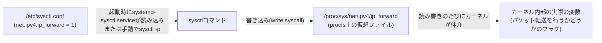

## はじめに

- **この記事で得られること**: `/etc/sysctl.conf`に`net.ipv4.ip_forward = 1`のような1行を書くだけで、なぜ実際にカーネルのパケット転送の挙動が変わるのか、その裏側にある**procfs**という仮想ファイルシステムの仕組み、`sysctl`コマンドとの対応関係、そして「編集したのに反映されない」という典型的なつまずきの原因までを体系的に理解できます。
- **対象読者**: `/etc/sysctl.conf`にパラメータを書き足して`sysctl -p`を実行する手順は知っているものの、なぜテキストファイルの中身がカーネルの動作そのものを変えるのか、その仕組みを説明できない方を想定しています。
- **読むのにかかる想定時間**: 約14分

この記事は[『上位1%』シリーズ 全記事ガイド](/sitemap)の一部です。[L2TP/IPsecサーバー自作ハンズオン](/articles/l2tp-ipsec-lab-guide)で`/etc/sysctl.conf`に`net.ipv4.ip_forward = 1`などを設定した箇所から派生した記事です。

## 前提知識

- **カーネル空間・システムコール**: プログラムがカーネルの機能を呼び出す仕組みです。詳しくは[ユーザー空間とカーネル空間の仕組み](/articles/linux-user-kernel-space-guide)で扱っています。
- **ファイルシステム**: ディスク上のデータをファイル・ディレクトリという形で扱うための仕組みです。通常は物理的なディスク領域と対応しています。

## 全体像をつかむ

### 一言で言うと

**procfs(`/proc`)は、ディスク上には実体が存在せず、アクセスされた瞬間にカーネルがその場で内容を生成する「仮想的な」ファイルシステムです。** その中の`/proc/sys`以下は、カーネルが動作中に参照する設定値(チューニングパラメータ)を「ファイル」として見せかけたもので、このファイルを読めば現在の値が、書き込めばカーネル内部の実際の値が、**その場で即座に**変わります。`sysctl`コマンドや`/etc/sysctl.conf`は、この`/proc/sys`を便利に読み書きするための、あくまで「フロントエンド」に過ぎません。



## 基礎から徹底解説

### procfsは「ディスク上のファイル」ではない

`ls /proc`を実行すると、数字の名前が並んだディレクトリ(実行中の各プロセスのPIDに対応)や、`cpuinfo`・`meminfo`のようなファイルが見えます。しかし、これらは`df`で見えるどのディスクパーティションにも実体を持ちません。**カーネルが、`/proc`以下のパスへのアクセスを検知するたびに、そのとき保持している内部データを「あたかもファイルであるかのような」形式に整形して返しているだけです。** `cat /proc/meminfo`のたびに数値が変わって見えるのは、キャッシュされた古いファイルを読んでいるのではなく、**その都度カーネルの内部状態をリアルタイムに反映している**ためです。

### `/proc/sys`とsysctlキーの対応関係

`/proc`以下のうち、カーネルの動作を**変更**できる(書き込み可能な)パラメータ群が置かれているのが`/proc/sys`です。ここには、階層的なディレクトリ構造の末端にファイルとして1つ1つのパラメータが並んでいます。

```bash
cat /proc/sys/net/ipv4/ip_forward
```

`sysctl`コマンドは、このパスをドット区切りの「キー」として扱う、単なる読み書きの糖衣構文(シンタックスシュガー)です。

| `/proc/sys`のパス | 対応する`sysctl`キー |
|---|---|
| `/proc/sys/net/ipv4/ip_forward` | `net.ipv4.ip_forward` |
| `/proc/sys/net/ipv4/conf/all/accept_redirects` | `net.ipv4.conf.all.accept_redirects` |

つまり、`sysctl net.ipv4.ip_forward`は`cat /proc/sys/net/ipv4/ip_forward`と、`sysctl -w net.ipv4.ip_forward=1`は`echo 1 > /proc/sys/net/ipv4/ip_forward`(root権限)と、それぞれほぼ等価です。パス区切りの`/`がキーの`.`に対応している、と覚えておくと、知らないパラメータに出会ったときも自力でファイルの場所を推測できます。

<details>
<summary>`net.ipv4.conf.all.accept_redirects`/`send_redirects`とは何か(L2TP/IPsecハンズオンでの設定項目)</summary>

`accept_redirects`は、他のルーターから届いたICMPリダイレクトメッセージ(「そのパケットは私経由ではなく、こちらのルーター経由で送った方が近道です」という通知)を信用してルーティングテーブルを書き換えるかどうかの設定です。これを信用してしまうと、悪意のある端末が偽のICMPリダイレクトを送りつけることで通信経路を乗っ取る攻撃(中間者攻撃の一種)が成立しうるため、`0`(無効化)にするのが安全側の運用です。`send_redirects`は逆に、自分自身がICMPリダイレクトを送信する側になるかどうかの設定で、VPNサーバーのように「本来のLAN内ルーターではない」ホストでは`0`にしておくのが適切です。

</details>

### `/etc/sysctl.conf`を編集しただけでは反映されない理由

ここが最大のつまずきポイントです。**カーネルは`/etc/sysctl.conf`というファイルの存在を一切知りません。** このファイルはあくまで、`sysctl`コマンド(またはOS起動時に自動実行される`systemd-sysctl.service`)が「起動時、または明示的に指示されたときに、この一覧の内容を`/proc/sys`へ書き込んでいく」ための入力リストに過ぎません。したがって、

- OS起動時は、`systemd-sysctl.service`が`/etc/sysctl.conf`と`/etc/sysctl.d/*.conf`を読み込んで自動的に`/proc/sys`へ反映します。
- 稼働中のシステムで`/etc/sysctl.conf`を編集しただけでは、**ファイルの中身が変わるだけで、カーネルの実際の動作は何も変わりません**。反映させるには、再起動するか、明示的に次のコマンドを実行して`/proc/sys`へ書き込みを行う必要があります。

```bash
sudo sysctl -p
```

このコマンドは、「`/etc/sysctl.conf`を読み、その内容を1行ずつ`/proc/sys`以下の対応するファイルへ書き込む」という処理を、まとめて実行しているだけです。

### `/etc/sysctl.conf`と`/etc/sysctl.d/`の使い分け

現代のディストリビューションでは、単一の`/etc/sysctl.conf`に加えて、`/etc/sysctl.d/*.conf`という**ドロップイン方式**のディレクトリが推奨されています。パッケージやアプリケーションごとに個別のファイル(例: `/etc/sysctl.d/99-vpn-lab.conf`)を追加でき、ファイル名の辞書順(通常は数字プレフィックスで制御)で読み込まれるため、**手作業で1つの巨大な`sysctl.conf`を編集し続けて競合させる**リスクを避けられます。

## プロが見ている視点(上位1%の理解)

### procfs型の設定は「即時反映・非永続」、設定ファイル型は「永続・非即時」というトレードオフ

`/proc/sys`への直接書き込みは、実行中のカーネルに即座に反映されますが、再起動すればカーネルのデフォルト値に戻ってしまいます(**即時性はあるが永続しない**)。一方、`/etc/sysctl.conf`への記述は、再起動後も自動的に適用される永続的な設定ですが、**書いただけでは今動いているカーネルには反映されません**(**永続するが即時ではない**)。本番環境でパラメータを変更する際は、この2つを常にセットで扱う——`sysctl -w`で今すぐ効果を確認しつつ、`/etc/sysctl.d/`にも書いて次回起動後も同じ状態を保証する——のが実務上の定石です。

### procfsは「読み書き可能なファイルという皮を被ったAPI」である

`/proc/sys`以下のファイルへの読み書きは、実体としてはファイルI/Oではなく、カーネル内部の変数への直接アクセスです。この設計の利点は、**専用のプログラムやライブラリを一切必要とせず、`cat`や`echo`、あるいは任意のプログラミング言語の標準的なファイル操作関数だけで、カーネルの内部状態を読み書きできる**という汎用性にあります。「設定ファイルを書く」という行為と「プログラムがAPIを呼び出す」という行為を、Linuxというシステムの中では区別なく同じインターフェース(ファイル)で扱えるようにした、UNIX哲学(「すべてはファイルである」)の実例だと理解しておくと、procfs以外の`sysfs`(`/sys`、デバイス情報)や`cgroupfs`(`/sys/fs/cgroup`、リソース制限)といった他の仮想ファイルシステムに出会ったときも、同じ考え方で読み解けます。

## よくある誤解・つまずきポイント

- **誤解1: 「`sysctl.conf`を保存すれば設定は反映される」**
  ファイルを保存しただけでは何も起きません。`sysctl -p`の実行(または再起動)という「反映させる操作」が別途必要です。
- **誤解2: 「`/proc`以下のファイルはディスクを消費する」**
  procfsは仮想的なファイルシステムであり、`du`や`df`で計測されるディスク容量を実際には消費しません。アクセスのたびにカーネルがメモリ上のデータから動的に生成しています。
- **誤解3: 「sysctlで変更できるのはネットワーク関連の設定だけだ」**
  `net.*`以外にも、メモリ管理(`vm.*`)、プロセス数の上限(`kernel.pid_max`)、ファイルディスクリプタの上限(`fs.file-max`)など、カーネルの広範な挙動が`sysctl`経由で調整可能です。

## 障害・トラブルシューティングの視点

1. **設定ファイルを書いたのにルーティング/転送が動かない**: `sysctl net.ipv4.ip_forward`で**現在の実際の値**を確認します。ファイルの中身と実際の値が食い違っている場合は、`sysctl -p`の実行漏れ、または`/etc/sysctl.d/`内の別のファイルが後から上書きしている可能性を疑います。
2. **`sysctl -p`が「No such file or directory」のようなエラーを出す**: 指定したキーに対応するカーネルモジュールがまだロードされていない場合に起きます(例: 特定のネットワークプロトコル関連のパラメータは、該当モジュールのロード後でないと`/proc/sys`にファイルが現れません)。
3. **複数の設定ファイルで同じキーが競合している**: `/etc/sysctl.d/`配下は辞書順で読み込まれ、**後から読み込まれたファイルの値で上書き**されます。`sysctl --system`を実行すると、実際にどのファイルがどの順序で読み込まれ、最終的にどの値が採用されたかをログとして確認できます。

### 予防策・恒久対策

- 本番環境向けのsysctlパラメータは、単一の`/etc/sysctl.conf`ではなく、用途ごとに命名した`/etc/sysctl.d/*.conf`ファイルに分割し、構成管理ツール(Ansibleなど)でコード化しておく。
- パラメータを変更したら、`sysctl -p`(または`sysctl --system`)の実行を手順書やプロビジョニングスクリプトに必ず含め、「ファイルは書いたが未反映」という状態を作らない。
- セキュリティに関わるパラメータ(`accept_redirects`など)は、デフォルト値からの変更点を一覧化し、変更理由をコメントとして残しておく。

## まとめ

- `/proc`はディスク上に実体を持たない仮想的なファイルシステム(procfs)で、アクセスのたびにカーネルの内部状態をその場で反映します。
- `/proc/sys`以下は、カーネルの動作を実際に変更できる書き込み可能なパラメータ群で、`sysctl`コマンドのキー(ドット区切り)は、このパス(スラッシュ区切り)にそのまま対応しています。
- `/etc/sysctl.conf`はカーネルが直接読むファイルではなく、`systemd-sysctl.service`や`sysctl -p`が`/proc/sys`へ反映するための入力リストに過ぎないため、編集しただけでは稼働中のカーネルには反映されません。
- procfsは「読み書き可能なファイルという皮を被ったAPI」であり、専用ツールなしにカーネル内部状態を操作できるUNIX哲学の実例です。

**今日から意識すべきこと**
1. sysctlパラメータを変更したら、ファイルを保存して終わりにせず、`sysctl -p`の実行(または`sysctl <キー>`での実際の値の確認)までを1セットの作業として習慣づけましょう。
2. 見慣れないsysctlキーに出会ったら、ドットをスラッシュに読み替えて`/proc/sys`配下のパスを推測し、`cat`で現在値を確認する癖をつけましょう。

## 参考文献

- [sysctl(8) — Linux manual page](https://man7.org/linux/man-pages/man8/sysctl.8.html)
- [sysctl.d(5) — Linux manual page](https://man7.org/linux/man-pages/man5/sysctl.d.5.html)
- [proc(5) — Linux manual page](https://man7.org/linux/man-pages/man5/proc.5.html)
