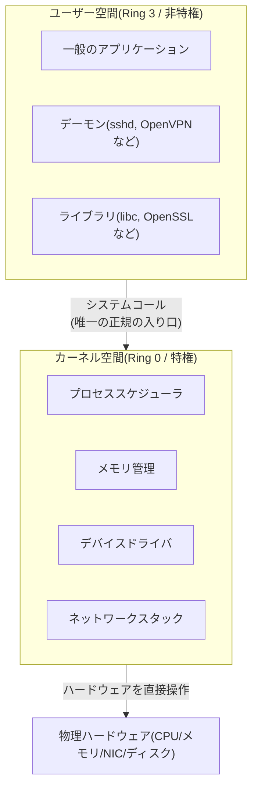
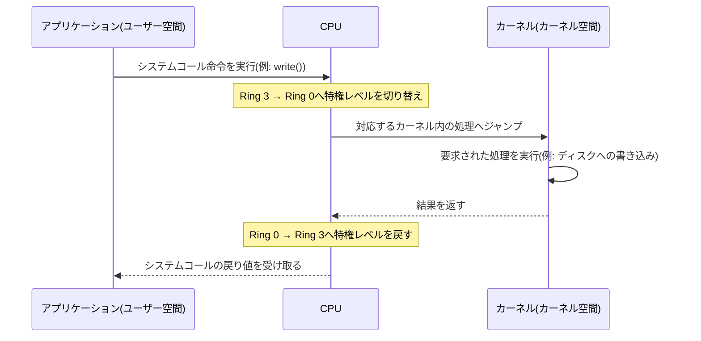
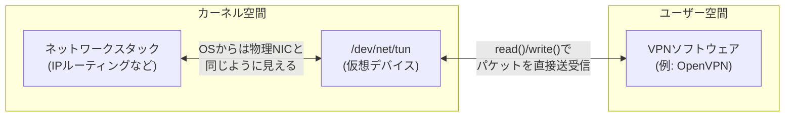

## はじめに

- **この記事で得られること**: Linuxがユーザー空間とカーネル空間をなぜ・どうやって分離しているのか、その境界を越える手段であるシステムコールの仕組み、そして「ユーザー空間で動くプログラムが、まるで物理的なネットワークカードを持っているかのように振る舞える」TUN/TAPデバイスが、この境界の上でどう成立しているのかを、体系的に理解できます。
- **対象読者**: サーバー・仮想ネットワーク環境の構築に関わるインフラエンジニアで、「ユーザー空間」「カーネル空間」という言葉は聞いたことがあるものの、両者が具体的に何によって隔てられているのか、VPNソフトウェアがTUN/TAPデバイスをどう使っているのかを説明できない方を想定しています。
- **読むのにかかる想定時間**: 約18分

この記事は[『上位1%』シリーズ 全記事ガイド](/sitemap)の一部です。

## 前提知識

- **プロセス** : 実行中のプログラムの実体です。詳しくは[デーモン(daemon)とは何か](/articles/linux-daemon-guide)で扱っています。
- **CPU** : 命令を実行する演算装置です。CPUには「特権レベル」という概念があり、実行できる命令の範囲が段階的に制限されています。
- **メモリ空間(アドレス空間)** : プロセスから見た「メモリ上のどこに何があるか」を表す番地の体系です。現代のOSでは、プロセスごとに独立した仮想的なメモリ空間が割り当てられます。

## 全体像をつかむ

### 一言で言うと

**カーネル空間とは、OSの中核処理(ハードウェア制御、メモリ管理、プロセススケジューリングなど)が動く特権的な領域であり、ユーザー空間とは、一般のアプリケーションが動く、ハードウェアへの直接アクセスを制限された領域です。** この2つを厳密に分離することで、**一般のアプリケーションのバグやクラッシュが、OS全体やハードウェアを直接壊してしまうことを防ぐ**、というのがこの分離の本質的な目的です。

一般のアプリケーションは、ディスクやネットワークカードといったハードウェアを直接操作することを許されていません。**何かハードウェアに関わる処理をしたければ、必ずカーネルに「代わりにやってください」と依頼する**必要があり、この依頼の仕組みが次に説明するシステムコールです。

## 基礎から徹底解説

### なぜ空間を分離する必要があるのか:CPUの特権レベル

この分離は、ソフトウェアの都合だけでなく、**CPUハードウェア自体が持つ特権レベル(x86では「リング」と呼ばれる仕組み、Ring 0〜Ring 3)** によって実現されています。

- **Ring 0(カーネルモード)**: すべてのCPU命令・メモリ・ハードウェアレジスタにアクセスできる、最も特権レベルの高いモードです。Linuxカーネルはここで動作します。
- **Ring 3(ユーザーモード)**: 実行できる命令が制限され、ハードウェアへの直接アクセスやメモリ管理に関わる特権命令の実行が禁止されているモードです。一般のアプリケーションはここで動作します。

ユーザーモードで特権命令を実行しようとすると、CPUは **例外(fault)** を発生させて処理を強制的に中断させます。つまり、「ユーザー空間のプログラムはハードウェアを直接操作できない」というのは、単なる取り決めやマナーではなく、**CPUのハードウェアレベルで強制されている制約**です。バグのあるアプリケーションがディスクの内容を直接破壊したり、他のプロセスのメモリを覗き見たりできないのは、この特権レベルの分離のおかげです。

### システムコール:境界を越える唯一の正規ルート

ユーザー空間のプログラムがカーネルの機能(ファイルの読み書き、ネットワーク通信、メモリの確保など)を使いたいときに呼び出すのが **システムコール(system call)** です。

`write()`でファイルに書き込む、`socket()`でネットワークソケットを作る、`fork()`で新しいプロセスを作る——アプリケーション開発者が日常的に使うこれらの標準ライブラリ関数の多くは、最終的にシステムコールを呼び出し、この特権レベルの切り替えを経てカーネルに処理を依頼しています。**この切り替え処理自体にCPUサイクルのコスト(コンテキストスイッチのオーバーヘッド)がかかる**ため、システムコールを頻繁に呼び出すプログラムほど、この切り替えコストの影響を受けやすくなります。

補足: コンテキストスイッチとは何か

**コンテキストスイッチ**とは、CPUが「今実行している処理の状態(レジスタの値など)」を保存し、別の処理の状態を読み込んで実行を切り替えることです。ユーザー空間とカーネル空間の切り替えもコンテキストスイッチの一種であり、また、OSが複数のプロセスに公平にCPU時間を割り当てるためにプロセスを切り替える際にも発生します。どちらの場合も、レジスタの退避・復元というオーバーヘッドを伴うため、頻度が高くなるとCPU全体のスループットに影響します。

### TUN/TAPデバイス:ユーザー空間から見える「仮想的なネットワークカード」

ここまでの原則に立つと、**ネットワークインターフェース(NIC)の制御は本来カーネル空間の仕事**であり、ユーザー空間のプログラムは直接パケットを送受信できないはずです。しかし、OpenVPNのようなユーザー空間で動作するVPNソフトウェアは、実際にはパケットを自在に読み書きしています。これを可能にしているのが**TUN/TAPデバイス**です。

TUN/TAPは、Linuxカーネルが提供する**仮想的なネットワークインターフェース**の仕組みで、カーネルのネットワークスタックとユーザー空間のプログラムとの間に、双方向のパケットのやり取り口を作ります。

動作の流れは次の通りです。

1. VPNソフトウェアが`/dev/net/tun`を開き、`tun0`のような仮想ネットワークインターフェースを作成します。
2. OSのルーティングテーブルには、この`tun0`が通常の物理NICと同じ1つのネットワークインターフェースとして登録されます。
3. アプリケーションが送信したパケットがカーネルのルーティング判断で`tun0`宛てだと判定されると、カーネルはそのパケットをそのままユーザー空間のVPNソフトウェアに渡します(`read()`で読み取れる)。
4. VPNソフトウェアは受け取ったパケットを暗号化し、実際の物理NIC経由で相手のVPNサーバーに送信します。
5. 相手から届いた暗号化パケットを復号したら、VPNソフトウェアはそれを`tun0`に`write()`で書き戻し、カーネルのネットワークスタックに「あたかも`tun0`から届いたパケットであるかのように」渡します。

**TUN(TUNnel)デバイスはIPパケット(レイヤー3)をそのまま扱うのに対し、TAP(network TAP)デバイスはEthernetフレーム(レイヤー2、MACアドレスを含む)を扱う**という違いがあります。ルーティングだけで済むリモートアクセスVPNの多くはTUNで十分ですが、ブリッジ接続(同一セグメントへの参加)が必要な構成ではTAPが使われます。

この仕組みは、まさに**ユーザー空間のプログラムとカーネル空間のネットワークスタックとの間の境界を、正規の(カーネルが用意した)インターフェースを介して橋渡しする**という、この記事のテーマそのものの実例になっています。VPNソフトウェアがパケットを1つ処理するたびに、この`read()`/`write()`というシステムコールを経由してユーザー空間とカーネル空間を行き来する必要があることが、ユーザー空間実装のVPNソフトウェアに、カーネル空間で完結する実装と比べたオーバーヘッドが生まれる直接の原因になっています。

## プロが見ている視点(上位1%の理解)

### なぜカーネル空間で完結する実装の方が高速なのか

TUN/TAPを介した通信は、パケット1つあたり最低でも「カーネル→ユーザー空間へのコピーとコンテキストスイッチ」「ユーザー空間での処理」「ユーザー空間→カーネルへのコピーとコンテキストスイッチ」という往復が発生します。これに対し、**ネットワーク処理をすべてカーネル空間内で完結させる実装(IPsecのXFRMフレームワークや、Linuxカーネルに直接組み込まれたWireGuardなど)は、この往復自体が発生しない**ため、同条件であれば高いスループットと低いレイテンシを実現しやすくなります。「実装がユーザー空間かカーネル空間か」は、単なる実装場所の違いではなく、**パケットが辿る経路の長さそのものを左右する設計判断**だと理解しておくと、VPNプロトコルやネットワーク機器のパフォーマンス特性を評価する際の軸として使えます。

### カーネル空間のバグが致命的になりやすい理由

ユーザー空間のプログラムがクラッシュしても、影響はそのプロセス単体にとどまり、OS自体は動き続けます(OSがそのプロセスのメモリ空間を回収して終わりです)。一方、 **カーネル空間で動くコード(カーネル本体やデバイスドライバ)がバグでクラッシュすると、特権レベルの分離という保護機構自体が機能している場所でエラーが起きるため、OS全体が停止する(カーネルパニック)** ことになります。デバイスドライバの多くがカーネル空間で動作することは、高いパフォーマンスを得られる一方で、ドライバの品質がシステム全体の安定性に直結するというトレードオフを伴います。

## よくある誤解・つまずきポイント

- **誤解1: 「TUN/TAPは特別な物理ハードウェアが必要な機能だ」**
  TUN/TAPは完全にソフトウェア(カーネル)によって作られる仮想デバイスであり、追加の物理ハードウェアは一切不要です。
- **誤解2: 「ユーザー空間のプログラムは、工夫すればハードウェアに直接アクセスできる」**
  通常の実行モードでは、CPUの特権レベルによってハードウェアへの直接アクセスは禁止されています(カーネルバイパス技術は、カーネルの許可のもとで特定のハードウェア領域を安全にユーザー空間へマッピングする、限定的な例外的手法です)。
- **誤解3: 「システムコールは遅いから、極力使わないプログラムほど良い」**
  ファイルの読み書きやネットワーク通信など、ハードウェアが関わる処理は原理的にシステムコールなしには実現できません。重要なのは「不要なシステムコールの回数を減らす」ことであり、システムコール自体を完全に避けることではありません。

## 障害・トラブルシューティングの視点

ユーザー空間/カーネル空間の境界に関わるトラブルは、**「どちらの空間で問題が起きているか」を切り分ける**ことが出発点になります。

1. **VPN接続時に`tun0`が作成されない**: `/dev/net/tun`デバイスファイルの権限、あるいはコンテナ環境であれば`--cap-add=NET_ADMIN`のような追加権限の付与漏れが典型的な原因です。TUN/TAPデバイスの作成にはカーネルに対する管理者権限相当の操作が必要です。
2. **VPN経由の通信は成立するがスループットが伸びない**: `top`コマンドで該当プロセスのCPU使用率(特に`%sy`のシステム時間の割合)を確認します。システム時間が高ければ、システムコール・コンテキストスイッチのオーバーヘッドがボトルネックになっている可能性があります。
3. **カーネルパニックやシステム全体のフリーズが発生する**: `dmesg`やカーネルのクラッシュダンプを確認し、直前にどのカーネルモジュール(デバイスドライバなど)が関与していたかを特定します。ユーザー空間のアプリケーションログだけでは原因が追えないため、カーネルログの確認が必須になります。

### 予防策・恒久対策

- コンテナ環境でTUN/TAPを使うVPNソフトウェアを動かす場合、必要な権限(`NET_ADMIN`など)を事前に洗い出し、最小権限の原則の中でどこまで許可が必要かを設計しておく。
- スループットが重要な用途では、ユーザー空間実装(TUN/TAP経由)とカーネル空間実装(WireGuardなど)のどちらを選ぶかを、性能要件に応じて意識的に選定する。
- カーネルモジュール(サードパーティのドライバなど)を本番環境に導入する際は、事前に検証環境でクラッシュ時の挙動(パニックの有無、自動復旧の可否)を確認しておく。

## まとめ

- Linuxは、CPUの特権レベル(Ring 0/Ring 3)を利用して、カーネル空間(特権的な中核処理)とユーザー空間(一般のアプリケーション)を分離しています。
- ユーザー空間のプログラムがカーネルの機能を使うには、システムコールという正規の入り口を経由する必要があり、この切り替えにはコンテキストスイッチのオーバーヘッドが伴います。
- TUN/TAPデバイスは、この境界を橋渡しする仮想ネットワークインターフェースで、ユーザー空間のVPNソフトウェアがパケットを直接読み書きできるようにする仕組みです。
- カーネル空間で処理が完結する実装はユーザー空間との往復が発生しないため高速になりやすく、一方でカーネル空間のバグはシステム全体の停止につながりやすいというトレードオフがあります。

**今日から意識すべきこと**
1. ユーザー空間実装のソフトウェアでスループットの問題に直面したら、まずシステムコール・コンテキストスイッチのオーバーヘッドを疑い、CPUのシステム時間(`%sy`)を確認する習慣をつけましょう。
2. TUN/TAPを使うソフトウェアをコンテナで動かす際は、必要な権限を事前に洗い出しておきましょう。

## 参考文献

- [Universal TUN/TAP device driver — Linux kernel documentation](https://www.kernel.org/doc/Documentation/networking/tuntap.txt)
- [syscalls(2) — Linux manual page](https://man7.org/linux/man-pages/man2/syscalls.2.html)
- [vdso(7) — Linux manual page(ユーザー空間/カーネル空間の切り替えコスト削減の仕組み)](https://man7.org/linux/man-pages/man7/vdso.7.html)
