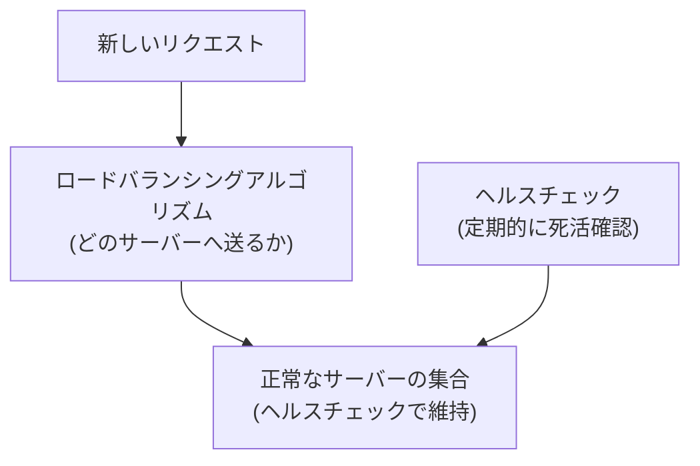

## はじめに

- **この記事で得られること**: [L4とL7の違い](/articles/load-balancing-fundamentals-guide)を前提に、ロードバランサーが**どのバックエンドサーバーへ振り分けるかを決める複数のアルゴリズム**(ラウンドロビン・最小接続数・IPハッシュなど)の違いと、**異常なバックエンドサーバーを自動的に切り離すヘルスチェック**の仕組みを体系的に理解します。
- **対象読者**: ロードバランサーが「複数台に振り分ける」ことは知っているものの、ラウンドロビン以外のアルゴリズムの存在や、ヘルスチェックが具体的にどう動いているのかを説明できない方を想定しています。
- **読むのにかかる想定時間**: 約16分

この記事は[『上位1%』シリーズ 全記事ガイド](/sitemap)の一部、[ロードバランシング基礎シリーズ](/sitemap#シリーズ一覧)の2本目です。

## 前提知識

- **L4/L7ロードバランサーの違い**: [ロードバランサーのL4とL7の違い](/articles/load-balancing-fundamentals-guide)で扱った、ロードバランサーが何を見て振り分けているかという基礎です。本記事で扱うアルゴリズムは、このL4・L7いずれのロードバランサーにも共通して適用されます。

## 全体像をつかむ

ロードバランサーが「次のリクエストをどのバックエンドサーバーへ送るか」を決めるロジックを**ロードバランシングアルゴリズム**と呼びます。そして、そもそも振り分け先の候補に入れてよいサーバーかどうかを判定する仕組みを**ヘルスチェック**と呼びます。この2つは、別々の役割を持つ、独立した仕組みです。

## 基礎から徹底解説

### ロードバランシングアルゴリズム:何を基準に振り分けるか

| アルゴリズム | 振り分けの基準 | 向いている場面 |
|---|---|---|
| **ラウンドロビン** | 順番に、均等に振り分ける | すべてのリクエストの処理時間がほぼ均一な場合 |
| **重み付けラウンドロビン** | サーバーごとに設定した重みの比率で振り分ける | サーバーの性能差がある場合(高性能なサーバーに多めに振る) |
| **最小接続数(Least Connections)** | その時点で、処理中の接続数が最も少ないサーバーへ送る | リクエストごとの処理時間に差がある場合 |
| **IPハッシュ(Source Hash)** | クライアントの送信元IPアドレスをハッシュ化し、常に同じサーバーへ送る | 同じクライアントを常に同じサーバーへ固定したい場合(後述のセッション永続化) |

**なぜラウンドロビンだけでは不十分なのか**: ラウンドロビンは、各リクエストの処理時間が均一であることを前提にした、最も単純な方式です。しかし、あるリクエストの処理に時間がかかる(たとえば大きなファイルのアップロード処理)場合、そのリクエストを受けたサーバーは、他のサーバーより長く接続を保持し続けます。それでもラウンドロビンは「次は順番だから」と機械的に新しいリクエストを同じサーバーへ送り続けてしまい、特定のサーバーだけが過負荷になる偏りが生まれます。**最小接続数アルゴリズムは、この「今まさに処理中の負荷」を見て動的に判断する**ため、処理時間に差があるワークロードでは、ラウンドロビンより実務で好まれます。

### セッション永続化(スティッキーセッション):なぜ同じサーバーに固定する必要があるのか

Webアプリケーションがログイン状態などのセッション情報をサーバー側のメモリに保持している場合、あるクライアントのリクエストが毎回別のバックエンドサーバーへ振り分けられてしまうと、**ログインしたはずなのに、別のサーバーに着いた瞬間にログインが切れている**、という現象が起きます。これを防ぐため、同じクライアントからのリクエストを常に同じバックエンドサーバーへ送る仕組みを**セッション永続化**(スティッキーセッション)と呼びます。

- **IPハッシュ方式**: クライアントの送信元IPアドレスを基準に、常に同じサーバーへ振り分けます。ただし、同じ企業の社員が同じNAT経由でアクセスしている場合など、複数のクライアントが同じIPアドレスに見えてしまう環境では、特定のサーバーへ偏りが生じます。
- **Cookie方式(L7のみ)**: ロードバランサーが発行する専用のCookieに、どのバックエンドサーバーへ振り分けたかを記録し、以降そのCookieを基準に振り分けます。IPアドレスに依存しないため、より確実です。HTTPの内容(Cookie)を読む必要があるため、[L7ロードバランサーの機能](/articles/load-balancing-fundamentals-guide)です。

セッション永続化は、ロードバランシングの目的と矛盾しないのか

セッション永続化は、「特定のクライアントを特定のサーバーに固定する」という点で、負荷を均等に分散するというロードバランシングの目的と、ある程度トレードオフの関係にあります。**理想的には、バックエンドサーバー側がセッション情報を共有ストア(Redisなど)に外出しし、どのサーバーが処理しても同じ結果になる「ステートレス」な構成にすることで、セッション永続化そのものが不要になります。** セッション永続化は、バックエンド側をステートレス化できない場合の、実務上の妥協策として理解しておくとよいでしょう。

### ヘルスチェック:異常なサーバーをどう検知し、切り離すか

ヘルスチェックには、大きく2つの方式があります。

- **アクティブヘルスチェック**: ロードバランサーが、一定間隔でバックエンドサーバーへ自発的にプローブ(TCP接続確認や、特定のURLへのHTTPリクエストなど)を送り、応答を確認します。
- **パッシブヘルスチェック**: ロードバランサー自身が、実際に処理した通常のリクエストの応答(エラー発生やタイムアウト)を観察し、異常を検知します。

アクティブヘルスチェックには、**フラッピング**(頻繁に正常/異常の判定が切り替わってしまう状態)を防ぐため、通常、次のようなパラメータが設定されます。

| パラメータ | 意味 |
|---|---|
| **インターバル** | ヘルスチェックを実行する間隔 |
| **タイムアウト** | 1回のヘルスチェックで、応答を待つ最大時間 |
| **Fallスレッショルド** | 何回連続で失敗したら「異常」と判定するか |
| **Riseスレッショルド** | 何回連続で成功したら「正常」に復帰したと判定するか |

**Fallスレッショルドを1(1回失敗したら即座に異常判定)にすると、一時的なネットワークの揺れだけで不要に切り離されてしまいます。** 逆にスレッショルドを大きくしすぎると、本当に障害が起きているサーバーへ、しばらくリクエストが送られ続けてしまいます。このトレードオフを理解した上で、サービスの特性に応じた値を設定する必要があります。

## プロが見ている視点(上位1%の理解)

### アルゴリズムとヘルスチェックは、別々のレイヤーの問題である

初心者がよく混同するのが、「振り分けアルゴリズム」と「ヘルスチェック」です。**ヘルスチェックは、そもそも振り分け候補に入れてよいサーバーの集合を決める仕組みであり、アルゴリズムは、その集合の中から、どのサーバーを選ぶかを決める仕組みです。** この2つのレイヤーを分けて考えられないと、「ヘルスチェックの設定を直したのに、特定のサーバーへの偏りが解消しない」といった、実際には別の原因(アルゴリズムの設定)で起きている問題を、誤った箇所で調査してしまうことになります。

## よくある誤解・つまずきポイント

- **誤解1: 「ラウンドロビンは、常に最も公平な振り分け方式である」**
  処理時間に差があるワークロードでは、最小接続数アルゴリズムの方が、実際の負荷に応じたより公平な振り分けになります。
- **誤解2: 「セッション永続化を設定すれば、ロードバランシングの効果は失われない」**
  セッション永続化は、特定のクライアントを特定のサーバーへ固定するため、負荷分散の効果をある程度犠牲にするトレードオフです。
- **誤解3: 「ヘルスチェックのFallスレッショルドは、小さいほど安全である」**
  小さすぎると、一時的なネットワークの揺れだけでサーバーが不要に切り離され、むしろ可用性が下がります。

## 障害・トラブルシューティングの視点

1. **特定のバックエンドサーバーだけ負荷が高い**: 振り分けアルゴリズムの設定(ラウンドロビンか最小接続数か)と、重み付けの設定を確認します。
2. **ログイン状態が頻繁に切れる**: セッション永続化(スティッキーセッション)が設定されているか、Cookie/IPハッシュのいずれの方式かを確認します。
3. **障害が起きたサーバーに、まだリクエストが送られている**: ヘルスチェックのFallスレッショルドとインターバルの設定を確認し、検知までの時間が長すぎないかを確認します。

## まとめ

- ロードバランシングアルゴリズムには、ラウンドロビン・重み付けラウンドロビン・最小接続数・IPハッシュなど複数の方式があり、ワークロードの特性に応じて選ぶ必要があります。
- セッション永続化は、同じクライアントを同じサーバーへ固定する仕組みで、負荷分散との間にトレードオフがあります。
- ヘルスチェックは、アクティブ/パッシブの2方式があり、Fall/Riseスレッショルドの設定でフラッピングを防ぎます。
- ヘルスチェック(振り分け候補の決定)とアルゴリズム(候補の中からの選択)は、別々のレイヤーの仕組みです。

**今日から意識すべきこと**
1. 負荷の偏りを調査する際は、アルゴリズムの設定とヘルスチェックの設定を、別々の問題として切り分けましょう。
2. セッション永続化を設定する前に、バックエンドをステートレス化できないか、まず検討しましょう。

## 参考文献

- [HAProxy Configuration Manual - Load Balancing Algorithms](https://docs.haproxy.org/)
- [How Elastic Load Balancing Works | AWS](https://docs.aws.amazon.com/elasticloadbalancing/)
