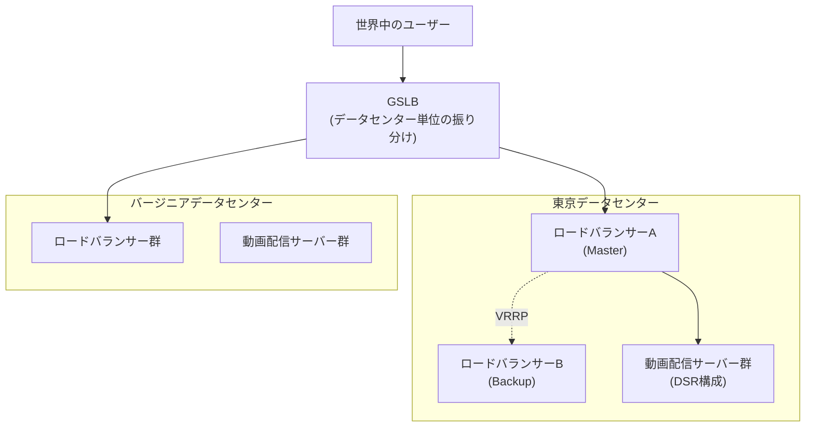

## はじめに

- **この記事で得られること**: ここまでのハンズオンで、1つずつ個別に習得してきた技術(GSLBによる広域分散、HAProxyによるL7ロードバランシング、VRRP/keepalivedによるロードバランサー自体の冗長化、SSL配置方式の選定、DSRによる帯域の非対称性への対処、PROXY protocolによるクライアントIPの保持、HTTPリクエストスマグリング対策)を、**1つの架空の動画配信スタートアップの負荷分散基盤へ、自分の力で統合する**、ロードバランシング学科の卒業制作です。これまでの記事が「手順をなぞって、1つの技術を確実に身につける」ことを目的としていたのに対し、この記事は**要件だけを提示し、どの技術を、どう組み合わせるかを、自分で設計する**という、実務そのものに近い形式を取ります。
- **対象読者**: ロードバランシング学科の3年生・4年生・大学院の内容を一通り終え、個々のハンズオンは実施できるが、それらを組み合わせて1つの負荷分散基盤を設計した経験がない方を想定しています。
- **読むのにかかる想定時間**: 設計・構築・文書化を含めて、数日〜1週間程度を想定しています(1回のハンズオンとしては最も重量級です)。

この記事は[『上位1%』シリーズ 全記事ガイド](/sitemap)の一部です。[ロードバランシング学科の全カリキュラム](/university#ロードバランシング学科)の、卒業制作にあたる位置づけです。

## 前提知識

このハンズオンは、新しい技術を教えるものではありません。**以下の、すでに実施済みのハンズオンで習得した技術を、組み合わせて使います。**

- [ロードバランサーのL4とL7の違いを『上位1%』の視点で理解する](/articles/load-balancing-fundamentals-guide)
- [ロードバランシングのアルゴリズムとヘルスチェックの仕組みを『上位1%』の視点で理解する](/articles/load-balancing-algorithms-guide)
- [SSLターミネーションとSSLパススルーの違いを『上位1%』の視点で理解する](/articles/load-balancing-ssl-termination-guide)
- [HAProxyでL7ロードバランサーを構築し、複数のバックエンドサーバーへ振り分けるハンズオン](/articles/load-balancing-haproxy-handson-guide)
- [GSLB(グローバルサーバーロードバランシング)の仕組みを『上位1%』の視点で理解する](/articles/load-balancing-gslb-guide)
- [ロードバランサー自体の冗長化を『上位1%』の視点で理解する](/articles/load-balancing-vrrp-keepalived-guide)
- [PROXY protocolの仕組みを『上位1%』の視点で理解する](/articles/load-balancing-proxy-protocol-guide)
- [keepalivedで2台のHAProxyを冗長化し、VIPの自動フェイルオーバーを体験するハンズオン](/articles/load-balancing-keepalived-handson-guide)
- [IPVSでDSR(Direct Server Return)を構築し、応答がロードバランサーを経由しない設計を体感するハンズオン](/articles/load-balancing-dsr-handson-guide)
- [HTTPリクエストスマグリングの原理をCurlとNetcatで再現し、HAProxyの厳格なパース処理による防御を確認するハンズオン](/articles/load-balancing-request-smuggling-handson-guide)

## 課題設定:架空の動画配信スタートアップの負荷分散基盤

**あなたは、架空の動画配信スタートアップ「KoiKoi Stream」のインフラエンジニアです。この会社は、単一のデータセンターで小規模に運営してきたサービスを、東京とバージニアの2つのデータセンターへ拡張し、世界中のユーザーへ低遅延で動画配信を行う体制を整えることになりました。あなたに与えられた課題は、次の要件をすべて満たす、負荷分散基盤を、自分の手で構築することです。**

### 要件1: ユーザーを、地理的に近いデータセンターへ振り分ける

**世界中のユーザーが、東京とバージニア、それぞれ地理的に近いデータセンターへ振り分けられる仕組みを構築してください。** いずれかのデータセンターが完全に停止した場合、残ったデータセンターへ自動的にフェイルオーバーする仕組みもあわせて検討してください。

### 要件2: データセンター内で、適切なアルゴリズムによるL7ロードバランシングを構築する

**各データセンター内に、複数の動画配信サーバーへ振り分けるL7ロードバランサーを構築してください。** リクエストごとの処理時間に差があることを想定し、適切な振り分けアルゴリズムを選定してください。

### 要件3: ロードバランサー自体を冗長化する

**各データセンターのロードバランサーが単一障害点にならないよう、複数台構成で冗長化してください。** 片方が停止しても、クライアント側が何も意識することなく、サービスが継続する必要があります。

### 要件4: TLS証明書の配置方式を選定する

**ユーザーとの通信を暗号化する必要がありますが、証明書管理の手間と、ロードバランサーでのコンテンツに応じた振り分け機能(L7機能)の両方を考慮し、適切な配置方式を選定してください。**

### 要件5: 動画配信による帯域ボトルネックに対処する

**動画の配信データ量は、リクエストのデータ量よりはるかに大きく、ロードバランサー自体の帯域が、サービス全体のボトルネックになるリスクがあります。** このボトルネックに対処する構成を検討してください。

### 要件6: ユーザーの本当のIPアドレスを、配信サーバー側で把握できるようにする

**不正アクセスの検知や、地域ごとの配信ライセンス制限のため、配信サーバー側で、ユーザーの本当のIPアドレスを把握できる必要があります。** ロードバランサーの構成に応じた、適切な方式を選定してください。

### 要件7: HTTPリクエストスマグリングのリスクに備える

**フロントエンドとバックエンドの間で、リクエストの境界の解釈がずれることによる、リクエストスマグリングのリスクに備えてください。**

## 成果物の要件:ポートフォリオとしてまとめる

**このハンズオンの最終的な成果物は、実際に動いた構成の確認結果だけではありません。** GitHubなどのリポジトリに、次の内容を含む形でまとめてください。

- **README.md**: このシナリオの概要、あなたが採用した負荷分散基盤の全体像(mermaidなどの図を含む)
- **設計判断の記録**: 「なぜその技術・構成を選んだのか」という、判断の理由。特に、帯域・可用性・セキュリティのトレードオフが発生した箇所について
- **実施手順**: 実際に実行した設定ファイルの記述や、検証コマンドの記録
- **振り返り**: 実施してみて分かった課題、実際の実務であれば追加で検討すべき点(CDNの活用、マネージド型ロードバランサーへの移行など)

**この成果物こそが、転職活動やポートフォリオとして提示できる、具体的な実績になります。** 単に「HAProxyのハンズオンをやりました」と説明するよりも、「複数データセンター・大容量コンテンツ配信という現実的な制約の中で、複数の技術を組み合わせて設計し、帯域・可用性・セキュリティのトレードオフを言語化できる」ことを示せる方が、はるかに説得力があります。

## プロが見ている視点(上位1%の理解)

### 「手順をなぞる力」と「要件から設計する力」は、まったく別のスキルである

これまでのハンズオンは、いずれも「Step 1、Step 2……」という、決められた手順をなぞる形式でした。**しかし、実際の実務で評価されるのは、手順書通りに作業を実行する力ではなく、与えられた要件(この記事でいう「要件1〜7」)から、どの技術を、どう組み合わせるべきかを、自分で設計する力です。** この2つは、似ているようでまったく別のスキルです。個々のハンズオンをすべて完了していても、それらを組み合わせて1つの一貫した負荷分散基盤を設計した経験がなければ、実務での即戦力にはなりません。この卒業制作は、その橋渡しを行うための、意図的な設計になっています。

### なぜ「動画配信+複数データセンター」という設定なのか

このハンズオンが、単発の技術デモではなく、あえて「動画配信という帯域の非対称性を持つコンテンツを、複数データセンターでグローバルに配信する」という、現実的なプロジェクトを模した設定にしているのには理由があります。**実務の負荷分散基盤の多くは、単一の目的だけで完結せず、広域分散・可用性・帯域最適化・セキュリティという、複数の軸を同時に満たす必要があります。** HAProxyの構築方法だけを知っていても、その先にあるGSLB・冗長化・DSR・セキュリティ対策までを見通せなければ、実際のプロジェクトでは通用しません。この卒業制作を通じて、個々の技術の知識を、**複数の軸を同時に見通す設計力**へと昇華させることが、最終的な狙いです。

## よくある誤解・つまずきポイント

- **誤解1: 「このハンズオンは、決められた1つの正解の構成が存在する」**
  このハンズオンには、唯一の正解はありません。要件を満たす設計であれば、複数の妥当なアプローチが存在します。README.mdに、あなたが選んだ設計とその理由を記録することが重要です。
- **誤解2: 「成果物は、動作した証拠の確認結果だけで十分である」**
  動作確認は重要ですが、それだけでは不十分です。設計判断の理由を言語化できることが、このハンズオンの本当の価値です。
- **誤解3: 「個々のハンズオンをすべて完了していれば、このハンズオンも簡単に終わる」**
  個々の技術を知っていることと、それらを1つの一貫した設計へ統合することの間には、大きな距離があります。多くの時間を要することを想定しておいてください。

## 障害・トラブルシューティングの視点

このハンズオンは、個々の技術的なトラブルシューティングよりも、**設計上の手戻り**が主な課題になります。

1. **要件を満たしているつもりが、後から矛盾に気づく**: 実装を始める前に、README.mdの設計部分だけを先に書き上げ、要件1〜7のすべてを満たせているかを、文章の段階で確認してください。
2. **個々のハンズオンの手順を忘れてしまっている**: 各要件に対応する前提記事のリンクを、遠慮なく読み返してください。この卒業制作は、暗記力ではなく設計力を試すものです。
3. **どこまで作り込めばよいか分からない**: 「転職活動で、初対面の面接官にこのREADME.mdを見せて、設計判断を説明できるか」を、完成度の目安にしてください。

## まとめ

- この卒業制作は、ロードバランシング学科でこれまで個別に習得した技術を、1つの架空の動画配信スタートアップの負荷分散基盤へ統合する、総合演習です。
- 求められているのは、手順をなぞる力ではなく、要件から自分で設計する力です。
- 成果物は、動作確認の結果だけでなく、設計判断の理由を言語化した文書として、ポートフォリオにまとめてください。

**今日から意識すべきこと**
1. 個々のハンズオンを学ぶときも、「これは、将来どんな要件の中で使うことになるか」を意識する習慣をつけましょう。
2. 技術的な成果物だけでなく、帯域・可用性・セキュリティのトレードオフを言語化する習慣を、日々の業務でも意識しましょう。

## 参考文献

- [ロードバランシング学科の全カリキュラム](/university#ロードバランシング学科)
