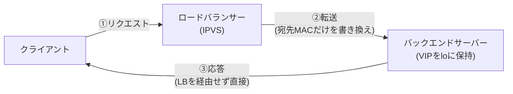

## はじめに

- **この記事で得られること**: [HAProxyハンズオン](/articles/load-balancing-haproxy-handson-guide)で構築した、リクエストと応答の両方をロードバランサーが中継する構成とは異なる、**DSR**(Direct Server Return)という構成を、Linuxの**IPVS**(IP Virtual Server、`ipvsadm`コマンドで操作)を使って実際に構築し、応答パケットがロードバランサーを一切経由しない様子を、`tcpdump`で自分の目で確認します。
- **対象読者**: ロードバランサーの基本的な構築経験があり、「応答トラフィックの量が、リクエストの量よりはるかに多い」という状況で、ロードバランサー自体が帯域のボトルネックになる問題への対処法を知りたい方を想定しています。
- **読むのにかかる想定時間**: 約25分(ハンズオン実施込み)

この記事は[『上位1%』シリーズ 全記事ガイド](/sitemap)の一部、[ロードバランシング基礎シリーズ](/sitemap#シリーズ一覧)の10本目です。[ハンズオン準備マニュアル](/articles/handson-prep-guide)で作成したUbuntu Server環境が3台(ロードバランサー用に1台、バックエンド用に2台)、**すべて同一L2ネットワーク内に**あれば実施できます(DSRは、後述する理由により、同一L2ネットワーク内でのみ成立します)。

## 前提知識

- **VIP(Virtual IP)の概念**: [ロードバランサーのL4とL7の違い](/articles/load-balancing-fundamentals-guide)で扱った、クライアントが直接意識する仮想的なIPアドレスです。
- **Gratuitous ARPとMACアドレスの関係**: [ロードバランサー自体の冗長化](/articles/load-balancing-vrrp-keepalived-guide)で扱った、IPアドレスとMACアドレスの対応関係を、ARPが管理しているという基礎知識です。本記事のDSRは、この対応関係を意図的に操作する技術です。

## 全体像をつかむ

[HAProxyハンズオン](/articles/load-balancing-haproxy-handson-guide)で構築した通常のロードバランサーは、クライアントからのリクエストと、バックエンドからの応答の、**両方の通信を中継していました。** これを「ツーアーム(Two-Arm)」構成と呼びます。しかし、動画配信やファイルダウンロードのように、**応答のデータ量が、リクエストのデータ量より桁違いに大きい**場合、ロードバランサー自身のネットワーク帯域が、応答の中継だけでボトルネックになってしまいます。

**DSR**(Direct Server Return)は、リクエストだけをロードバランサーが中継し、**応答はバックエンドサーバーから直接クライアントへ返す**ことで、このボトルネックを解消する構成です。



## 基礎から徹底解説

### DSRが成立する仕組み:IPアドレスは変えず、MACアドレスだけを書き換える

DSRの核心は、**ロードバランサーが、リクエストパケットの宛先IPアドレス(VIP)を一切書き換えず、宛先MACアドレスだけを、選んだバックエンドサーバーのMACアドレスへ書き換えて転送する**という点にあります。

- バックエンドサーバーは、パケットの宛先IPアドレスが、自分自身が保持しているVIPと一致するため、**自分宛のパケットとして正常に受信・処理します。**
- バックエンドサーバーが応答を返す際、送信元IPアドレスを(自身の実IPではなく)**VIPのまま**、クライアントへ直接送り返します。

**この仕組みが成立するためには、宛先IPアドレスを変えずに転送できる必要があり、これは必然的にロードバランサーとバックエンドサーバーが同一L2ネットワーク内にある場合に限られます。** 異なるネットワーク(別のサブネット)にあるバックエンドへは、MACアドレスの書き換えだけでパケットを届けることができないため、DSRは使えません。

### バックエンドサーバー側の設定:VIPをループバックに、ARP応答を抑制する

バックエンドサーバー側には、2つの設定が必要です。

1. **VIPを、物理インターフェースではなく、ループバックインターフェース(`lo`)に設定する**: これにより、バックエンドサーバーは、ネットワーク上でVIPを「自分のものである」とARPで広告することなく、VIP宛のパケットを受信・応答できます。
2. **物理インターフェースでのARP応答を抑制する**(`arp_ignore`): これを設定しないと、ロードバランサーだけでなく、バックエンドサーバー自身もVIPについてARP応答を返してしまい、どちらが本当にVIPを処理すべきか、ネットワーク上で競合してしまいます。

<details>
<summary>なぜ「ロードバランサーだけがVIPのARPに応答する」状態を作る必要があるのか</summary>

[ロードバランサー自体の冗長化](/articles/load-balancing-vrrp-keepalived-guide)で扱ったVRRPでは、VIPを実際に保持する機体が、Gratuitous ARPでそのことを周辺機器へ広告していました。DSR構成でも、同じ発想で、**「VIPのARPに応答すべきなのは、ロードバランサーだけである」という状態を、意図的に作り出す必要があります。** バックエンドサーバーは、VIP宛のパケットを受信・処理する必要はありますが、「自分がVIPの所在地である」とARPで名乗ってしまうと、クライアントからのリクエストが、ロードバランサーを経由せず、バックエンドサーバーへ直接届いてしまい、ロードバランシングそのものが機能しなくなります。この「受信はするが、ARPでは名乗らない」という、絶妙な非対称性が、DSRの設定における最大のポイントです。

</details>

## ハンズオン手順

### Step 1: バックエンドサーバー2台に、VIPとarp_ignoreを設定する

バックエンドサーバー2台(例: `10.0.0.31`・`10.0.0.32`)の両方で、同じ設定を行います(`192.168.100.10`をVIPとします)。

```bash
sudo ip addr add 192.168.100.10/32 dev lo
sudo sysctl -w net.ipv4.conf.all.arp_ignore=1
sudo sysctl -w net.ipv4.conf.all.arp_announce=2
```

**この3つの設定が担っている役割**を整理しておきます。

| 設定 | 役割 |
|---|---|
| `ip addr add ... dev lo` | VIPをループバックインターフェースに設定し、VIP宛のパケットを自分宛として受信できるようにする |
| `arp_ignore=1` | 自分が実際に保持しているIPアドレスへのARP要求にしか応答しないようにし、インターフェースを越えたVIPへの不要な応答を防ぐ |
| `arp_announce=2` | ARP要求の送信元として、関係のないインターフェースのIPアドレスを使わないようにする |

簡易Webサーバーを、両方のバックエンドで起動します。

```bash
sudo python3 -m http.server 80 --bind 192.168.100.10 &
```

### Step 2: ロードバランサーに、IPVSをDRモードで設定する

ロードバランサー役のサーバーに、`ipvsadm`をインストールします。

```bash
sudo apt install -y ipvsadm
sudo ip addr add 192.168.100.10/32 dev eth0
```

VIPを、IPVSの仮想サービスとして登録し、2台のバックエンドをDR(Direct Routing)モードで追加します。

```bash
sudo ipvsadm -A -t 192.168.100.10:80 -s rr
sudo ipvsadm -a -t 192.168.100.10:80 -r 10.0.0.31:80 -g
sudo ipvsadm -a -t 192.168.100.10:80 -r 10.0.0.32:80 -g
```

**末尾の`-g`フラグが、DR(Direct Routing)モードを指定している箇所です。** これがなければ、IPVSは別の転送方式(NATモードなど、IPアドレス自体を書き換える方式)を使ってしまい、DSRにはなりません。

### Step 3: ロードバランサーが応答パケットを一切見ていないことを確認する

ロードバランサー上で、VIPに関するすべてのトラフィックを監視します。

```bash
sudo tcpdump -i eth0 host 192.168.100.10
```

別の端末(クライアント)から、VIPへアクセスします。

```bash
curl http://192.168.100.10/
```

**ロードバランサーのtcpdumpの出力を確認すると、クライアントからの「リクエスト」パケットだけが記録され、バックエンドサーバーからクライアントへの「応答」パケットは、一切記録されません。** これは、応答がロードバランサーを経由せず、バックエンドサーバーから直接クライアントへ返っていることの、具体的な証拠です。

一方、クライアント側の端末で`tcpdump`を実行すると、応答パケットの送信元MACアドレスが、ロードバランサーのMACアドレスではなく、**実際に応答したバックエンドサーバーのMACアドレスになっている**ことが確認できます。それでも、送信元IPアドレスは`192.168.100.10`(VIP)のままであるため、クライアント側のアプリケーションからは、通常のロードバランサーと区別がつきません。

## プロが見ている視点(上位1%の理解)

### DSRは「ロードバランサーの帯域をリクエストの分だけに抑える」という、帯域の非対称性への対処である

[HAProxyハンズオン](/articles/load-balancing-haproxy-handson-guide)で構築したツーアーム構成では、ロードバランサーの帯域が、リクエストと応答の合計量で消費されます。**DSRは、応答の帯域をロードバランサーから完全に切り離すことで、ロードバランサー自体のスペックを、リクエストの処理量だけに最適化できる、という設計です。** 動画配信やCDNのオリジンサーバーのように、応答のデータ量がリクエストよりはるかに大きいサービスで、DSR(あるいはこれに類する技術)が好まれるのは、この帯域の非対称性への、構造的に正しい対処だからです。

## よくある誤解・つまずきポイント

- **誤解1: 「DSRは、異なるサブネットにあるバックエンドサーバーでも使用できる」**
  DSRは宛先MACアドレスの書き換えだけで転送するため、ロードバランサーとバックエンドサーバーが同一L2ネットワーク内にある場合に限られます。
- **誤解2: 「バックエンドサーバーにVIPを設定すれば、自動的にDSRとして機能する」**
  `arp_ignore`を設定していないと、バックエンドサーバー自身がVIPのARPに応答してしまい、ロードバランサーを経由せずクライアントから直接届いてしまう、別の問題が発生します。
- **誤解3: 「DSRでは、クライアント側で何らかの特別な対応が必要になる」**
  応答の送信元IPアドレスはVIPのままであるため、クライアント側のアプリケーションは、通常のロードバランサー構成と全く同じように動作します。

## 障害・トラブルシューティングの視点

1. **バックエンドサーバーが、VIP宛のパケットに応答しない**: `ip addr add ... dev lo`が正しく実行されているか、`ip addr show lo`で確認します。
2. **特定のクライアントからのアクセスだけが、ロードバランサーを経由せず直接バックエンドへ届いてしまう**: `arp_ignore`の設定が、バックエンドサーバーのすべての物理インターフェースに適用されているかを確認します。
3. **`ipvsadm`の設定後、まったく振り分けが発生しない**: `-g`フラグ(DRモード)を指定し忘れ、デフォルトのNATモードになっていないかを、`ipvsadm -Ln`で確認します。

## まとめ

- DSR(Direct Server Return)は、リクエストだけをロードバランサーが中継し、応答はバックエンドサーバーから直接クライアントへ返す構成で、応答の帯域をロードバランサーから切り離します。
- DSRは、宛先MACアドレスの書き換えだけで転送するため、ロードバランサーとバックエンドサーバーが同一L2ネットワーク内にある場合に限られます。
- バックエンドサーバー側では、VIPをループバックインターフェースに設定し、`arp_ignore`で物理インターフェースでのARP応答を抑制する必要があります。
- 応答の送信元IPアドレスはVIPのままであるため、クライアント側のアプリケーションには、通常のロードバランサー構成との違いが一切見えません。

**今日から意識すべきこと**
1. 応答のデータ量がリクエストより極端に大きいサービスを設計する際は、DSRのような、帯域の非対称性に対処する構成を検討する習慣をつけましょう。
2. ロードバランサーの転送方式を設定する際は、NATモードとDR(DSR)モードのどちらを使っているかを、常に明示的に確認しましょう。

## 参考文献

- [IPVS (IP Virtual Server) Documentation | Linux Virtual Server Project](http://www.linuxvirtualserver.org/software/ipvs.html)
- [ipvsadm(8) Manual Page](https://linux.die.net/man/8/ipvsadm)
