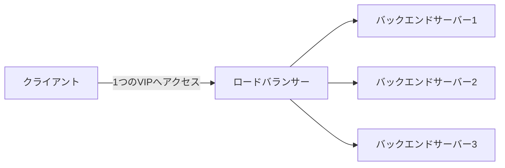

## はじめに

- **この記事で得られること**: ロードバランサーが、実際には**OSI参照モデルのどの層の情報を見て振り分けているか**という観点から、**L4ロードバランサー**(トランスポート層)と**L7ロードバランサー**(アプリケーション層)の違いを体系的に理解します。あわせて、クライアントが直接バックエンドサーバーのIPアドレスを意識しなくて済む**VIP**(Virtual IP、仮想IP)という設計思想も扱います。
- **対象読者**: 「ロードバランサーは複数台のサーバーに処理を振り分ける箱」という理解はあるものの、L4とL7という分類や、F5・AWS ALB/NLB・HAProxy・nginxといった製品名が何を指しているのか、整理できていない方を想定しています。
- **読むのにかかる想定時間**: 約15分

この記事は[『上位1%』シリーズ 全記事ガイド](/sitemap)の一部、[ロードバランシング基礎シリーズ](/sitemap#シリーズ一覧)の1本目です。この後の[ロードバランシングのアルゴリズムとヘルスチェック](/articles/load-balancing-algorithms-guide)、[SSLターミネーションとSSLパススルー](/articles/load-balancing-ssl-termination-guide)で、より発展的な内容を扱います。

## 全体像をつかむ

### ロードバランサーは、なぜ必要なのか

1台のサーバーだけでサービスを提供していると、そのサーバーが落ちれば、サービス全体が止まってしまいます。また、アクセスが増えてきても、サーバーを1台増強するだけでは対応できる限界があります。この問題を解決するのが、**複数台のサーバー(バックエンドサーバー)に処理を分散させる**ロードバランサーです。

クライアントは、ロードバランサーが公開している**VIP**(Virtual IP、仮想IP)という1つのIPアドレスだけにアクセスします。実際にどのバックエンドサーバーが処理を担当するかは、ロードバランサーが裏側で決定し、クライアントからは完全に隠されています。バックエンドサーバーを増減させても、クライアント側の接続先(VIP)は一切変わりません。この「クライアントから見える窓口」と「実際に処理する実体」を分離する設計は、[DNS基盤における権威サーバーとキャッシュサーバーの分離](/articles/dns-server-fundamentals-guide)とは別の文脈ですが、「見せる面と、実際に動く面を分ける」という発想自体は、分散システム全般で繰り返し登場します。

## 基礎から徹底解説

### L4ロードバランサー:IPアドレスとポート番号だけを見る

**L4ロードバランサー**は、OSI参照モデルの**トランスポート層(Layer 4)**、つまりTCP/UDPのヘッダー情報(送信元・宛先のIPアドレスとポート番号)だけを見て振り分けます。パケットの中身(HTTPリクエストの内容など)は一切解釈しません。

- **メリット**: パケットの中身を解釈しないため、処理が非常に高速です。HTTPに限らず、どんなプロトコル(TCP/UDPに乗る任意のアプリケーション)にも使えます。
- **デメリット**: URLのパスやHTTPヘッダーの内容に応じた振り分け(たとえば「`/api/`で始まるリクエストだけ別のサーバー群へ送る」)はできません。

AWSの**NLB**(Network Load Balancer)は、このL4ロードバランサーの代表例です。

### L7ロードバランサー:HTTPリクエストの内容まで見る

**L7ロードバランサー**は、OSI参照モデルの**アプリケーション層**(Layer 7)まで踏み込み、HTTPリクエストの内容(URLパス、ヘッダー、Cookieなど)を解釈してから振り分けます。

- **メリット**: 「`/api/`はAPIサーバー群へ、`/static/`は静的ファイル配信サーバー群へ」といった、リクエストの内容に応じた柔軟な振り分けができます。後述する[SSLターミネーション](/articles/load-balancing-ssl-termination-guide)も、HTTPの内容を読む必要があるため、L7の機能です。
- **デメリット**: パケットの中身を実際に解釈する必要があるため、L4より処理コストが高くなります。また、対象はHTTP/HTTPSのような、L7ロードバランサーが理解できるプロトコルに限られます。

AWSの**ALB**(Application Load Balancer)や、OSSの**HAProxy**(L7モードで使う場合)・**nginx**が、このL7ロードバランサーの代表例です。

なぜL7ロードバランサーは「TCP接続を2本」持つのか

L4ロードバランサーは、クライアントとバックエンドサーバーの間のTCP接続を、ほぼそのまま中継するだけです。一方、L7ロードバランサーは、HTTPの内容を読むために、**「クライアントとの間のTCP接続」と「バックエンドサーバーとの間のTCP接続」を、それぞれ別々に確立します。** ロードバランサー自身が、クライアントに対しては「サーバーのように振る舞い」、バックエンドサーバーに対しては「クライアントのように振る舞う」、いわば中間プロキシとして動作しているためです。この2本のTCP接続という構造が、後述する[SSLターミネーション](/articles/load-balancing-ssl-termination-guide)の仕組みの土台になります。

### 実務でよく使われる製品の位置づけ

| 製品 | 位置づけ |
|---|---|
| **F5 BIG-IP、Citrix ADC** | 商用の専用ハードウェア/ソフトウェアアプライアンス。L4・L7の両方の機能を、高度な設定オプションとともに提供します。 |
| **AWS NLB** | L4ロードバランサー。超高スループット・低レイテンシが必要な用途向けです。 |
| **AWS ALB** | L7ロードバランサー。HTTPヘッダーやパスベースのルーティングに対応します。 |
| **HAProxy、nginx** | OSSのソフトウェアロードバランサー。L4・L7双方の設定が可能で、自分でサーバーに構築して動かせます。 |

## プロが見ている視点(上位1%の理解)

### 「ロードバランサー」という1つの言葉が指す範囲の広さ

「ロードバランサー」という言葉は、専用ハードウェアアプライアンスから、Linux上で動くただのソフトウェア(HAProxyやnginx)まで、極めて広い範囲を指します。**本質的には、ロードバランサーとは「複数の宛先の中から1つを選んで中継する、特殊な用途のプロキシ」です。** この理解があれば、「DNSラウンドロビン」(DNSの応答に複数のIPアドレスを登録し、クライアント側に順番に選ばせる、最も単純な分散方式)が、なぜ"本物の"ロードバランサーとは呼ばれないのかも分かります。DNSラウンドロビンは、ヘルスチェックも、きめ細かい振り分けロジックも持たず、単にDNSの応答順序を変えているだけだからです。

## よくある誤解・つまずきポイント

- **誤解1: 「ロードバランサーは、常にL7の機能(HTTPの内容を見る)を使っている」**
  L4ロードバランサーは、HTTPの内容を一切見ません。TCP/UDPのヘッダー情報だけで振り分けます。
- **誤解2: 「L7ロードバランサーの方が、L4ロードバランサーより常に優れている」**
  L7は柔軟な分、処理コストが高くなります。超高スループットが必要な用途では、L4の方が適している場合があります。
- **誤解3: 「VIPは、どこかのバックエンドサーバーのIPアドレスである」**
  VIPは、ロードバランサー自身が公開する、実体を持たない仮想的なIPアドレスです。バックエンドサーバーのIPアドレスはクライアントから完全に隠されています。

## 障害・トラブルシューティングの視点

1. **一部のリクエストだけ失敗する**: L7ロードバランサーが、特定のURLパスやヘッダーの条件で、意図しないバックエンドへ振り分けていないかを確認します。
2. **特定のバックエンドサーバーにアクセスが集中する**: 振り分けアルゴリズム(次の記事で扱います)の設定を確認します。
3. **VIPへの接続自体ができない**: ロードバランサー自体の障害か、VIPに紐づくネットワーク設定(ARP応答など)の問題である可能性があります。

## まとめ

- L4ロードバランサーは、TCP/UDPのヘッダー情報(IPアドレス・ポート番号)だけを見て高速に振り分けます。
- L7ロードバランサーは、HTTPリクエストの内容(URLパス・ヘッダー・Cookie)まで読み、柔軟な振り分けができる一方、処理コストが高くなります。
- クライアントは、ロードバランサーが公開するVIP(仮想IP)だけを意識し、実際のバックエンドサーバーの実体は隠されています。

**今日から意識すべきこと**
1. ロードバランサーの設定を見るときは、まず「これはL4なのか、L7なのか」を意識する習慣をつけましょう。
2. 「ロードバランサー」という言葉を聞いたら、専用アプライアンスなのか、ソフトウェアなのかを区別して考えましょう。

## 参考文献

- [HAProxy Documentation](https://www.haproxy.org/#docs)
- [What is a Load Balancer? | AWS](https://aws.amazon.com/what-is/load-balancing/)
