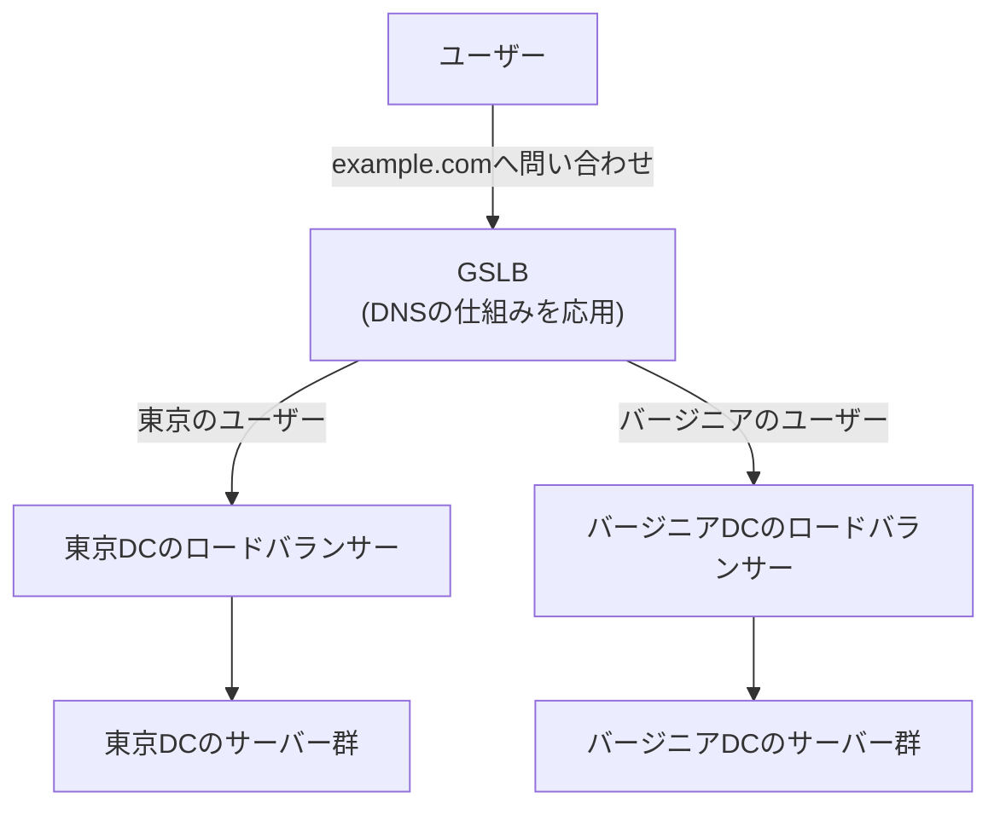

## はじめに

- **この記事で得られること**: [HAProxyハンズオン](/articles/load-balancing-haproxy-handson-guide)で構築した、1つのデータセンター内でのロードバランシングを前提に、**地理的に離れた複数のデータセンター間でトラフィックを振り分ける**GSLB(Global Server Load Balancing)が、DNSの仕組みをどう応用して実現されているのかを体系的に理解します。
- **対象読者**: 1台のロードバランサーが複数台のサーバーへ振り分ける仕組みは理解しているものの、「複数のデータセンターに、どうやってユーザーを割り振っているのか」を説明できない方を想定しています。
- **読むのにかかる想定時間**: 約16分

この記事は[『上位1%』シリーズ 全記事ガイド](/sitemap)の一部、[ロードバランシング基礎シリーズ](/sitemap#シリーズ一覧)の6本目です。

## 前提知識

- **DNSの名前解決の基礎**: [DNSサーバーの基礎](/articles/dns-server-fundamentals-guide)で扱った、権威サーバーがクライアントの問い合わせに応答する仕組みです。GSLBは、この権威サーバーの応答内容を動的に変化させる仕組みとして実現されます。
- **L4/L7ロードバランサーの違い**: [ロードバランサーのL4とL7の違い](/articles/load-balancing-fundamentals-guide)で扱った基礎です。GSLBは、ここで扱うロードバランサーより一段上の、**データセンター単位での振り分け**を担います。

## 全体像をつかむ

[HAProxyハンズオン](/articles/load-balancing-haproxy-handson-guide)で構築したロードバランサーは、1つのデータセンター(あるいは1つのリージョン)の中で、複数台のバックエンドサーバーへ振り分けるものでした。しかし、サービスが世界中のユーザーに利用されるようになると、**東京のデータセンターとバージニアのデータセンター、どちらへユーザーを送るべきか**という、1段階上の問題が生まれます。これを解決するのが**GSLB**(グローバルサーバーロードバランシング)です。

## 基礎から徹底解説

### GSLBの正体:権威DNSサーバーが、問い合わせ元に応じて異なる答えを返す

GSLBは、専用の新しいプロトコルではありません。**権威DNSサーバーが、`example.com`への問い合わせに対して、常に同じIPアドレスを返すのではなく、問い合わせてきたクライアントの状況に応じて、異なるIPアドレスを返す**という、DNSの仕組みそのものを応用した設計です。[スプリットホライズンDNS](/articles/dns-split-horizon-guide)が「社内か社外か」で異なる応答を返す仕組みだったのと同じように、GSLBは「地理的にどこから来たか」「どのデータセンターが正常に稼働しているか」という条件で、異なる応答を返します。

### どうやって「地理的にどこから来たか」を判断するのか

最も単純な方法は、**問い合わせを送ってきたDNSリゾルバのIPアドレス**を基準に、地理的な近さを推定する方法です。しかし、これには限界があります。多くのユーザーは、ISPが提供する、ユーザー自身とは別の場所にあるパブリックDNSリゾルバ(例: Google Public DNS)を使っているため、**「リゾルバの場所」と「実際のユーザーの場所」が一致しない**ことがあるのです。

この問題に対応するため、**EDNS Client Subnet**(ECS)という拡張仕様が使われます。これは、リゾルバが権威DNSサーバーへ問い合わせる際、**ユーザー自身のIPアドレス(の一部)を、問い合わせに含めて転送する**仕組みです。これにより、権威DNSサーバー側は、リゾルバの場所ではなく、実際のユーザーに近い場所を基準に、どのデータセンターのIPアドレスを返すべきかを判断できます。

EDNS Client Subnetが「IPアドレスの一部」しか送らない理由

ECSは、ユーザーの完全なIPアドレスではなく、**IPアドレスの上位ビット部分**(通常は/24程度)だけを権威DNSサーバーへ送ります。これは、プライバシー上の配慮です。GSLBが知りたいのは「おおよそどの地域から来ているか」という粗い位置情報だけであり、個々のユーザーを一意に特定できる完全なIPアドレスまで権威DNSサーバー側へ渡す必要はありません。この「必要な精度だけを渡し、それ以上は渡さない」という設計は、[最小権限の原則](/articles/aws-least-privilege-policy-handson-guide)が扱った考え方と、分野は違いますが発想として通じるところがあります。

### ヘルスチェックとの連携:データセンター障害時のフェイルオーバー

GSLBのもう一つの重要な役割が、**データセンター単位のヘルスチェック**です。[アルゴリズムとヘルスチェック](/articles/load-balancing-algorithms-guide)で扱った、バックエンドサーバー単位のヘルスチェックと同じ発想を、データセンター全体に対して適用します。東京のデータセンター全体が停止した場合、GSLBはそれを検知し、以降の問い合わせに対して、バージニアのデータセンターのIPアドレスだけを返すように切り替えます。

**ここで注意が必要なのは、DNSのTTL(Time To Live)という制約です。** ある程度の時間、以前の応答がクライアント側やリゾルバ側にキャッシュされ続けるため、データセンター障害が発生してから、すべてのユーザーが新しいデータセンターへ切り替わるまでには、TTLの値に応じたタイムラグが生じます。GSLB用のDNSレコードは、通常のレコードよりも短いTTL(数十秒〜数分程度)に設定することで、このタイムラグを短縮するのが定石です。

## プロが見ている視点(上位1%の理解)

### GSLBは「賢いDNS」であり、「賢いロードバランサー」ではない

GSLBという名前に「ロードバランシング」という言葉が含まれているため、[HAProxyハンズオン](/articles/load-balancing-haproxy-handson-guide)で扱ったような、単一のロードバランサーの延長だと誤解されがちです。**しかし、GSLBが実際に操作しているのは、常にDNSの応答内容だけです。** クライアントとサーバーの間の通信経路そのものには、一切介在しません。この理解があれば、GSLBの限界——DNSのキャッシュとTTLに起因する切り替えの遅延、そしてクライアント側がDNSの応答を無視してIPアドレスをキャッシュし続けてしまう(一部の古いアプリケーションに見られる)挙動への対処——が、なぜ常に課題として残るのかが見えてきます。

## よくある誤解・つまずきポイント

- **誤解1: 「GSLBは、ロードバランサーと同じようにリアルタイムでトラフィックを振り分けている」**
  GSLBが操作するのは、DNSの応答だけです。実際の通信経路には介在しないため、TTLに起因する切り替えの遅延が必ず発生します。
- **誤解2: 「リゾルバのIPアドレスが分かれば、常にユーザーの正確な位置が分かる」**
  パブリックDNSリゾルバを使うユーザーでは、リゾルバの場所と実際のユーザーの場所が一致しないことがあるため、EDNS Client Subnetのような拡張仕様が必要になります。
- **誤解3: 「GSLBのTTLは、通常のDNSレコードと同じ値にしておけばよい」**
  TTLが長いと、データセンター障害時の切り替えが遅れます。GSLB用のレコードは、短いTTLに設定するのが定石です。

## 障害・トラブルシューティングの視点

1. **データセンター障害後、一部のユーザーだけ切り替わりが遅い**: DNSのTTLに応じたキャッシュが、クライアントやリゾルバ側に残っている可能性があります。
2. **地理的に近いはずのデータセンターへ振り分けられない**: ユーザーが使っているDNSリゾルバの場所が、実際のユーザーの場所と異なり、EDNS Client Subnetが正しく機能していない可能性があります。
3. **特定のアプリケーションだけ、切り替え後も古いデータセンターへアクセスし続ける**: そのアプリケーションが、DNSのTTLを無視してIPアドレスを独自にキャッシュしている可能性があります。

## まとめ

- GSLBは、専用の新しいプロトコルではなく、権威DNSサーバーが問い合わせ元の状況に応じて異なる応答を返す、DNSの仕組みを応用した設計です。
- EDNS Client Subnetは、リゾルバの場所と実際のユーザーの場所が異なる問題に対応するため、ユーザーのIPアドレスの一部を権威DNSサーバーへ伝える拡張仕様です。
- GSLBは、データセンター単位のヘルスチェックと連携して、障害時のフェイルオーバーを行いますが、DNSのTTLに起因する切り替えの遅延が常に発生します。

**今日から意識すべきこと**
1. GSLBが登場したら、「これはDNSの応答を操作しているだけだ」という前提に立ち戻って考えましょう。
2. GSLB用のDNSレコードを設定する際は、TTLの値が、許容できる切り替え遅延と一致しているかを確認しましょう。

## 参考文献

- [RFC 7871 - Client Subnet in DNS Queries](https://datatracker.ietf.org/doc/html/rfc7871)
- [What Is Global Server Load Balancing? | F5](https://www.f5.com/glossary/global-server-load-balancing)
