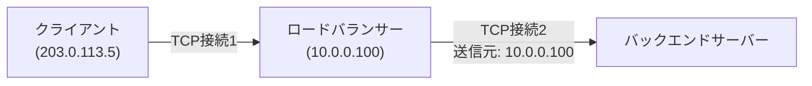

## はじめに

- **この記事で得られること**: [L4/L7の違い](/articles/load-balancing-fundamentals-guide)で扱った「L7ロードバランサーは、クライアントとの間と、バックエンドとの間で、別々のTCP接続を持つ」という構造を前提に、**ロードバランサーの先でクライアントの本当のIPアドレスが失われてしまう問題**と、それを解決する**X-Forwarded-Forヘッダー**・**PROXY protocol**という、2つの異なるアプローチを体系的に理解します。
- **対象読者**: ロードバランサーの先に置いたWebサーバーのアクセスログで、クライアントのIPアドレスがすべて同じ(ロードバランサー自身の)IPアドレスになってしまう現象に遭遇したことがある方を想定しています。
- **読むのにかかる想定時間**: 約15分

この記事は[『上位1%』シリーズ 全記事ガイド](/sitemap)の一部、[ロードバランシング基礎シリーズ](/sitemap#シリーズ一覧)の8本目です。

## 前提知識

- **L4/L7ロードバランサーが持つTCP接続の構造**: [ロードバランサーのL4とL7の違い](/articles/load-balancing-fundamentals-guide)の「なぜL7ロードバランサーはTCP接続を2本持つのか」で扱った、クライアント側とバックエンド側で別々のTCP接続が確立される、という構造です。

## 全体像をつかむ

ロードバランサーの先に置いたバックエンドサーバーのアクセスログを見ると、**本来記録されるべきクライアントのIPアドレスの代わりに、ロードバランサー自身のIPアドレスばかりが記録されている**という現象に遭遇することがあります。これは設定ミスではなく、ロードバランサーの構造そのものに起因する、必然的な現象です。



## 基礎から徹底解説

### なぜクライアントのIPアドレスが失われるのか

[L4/L7の違い](/articles/load-balancing-fundamentals-guide)で扱ったとおり、L7ロードバランサーは、クライアントとの間のTCP接続と、バックエンドサーバーとの間のTCP接続を、**それぞれ別々に確立します。** バックエンドサーバーから見ると、通信してきた相手は、常にロードバランサー自身であり、その先にいる本当のクライアントの存在は、TCP/IPの接続情報だけからは一切分かりません。バックエンドサーバーのアクセスログに記録される送信元IPアドレスが、すべてロードバランサーのIPアドレスになってしまうのは、この接続の構造上、当然の結果なのです。

### X-Forwarded-Forヘッダー:L7限定の、最も一般的な解決策

**X-Forwarded-For**(XFF)ヘッダーは、L7ロードバランサーが、バックエンドサーバーへ転送するHTTPリクエストに、**「本当の送信元はこのIPアドレスでした」という情報を、HTTPヘッダーとして追記する**仕組みです。バックエンドサーバー側のアプリケーションは、このヘッダーを読むことで、本当のクライアントIPアドレスを知ることができます。

```
X-Forwarded-For: 203.0.113.5
```

**この方式には、構造上の限界があります。** XFFは、あくまでHTTPというアプリケーション層のヘッダーの一部であるため、[L7ロードバランサーの機能](/articles/load-balancing-fundamentals-guide)、つまりHTTPの内容を読み書きできるロードバランサーでしか使えません。HTTPの内容を一切見ないL4ロードバランサーや、[SSLパススルー](/articles/load-balancing-ssl-termination-guide)のように、ロードバランサーがHTTPの内容を読めない構成では、XFFヘッダーを追記する余地がありません。

<details>
<summary>複数のロードバランサー/プロキシを経由すると、XFFはどうなるのか</summary>

クライアントとバックエンドサーバーの間に、複数のロードバランサーやリバースプロキシが連なっている場合、XFFヘッダーには、**カンマ区切りで、通過したプロキシそれぞれのIPアドレスが追記されていきます。**

```
X-Forwarded-For: 203.0.113.5, 198.51.100.10
```

このとき、**最も信頼できる「本当のクライアントIP」は、リストの先頭(最初に追記されたもの)です。** リストの後ろの値ほど、自分の管理下にあるプロキシが追記したものである可能性が高く、信頼性が高まります。逆に、クライアントが悪意を持って、最初から偽のXFFヘッダーを付けて送ってきた場合、その偽の値がリストの先頭に紛れ込んでしまうリスクがあるため、**どこまでを信頼するかは、自分が管理しているプロキシの台数を正確に把握した上で判断する必要があります。**

</details>

### PROXY protocol:L4でも使える、より低レイヤーの解決策

**PROXY protocol**は、HTTPヘッダーという形ではなく、**TCP接続が確立された直後に、本当の送信元情報を記したヘッダーを、プロトコルの内容そのものの前に挿入する**という、より低レイヤーのアプローチです。HTTPの内容を一切解釈しないL4ロードバランサーであっても、この方式であれば、クライアントの本当のIPアドレスをバックエンドサーバーへ伝えることができます。

| 方式 | 動作するレイヤー | 対応するロードバランサー |
|---|---|---|
| **X-Forwarded-For** | HTTPヘッダー(アプリケーション層) | L7ロードバランサーのみ |
| **PROXY protocol** | TCP接続の直後(トランスポート層に近い) | L4・L7いずれのロードバランサーでも対応可能 |

PROXY protocolを使うには、**ロードバランサー側とバックエンドサーバー側の、両方がこのプロトコルに対応している必要があります。** バックエンドサーバー側(nginxやHAProxy自身など)で、受信した接続の先頭に付加されたPROXY protocolのヘッダーを解釈する設定を、明示的に有効にしなければ、そのヘッダーの内容がHTTPリクエストの一部として誤って解釈され、エラーになってしまいます。

## プロが見ている視点(上位1%の理解)

### 「情報の伝達方法」は、常にその情報が乗っている層に制約される

XFFとPROXY protocolという2つの解決策が存在する理由は、**「クライアントの本当のIPアドレスを伝えたい」という、同じ1つの要求に対して、どの層(アプリケーション層か、それより下の層か)で情報を伝達するかという、アプローチの違いにすぎません。** この視点を持っていれば、「なぜL4ロードバランサーではXFFが使えないのか」という疑問に対し、「XFFはHTTPヘッダーであり、HTTPはアプリケーション層の情報だから、それを解釈しないL4では当然使えない」と、構造的に説明できるようになります。ロードバランサーやプロキシに関するあらゆる「なぜこれは使えて、これは使えないのか」という疑問は、多くの場合、この「情報がどの層に乗っているか」という視点に立ち戻ることで解消できます。

## よくある誤解・つまずきポイント

- **誤解1: 「バックエンドサーバーのログにロードバランサーのIPアドレスが記録されるのは、設定ミスである」**
  これは、L7ロードバランサーが2本の別々のTCP接続を持つ構造上、必然的に起きる現象です。XFFやPROXY protocolによる追加対応が必要です。
- **誤解2: 「X-Forwarded-Forは、L4ロードバランサーでも使える」**
  XFFはHTTPヘッダーであり、HTTPの内容を解釈しないL4ロードバランサーでは使えません。L4でクライアントIPを伝えるには、PROXY protocolが必要です。
- **誤解3: 「PROXY protocolを有効にすれば、設定は自動的に反映される」**
  ロードバランサー側とバックエンドサーバー側の両方で、明示的に対応設定を有効にする必要があります。片方だけ有効にすると、ヘッダーの内容が誤って解釈され、エラーになります。

## 障害・トラブルシューティングの視点

1. **バックエンドのアクセスログに、クライアントのIPアドレスが記録されない**: ロードバランサーがXFFヘッダーを追記する設定になっているか、L4構成の場合はPROXY protocolが有効になっているかを確認します。
2. **PROXY protocolを有効にした途端、通信エラーが発生する**: バックエンドサーバー側で、PROXY protocolのヘッダーを解釈する設定(nginxの`proxy_protocol`など)が有効になっているかを確認します。
3. **XFFヘッダーに、信頼できない値が含まれている**: 自分が管理しているプロキシの台数を数え、リストの中のどこまでを信頼すべきかを、正確に把握し直します。

## まとめ

- ロードバランサーの先でクライアントのIPアドレスが失われるのは、L7ロードバランサーがクライアント側とバックエンド側で別々のTCP接続を持つ、構造上必然的な現象です。
- X-Forwarded-Forは、HTTPヘッダーとしてクライアントIPを伝える仕組みで、HTTPの内容を解釈できるL7ロードバランサーでのみ使えます。
- PROXY protocolは、TCP接続の直後にクライアントIP情報を挿入する、より低レイヤーの方式で、L4ロードバランサーでも使用できます。
- どちらの方式も、ロードバランサー側とバックエンドサーバー側の両方で、明示的な対応設定が必要です。

**今日から意識すべきこと**
1. クライアントIPが失われる問題に遭遇したら、まず自分の構成がL4かL7かを確認し、適切な解決策(XFFまたはPROXY protocol)を選びましょう。
2. XFFヘッダーを信頼する際は、自分が管理しているプロキシの台数を正確に把握し、リストのどこまでを信頼すべきかを判断しましょう。

## 参考文献

- [PROXY protocol Specification | HAProxy](https://www.haproxy.org/download/2.8/doc/proxy-protocol.txt)
- [RFC 7239 - Forwarded HTTP Extension](https://datatracker.ietf.org/doc/html/rfc7239)
