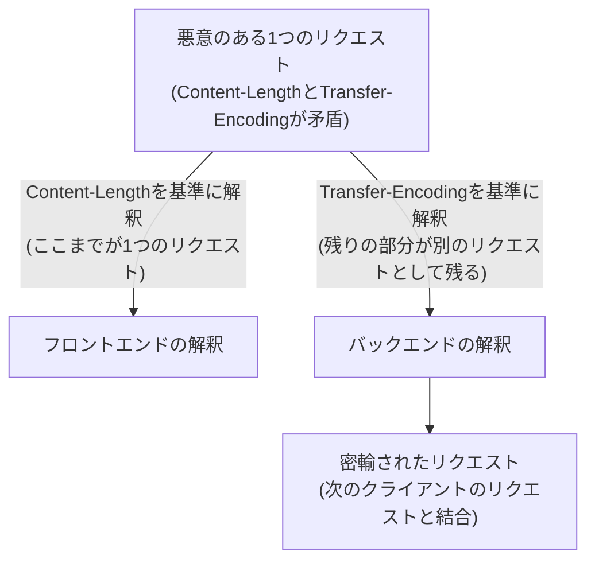

## はじめに

- **この記事で得られること**: [PROXY protocolの仕組み](/articles/load-balancing-proxy-protocol-guide)で扱った、ロードバランサーとバックエンドサーバーの間に別々のTCP接続が存在するという構造を前提に、**Content-LengthとTransfer-Encodingという、HTTPリクエストの境界を決める2つの方法が、フロントエンドとバックエンドで異なって解釈されてしまう**ことで発生する、**HTTPリクエストスマグリング**という攻撃手法の原理を、安全な検証環境の中だけで再現し、HAProxyの防御機構を確認します。
- **対象読者**: ロードバランサーの基本的な構築経験があり、ロードバランサー・リバースプロキシが関わるWebアプリケーションの、セキュリティ上の弱点を理解しておきたい方を想定しています。
- **重要な注意**: **このハンズオンは、自分が管理する検証環境の防御力を高めるための、教育・防御目的のものです。** 実運用中の他者の環境に対して、許可なくこの手順を実行しないでください。本記事で使う検証環境は、自分自身で用意したバックエンドサーバーに対してのみ通信を送るものであり、第三者のシステムへの攻撃手順は一切含まれていません。
- **読むのにかかる想定時間**: 約25分(ハンズオン実施込み)

この記事は[『上位1%』シリーズ 全記事ガイド](/sitemap)の一部、[ロードバランシング基礎シリーズ](/sitemap#シリーズ一覧)の11本目です。[ハンズオン準備マニュアル](/articles/handson-prep-guide)で作成したUbuntu Server環境が2台(ロードバランサー用に1台、バックエンド用に1台)あれば実施できます。

## 前提知識

- **ロードバランサーが持つ2本の別々のTCP接続**: [PROXY protocolの仕組み](/articles/load-balancing-proxy-protocol-guide)で扱った、L7ロードバランサーがクライアントとの間、バックエンドとの間で、それぞれ別々のTCP接続を確立する構造です。本記事のHTTPリクエストスマグリングは、この構造、特にバックエンドとの接続が複数のリクエストで再利用されることに起因します。

## 全体像をつかむ

HTTP/1.1では、1つのTCP接続の上で、複数のHTTPリクエストを連続して送る(**Keep-Alive**、接続の再利用)ことが一般的です。この際、サーバー側は、**「1つのリクエストが、どこで終わり、次のリクエストがどこから始まるか」を正確に判断する**必要があります。この境界を決める方法には、**Content-Length**(ボディの長さをバイト数で明示する)と**Transfer-Encoding: chunked**(ボディを可変長のチャンクに分割し、長さ0のチャンクで終端を示す)という、2つの異なる仕様が存在します。

**HTTPリクエストスマグリングは、1つのリクエストに両方のヘッダーを矛盾した形で含め、フロントエンド(ロードバランサー)とバックエンドサーバーに、それぞれ異なる方法でリクエストの境界を解釈させることで成立します。**



## 基礎から徹底解説

### CL.TEとTE.CL:どちらのヘッダーを「信じる」かのズレが引き起こす問題

**CL.TE**は、フロントエンドがContent-Lengthを基準に境界を判断し、バックエンドがTransfer-Encodingを基準に判断する、不一致のパターンです。フロントエンドが「ここで1つのリクエストが終わった」と判断した後に残っている、本来は次のリクエストの一部であるべきバイト列を、バックエンドは「chunkedエンコーディングの続き」として解釈してしまい、**本来存在しなかったはずの、もう1つのリクエストが、接続の中に紛れ込んでしまいます。** これが「密輸(smuggling)」という名前の由来です。**TE.CL**は、この逆のパターンです。

このようにして密輸された不正なリクエストは、**同じバックエンドとの接続(Keep-Alive接続)を、次に使う、全く無関係な別のクライアントのリクエストの前に、結合されてしまいます。** これにより、他のユーザーのリクエストに、攻撃者が仕込んだ不正なヘッダーやパスが混入し、セッション情報の漏洩や、WAF(Web Application Firewall)によるチェックの回避につながる、深刻な脆弱性です。

<details>
<summary>なぜ、この問題がロードバランサーの構造そのものと深く関係しているのか</summary>

[PROXY protocolの仕組み](/articles/load-balancing-proxy-protocol-guide)で扱ったとおり、L7ロードバランサーは、クライアントとの接続とバックエンドとの接続を、別々に管理しています。**そして、パフォーマンス向上のため、バックエンドとの接続は、複数の異なるクライアントからのリクエストに対して、再利用されるのが一般的です。** この「接続の再利用」という、ごく普通の最適化こそが、密輸されたリクエストが、無関係な別のクライアントのリクエストと結合してしまう土台になっています。接続が毎回新規に確立されるのであれば、密輸されたリクエストが「次のリクエスト」に混入する余地自体が、そもそも存在しません。

</details>

### 現代的なロードバランサーが、この問題にどう対処しているか

[RFC 7230](https://datatracker.ietf.org/doc/html/rfc7230#section-3.3.3)は、**Content-LengthとTransfer-Encodingの両方が1つのリクエストに含まれている場合、そのリクエストを拒否するべきである**と明確に規定しています。現代的なバージョンのHAProxyは、この規定に従い、両方のヘッダーが矛盾した形で存在するリクエストを、デフォルトで**400 Bad Request**として拒否します。これは、曖昧さを許さず、仕様に厳密に従ってリクエストをパースする、という防御姿勢そのものです。

## ハンズオン手順

### Step 1: バックエンドサーバーに、簡易的なHTTPサーバーを起動する

バックエンドサーバー役のUbuntu Serverで、リクエストの内容をそのまま表示する、簡易的なサーバーを起動します。

```bash
python3 -c "
import socketserver, http.server
class Handler(http.server.BaseHTTPRequestHandler):
    def do_POST(self):
        length = int(self.headers.get('Content-Length', 0))
        body = self.rfile.read(length)
        print('--- Received body ---')
        print(body)
        self.send_response(200)
        self.end_headers()
with socketserver.TCPServer(('0.0.0.0', 8080), Handler) as httpd:
    httpd.serve_forever()
"
```

### Step 2: netcatで、矛盾したヘッダーを持つ生のHTTPリクエストを送信する

ロードバランサー役(またはクライアント役)のサーバーから、`netcat`を使い、バックエンドサーバーへ**直接**(ロードバランサーを経由せず)、Content-LengthとTransfer-Encodingが矛盾したリクエストを送信します。

```bash
printf 'POST / HTTP/1.1\r\nHost: backend\r\nContent-Length: 6\r\nTransfer-Encoding: chunked\r\n\r\n0\r\n\r\nX' | nc <バックエンドのIP> 8080
```

このリクエストは、**Content-Lengthを信じれば「6バイトのボディ」**(`0\r\n\r\n`の4バイトと、末尾の`X`を含む)を期待し、**Transfer-Encodingを信じれば「`0\r\n\r\n`で終端された、空のchunked本文」として解釈され**ます。バックエンドサーバーの出力を確認すると、**Content-Lengthを基準に、`0\r\n\r\nX`という6バイトをそのままボディとして読み込んでいる**ことが確認できます。もしこの残りの`X`が、実は別の悪意あるHTTPリクエストの先頭部分であったなら、それが次のリクエストの一部として紛れ込んでしまう、という構造が、ここで再現できました。

### Step 3: HAProxyを経由させ、デフォルトの防御を確認する

ロードバランサー役のサーバーに、[HAProxyハンズオン](/articles/load-balancing-haproxy-handson-guide)と同様の設定でHAProxyを構築し、今度は**HAProxy経由で**、同じ矛盾したリクエストを送信してみます。

```bash
printf 'POST / HTTP/1.1\r\nHost: backend\r\nContent-Length: 6\r\nTransfer-Encoding: chunked\r\n\r\n0\r\n\r\nX' | nc <ロードバランサーのIP> 80
```

**実行結果:**

```
HTTP/1.1 400 Bad Request
```

**HAProxyが、Content-LengthとTransfer-Encodingの両方が矛盾した形で存在するリクエストを検知し、バックエンドへ転送する前に、400 Bad Requestとして拒否していることが確認できました。** Step 2で、バックエンドサーバーに直接送った場合には(境界の解釈がどちらか一方に偏るだけで)問題なく処理されてしまったのに対し、HAProxyを経由させると、そもそも転送自体が行われません。これが、[RFC 7230](https://datatracker.ietf.org/doc/html/rfc7230#section-3.3.3)に従った、厳格なパース処理による防御です。

## プロが見ている視点(上位1%の理解)

### 「どちらの解釈が正しいか」ではなく、「解釈の余地自体をなくす」ことが正解である

HTTPリクエストスマグリングへの対処として、**「フロントエンドとバックエンドで、解釈方法を揃える」という発想もありえますが、これは本質的な解決にはなりません。** 将来、バックエンドのソフトウェアがアップデートされ、解釈方法が変わってしまえば、同じ問題が再発するためです。[HAProxyの防御](https://datatracker.ietf.org/doc/html/rfc7230#section-3.3.3)が取っているアプローチは、**「どちらの解釈を信じるか」という問いそのものを発生させず、矛盾した入力自体を、仕様違反としてその場で拒否する**という、より根本的な設計です。この「曖昧さが生まれる余地を、入力の時点で断つ」という考え方は、信頼できない入力を実行可能なコードとして解釈させないようにする、他の多くのセキュリティ対策にも通じる、普遍的な防御思想です。

## よくある誤解・つまずきポイント

- **誤解1: 「HTTPリクエストスマグリングは、特定の脆弱なソフトウェアにのみ存在する、特殊な問題である」**
  これは、HTTP/1.1の仕様自体が、リクエストの境界を決める方法を2つ用意していることに起因する、構造的な問題です。フロントエンドとバックエンドの実装が異なれば、どのソフトウェアの組み合わせでも理論上発生しえます。
- **誤解2: 「Content-LengthかTransfer-Encodingのどちらかを、常に正しく解釈すれば問題ない」**
  問題は「どちらが正しいか」ではなく、フロントエンドとバックエンドが「異なる」方を信じてしまうことです。現代的な対処は、矛盾した入力自体を拒否することです。
- **誤解3: 「HAProxyを使っていれば、この問題を気にする必要はない」**
  現代的なデフォルト設定では保護されますが、古いバージョンや、意図的に緩い設定にしている場合は、保護されない可能性があります。自分の環境のバージョンと設定を確認する習慣が必要です。

## 障害・トラブルシューティングの視点

1. **HAProxy経由のリクエストが、予期せず400 Bad Requestになる**: 自分が送っているリクエストに、Content-LengthとTransfer-Encodingの両方が、矛盾した形で含まれていないかを確認します。これは、多くの場合バグではなく、意図した防御の結果です。
2. **バックエンドへの直接通信と、HAProxy経由の通信で、挙動が異なる**: この違いこそが、フロントエンドの厳格なパース処理が機能している証拠です。
3. **古いバージョンのHAProxyで、このハンズオンの防御が確認できない**: HAProxyのバージョンによって、デフォルトの挙動が異なる場合があります。公式ドキュメントで、使用しているバージョンの挙動を確認してください。

## まとめ

- HTTPリクエストスマグリングは、Content-LengthとTransfer-Encodingという、HTTPリクエストの境界を決める2つの方法を、フロントエンドとバックエンドが異なって解釈することで発生します。
- 密輸されたリクエストは、再利用されるバックエンドとの接続(Keep-Alive)を通じて、無関係な別のクライアントのリクエストと結合してしまう、深刻な脆弱性です。
- RFC 7230は、両方のヘッダーが矛盾した形で存在するリクエストを拒否すべきと規定しており、現代的なHAProxyはこれに従い、デフォルトで厳格にパースします。
- 対処の本質は、「どちらの解釈が正しいか」を決めることではなく、矛盾した入力自体を、解釈の余地なく拒否することです。

**今日から意識すべきこと**
1. ロードバランサーやリバースプロキシを選定・設定する際は、RFC 7230に準拠した厳格なHTTPパース処理が行われているかを確認する習慣をつけましょう。
2. 「どちらの解釈が正しいか」で悩む設計に出会ったら、「そもそも矛盾を発生させない」という、より根本的な解決策がないかを考えましょう。

## 参考文献

- [RFC 7230 - HTTP/1.1 Message Syntax and Routing, Section 3.3.3](https://datatracker.ietf.org/doc/html/rfc7230#section-3.3.3)
- [HTTP Request Smuggling | OWASP](https://owasp.org/www-community/attacks/HTTP_Request_Smuggling)
