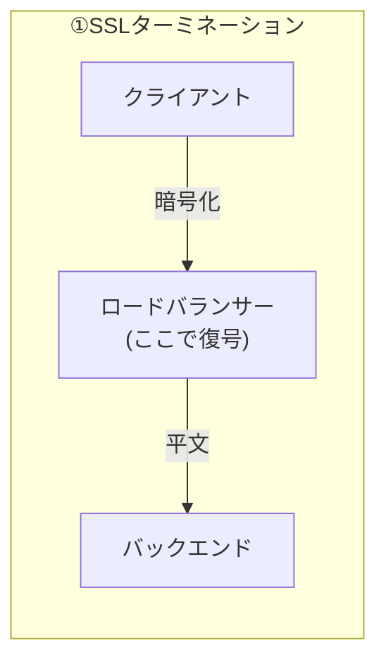
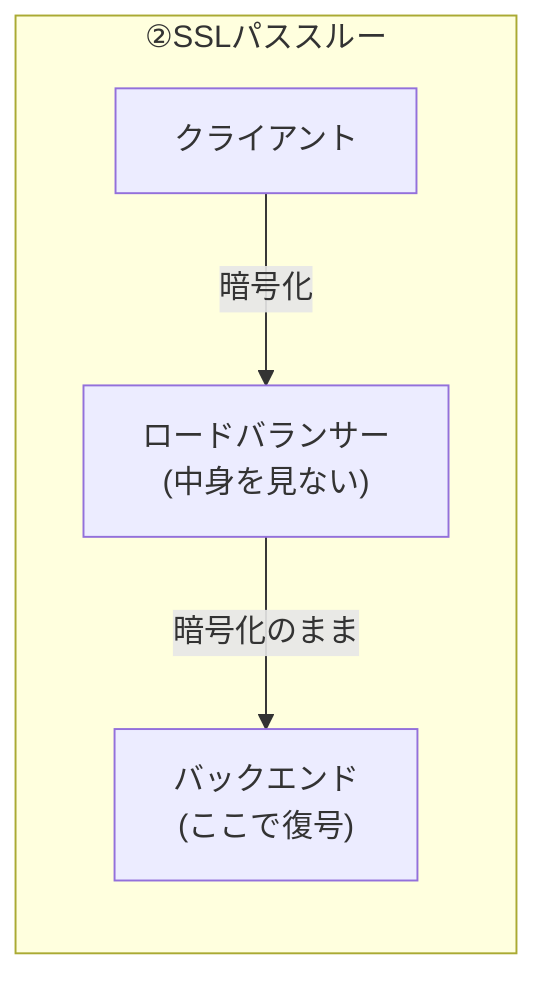
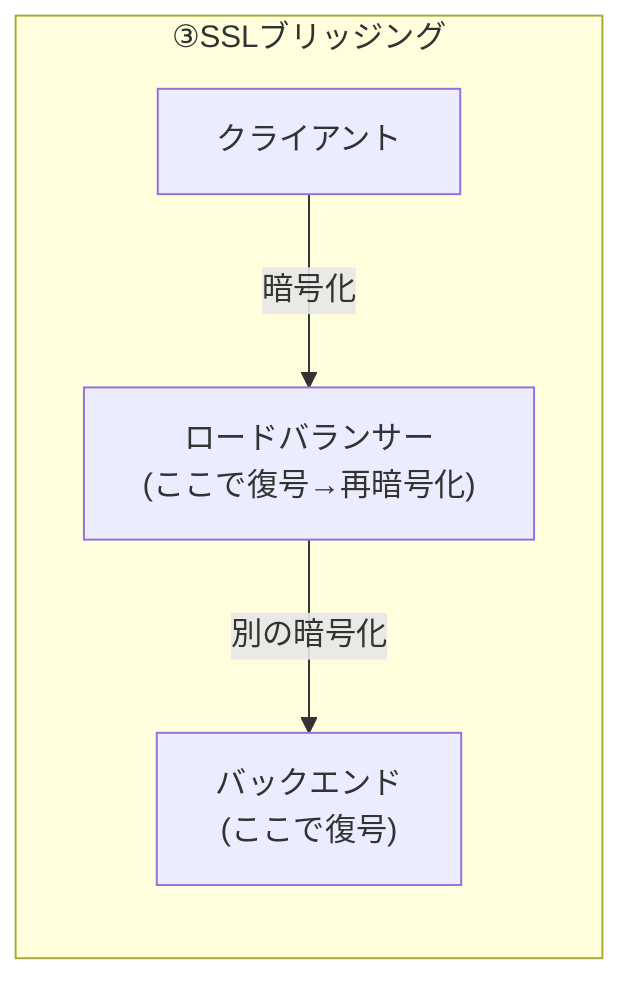

## はじめに

- **この記事で得られること**: [L4とL7の違い](/articles/load-balancing-fundamentals-guide)を前提に、ロードバランサーにTLS証明書を設定する3つの方式——**SSLターミネーション**・**SSLパススルー**・**SSLブリッジング**——の違いと、それぞれのトレードオフを体系的に理解します。
- **対象読者**: ロードバランサーにTLS証明書を設定した経験はあるものの、「ターミネーション」「パススルー」という言葉の違いを説明できず、なぜ複数の方式が存在するのかを理解できていない方を想定しています。
- **読むのにかかる想定時間**: 約16分

この記事は[『上位1%』シリーズ 全記事ガイド](/sitemap)の一部、[ロードバランシング基礎シリーズ](/sitemap#シリーズ一覧)の3本目です。

## 前提知識

- **L4/L7ロードバランサーの違い**: [ロードバランサーのL4とL7の違い](/articles/load-balancing-fundamentals-guide)で扱った、ロードバランサーが何を見て振り分けているかという基礎です。本記事で扱うSSLターミネーションは、HTTPの内容を読む必要があるため、L7の機能として実現されます。

## 全体像をつかむ

TLS(SSL)で暗号化された通信を、ロードバランサーがどう扱うかには、大きく3つの方式があります。**どこで暗号化が終わり、どこから先が平文(または別の暗号化)になるか**という一点が、3方式を区別する基準です。

## 基礎から徹底解説

### ①SSLターミネーション:ロードバランサーで復号し、バックエンドへは平文で中継する

**SSLターミネーション**は、ロードバランサーがクライアントとのTLS接続を終端(復号)し、バックエンドサーバーとの間は暗号化しない平文のHTTPで中継する方式です。

- **メリット**: TLS証明書を、ロードバランサー1台にだけ配置すればよく、証明書の更新・管理が大幅に簡素化されます。また、ロードバランサーが平文のHTTPリクエストを読めるため、[URLパスに応じた振り分けのようなL7機能](/articles/load-balancing-fundamentals-guide)を、暗号化と組み合わせて使えます。
- **デメリット**: ロードバランサーとバックエンドサーバーの間の通信が平文になるため、その経路のネットワークセキュリティ(閉じたネットワーク内であることの保証など)に責任を持つ必要があります。

### ②SSLパススルー:ロードバランサーは中身を見ず、暗号化されたまま中継する

**SSLパススルー**は、ロードバランサーがTLSの内容を一切復号せず、暗号化されたパケットをそのままバックエンドサーバーへ中継する方式です。TLSの復号は、バックエンドサーバー自身が行います。

- **メリット**: バックエンドサーバーまで、エンドツーエンドで暗号化が維持されます。金融・医療業界のコンプライアンス要件など、「経路上のどこであっても復号された平文が存在してはならない」という要件に応えられます。
- **デメリット**: ロードバランサーがHTTPの内容を読めないため、URLパスに応じた振り分けのような[L7機能](/articles/load-balancing-fundamentals-guide)が使えません。また、証明書は各バックエンドサーバーそれぞれに配置・更新する必要があり、運用の手間が増えます。

SSLパススルーでも、ホスト名による振り分けだけはできる理由

SSLパススルーは、TLSの内容(暗号化された部分)を復号できません。しかし、TLSハンドシェイクの最初のメッセージである**ClientHello**には、[IISのSNIハンズオン](/articles/windows-server-iis-sni-handson-guide)で扱った**SNI**(Server Name Indication)という、宛先のホスト名を示す情報が、暗号化される前の平文のまま含まれています。**ロードバランサーは、このSNI情報だけを覗き見ることで、復号せずにホスト名ベースの振り分けを行うことができます。** これは、HTTPの内容(URLパスなど)までは読めないものの、ホスト名単位の振り分けであれば、SSLパススルーのままでも実現可能であることを示す、重要な例外です。

### ③SSLブリッジング:ロードバランサーで一度復号し、別の暗号化でバックエンドへ再送する

**SSLブリッジング**は、ロードバランサーがクライアントとのTLSを一度復号した上で、バックエンドサーバーとの間を、別のTLS接続で再暗号化して中継する方式です。SSLターミネーションと似ていますが、**バックエンドまでの経路も暗号化されたままになる**点が異なります。

- **メリット**: ロードバランサーがHTTPの内容を読める(L7機能が使える)上に、バックエンドまでの経路も暗号化されるため、ターミネーションのデメリット(平文経路)とパススルーのデメリット(L7機能が使えない)の、両方をある程度解消します。
- **デメリット**: ロードバランサーとバックエンドサーバーの両方に、それぞれ証明書の管理が必要になり、構成が最も複雑になります。また、ロードバランサー上で一瞬だけ平文の状態が存在するため、「経路上のどこであっても復号された平文が存在してはならない」という最も厳格な要件には応えられません。

## プロが見ている視点(上位1%の理解)

### 証明書管理の手間と、セキュリティ要件は、常にトレードオフの関係にある

**SSLターミネーションが実務で最も多く採用されるのは、「証明書管理の手間を1か所に集約できる」というメリットが、多くの環境で、エンドツーエンド暗号化の要件を上回るためです。** 数十台・数百台のバックエンドサーバーそれぞれに証明書を配置・更新する運用は、現実的に持続可能ではありません。一方で、コンプライアンス上「復号された平文がどこにも存在してはならない」という要件がある場合は、運用の手間を受け入れてでも、パススルーやブリッジングを選ぶ必要があります。**「どの方式が優れているか」ではなく、「自分の環境の要件が、どちらのトレードオフを許容できるか」という視点で選ぶべき**だと理解しておきましょう。

## よくある誤解・つまずきポイント

- **誤解1: 「SSLターミネーションを使うと、通信全体が暗号化されない」**
  クライアントとロードバランサーの間は、暗号化されています。暗号化されないのは、ロードバランサーとバックエンドサーバーの間だけです。
- **誤解2: 「SSLパススルーでは、ホスト名による振り分けすらできない」**
  SNI情報は暗号化前の平文で見えるため、ホスト名ベースの振り分けは、SSLパススルーのままでも可能です。
- **誤解3: 「SSLブリッジングは、ターミネーションより常に安全である」**
  ブリッジングは、ロードバランサー上で一瞬だけ平文が存在する点はターミネーションと同じであり、「どこにも平文が存在しない」という最も厳格な要件には、どちらも応えられません。

## 障害・トラブルシューティングの視点

1. **バックエンドサーバーへのL7振り分け(URLパスなど)が機能しない**: SSLパススルー方式になっていないか確認します。パススルーでは、ロードバランサーがHTTPの内容を読めません。
2. **証明書の更新を、ロードバランサー側だけ行ったのに反映されない**: パススルーまたはブリッジング方式で、証明書がバックエンドサーバー側にも必要な構成になっていないか確認します。
3. **ロードバランサーとバックエンド間の通信が、意図せず平文になっている**: ターミネーション方式を採用している場合の想定内の挙動です。その経路のネットワークがセキュリティ境界内にあるかを確認します。

## まとめ

- SSLターミネーションは、ロードバランサーで復号し、バックエンドへは平文で中継する方式で、証明書管理が1か所に集約できます。
- SSLパススルーは、ロードバランサーが中身を見ず、暗号化されたまま中継する方式で、エンドツーエンド暗号化が維持されますが、L7機能は使えません。
- SSLブリッジングは、ロードバランサーで一度復号し、別の暗号化でバックエンドへ再送する方式で、両方のメリットをある程度両立しますが、構成が最も複雑です。
- どの方式を選ぶかは、「証明書管理の手間」と「暗号化要件の厳しさ」のトレードオフとして判断する必要があります。

**今日から意識すべきこと**
1. ロードバランサーのTLS設定を見るときは、どの方式(ターミネーション・パススルー・ブリッジング)なのかを、まず確認する習慣をつけましょう。
2. コンプライアンス要件を確認する際は、「経路上のどこかで平文が存在してよいか」という一点を、具体的に確認しましょう。

## 参考文献

- [HAProxy SSL/TLS Documentation](https://www.haproxy.org/#docs)
- [SSL Offloading, Encryption, and Certificates with ALB | AWS](https://docs.aws.amazon.com/elasticloadbalancing/)
